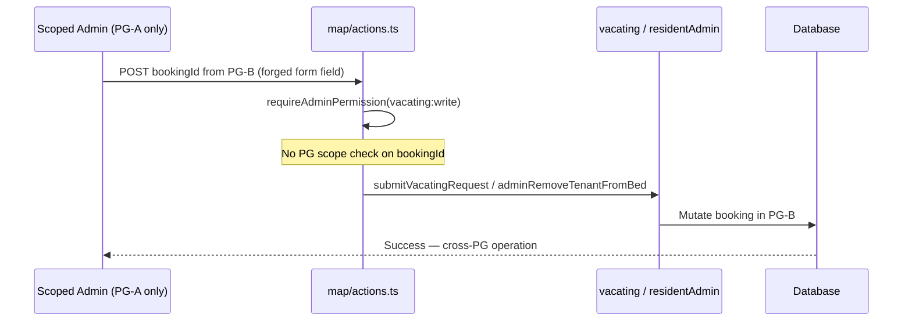
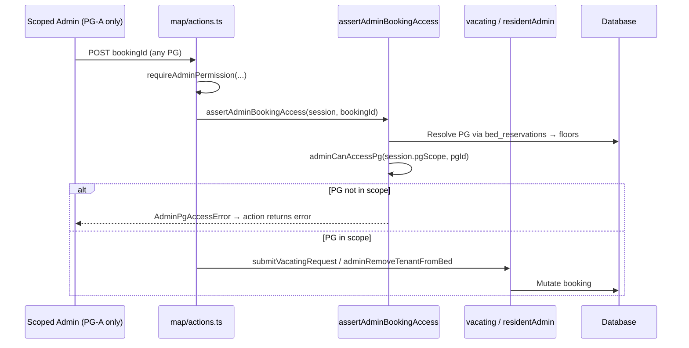
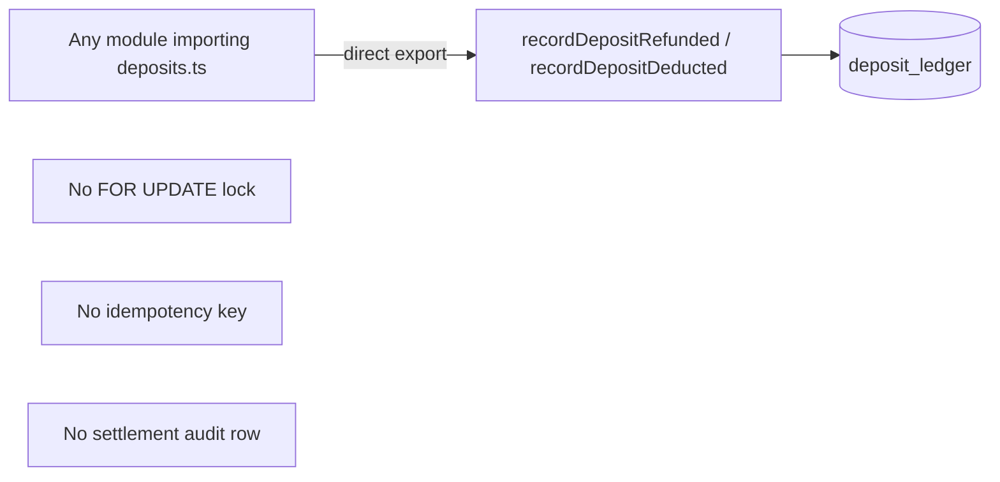
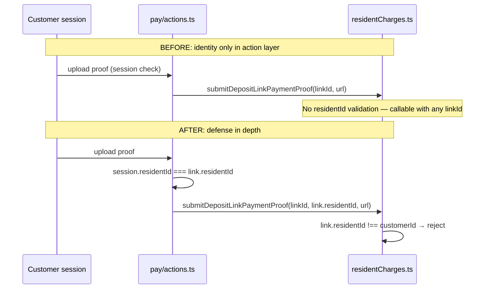
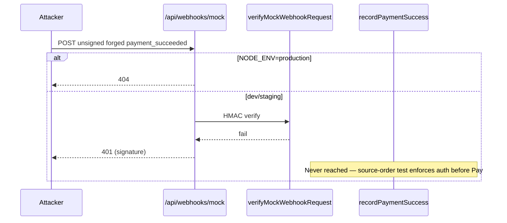

# Security Follow-Up — Verification Audit Remediation

**Date:** 2026-06-13  
**Status:** All 330 tests pass (`npm test`)

---

## 1. Exact Files Changed

| File | Change |
|------|--------|
| `app/(admin)/admin/pgs/[pgId]/map/actions.ts` | Added `assertAdminBookingAccess()` to `submitAdminVacatingAction` and `removeTenantFromBedAction` |
| `src/services/depositSettlement.ts` | Added canonical `applyDepositDeduction()` with `FOR UPDATE`, balance check, audit |
| `src/services/deposits.ts` | Removed exports of `recordDepositRefunded` / `recordDepositDeducted`; internal callers use settlement |
| `app/(admin)/admin/deposits/[bookingId]/actions.ts` | Routes deductions through `applyDepositDeduction` |
| `src/services/depositCredit.ts` | Uses `applyDepositDeduction` |
| `src/services/invoicePayment.ts` | Uses `applyDepositDeduction` |
| `src/services/vacating.ts` | Removed unused legacy import |
| `src/services/residentCharges.ts` | Service-layer `residentId === customerId` check in `submitDepositLinkPaymentProof` |
| `app/(customer)/pay/actions.ts` | Passes `link.residentId` as `customerId` to service |
| `scripts/verify-deposit-ledger.ts` | Updated to canonical settlement APIs |
| `tests/integration/mockWebhookRoute.test.ts` | **New** — production 404, unsigned 401, source-order guard, DB side-effect test |
| `tests/unit/mapActionsPgScope.test.ts` | **New** — static assertion that map actions call `assertAdminBookingAccess` |
| `tests/unit/paymentLinkProof.test.ts` | **New** — empty customerId rejection + legacy export removal |
| `tests/unit/depositSettlement.test.ts` | Added `applyDepositDeduction` validation cases |
| `package.json` | Integration tests included in `npm test` |

**Unchanged but relevant:** `assertAdminVacatingRequestAccess()` already exists in `src/lib/auth/pgAccess.ts`; map actions operate on `bookingId` directly (not vacating-request IDs), so `assertAdminBookingAccess` is the correct guard.

---

## 2. Authorization Flow Diagrams

### 2a. Map actions — BEFORE (vulnerable)



### 2a. Map actions — AFTER (hardened)



### 2b. Deposit mutations — BEFORE (bypass risk)



### 2b. Deposit mutations — AFTER (canonical path)

```mermaid
flowchart LR
  AdminAction[deposits actions]
  Credit[depositCredit / invoicePayment]
  Settlement[depositSettlement.ts]
  DB[(deposit_ledger + deposit_settlements)]

  AdminAction --> Settlement
  Credit --> Settlement
  Settlement -->|applyDepositDeduction| DB
  Settlement -->|settleDepositRefund| DB
  Settlement -->|FOR UPDATE + balance + audit|
  Legacy[recordDeposit*] -.->|removed from exports| X[blocked]
```

### 2c. Payment link proof — BEFORE vs AFTER



### 2d. Mock webhook — AFTER



---

## 3. Updated Threat Model

| Threat | Prior state | Remediation | Residual risk |
|--------|-------------|-------------|---------------|
| **T1: Cross-PG admin via map UI** | Scoped admin could vacate/remove tenant on any booking by forging `bookingId` | `assertAdminBookingAccess` on both map actions | Service layer (`adminRemoveTenantFromBed`) still trusts caller; defense relies on action layer |
| **T2: Forged mock webhook confirms booking** | Unsigned POST could call payment lifecycle | HMAC + prod 404 + replay guard (0052) | Integration test proves 401 + no DB mutation; no runtime spy on `recordPaymentSuccess` |
| **T3: Deposit ledger bypass** | Legacy exports skipped locking/idempotency/audit | Exports removed; all paths via `depositSettlement.ts` | Direct SQL or future re-export would bypass — mitigated by unit test asserting exports absent |
| **T4: Payment link proof hijack** | Service accepted any active linkId | Service validates `link.residentId === customerId` | Action layer still required for session; double gate |
| **T5: Empty pgScope superuser confusion** | Documented in prior audit | `adminCanAccessPg` denies empty scope for non–super_admin | Unchanged |
| **T6: Manual partial refund idempotency** | `randomUUID()` per call | Intentional for partial refunds | Operational duplicate-refund risk if admin double-clicks |

**Deployment posture:** **APPROVED WITH CONDITIONS**

- Apply migration `0052_security_hardening.sql` before enabling mock webhook in non-prod
- Set `MOCK_WEBHOOK_SECRET` in staging
- Consider service-layer PG check inside `adminRemoveTenantFromBed` (P2 backlog)

---

## 4. Test Results

```
npm test
ℹ tests 330
ℹ suites 46
ℹ pass 330
ℹ fail 0
ℹ duration_ms ~7500
```

### New / relevant test coverage

| Test file | Assertions |
|-----------|------------|
| `tests/integration/mockWebhookRoute.test.ts` | Prod → 404; unsigned → 401; auth before `recordPaymentSuccess` in source; optional DB: no payment row, booking status unchanged |
| `tests/unit/mapActionsPgScope.test.ts` | Both map actions import and call `assertAdminBookingAccess` |
| `tests/unit/paymentLinkProof.test.ts` | Empty `customerId` rejected; `recordDepositRefunded`/`recordDepositDeducted` not exported |
| `tests/unit/depositSettlement.test.ts` | `applyDepositDeduction` input validation |

**Note on `recordPaymentSuccess`:** Node test runner lacks `mock.module`; rejection is proven via HTTP 401, static source-order assertion, and DB count/status invariants when `DATABASE_URL` is set.
