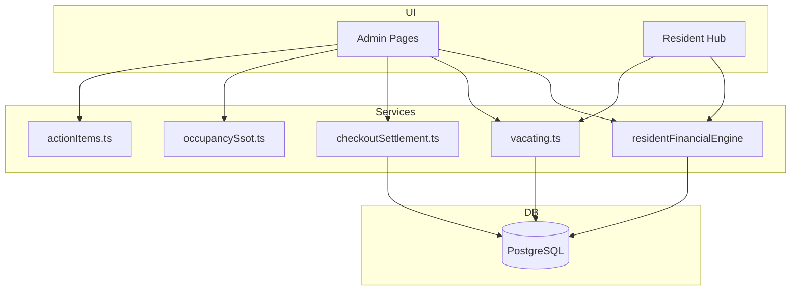

# Architecture

> System design, data flow, and module relationships.  
> Codebase: Next.js 16 App Router + service layer SSOT.

**Governed by [[ECOSYSTEM_V2]] (ADR-ECO-001).** Engines execute; Brains own intelligence. Shared-knowledge that could benefit another Engine belongs in a Brain — never hardcoded per Engine. Inventory: [[ECOSYSTEM_V2_INVENTORY]].

Cross-links: [[ECOSYSTEM_V2]] · [[AI_CONTEXT]] · [[DATABASE]] · [[ROUTES]] · [[WORKFLOWS]] · [[DECISIONS]]

---

## Ecosystem framing (v2)

| Layer | In this monorepo today |
|-------|-------------------------|
| **Awesome PG Engine** | `src/services/*` writers + App Router admin/customer — actions & ledgers |
| **FYH Salon / Capital Engines** | `src/hair/*`, `src/capital/*` — host-isolated DBs |
| **PG-scoped Brains** | Room OS (`src/roomOs/`) — Bed / Property / Electricity / WorkQueue projections |
| **Finance / Owner / Customer Brains** | Not built yet — do not treat engine-local metrics as ecosystem Brains |

---

## High-level diagram

```
┌─────────────────────────────────────────────────────────────┐
│  Browser                                                     │
│  ├─ Public (pgs, booking)                                   │
│  ├─ Customer account (profile, resident hub)                  │
│  └─ Admin console (sidebar modules)                         │
└──────────────────────────┬──────────────────────────────────┘
                           │ RSC + Server Actions + API routes
┌──────────────────────────▼──────────────────────────────────┐
│  Presentation layer                                          │
│  app/(admin)/admin/*  app/(customer)/*  app/api/*           │
│  src/components/admin/*  src/components/customer/*          │
└──────────────────────────┬──────────────────────────────────┘
                           │
┌──────────────────────────▼──────────────────────────────────┐
│  Service layer (SSOT business logic)                         │
│  src/services/*.ts  src/lib/* (pure helpers)                │
└──────────────────────────┬──────────────────────────────────┘
                           │ Drizzle ORM
┌──────────────────────────▼──────────────────────────────────┐
│  PostgreSQL                                                  │
└─────────────────────────────────────────────────────────────┘
```

---

## Layer rules

| Layer | May do | Must not |
|-------|--------|----------|
| **Pages / components** | Render, collect input, call actions | Duplicate billing math, query raw SQL for money |
| **Server actions** | Auth guard, validate, call services, revalidate | Business logic beyond thin orchestration |
| **Services** | Transactions, invariants, audit log | Import React |
| **Lib helpers** | Pure functions (dates, format, proration) | DB access (exceptions: query modules) |

---

## Admin modules

Defined in `src/lib/admin/navigation.ts`:

| Module | Route | Primary concern |
|--------|-------|-----------------|
| Overview | `/admin/overview` | KPIs, sync, notifications |
| Revenue | `/admin/revenue` | Charts, PG breakdown |
| Invoices | `/admin/invoices` | Unified registry |
| Deposits | `/admin/deposits` | Wallets |
| Checkout settlements | `/admin/checkout-settlements` | [[Vacating]] refunds |
| PGs | `/admin/pgs` | Inventory |
| [[Residents]] | `/admin/residents` | Per-resident hub |
| [[KYC]] | `/admin/residents/kyc` | Identity |
| [[Operations]] | `/admin/operations` | **Action queue** |
| Analytics | `/admin/analytics` | Traffic only |
| System | `/admin/system` | Health |
| Panel | `/admin/panel` | Advanced tools |

**Billing hub** lives under Revenue: `/admin/revenue/billing` (not a top-level sidebar item).

---

## Service map (SSOT)

### Financial core

```
residentFinancialEngine.ts  ←── ALL admin/resident money displays
         │
         ├── rentInvoices.ts ←── billing.ts (proration, late fee)
         ├── electricityBilling.ts ←── meterElectricity.ts
         ├── deposits.ts ←── depositOperations.ts
         └── unifiedInvoices.ts ←── financial_invoices table
```

**Rule:** UI reads `getResidentFinancialSummary()` / `getBookingFinancialSummary()` — never recomputes outstanding.

### Occupancy core

```
occupancySsot.ts  ←── SQL for "who occupies bed today"
         │
         ├── pgBedMap.ts
         ├── residentActiveTenancy.ts
         └── bedAssignmentCommand.ts
```

**Rule:** Bed map and residents list must use same assignment predicates ([[DECISIONS#Bed assignment SSOT]]).

### Move-out core

```
vacating.ts
    ├── submitVacatingRequest / approveVacatingRequest
    ├── vacatingCheckoutBilling.ts  (checkout-month rent)
    └── checkoutSettlement.ts  (refund workflow)
         └── moveOutPipeline.ts  (admin UI stage derivation)
```

### Operations core

```
residentOperationsDashboard.ts
    ├── buildResidentOperationsDashboard (lib)
    ├── actionItems.ts (sync)
    └── actionExecution.ts (WhatsApp, email, links)
```

### Booking core

```
bookingLifecycle.ts  ←── payment webhooks
tenantAssignment.ts
pricingPropagation.ts
```

---

## Data flow examples

### Monthly rent generation

```
Cron /admin action
  → rentInvoices.generateRentInvoicesForMonth()
  → billing.prorateForMonth() + loadStayWindow()
  → INSERT rent_invoices
  → unifiedInvoices.syncRentInvoiceToUnified()
  → actionItems.syncActionItems() (optional)
```

### Vacating submit

```
Resident form
  → vacating.submitVacatingRequest()
  → INSERT vacating_requests
  → vacatingCheckoutBilling.syncVacatingCheckoutRentBilling()
  → cancel future rent invoices
  → email notifyVacatingUpdate()
```

### Vacating approve

```
Admin ApproveVacatingButton
  → vacating.approveVacatingRequest()
  → shorten bed_reservations (if future date)
  → syncVacatingCheckoutRentBilling() (idempotent)
  → checkoutSettlement.createCheckoutSettlementFromVacating()
  → revalidateVacatingLifecycleViews()
```

### Deposit refund

```
Resident (after gates) → residentRequests
  → checkout_settlement updated
Admin → checkoutSettlement.approve / markRefundPaid
  → deposit_ledger refunded entry
  → vacating.complete (optional)
```

---

## State management

| Area | Pattern |
|------|---------|
| Server state | PostgreSQL + RSC fetch |
| Forms | Server Actions + `useActionState` |
| Client UI | React `useState`, `details` menus |
| Global admin drawer | `AdminActionDrawerProvider` (context) |
| Customer resident tabs | URL search params (`accountNavigation.ts`) |
| No Redux | Zustand only where needed (minimal) |

---

## Auth & authorization

```
middleware.ts          → session cookie on protected paths
requireAdminSession()  → admin layout guard
requireAdminPermission('deposits:write')  → action guard
assertAdminCanAccessPg()  → PG scope filter
```

Roles in `src/lib/auth/roles.ts`. PG scope on `admin_users.pg_scope`.

---

## Revalidation strategy

| Event | Paths revalidated |
|-------|-------------------|
| Financial change | `revalidateFinancialViews()` |
| Vacating change | `revalidateVacatingLifecycleViews()` |
| Occupancy change | `revalidateOccupancyViews()` |
| Invoice action | `/admin/invoices/[id]`, overview, revenue |

Prevents stale UI without full cache bust.

---

## Client / server boundary

Next.js RSC passes props to `'use client'` components as JSON.

**Never pass:**
- `Date` objects → use ISO strings ([[DECISIONS#Client Date serialization]])
- `Map` / `Set` → convert to plain objects/arrays
- Functions

**Fixed:** `MoveOutPipelineQueue` uses `toClientMoveOutPipelineItem()` (`d4c01c6`).

---

## External integrations

| Service | Usage |
|---------|-------|
| Razorpay | Booking checkout, webhooks |
| Vercel Blob | KYC, meter photos, QR |
| Nodemailer | Transactional email |
| Sentry | Error tracking |
| PostHog / Vercel Analytics | Product analytics |

---

## Testing architecture

| Layer | Location |
|-------|----------|
| Pure billing math | `tests/unit/billing.test.ts` |
| Vacating / occupancy | `tests/unit/vacating*.test.ts`, `occupancy*.test.ts` |
| Integration | `tests/integration/` (webhooks, routes) |

Run: `npm test`

---

## Module dependency graph (simplified)


```mermaid
flowchart TB
  subgraph UI
    AdminPages[Admin Pages]
    ResidentHub[Resident Hub]
  end
  subgraph Services
    RFE[residentFinancialEngine]
    Vacating[vacating.ts]
    Checkout[checkoutSettlement.ts]
    Occupancy[occupancySsot.ts]
    Actions[actionItems.ts]
  end
  subgraph DB
    PG[(PostgreSQL)]
  end
  AdminPages --> RFE
  AdminPages --> Vacating
  AdminPages --> Checkout
  AdminPages --> Occupancy
  AdminPages --> Actions
  ResidentHub --> RFE
  ResidentHub --> Vacating
  RFE --> PG
  Vacating --> PG
  Checkout --> PG
```

---

## Room OS / Property OS (Wave 0+)

Strangler **read/intelligence layer** for Operations Centre — does not replace ledger writers or frozen settlement math. Full design: [[ROOM_OS]].

**Operations Recovery** (architecture freeze OR-0): generic operational recovery orchestrator under Property OS — plan-only in OR-0; execute gated OR-1+. Full design: [[OPERATIONS_RECOVERY]] · ADRs `docs/adr/ADR-OR-001` … `005`.

**Frozen move-out SSOTs:** Exit Brain ([[EXIT_BRAIN_FREEZE]]) · Vacating Engine write pipeline · CheckoutSettlementEngineV2 ([[SETTLEMENT_ENGINE_FREEZE]]). Post-checkout turnover (cleaning, maintenance, room-ready) → Room Turnover Brain (planned), consuming Exit Brain public APIs.

```
Property OS (pgId) ── property_os_index snapshot
  ├── KpiStrip
  └── WorkQueueSnapshot (materialized — not live-composed per request)
Room OS (roomId) ── shared room state
Bed Brain (bedId) ── occupancy + BookingContext value object
```

**Truth ladder:** (1) ledger writes → (2) domain events → (3) materialized projections → (4) timeline display.

**Wave 0 code:** `src/roomOs/` — types, rules catalog v1, transactional outbox, projector framework skeleton, versioned read API stubs.

### Forbidden dependency matrix (Room OS)

| Module | Must NOT import |
|--------|-----------------|
| Projectors | React, Next.js, payment writers, settlement V2 compute |
| Rules | DB except rule store |
| WorkQueueProjector | Engines, SSOT services, engine snapshot types; must read `PropertyOsIndexSnapshot` / `property_os_index` only |
| WorkQueueProjector | Live HTTP, approval mutators |
| Operations Centre UI | `rentInvoices`, `occupancySsot`, `roomElectricityOccupants` directly |
| Ledger writers | Room OS projectors (writers enqueue outbox only) |

Enforced by `tests/unit/roomOsArchitecture.test.ts`.

---

## Related docs

- Operations Recovery architecture: [[OPERATIONS_RECOVERY]]
- Room OS architecture: [[ROOM_OS]]
- Deep product spec: [[AWESOME_PG_MASTER_DOCUMENTATION_V2]]
- Legacy v1: [[AWESOME_PG_MASTER_DOCUMENTATION]]
- Feature list: [[features]]
- Routes: [[ROUTES]]

[[AI_CONTEXT]] · [[DATABASE]] · [[WORKFLOWS]]

<!-- DOC_SYNC_TOUCH_2026-06-21 -->
> **2026-06-21 21:03:08 UTC** — Code changed in: Routes, Vacating, Billing. Manual review recommended.

<!-- DOC_SYNC_TOUCH_2026-06-22 -->
> **2026-06-22 00:25:15 UTC** — Code changed in: Routes, Auth, Billing. Manual review recommended.

<!-- DOC_SYNC_TOUCH_2026-06-23 -->
> **2026-06-23 07:25:58 UTC** — Code changed in: Routes, Auth, Billing. Manual review recommended.

<!-- DOC_SYNC_TOUCH_2026-06-24 -->
> **2026-06-24 09:55:58 UTC** — Code changed in: Routes, Billing, Bookings. Manual review recommended.

<!-- DOC_SYNC_TOUCH_2026-06-25 -->
> **2026-06-25 13:43:37 UTC** — Code changed in: Routes, Billing, Bookings. Manual review recommended.

<!-- DOC_SYNC_TOUCH_2026-06-26 -->
> **2026-06-26 11:29:51 UTC** — Code changed in: Routes, Database, Billing, Action Center, Electricity. Manual review recommended.

<!-- DOC_SYNC_TOUCH_2026-06-27 -->
> **2026-06-27 08:37:59 UTC** — Code changed in: Vacating, Action Center, Residents. Manual review recommended.

<!-- DOC_SYNC_TOUCH_2026-06-29 -->
> **2026-06-29 08:55:28 UTC** — Code changed in: Routes, Billing, Vacating, Action Center. Manual review recommended.

<!-- DOC_SYNC_TOUCH_2026-06-30 -->
> **2026-06-30 07:29:12 UTC** — Code changed in: Routes, Billing. Manual review recommended.

<!-- DOC_SYNC_TOUCH_2026-07-01 -->
> **2026-07-01 06:59:17 UTC** — Code changed in: Billing, Action Center, Electricity. Manual review recommended.

<!-- DOC_SYNC_TOUCH_2026-07-02 -->
> **2026-07-02 08:03:54 UTC** — Code changed in: Routes, Auth. Manual review recommended.

<!-- DOC_SYNC_TOUCH_2026-07-03 -->
> **2026-07-03 08:28:00 UTC** — Code changed in: Routes, Billing. Manual review recommended.

<!-- DOC_SYNC_TOUCH_2026-07-04 -->
> **2026-07-04 07:48:05 UTC** — Code changed in: Database, Electricity, Billing. Manual review recommended.

<!-- DOC_SYNC_TOUCH_2026-07-05 -->
> **2026-07-05 10:29:21 UTC** — Code changed in: Routes, Database, Billing, Bookings, Vacating. Manual review recommended.

<!-- DOC_SYNC_TOUCH_2026-07-07 -->
> **2026-07-07 06:19:57 UTC** — Code changed in: Database, Billing. Manual review recommended.

<!-- DOC_SYNC_TOUCH_2026-07-08 -->
> **2026-07-08 08:33:09 UTC** — Code changed in: Routes, Billing. Manual review recommended.

<!-- DOC_SYNC_TOUCH_2026-07-09 -->
> **2026-07-09 08:00:44 UTC** — Code changed in: Routes, Billing, Bookings. Manual review recommended.

<!-- DOC_SYNC_TOUCH_2026-07-10 -->
> **2026-07-10 09:34:26 UTC** — Code changed in: Billing. Manual review recommended.

<!-- DOC_SYNC_TOUCH_2026-07-11 -->
> **2026-07-11 04:31:31 UTC** — Code changed in: Routes, Auth. Manual review recommended.

<!-- DOC_SYNC_TOUCH_2026-07-21 -->
> **2026-07-21 09:38:31 UTC** — Code changed in: Routes, Billing, Electricity, Bed Assignment. Manual review recommended.

<!-- DOC_SYNC_TOUCH_2026-07-22 -->
> **2026-07-22 04:46:18 UTC** — Code changed in: Routes, Database, Billing, Bookings. Manual review recommended.

<!-- DOC_SYNC_TOUCH_2026-07-23 -->
> **2026-07-23 18:07:24 UTC** — Code changed in: Routes, Database, Billing, Vacating, Residents, Bookings. Manual review recommended.

<!-- DOC_SYNC_TOUCH_2026-07-24 -->
> **2026-07-24 05:35:01 UTC** — Code changed in: Routes, Billing, Residents, Vacating, Bookings. Manual review recommended.

<!-- DOC_SYNC_TOUCH_2026-07-25 -->
> **2026-07-25 18:27:22 UTC** — Code changed in: Routes, Vacating, Residents, Action Center. Manual review recommended.

<!-- DOC_SYNC_TOUCH_2026-07-27 -->
> **2026-07-27 11:09:13 UTC** — Code changed in: Routes, Database, Billing, Bookings. Manual review recommended.

<!-- DOC_SYNC_TOUCH_2026-07-28 -->
> **2026-07-28 05:16:13 UTC** — Code changed in: Routes, Billing. Manual review recommended.

<!-- DOC_SYNC_TOUCH_2026-07-29 -->
> **2026-07-29 04:28:02 UTC** — Code changed in: Routes, Bookings, Billing. Manual review recommended.

<!-- DOC_SYNC_TOUCH_2026-07-31 -->
> **2026-07-31 16:43:58 UTC** — Code changed in: Routes, Database, Billing. Manual review recommended.

<!-- DOC_SYNC_TOUCH_2026-08-01 -->
> **2026-08-01 10:14:30 UTC** — Code changed in: Routes, Billing, Residents, Bookings, Deposits. Manual review recommended.

<!-- DOC_SYNC_TOUCH_2026-08-02 -->
> **2026-08-02 07:48:39 UTC** — Code changed in: Routes, Database, Billing, Bookings, Deposits, Electricity, Residents, Vacating. Manual review recommended.

<!-- DOC_SYNC_TOUCH_2026-08-03 -->
> **2026-08-03 05:47:05 UTC** — Code changed in: Routes, Database, Billing, Electricity. Manual review recommended.

<!-- DOC_SYNC_TOUCH_2026-08-04 -->
> **2026-08-04 16:59:10 UTC** — Code changed in: Routes, Billing. Manual review recommended.

<!-- DOC_SYNC_TOUCH_2026-08-05 -->
> **2026-08-05 01:42:31 UTC** — Code changed in: Routes, Billing, Residents, Electricity. Manual review recommended.

<!-- DOC_SYNC_TOUCH_2026-08-06 -->
> **2026-08-06 04:01:32 UTC** — Code changed in: Routes, Database, Bookings, Billing, Vacating. Manual review recommended.

<!-- DOC_SYNC_TOUCH_2026-08-13 -->
> **2026-08-13 06:34:09 UTC** — Code changed in: Billing. Manual review recommended.

<!-- DOC_SYNC_TOUCH_2026-08-14 -->
> **2026-08-14 18:39:51 UTC** — Code changed in: Routes, Action Center. Manual review recommended.

<!-- DOC_SYNC_TOUCH_2026-08-15 -->
> **2026-08-15 05:13:51 UTC** — Code changed in: Routes, Billing, Vacating. Manual review recommended.

<!-- DOC_SYNC_TOUCH_2026-08-16 -->
> **2026-08-16 09:56:08 UTC** — Code changed in: Billing, Residents. Manual review recommended.

<!-- DOC_SYNC_TOUCH_2026-08-17 -->
> **2026-08-17 07:17:27 UTC** — Code changed in: Billing. Manual review recommended.

<!-- DOC_SYNC_TOUCH_2026-08-18 -->
> **2026-08-18 19:48:18 UTC** — Code changed in: Routes, Auth. Manual review recommended.

<!-- DOC_SYNC_TOUCH_2026-08-19 -->
> **2026-08-19 20:16:40 UTC** — Code changed in: Auth. Manual review recommended.

<!-- DOC_SYNC_TOUCH_2026-08-20 -->
> **2026-08-20 01:30:34 UTC** — Code changed in: Routes, Auth. Manual review recommended.

<!-- DOC_SYNC_TOUCH_2026-08-23 -->
> **2026-08-23 18:40:11 UTC** — Code changed in: Routes, Billing. Manual review recommended.

<!-- DOC_SYNC_TOUCH_2026-08-26 -->
> **2026-08-26 10:49:21 UTC** — Code changed in: Routes, Billing. Manual review recommended.

<!-- DOC_SYNC_TOUCH_2026-08-27 -->
> **2026-08-27 11:57:18 UTC** — Code changed in: Billing, Residents, Vacating. Manual review recommended.

<!-- DOC_SYNC_TOUCH_2026-08-29 -->
> **2026-08-29 06:02:03 UTC** — Code changed in: Routes, Billing, Residents, Vacating. Manual review recommended.

<!-- DOC_SYNC_TOUCH_2026-08-31 -->
> **2026-08-31 19:45:46 UTC** — Code changed in: Billing, Residents. Manual review recommended.

<!-- DOC_SYNC_TOUCH_2026-09-01 -->
> **2026-09-01 14:18:24 UTC** — Code changed in: Billing, Residents, Electricity. Manual review recommended.

<!-- DOC_SYNC_TOUCH_2026-09-02 -->
> **2026-09-02 05:57:27 UTC** — Code changed in: Billing, Vacating. Manual review recommended.
