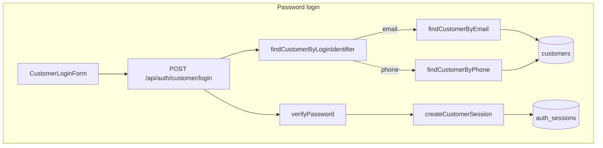
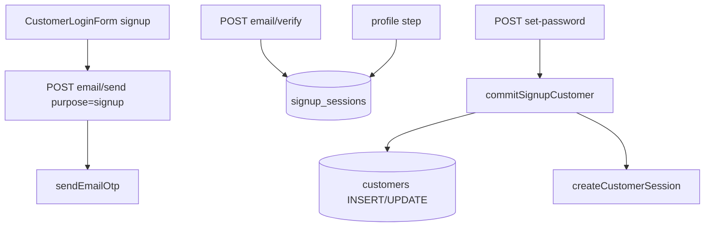
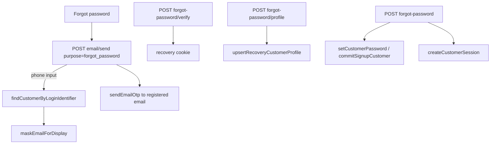
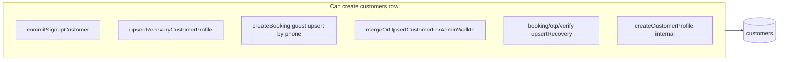

# Authentication SSOT — Investigation Report

**Status:** Investigation complete — implementation in progress  
**Date:** 2026-07-02  
**Scope:** Resident identity only (not admin auth, not booking/billing/occupancy logic)

Related: [`AUTH_DUAL_LOGIN.md`](./AUTH_DUAL_LOGIN.md), [`CRITICAL_BOOKING_AUTH_INVESTIGATION.md`](./CRITICAL_BOOKING_AUTH_INVESTIGATION.md)

---

## Objective

**One human = one `customers` row = one password = one wallet = one booking history = one KYC.**

Phone login and email login must resolve to the **same** customer. Forgot-password must never reveal the full registered email.

---

## Invariant

| Dimension | Canonical store |
|-----------|-----------------|
| Identity | `customers.id` |
| Phone | `customers.phone` (unique, E.164) |
| Email | `customers.email` (unique, citext) |
| Password | `customers.password_hash` |
| Session | `auth_sessions` (`kind='customer'`, `subject_id` → `customers.id`) |
| Bookings | `bookings.customer_id` |
| Wallet / deposits | `deposit_ledger.customer_id` |
| KYC | `kyc_submissions.customer_id` |
| Invoices | `rent_invoices.customer_id`, `financial_invoices.customer_id` |

---

## Flow diagram — login paths

Both branches converge on **one** `customers` row when phone and email belong to the same account. Split identity is when phone resolves to row A and email to row B.

---

## Flow diagram — signup

Customer row is **not** created until password commit. Profile lives in `signup_sessions` until then.

---

## Flow diagram — forgot password

**Rule:** OTP always goes to the **registered email**. Phone entry shows masked email only (`a******@gmail.com`).

---

## Flow diagram — customer creation paths

| Path | Unique key | Duplicate risk |
|------|------------|----------------|
| `commitSignupCustomer` | email + phone pre-check | Low (DB unique indexes) |
| `upsertRecoveryCustomerProfile` | email; phone via `resolvePhoneConflictForRecovery` | Low |
| `createBooking` (guest) | phone `onConflictDoUpdate` | Phone safe; email clash → 23505 |
| `mergeOrUpsertCustomerForAdminWalkIn` | phone upsert | Phone safe |
| `createCustomerProfile` | none | **High** if called without guards |

---

## Root causes of duplicate / split identity

### 1. Split identity (phone row ≠ email row)

**Symptom:** Login works with phone OR email but not both; forgot-password finds wrong account; bookings on one row, profile on another.

**Cause:** Historical data or parallel creation paths before unique constraints; Harshal-style case (documented in `CRITICAL_BOOKING_AUTH_INVESTIGATION.md`).

**Detection:** `PHONE_LOOKUP_EMAIL_MISMATCH` in auth integrity check.

### 2. Phone-only upsert without email merge

**Symptom:** Admin walk-in / express booking creates row with placeholder email; resident later signs up with real email → second row if phone differs slightly.

**Mitigation:** `mergeOrUpsertCustomerForAdminWalkIn` uses phone as key; signup uses `commitSignupCustomer` phone conflict check.

### 3. Booking inline OTP synthetic email

**Path:** `resolveBookingOtpEmail` → `book+{digits}@awesomepg.app` when no customer exists.

**Risk:** Profile created via `upsertRecoveryCustomerProfile` before user completes signup with real email.

### 4. Incomplete signup rows with bookings

**Symptom:** Booking assigned before password set; resident cannot log in.

**Detection:** `ORPHAN_INCOMPLETE_WITH_BOOKING`.

### 5. `findCustomerByPhone` / `findCustomerByEmail` return archived rows

Callers must check `archivedAt` (login does; not all paths).

### 6. Auth integrity repair gaps (pre-fix)

- `PHONE_LOOKUP_EMAIL_MISMATCH` missing `customerIds` in metadata → repair skipped
- Repair only reassigned `bookings`, not wallet/KYC/invoices
- Repair did not merge phone+email onto canonical row after archive
- Three declared check types never ran (`BOOKING_WITHOUT_CUSTOMER`, etc.)

---

## Architecture proposal

### Layer 1 — Runtime SSOT (`src/lib/auth/`)

| Module | Role |
|--------|------|
| `customer.ts` | Create/update/commit; conflict resolution |
| `loginIdentifier.ts` | Parse email/phone; `findCustomerByLoginIdentifier`; mask email |
| `session.ts` | Session create/read |
| `customerIdentityMerge.ts` | **New** — reassign all `customer_id` FKs; merge credentials onto canonical |

### Layer 2 — Integrity (`src/services/authIntegrity*.ts`)

Detect → repair with full FK reassign + identity merge on canonical.

### Layer 3 — Admin tool (`/admin/system/auth-integrity`)

Report, search, per-issue repair.

### Rules enforced at runtime (unchanged behaviour, documented)

1. Login: `findCustomerByLoginIdentifier` → single active customer
2. Signup: `commitSignupCustomer` blocks complete phone on different email
3. Recovery: `resolvePhoneConflictForRecovery` archives stale incomplete phone owners
4. Forgot password: never return full email; OTP to registered email only

---

## Files in scope (auth only)

- `src/lib/auth/*`
- `app/api/auth/customer/**`
- `src/services/authIntegrityCheck.ts`
- `src/services/authIntegrityRepair.ts`
- `src/lib/auth/customerIdentityMerge.ts`
- `app/(admin)/admin/system/auth-integrity/**`
- `tests/unit/loginIdentifier.test.ts`
- `tests/unit/authIntegrity.test.ts`

**Out of scope:** booking lifecycle, billing, occupancy, UI redesign.

---

## Production verification checklist

- [ ] Phone + password login
- [ ] Email + password login (same customer)
- [ ] Forgot password via phone → masked email → OTP → new password
- [ ] Forgot password via email
- [ ] Auth integrity page detects duplicates
- [ ] Repair merges bookings, wallet, KYC, invoices
- [ ] Express booking / admin walk-in does not create duplicate for same phone
- [ ] `npm test` passes
- [ ] `npm run build` passes
- [ ] Vercel production deploy Ready
