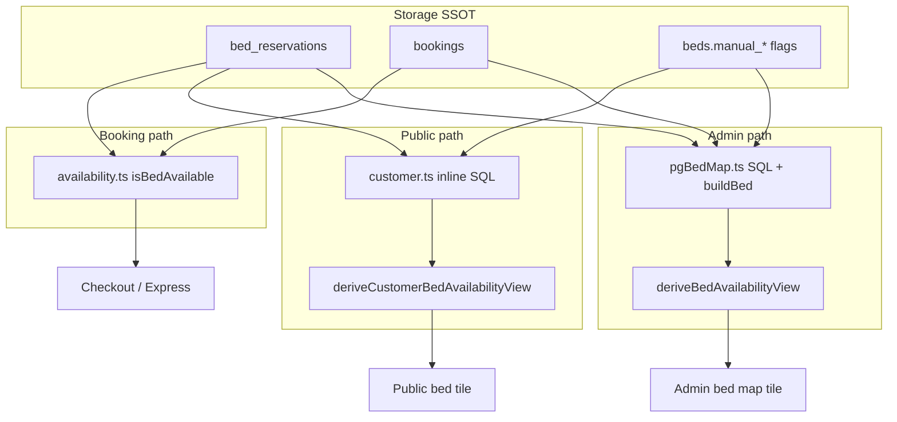
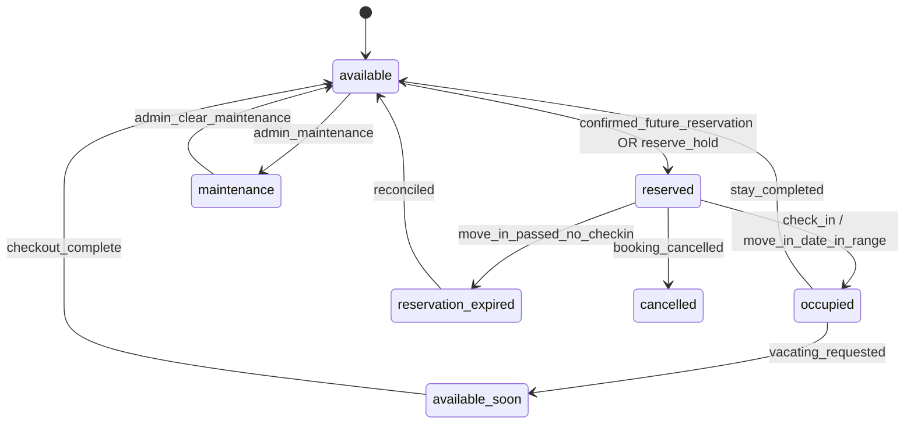
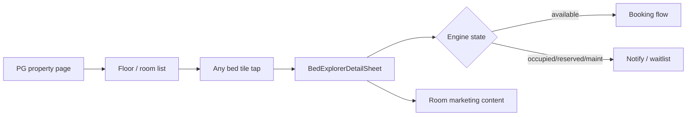

# Bed Explorer & Occupancy SSOT — Technical Implementation Plan

**Status:** Draft for approval — **do not implement until signed off.**  
**Date:** 2026-07-02  
**Scope:** Part 1 bug fixes, Part 2–7 Bed Explorer redesign, critical Admin/Public SSOT unification.

---

## Executive summary

The Admin bed map and Public PG page **can disagree on the same bed** because occupancy is computed in **at least six independent places**, each with slightly different SQL predicates, inputs, and semantics. UI patches (`deriveBedAvailabilityView`, inline EXISTS in `customer.ts`, TS logic in `pgBedMap.buildBed`) cannot fix this — we need **one occupancy engine** that every surface consumes.

This plan proposes:

1. **`getBedOccupancySnapshot(bedId, asOfDate)`** as the single SSOT read API.
2. **`bedOccupancyEngine.ts`** consolidating predicates currently scattered across `occupancySsot.ts`, `availability.ts`, `customer.ts`, `pgBedMap.ts`, and `roomActivity.ts`.
3. **Reservation lifecycle engine** with explicit states including **reservation expired**.
4. **Unified premium room/bed detail experience** (Public + Admin) driven by the same snapshot + enriched room/property content.
5. **Regression test suite** that fails the build if Admin ≠ Public ≠ Resident for the same fixture.

---

## Part 0 — Critical SSOT audit (why Admin ≠ Public)

### 0.1 Every place occupancy / availability is calculated

| # | Location | Function / mechanism | Predicate highlights | Used by |
|---|----------|-------------------|----------------------|---------|
| 1 | `src/lib/occupancySsot.ts` | SQL fragments: `occupancyReservationCoreSql`, `adminAssignedReservationSql_b`, `bedOccupiedTodayExistsSql` | `confirmed` + `active` + `primary` + date in range | Admin KPIs, bed map `occ` lateral, residents |
| 2 | `src/services/pgBedMap.ts` | `getPgBedMap` + `buildBed` | `occ` uses SSOT; `res` lateral = future monthly/open_ended only; `isAvailableNow` computed in TS | Admin bed map |
| 3 | `src/db/queries/customer.ts` | `getRoomDetail`, `listPublicPgs` inline SQL | **`isAvailableNow` / `reservedFrom` — NO `booking.status = confirmed` on block checks** | Public PG page, bed tiles |
| 4 | `src/services/availability.ts` | `isBedAvailable`, `getPgAvailability`, `getBedAvailabilityTimeline` | `active` + `confirmed` + range overlap | Booking engine, Express booking, room change |
| 5 | `src/lib/bedAvailabilityState.ts` | `deriveBedAvailabilityView`, `deriveCustomerBedAvailabilityView` | Pure label derivation from **different input flags** | Admin map labels, public bed tiles |
| 6 | `src/services/roomActivity.ts` | `getRoomActivityStats` | Duplicate of customer SQL (no confirmed) | Room detail insights |
| 7 | `src/db/queries/admin.ts` | `getDashboardStats`, `getOccupancyByPg` | `bedOccupiedTodayExistsSql` | Platform occupancy KPIs |
| 8 | `beds.manual_occupied` column | `setBedManualOccupied` | Column flag, not a reservation | Public block only; **ignored by** `isBedAvailable` unless cleared |
| 9 | `beds.manual_reserved_*` | `setBedManualReserved` | Admin reserve mark | Display + public hold logic |
| 10 | `bed_reserve_holds` table | `listActiveBedReserves` | Customer 50% reserve holds | Ops “move-ins today”, public reserve display |
| 11 | `src/lib/occupancyEligibility.ts` | Payment/KYC gates | Operational eligibility, **not** display SSOT | Billing, onboarding |
| 12 | `src/lib/residentActiveTenancy.ts` | `getActiveTenancyForCustomer` | `adminAssignedReservationSql_b` | Resident portal, Express booking context |

**There is no `getBedStatus()` function.** Status is inferred differently at each layer.

### 0.2 Root cause of Admin vs Public regression (e.g. Room 102 B1)



**Why this regression happened:**

1. **Historical layering:** `occupancySsot.ts` was added as SQL fragments for admin/residents, but public queries in `customer.ts` were never migrated to use them.
2. **Missing `confirmed` filter on public:** Public `isAvailableNow` blocks on any `active` reservation in range; admin requires `confirmed`. A `pending_approval` booking can block public inventory while admin shows “open”.
3. **Inverse drift on future reservations:** Admin `res` lateral filters `duration_mode IN ('monthly','open_ended')`; public `reservedFrom` does not — different “Booked/Reserved” semantics.
4. **`manualOccupied` is a shadow state:** Sets display on website but not operational SSOT; admin map and dashboard counts treat it differently.
5. **Label layer ≠ data layer:** `bedAvailabilityState.ts` is shared, but **inputs differ** per caller — same function, different truth.
6. **No cross-surface regression tests:** Unit tests cover derivations with mocked inputs, not “same bedId → same kind” across admin and public loaders.

### 0.3 Which layer should become SSOT

| Layer | Verdict |
|-------|---------|
| **Storage** | `bed_reservations` + `bookings` + `beds.status` remain storage SSOT |
| **Read/compute SSOT (NEW)** | `src/services/bedOccupancyEngine.ts` → `getBedOccupancySnapshot()` |
| **Display SSOT (keep, refactor inputs)** | `bedAvailabilityState.ts` — **labels only**, fed exclusively by engine output |
| **Booking gate SSOT (delegate)** | `availability.ts` → thin wrapper calling engine + date-range overlap |
| **Delete / stop using** | Inline occupancy SQL in `customer.ts`, `roomActivity.ts`; TS `isAvailableNow` in `pgBedMap.buildBed` |

### 0.4 Files to delete or gut

| File / section | Action |
|----------------|--------|
| `customer.ts` — inline `isAvailableNow`, `reservedFrom`, vacating laterals | **Replace** with engine calls or shared SQL view |
| `roomActivity.ts` — duplicate availability SQL | **Delete** duplicate logic; call engine |
| `pgBedMap.buildBed` — local `isAvailableNow` computation | **Replace** with engine snapshot fields |
| `PgBedMapPanel` / `CustomerBedMap` — local room occupied counts | **Replace** with engine aggregates |
| Dormant unwired UI (`PgDnaFloorFlow`, duplicate `RoomDetailSheet` paths) | **Consolidate** into one explorer after SSOT lands (see Part 2) |

### 0.5 Files to refactor (not delete)

| File | Refactor |
|------|----------|
| `src/lib/occupancySsot.ts` | Becomes internal predicates imported **only** by `bedOccupancyEngine.ts` |
| `src/services/availability.ts` | Delegates blocking checks to engine |
| `src/services/pgBedMap.ts` | Consumes engine for per-bed fields |
| `src/db/queries/customer.ts` | Batch engine call for room bed lists |
| `src/lib/bedAvailabilityState.ts` | Single `deriveBedViewFromSnapshot(snapshot, audience)` |
| `src/services/bookingAdminOps.ts` | Mark occupied/reserved/maintenance → engine invalidation + state transitions |
| `src/services/occupancySync.ts` | Extended for reservation expiry reconciliation |

---

## Part 1 — Bug fixes

### 1.1 Reservation expiry (Room 301 B2 — stale “Moves in 1 July”)

**Observed bug:** Future move-in date displayed after that date has passed; bed still blocked; booking never checked in.

**Current behavior:**

- `releaseExpiredHolds()` expires **`hold`** status when `hold_expires_at` passes (checkout unpaid).
- `fixedStayAutoExpiry` completes fixed stays past checkout.
- **No sweeper** for: confirmed/active primary reservation whose `lower(stay_range)` is in the past but tenant never became “occupied today” per SSOT.

**Proposed reservation states (engine output):**

| Engine state | Meaning | Blocks inventory |
|--------------|---------|------------------|
| `available` | No blocking reservation or mark | No |
| `reserved` | Future confirmed move-in (within policy window) | Yes |
| `reservation_expired` | Move-in date passed, no check-in, grace elapsed | No (after reconciliation) |
| `occupied` | SSOT occupant today | Yes |
| `available_soon` | Vacating approved/pending with release date | Partial (pre-bookable window) |
| `checkout_pending` | Past vacating date, settlement incomplete | Yes until checkout |
| `maintenance` | Bed or room in maintenance | Yes |
| `blocked` | Admin blocked | Yes |
| `cancelled` | Terminal booking | No |

**Proposed business rule (needs confirmation — see Questions):**

```
IF booking.status IN ('pending_payment', 'pending_approval')
   AND move-in date < today
   AND NOT payment_approved
THEN cancel reservation + booking (or mark reservation_expired)

IF booking.status = 'confirmed'
   AND lower(stay_range) <= today
   AND NOT occupied_today (per occupancyReservationCoreSql)
   AND grace_period_elapsed (default: end of move-in day IST?)
THEN transition → reservation_expired:
   - bed_reservations.status = 'cancelled' OR new status 'expired'
   - booking.status → 'cancelled' or 'no_show' (new enum?)
   - audit log + optional admin notification
```

**Never display stale move-in:** `deriveBedAvailabilityView` must receive engine state `reservation_expired` → label **“Reservation expired”** briefly during reconciliation, then **available**.

**Cron:** New job `expire-stale-reservations` (or extend `automation` cron) calling `expireStaleReservationsBatch()`.

**Affected services:**

- `bookingLifecycle.ts` — new expiry function
- `occupancySync.ts` — reconcile after expiry
- `bedOccupancyEngine.ts` — never emit `reserved` when move-in < asOfDate unless occupied

### 1.2 Admin “Mark occupied” audit

**Current flow:**

```
UI: BedMapManualOccupiedToggle
  → setBedManualOccupiedAction (map/actions.ts)
  → setBedManualOccupied (bookingAdminOps.ts)
  → reconcileBedForAdminMark (cancels stale holds)
  → UPDATE beds.manual_occupied = true
```

**Problems:**

1. **Not a real state transition** — toggles a column, does not create `bed_reservation` or booking.
2. **`isBedAvailable(..., ignoreManualOccupied: true)`** allows Express/assign to bypass the mark after `clearBedAdminMarks`.
3. **Admin map shows “Occupied”** via `manualOccupied && !isOccupiedToday`; public blocks via `NOT manual_occupied`; dashboard KPIs **ignore** manual mark.
4. **No transition path** Available → Reserved → Occupied in one SSOT — three parallel mechanisms (manual mark, manual reserve, real booking).

**Proposed fix:**

- Deprecate `manual_occupied` for new operations (migration period: engine treats it as `occupied` pseudo-state with `source: manual`).
- **Mark Occupied** admin action should either:
  - **Option A (recommended):** Open assign-tenant flow (creates confirmed booking + active reservation) — already exists via `assignTenantToBed`.
  - **Option B:** Create lightweight “admin occupancy placeholder” reservation (like `markPgFullyOccupied` but single bed) with required tenant link.
- Remove toggle that only sets column without reservation OR clearly label as “Website-only mark” excluded from ops SSOT.

**State machine (single SSOT):**



### 1.3 Maintenance mode

**Current:** `beds.status` enum includes `maintenance` | `blocked` | `available`. Admin toggles via `AdminBookingOpsPanel` / `updateBedInventoryStatus`. Engine + display already branch on `bedStatus === 'maintenance'`.

**Gaps vs requirements:**

| Requirement | Current | Plan |
|-------------|---------|------|
| Mark entire room | Per-bed only | Add `rooms.maintenance_mode` OR propagate maintenance to all beds in room via admin action |
| Mark specific bed | ✅ `beds.status` | Keep |
| Cannot book/reserve/check-in | ✅ `isBedAvailable` checks status | Engine hard block |
| Admin grey/orange | Partial styling | Standardize tokens in bed map |
| Public “Temporarily unavailable” | Label “Maintenance” | Map to customer copy per spec |

**DB change:** `rooms.maintenance_mode enum('none','full','partial')` + optional `maintenance_note`, `maintenance_until`. When `full`, engine marks all beds maintenance regardless of individual status.

---

## Part 2 — Public bed experience

### 2.1 Unified detail drawer (all bed states)

**Current:** `CustomerBedDetailSheet` — behavior differs by state; occupied beds are low-value; room page uses center modal vs PG page bottom sheet.

**Target UX:**

| Bed state | CTA | Secondary |
|-----------|-----|-----------|
| Available | Book now | — |
| Occupied | Notify me when available | Join waitlist |
| Reserved | Join waiting list | — |
| Maintenance | Unavailable (disabled) | Notify when back |
| Available soon (vacating) | Pre-book / Notify | — |

**Architecture:**

- One component: `BedExplorerDetailSheet` (replaces `CustomerBedDetailSheet` + unwired `RoomDetailSheet`).
- Props from `BedOccupancySnapshot` + `RoomMarketingProfile` (photos, amenities, rent, features).
- Admin bed side panel reads same snapshot via `audience: 'admin'`.

### 2.2 Room detail content (sell the room)

**Data model additions (see §3–4):** room gallery, amenities, marketing copy, interested count.

**Deposit rule:** First screen shows **monthly rent only** + “Electricity included” badge when configured. Deposit surfaced only at checkout/review step (already partially true; enforce in all entry points).

**Wire existing dormant assets:**

- `RoomDetailSheet`, `PgDnaFloorFlow` — merge patterns, don’t maintain two explorers.
- `roomMedia.ts` — extend for per-room photo sets.

### 2.3 UI flow



Admin map: bed tile click → same snapshot → `AdminBedDetailPanel` with ops actions (assign, maintenance, vacating link).

---

## Part 3 — Room amenities (DB)

**Current:** `room_types.default_amenities` jsonb exists but **never queried on public pages**. No per-room override.

**Proposed schema:**

```sql
-- Option A: room-level jsonb (flexible)
ALTER TABLE rooms ADD COLUMN amenities jsonb NOT NULL DEFAULT '{}';
ALTER TABLE rooms ADD COLUMN marketing jsonb NOT NULL DEFAULT '{}';
-- marketing: { headline, whyChooseBullets[], galleryUrls[] }

-- Canonical amenity catalog (optional normalization)
CREATE TABLE amenity_definitions (
  id text PRIMARY KEY,          -- 'pvc_wall_panels', 'ceiling_fan', ...
  label text NOT NULL,
  category text NOT NULL,       -- 'comfort', 'furniture', 'bathroom', ...
  icon text
);

-- room_amenities junction OR jsonb keys validated against catalog
```

**Seed catalog** with spec list: PVC panels, fans, window, ventilation, mattress, pillow, bedsheet, blanket, cupboard, study area, dustbin, attached washroom, mirror, curtains, lighting, AC/non-AC.

**Admin UI:** Extend `RoomDetailsEditor` with amenity checklist + room gallery upload.

**Public UI:** Amenity chips on detail sheet; inherit from `room_type` defaults with room overrides.

---

## Part 4 — Property features (PG level)

**Current:** `pgs.amenities` jsonb + `PG_AMENITY_DEFINITIONS` in `src/lib/pgAmenities.ts`. Sufficient for most spec items (cleaning, laundry, WiFi, UV water, fridge, terrace, parking, CCTV, etc.).

**Plan:**

- Extend catalog with any missing keys from spec.
- PG page shows features **once** in hero/trust section (`PgMobileHero` + `AmenityList`).
- Room detail sheet links “See all property features” — no duplication of full list on every room.

---

## Part 5 — Shantinagar “Electricity Included” badge

**Current:** Global `pgs.amenities.freeElectricity` boolean — not Shantinagar-specific in code (Shantinagar has it set in DB seed).

**Plan:**

- Add explicit PG config: `pgs.marketing_config jsonb` → `{ "electricityIncludedBadge": true }` OR reuse `freeElectricity` with documented semantics.
- **Single helper:** `shouldShowElectricityIncludedBadge(pgId | pgSlug)` — used by:
  - Property page
  - Room/bed detail sheet
  - Booking review / checkout (`BookingSummary`)
  - Invoice preview
- **No hardcoded slug checks** — configuration only.

---

## Part 6 — Waitlist & demand analytics

**Current:** `bed_notice_interest` — deduped visitor keys; auto-fired on sheet open; **no notification queue**.

**Plan:**

| Piece | Implementation |
|-------|----------------|
| Explicit “Notify me” / “Join waitlist” | UI button → `POST /api/beds/[bedId]/waitlist` |
| Interest count | Engine field `waitlistCount` + existing hold interest |
| States allowed | occupied, reserved, maintenance, available_soon |
| Admin analytics | Extend bed map + demand dashboard; feed from `bed_notice_interest` + waitlist signups |
| Future notify queue | Out of scope for Phase 1 — schema `bed_waitlist_entries(email, phone, customer_id, bed_id, room_id, created_at, notified_at)` |

---

## Part 7 — Design principles

- **Desktop/admin design is canonical** for information density; public is responsive adaptation.
- **Airbnb-level room story:** large imagery, amenity grid, social proof (interested count), clear rent headline.
- **One sheet, one snapshot, one CTA ruleset.**

---

## Database changes summary

| Change | Priority |
|--------|----------|
| `rooms.amenities jsonb`, `rooms.marketing jsonb` | P1 |
| `rooms.maintenance_mode` (+ optional note/until) | P1 |
| `amenity_definitions` catalog table | P2 |
| `bed_waitlist_entries` (explicit waitlist) | P2 |
| `pgs.marketing_config jsonb` (electricity badge + future) | P1 |
| Reservation status `expired` OR use `cancelled` + `expired_at` reason code | P1 |
| Optional `bookings.no_show_at` | P1 |
| Deprecate `beds.manual_occupied` (long-term) | P3 |

---

## SSOT engine API (proposed)

```typescript
// src/services/bedOccupancyEngine.ts

export type BedOccupancyState =
  | 'available'
  | 'reserved'
  | 'reservation_expired'
  | 'occupied'
  | 'available_soon'
  | 'checkout_pending'
  | 'maintenance'
  | 'blocked';

export type BedOccupancySnapshot = {
  bedId: string;
  asOfDate: string; // ISO date
  state: BedOccupancyState;
  // Occupant (privacy-safe fields for public)
  occupantFirstName?: string;
  occupantUntil?: string;
  reservedFrom?: string;
  reservedUntil?: string;
  nextAvailableDate?: string;
  preBookableFrom?: string;
  vacatingDate?: string;
  vacatingStatus?: 'pending' | 'approved';
  maintenanceUntil?: string;
  waitlistCount: number;
  holdInterestCount: number;
  bookingId?: string; // admin-only when audience=admin
  source: 'reservation' | 'manual' | 'maintenance' | 'hold' | 'none';
  blocksBooking: boolean;
  blocksReservation: boolean;
  allowsWaitlist: boolean;
  // Normalized for display layer
  availabilityKind: BedAvailabilityKind; // from bedAvailabilityState
};

export async function getBedOccupancySnapshot(
  bedId: string,
  options?: { asOfDate?: string; audience?: 'public' | 'admin' | 'system' }
): Promise<BedOccupancySnapshot>;

export async function getBedOccupancySnapshotsForRoom(
  roomId: string,
  options?: { asOfDate?: string; audience?: 'public' | 'admin' }
): Promise<BedOccupancySnapshot[]>;

export async function getBedOccupancySnapshotsForPg(
  pgId: string,
  options?: { asOfDate?: string; audience?: 'public' | 'admin' }
): Promise<Map<string, BedOccupancySnapshot>>;
```

---

## Migration impact

| Area | Impact |
|------|--------|
| **Existing reservations** | One-time reconciliation script: find stale future move-ins past grace → expire |
| **manual_occupied beds** | Migrate to placeholder reservations OR clear with admin review |
| **Public cache** | Revalidate PG pages after engine rollout |
| **Admin bed map** | SQL simplification — smaller query, engine batch in app layer or PG function |
| **Express booking / checkout** | No behavior change if engine matches `isBedAvailable` |
| **Cron jobs** | Add stale reservation sweeper |
| **Downtime** | Zero-downtime deploy: engine behind feature flag `OCCUPANCY_ENGINE_V2` |

---

## Regression protection (required before merge)

New test file: `tests/unit/bedOccupancyParity.test.ts`

```typescript
// Fixture-driven parity tests
for (const fixture of FIXTURES) {
  it(`${fixture.name}: admin snapshot === public snapshot`, async () => {
    const admin = await getBedOccupancySnapshot(fixture.bedId, { audience: 'admin' });
    const pub = await getBedOccupancySnapshot(fixture.bedId, { audience: 'public' });
    expect(admin.state).toBe(pub.state);
    expect(admin.availabilityKind).toBe(pub.availabilityKind);
    expect(admin.blocksBooking).toBe(pub.blocksBooking);
  });
}
```

**Fixtures to seed:**

1. Active tenancy (Dhruv scenario — Room 102 B1)
2. Future confirmed monthly reservation
3. Stale reservation past move-in (Room 301 B2 scenario)
4. Maintenance bed
5. Vacating approved with pre-book window
6. Checkout hold (pending_payment)
7. manual_occupied legacy bed

**CI gate:** `npm run test:occupancy-parity` fails on any drift.

**Integration test:** Load admin bed map + public `getRoomDetail` for same PG; assert per-bed kind matrix equality.

---

## Implementation phases (after approval)

| Phase | Deliverable | Est. |
|-------|-------------|------|
| **0** | Engine + parity tests + feature flag; wire admin map + public queries | 1–2 weeks |
| **1** | Reservation expiry cron + mark-occupied fix + maintenance room-level | 1 week |
| **2** | Unified `BedExplorerDetailSheet` + room marketing profile | 1–2 weeks |
| **3** | Room amenities schema + admin editor + public display | 1 week |
| **4** | Waitlist UX + analytics | 1 week |
| **5** | Shantinagar badge helper wired everywhere; deposit UX audit | 3 days |
| **6** | Deprecate manual_occupied; delete duplicate SQL | 1 week |

---

## Questions for you (must answer before coding)

### Reservation expiry

1. **Grace period:** If move-in was 1 July and today is 2 July with no check-in, expire at end of 1 July IST, or allow N days grace?
2. **Booking terminal status:** Prefer `cancelled`, new `no_show`, or keep `confirmed` but cancel only the reservation?
3. **Payment-approved but not checked in:** Does payment proof approval extend the reservation window?

### Mark occupied

4. Should **Mark Occupied** always require assigning a real resident (booking + reservation), or keep a “website-only” mark for marketing?
5. If a bed is **Reserved** (future move-in), can admin force Mark Occupied, or must they cancel the reservation first?

### Maintenance

6. Room-level maintenance: block **all beds** automatically, or allow partial (some beds usable)?
7. Should maintenance beds appear on public map as visible-but-unavailable, or hidden entirely?

### Public UX

8. **Deposit:** Confirm zero deposit mention on bed detail, first mention at checkout step X?
9. Unify PG page and `/rooms/[roomId]` into one navigation pattern, or keep both with same sheet?

### Waitlist

10. Collect email/phone for notify, or logged-in customers only?
11. Is automated email/WhatsApp notify in scope for Phase 1, or registration + admin analytics only?

### Shantinagar badge

12. Confirm: badge driven by `freeElectricity` amenity flag per PG (Shantinagar enabled in admin), not slug — correct?

### SSOT rollout

13. OK to ship engine behind `OCCUPANCY_ENGINE_V2` env flag for staged rollout?
14. Priority: fix SSOT parity **before** premium UI, or parallel tracks?

---

## Affected services map (quick reference)

| Engine | Current files | Role after |
|--------|---------------|------------|
| **Occupancy engine** | NEW `bedOccupancyEngine.ts` | SSOT read |
| **Reservation engine** | `booking.ts`, `bookingLifecycle.ts`, `occupancySync.ts` | Writes + expiry |
| **Booking engine** | `booking.ts`, `availability.ts` | Gate via engine |
| **Pricing engine** | `pricing.ts`, `bed_prices` | Unchanged; feeds room detail rent |
| **Room state** | `beds.status`, `rooms.*`, manual flags | Maintenance + deprecate manual |
| **Display** | `bedAvailabilityState.ts`, `customerBedUi.tsx` | Labels from snapshot |
| **Interest/waitlist** | `bedNoticeInterest.ts` | Extended |
| **Admin map** | `pgBedMap.ts`, `PgBedMapPanel.tsx` | Consumer |
| **Public explorer** | `customer.ts`, `PgBlockBooking.tsx`, `customerBedUi.tsx` | Consumer |
| **Express booking** | `expressBookingSale.ts` | Consumer (via availability) |
| **Resident portal** | `residentActiveTenancy.ts` | Tenancy SSOT (aligned predicates) |
| **Operations** | `operationsCenter.ts`, `admin.ts` KPIs | Consumer |

---

## Approval checklist

- [ ] SSOT engine design approved
- [ ] Reservation expiry business rules answered (Questions 1–3)
- [ ] Mark occupied behavior confirmed (Questions 4–5)
- [ ] Maintenance room model confirmed (Questions 6–7)
- [ ] Public UX scope confirmed (Questions 8–9)
- [ ] Waitlist Phase 1 scope confirmed (Questions 10–11)
- [ ] Electricity badge config confirmed (Question 12)
- [ ] Rollout strategy confirmed (Questions 13–14)

**Once approved, implementation begins at Phase 0 (engine + parity tests). No UI redesign until parity tests pass.**
