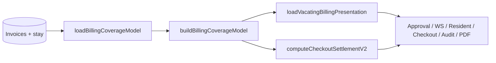

# Billing Coverage Model (SSOT)

**Status:** Permanent architecture for move-out money surfaces.  
**Code:** [`src/lib/billing/billingCoverageModel.ts`](../src/lib/billing/billingCoverageModel.ts) · **Loader:** [`loadBillingCoverageModel`](../src/services/billingCoverage.ts) · **Presentation bundle:** [`loadVacatingBillingPresentation`](../src/lib/vacating/loadVacatingBillingPresentation.ts)

Do **not** add parallel billing calculators for vacating, notice, tail rent, or settlement display. Extend this model and its loader only.

---

## Inputs

| Input | Source |
|-------|--------|
| `bookingId` | Booking row |
| Paid rent invoice periods | `rent_invoices` (paid principal) → raw anniversary windows |
| `moveInDate` | Primary bed reservation lower bound |
| `billingDay` | Resident billing profile or derived from move-in |
| `vacatingDate` / `noticeGivenDate` | Vacating request |
| `monthlyRentPaise` | Vacating snapshot or booking |
| `treatAsApprovedForTail` | `true` for settlement previews; `false` for live invoice suppression until approved |
| Stay policy | `stayType` / `durationMode` → notice applies |

Raw invoice periods are **clamped** to `moveInDate` before any display or notice math (`clampPaidPeriodToMoveIn`).

---

## Outputs (separate concepts)

| Field | Meaning |
|-------|---------|
| `paidInvoiceCoverage` | Which rent invoices are paid — **display/clamp only**, never starts before check-in |
| `currentBillingPeriod` | Anniversary period containing vacating (or as-of date) |
| `paidUntilDate` | Latest paid-through date extending **strictly past** vacating (notice prepaid) |
| `prepaidAfterVacatingDays` / `Paise` | Unused prepaid after vacate date |
| `daysPaidForSettlement` | Calendar days of paid coverage ∩ `[moveIn, vacating]` |
| `tailRent` / `tailRentPaise` | Final-period suppression + tail days through vacate ([`vacatingFinalPeriodRent`](../src/lib/billing/vacatingFinalPeriodRent.ts)) |
| `finalInvoiceSuppression` | Whether anniversary invoice for vacating month is suppressed |
| `noticeBreakdown` | Notice deduction engine output from **clamped** paid periods |

---

## Displayed “days” (admin/resident copy)

| UI label | Source | Notes |
|----------|--------|--------|
| **Days stayed** | V2 `waterfall.stay.stayDays` | Check-in through vacating (inclusive) |
| **`daysPaidForSettlement`** | Billing coverage model | **Internal only** — not shown on move-out review/statement UI (confusing vs rent paid/consumed) |
| **Rent consumed** | V2 `rentBucket.consumedPaise` | Money, not day count |
| **Billing cycle / Paid until** | `currentBillingPeriod` / `paidUntilDate` | Different business meanings |
| **Unused prepaid rent (days)** | Notice display | Prepaid **after vacate** applied to notice |

---

## Consumers (must use loader / presentation bundle)

- Notice deduction — `computeNoticeDeductionForBooking`
- Settlement preview — `loadVacatingBillingPresentation` → `estimatedSettlement`
- Approval dialog — `buildVacatingApprovalPreviewAsync`
- Financial workspace / resident portal — same preview + statement model
- Checkout detail — `loadVacatingBillingPresentation` + locked waterfall
- Monthly billing snapshot — optional `coverageModel` passthrough
- Tail rent in checkout V2 — `checkoutTailRentPaise` from coverage
- Audit breakdown — `settlementNoticeDisplay` + `billingCoverageDaysPaid` on detail
- Settlement PDF — `EstimatedSettlementPreview` sections only
- **Explainability audit** — `buildMoveOutSettlementExplanations` + `validateMoveOutSettlementExplanations`; production gate `scripts/audit-active-moveout-settlement-explanations.ts`

`notice_breakdown_json` on vacating/checkout rows is an **audit snapshot at write time** — not used for UI display after this migration.

---

## Settlement explainability contract

Every amount shown on move-out review (rent paid/consumed, unused rent, notice, tail, deposit remaining, refund) must have a structured explanation from [`moveOutSettlementExplanation.ts`](../src/lib/vacating/moveOutSettlementExplanation.ts):

| Field | Required |
|-------|----------|
| Value | Paise + INR (must match `CheckoutSettlementEngineV2` waterfall) |
| Formula | Calculation with substituted inputs |
| Business rule | Stable rule id + prose (`SETTLEMENT_BUSINESS_RULES`) |
| Source | `BookingMoneyBalances`, `BillingCoverageModel`, `CheckoutSettlementEngineV2`, or `NoticeDeductionEngine` |

If the engine cannot produce a complete explanation, or validation fails (waterfall vs UI vs BCM), treat as a **bug**. Run against all active non-terminal move-outs:

`USE_PRODUCTION_DB=1 npx tsx scripts/audit-active-moveout-settlement-explanations.ts`

Review UI shows a collapsible **Why these numbers** section on the settlement statement (admin approve modal).

---

## Flow

---

## Tail rent rule (Case B)

When vacating is exactly **one calendar day** after the first unpaid day following paid-through, tail charges **one day** (vacating date). Longer spans use inclusive tail window from first unpaid day through vacate. See `vacatingFinalPeriodRent.test.ts` and `billingCoverageRegression.test.ts`.

---

## Related docs

- [BILLING_ENGINE.md](./BILLING_ENGINE.md) — platform billing scheduler and products
- [MEMORY/decisions.md](./MEMORY/decisions.md) — decision log
