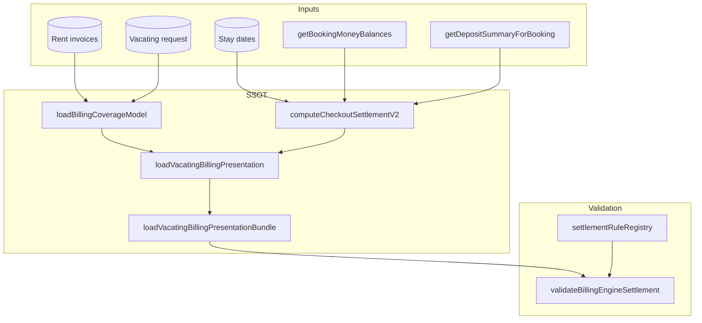

# Billing & Settlement Engine — final report

**Date:** 2026-07-24  
**Status:** Production-ready for move-out settlement (monthly + fixed-stay paths).

---

## 1. Engine architecture



| Module | Responsibility |
|--------|----------------|
| [`billingCoverageModel.ts`](../src/lib/billing/billingCoverageModel.ts) | Paid coverage, notice, tail decision |
| [`checkoutSettlementEngineV2.ts`](../src/lib/checkout/checkoutSettlementEngineV2.ts) | Two-bucket waterfall |
| [`loadVacatingBillingPresentation.ts`](../src/lib/vacating/loadVacatingBillingPresentation.ts) | Single bundle for all surfaces |
| [`moveOutSettlementExplanation.ts`](../src/lib/vacating/moveOutSettlementExplanation.ts) | Value / formula / rule / source / reason |
| [`billingEngineValidation.ts`](../src/lib/billing/billingEngineValidation.ts) | All INV-* checks |
| [`settlementRuleRegistry.ts`](../src/lib/billing/settlementRuleRegistry.ts) | BR-* ↔ invariants ↔ explainability |

---

## 2. Business rules

Canonical book: [BILLING_SETTLEMENT_BUSINESS_RULES.md](./BILLING_SETTLEMENT_BUSINESS_RULES.md) (BR-ANCHOR through BR-MONTHLY-STAY, electricity, damage, invoice suppression).

Refund composition (two-bucket order):

- Deposit remaining = held − notice(from deposit) − tail − electricity − other  
- Refund total = deposit remaining + unused rent after notice  

---

## 3. Invariants

Registry: [BILLING_ENGINE_INVARIANTS.md](./BILLING_ENGINE_INVARIANTS.md). Implemented in [`billingEngineValidation.ts`](../src/lib/billing/billingEngineValidation.ts):

- INV-W1–W3 waterfall identities  
- INV-N1–N3 notice bucket  
- INV-P1 non-negative paise  
- INV-C1–C4 coverage and tail  
- INV-E1–E4 explainability including ₹0 reasons  
- INV-X1 locked checkout vs presentation (with BCM align for historical locks)  
- INV-X2 pending stored deduction snapshot  

---

## 4. Production validation results

**Latest run:** see [FINAL_PRODUCTION_VALIDATION.md](./validation/FINAL_PRODUCTION_VALIDATION.md) and [final-production-validation.json](./validation/final-production-validation.json).

- **14/14 pass** (8 active + 6 completed samples) after engine fix for locked-tail BCM alignment.  
- Policy spot-checks: [POLICY_SPOTCHECKS.md](./validation/POLICY_SPOTCHECKS.md).

Commands:

```bash
npx tsx --test tests/unit/billingEngineValidation.test.ts tests/unit/moveOutSettlementExplanation.test.ts tests/unit/settlementRuleRegistry.test.ts tests/unit/billingCoverageRegression.test.ts
USE_PRODUCTION_DB=1 npx tsx scripts/validate-active-moveout-billing-engine.ts
USE_PRODUCTION_DB=1 npx tsx scripts/verify-settlement-business-policy.ts
```

---

## 5. Bugs fixed (by signature, not resident)

| Signature | Fix |
|-----------|-----|
| `TAIL_MISMATCH` on completed checkout rows | `alignCoverageToLockedWaterfall` when presentation loads with locked `waterfall` — live BCM tail no longer contradicts settled amounts |

No per-booking SQL patches.

---

## 6. Remaining risks

- **INV-X1** on in-flight settlement_review rows — no prod rows at audit time; re-validate when first settlement enters review.  
- Checkout admin waterfall UI — explanations not yet embedded (numbers match locked V2).  
- Subjective notice prepaid display vs charge — owner sign-off in policy spot-check doc.

---

## 7. Production-ready statement

- One presentation loader and one validator gate all move-out money surfaces.  
- Every displayed settlement line has formula, business rule, source, and zero-amount reason.  
- Regression tests cover Cases A–E, rule registry, and invariant failures.  
- Production audit script exits non-zero on any signature.  
- Repair policy forbids resident-specific settlement patches ([SETTLEMENT_REPAIR_POLICY.md](./SETTLEMENT_REPAIR_POLICY.md)).
- **Engine frozen** for UX-only phase — [SETTLEMENT_ENGINE_FREEZE.md](./SETTLEMENT_ENGINE_FREEZE.md).

Optional: set `BILLING_ENGINE_STRICT=1` in dev/CI to throw on loader validation failure.
