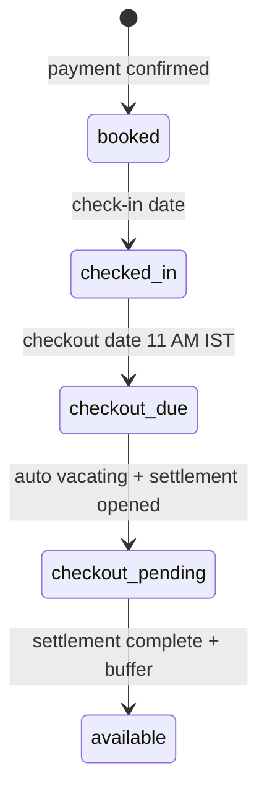
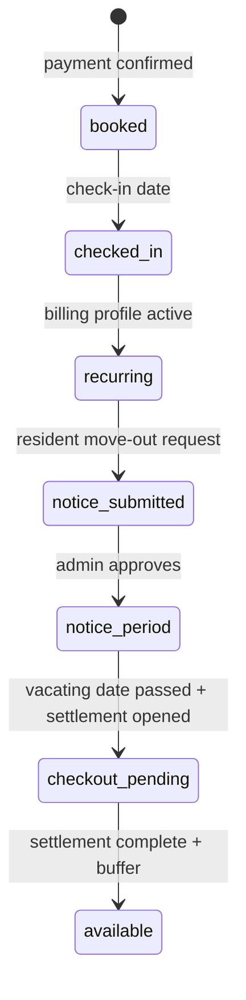

# Booking Lifecycle SSOT — Implementation Plan

**Status:** **Phase 1 complete** — see [`PHASE_1_OCCUPANCY_AUDIT.md`](./PHASE_1_OCCUPANCY_AUDIT.md)  
**Date:** 2026-07-02 (finalized 2026-07-02)  
**Approved investigation:** [`APG-2026-0036_BOOKING_MODEL_INVESTIGATION.md`](./APG-2026-0036_BOOKING_MODEL_INVESTIGATION.md)  
**Related:** [`BED_EXPLORER_SSOT_PLAN.md`](./BED_EXPLORER_SSOT_PLAN.md)

---

## 1. Problem statement

The system conflates two products:

| Product | Contract | Checkout | Billing | Occupancy end |
|---------|----------|----------|---------|---------------|
| **Fixed-duration** | 1–29 nights | Real `expected_checkout_date` | Single upfront rent + 50% deposit | Checkout → settlement → available |
| **Monthly recurring** | Open-ended tenancy | **None** — billing anchor only | Recurring cron + notice proration | Vacating → settlement → available |

Today, both products share:

- `bed_reservations.stay_range` upper bound as a pseudo-checkout
- `nextAvailableDate` / `pre_bookable` label branches keyed on dates alone
- `2099-01-01` sentinel for open-ended stays
- Customer checkout defaulting monthly `stay_range` to **check-in + 1 month**
- Beds becoming **Available** before checkout settlement completes

---

## 2. Target architecture

### 2.1 Single occupancy engine

```text
getBedOccupancySnapshot(bedId, asOfDate) → BedOccupancySnapshot
```

**Public / customer states (five):**

| State | Meaning | Colour |
|-------|---------|--------|
| `available` | No blocking reservation / hold | Green |
| `reserved` | Bed reserve product (§8.2) — not checked in | Amber |
| `occupied` | Checked-in resident, no approved notice | Grey |
| `notice_period` | Approved vacating, still in unit | Yellow |
| `maintenance` | Admin maintenance flag — overrides all | Red |

**Admin-only sixth state:**

| State | Meaning | When |
|-------|---------|------|
| `checkout_pending` | Resident has physically vacated; settlement/refund/electricity in progress | Active `checkout_settlements` row in non-terminal status |

**Rules:**

- **State** comes from booking lifecycle + vacating + settlement + bed inventory — never from `upper(stay_range)` alone on monthly.
- **`bookableFromDate`** is separate from state (eligibility for *other* bookings).
- **Global turnover buffer:** 1 day (`RESERVE_CLEANING_BUFFER_DAYS`) applied to all pre-bookable dates.
- During **`checkout_pending`:** bed is **not Available**, **not bookable** on public or admin; admin map shows **"Checkout pending"** with settlement link.

**Checkout pending eligibility:**

| Stay type | When `checkout_pending` applies |
|-----------|--------------------------------|
| **Monthly** | **Mandatory** whenever an active `checkout_settlements` row exists (refund, electricity, deposit, damages workflow). |
| **Fixed** | Only when there is an **actual outstanding settlement workflow** (refund, electricity, damages, deposit hold). If settlement is suppressed or deposit-only with no workflow, the bed may become **Available** automatically after the global 1-day turnover buffer. |

**Public behaviour during checkout pending:**

- Do **not** show "Checkout Pending" copy to customers.
- Show as **not available / not bookable** (neutral grey, same as occupied-from-booking perspective).
- No pre-bookable date until settlement reaches terminal state **and** turnover buffer elapses.

**Admin behaviour:**

```text
Checkout pending · <resident name> · Open settlement
```

Triggered when:

```sql
checkout_settlements.status IN (
  'awaiting_resident_details',
  'awaiting_admin_review',
  'approved',
  'refund_pending'
)
AND booking.status = 'completed'  -- physical vacate done
```

Terminal (bed may become available): `refund_paid` | `completed` | `archived` (per settlement workflow rules).

### 2.2 Fixed-duration lifecycle



- **Max length:** 1–29 nights. **30+ nights → Monthly** at quote/checkout.
- **Pricing:** `computeLowestFixedStayRent` (unchanged).
- **Deposit:** 50% of rent subtotal (unchanged).
- **While checked in:** Occupied · sublabel **"Available from {checkout}"** · `bookableFromDate = checkout + 1 day`.
- **No** notice period, recurring billing, or resident move-out request.

### 2.3 Monthly lifecycle



- **No contractual checkout** (`expected_checkout_date` always `NULL`).
- **`billing_anchor_date`** drives invoice anniversary.
- **`stay_range`:** `[check_in,)` unbounded — no sentinel dates.
- **While occupied:** not pre-bookable (`bookableFromDate = null`).
- **Notice period:** pre-bookable from `vacating_date + 1 day` only.
- **Notice proration:** `vacatingCheckoutBilling.ts` (1 Jul → 20 Jul).

### 2.4 Deposit policy (inheritance)

Resolve at quote time:

```text
PG.monthly_deposit_policy  (required default)
    ↓ override if set
Room.monthly_deposit_policy  (optional)
    ↓ override if set
Bed.monthly_deposit_policy  (optional — via bed_prices.monthly_security_deposit_paise multiplier or explicit policy column)
```

| Policy | Monthly deposit |
|--------|-----------------|
| `one_month` | 1 × monthly rent |
| `two_month` | 2 × monthly rent |

Fixed stays: always **50% of optimized rent subtotal** (unaffected by PG monthly policy).

**Admin UI (Phase 3):** PG-level configuration only for now. Room/bed columns exist for future admin UI.

---

## 3. Data model

### 3.1 Bookings & reservations

| Entity | Fixed-duration | Monthly |
|--------|----------------|---------|
| `stay_type` | `fixed_date_stay` | `monthly_stay` |
| `duration_mode` | `fixed_stay` / `daily` / `weekly` | `open_ended` |
| `expected_checkout_date` | Required | **Always NULL** |
| `billing_anchor_date` | NULL | **Required** |
| `bed_reservations.stay_range` | `[check_in, check_out)` | **`[check_in,)`** |
| `resident_billing_profiles` | Not created | Required, `auto_generate=true` |

### 3.2 Migrations (Phase 3)

```sql
-- Monthly billing anchor
ALTER TABLE bookings ADD COLUMN billing_anchor_date date;

-- Deposit policy inheritance (PG + optional room/bed; UI exposes PG only initially)
CREATE TYPE monthly_deposit_policy AS ENUM ('one_month', 'two_month');

ALTER TABLE pgs ADD COLUMN monthly_deposit_policy monthly_deposit_policy NOT NULL DEFAULT 'one_month';
ALTER TABLE rooms ADD COLUMN monthly_deposit_policy monthly_deposit_policy;  -- nullable override
-- Bed: add rooms.monthly_deposit_policy resolution OR bed_prices.deposit_policy_override

-- Monthly reservations: unbounded upper
-- UPDATE bed_reservations SET stay_range = daterange(lower(stay_range), NULL, '[)') WHERE ...
```

### 3.3 Remove 2099 sentinel (Phase 3)

Delete or replace everywhere:

- `OPEN_ENDED_STAY_END` constant
- `isOpenEndedStayEnd()`
- `expressBookingSale` `LONG_TERM_RESERVATION_END`
- `restoreOpenEndedStay` / `bookingStayDateIntegrity` sentinel paths
- Customer `getRoomDetail` sentinel filter (`>= 2090-01-01`)

Replace with: `duration_mode IN ('open_ended','monthly')` **or** `upper(stay_range) IS NULL` (unbounded).

### 3.4 Occupancy engine types

```typescript
type PublicBedState =
  | 'available'
  | 'reserved'
  | 'occupied'
  | 'notice_period'
  | 'maintenance';

type AdminBedState = PublicBedState | 'checkout_pending';

type BedOccupancySnapshot = {
  publicState: PublicBedState;
  adminState: AdminBedState;
  label: string;           // surface-appropriate
  sublabel?: string;
  bookableFromDate: string | null;
  turnoverBufferDays: 1;    // global constant
  checkoutSettlementId?: string;  // admin only
};
```

**`bookableFromDate` rules:**

| Situation | Value |
|-----------|-------|
| Fixed + occupied | `expected_checkout_date + 1 day` |
| Monthly + occupied | `null` |
| Monthly + notice approved | `vacating_date + 1 day` |
| Checkout pending | `null` |
| Maintenance | `null` |

---

## 4. ₹680 settlement (Phase 4 — investigate only)

APG-2026-0036: **₹680 = notice deduction** (`5 × dailyRateFromMonthly(₹4,080)`), incorrectly applied to `fixed_date_stay`. Not electricity. Phase 4 RCA before any settlement logic change.

---

## 5. Implementation phases

### Phase 1 — Occupancy SSOT

| Step | Work |
|------|------|
| 1.1 | `src/lib/bedOccupancyEngine.ts` + `BedOccupancySnapshot` |
| 1.2 | Consolidate SQL from `occupancySsot.ts`, `pgBedMap.ts`, `customer.ts` |
| 1.3 | Split `publicState` vs `adminState` (`checkout_pending` from active settlement) |
| 1.4 | `bookableFromDate` with global +1 day buffer |
| 1.5 | Fixed occupied → "Available from {checkout}"; monthly → no pre-book |
| 1.6 | Wire all surfaces; flag `OCCUPANCY_ENGINE_V2=1` |
| 1.7 | Parity tests (Dhruv 0040 monthly B1, fixed-stay fixtures) |
| 1.8 | Remove flag; `bedOccupancyResolve` + `bedOccupancyBatch` for all counts |

**DB:** None · **Risk:** Low

---

### Phase 2 — Maintenance

| Step | Work |
|------|------|
| 2.1 | Engine short-circuit: `beds.status = 'maintenance'` → red, not bookable |
| 2.2 | Public + admin parity; exclude from occupancy KPIs |

**DB:** None · **Risk:** Low

---

### Phase 2b — Reservation product

| Step | Work |
|------|------|
| 2b.1 | Align `bed_reserve_holds` lifecycle with §8.2 |
| 2b.2 | Pricing: 50% of **optimized short-stay rent** for reserve window (not 50% of month) |
| 2b.3 | No deposit until conversion on check-in date |
| 2b.4 | Overlap: fixed stays OK until `check_in - 1 day`; monthly **blocked** |
| 2b.5 | Public: **"Reserved until {date}"** |
| 2b.6 | Auto-convert reserve → booking on check-in |
| 2b.7 | Admin cancel/edit |

**DB:** Possible `bed_reserve_holds` extensions · **Risk:** Medium

---

### Phase 3 — Monthly architecture + deposit policy

> **Gate:** Do **not** run Phase 3 database migrations until Phase 1 (occupancy SSOT) is implemented, verified under `OCCUPANCY_ENGINE_V2=1`, and confirmed stable in staging/production. Phase 1 engine must support **both** existing data (finite monthly `stay_range`, 2099 sentinel) **and** future unbounded ranges before any schema change.

| Step | Work |
|------|------|
| 3.1 | Migrations: `billing_anchor_date`, deposit policy columns |
| 3.2 | Unbounded `[check_in,)` for all monthly reservations |
| 3.3 | Remove all 2099 / `isOpenEndedStayEnd` logic |
| 3.4 | `createBooking` + customer checkout: no finite monthly end |
| 3.5 | `FIXED_DATE_MAX_NIGHTS = 29` |
| 3.6 | `resolveMonthlyDepositPaise(pg, room, bed)` with inheritance |
| 3.7 | PG admin UI: deposit policy selector (one month / two month) |
| 3.8 | Repair script: finite monthly `stay_range` → unbounded; set `billing_anchor_date` |
| 3.9 | **Hold bed in `checkout_pending`** until settlement terminal — stop releasing on `fixedStayAutoExpiry` before settlement |

**DB:** Yes · **Risk:** Medium (production repair window)

---

### Phase 4 — Settlement ₹680 RCA + fix

Investigation only first; fix after confirmed root cause. See §4.

---

## 6. Decisions log (final)

| Topic | Decision |
|-------|----------|
| Phase order | 1 → 2 → **2b** → 3 → 4 |
| Fixed max | **29 nights** |
| Monthly `stay_range` | **`[check_in,)`** — remove 2099 sentinel entirely |
| Deposit policy | PG default → room override → bed override; **UI: PG only** for now |
| Turnover buffer | **Global 1 day** — not configurable |
| Checkout pending | **Admin-only state**; public not bookable; settlement must complete before Available |
| Reservation | Phase **2b**, first-class product (§8.2) |

### 8.2 Reservation product rules

1. `reserve_start = today`, `reserved_until = chosen check-in`, future booking attached.
2. During reserve: **no deposit**; **50% of optimized rent** for reserve period.
3. On check-in: auto-convert; deposit + remaining rent due.
4. Public: **"Reserved until {date}"**.
5. Fixed stays may overlap until `check_in - 1 day`.
6. Monthly bookings **may not overlap** reservation.
7. Admin cancel/edit anytime.

---

## 7. Surface wiring matrix

| Surface | Ph 1 | Ph 2 | Ph 2b | Ph 3 |
|---------|------|------|-------|------|
| Admin bed map | ✓ | ✓ | ✓ | ✓ |
| Public PG | ✓ | ✓ | ✓ | ✓ |
| Booking / availability API | ✓ | ✓ | ✓ | ✓ |
| Checkout settlements queue | ✓ (checkout_pending) | — | — | ✓ |
| PG deposit policy admin | — | — | — | ✓ |

---

## 8. Rollout

```text
Phase 1 (flagged) → Phase 2 → Phase 2b → Phase 3 dry-run → Phase 3 execute → Phase 4
```

---

## 9. Out of scope

- Harshal auth repair
- Full Bed Explorer UI redesign (engine is prerequisite)
- Notice-policy redesign beyond ₹680 RCA fix
