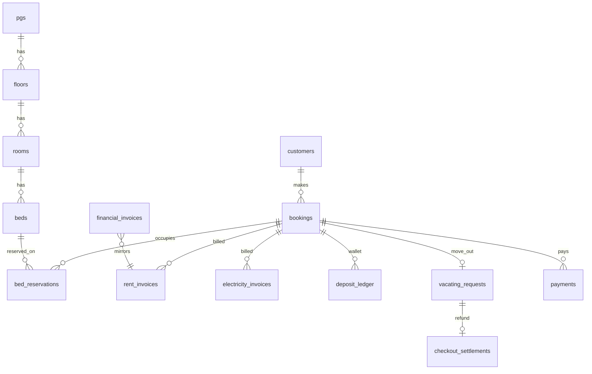

# Database

> PostgreSQL schema via Drizzle ORM. Source: `src/db/schema/`.  
> Migrations: `src/db/migrations/`. Deep reference: [[AWESOME_PG_MASTER_DOCUMENTATION_V2]].

Cross-links: [[ARCHITECTURE]] · [[WORKFLOWS]] · [[Billing]] · [[Vacating]] · [[Deposits]] · [[Bed Assignment]]

---

## Entity relationship (core)



---

## Inventory & property

### `pgs`

| Field | Notes |
|-------|-------|
| `id`, `slug`, `name` | Property identity |
| `gender_policy` | male / female / coed |
| `archived_at` | Soft delete |

**Relations:** `floors` → `rooms` → `beds`

### `floors`, `rooms`, `beds`

| Table | Key fields |
|-------|------------|
| `rooms` | `room_number`, `room_type_id`, `capacity` |
| `beds` | `bed_code`, `status` (available / maintenance / blocked) |
| `bed_prices` | Rate tiers per bed (daily/weekly/monthly/deposit) |

**Constraint:** GiST EXCLUDE on `bed_reservations` prevents overlapping active/hold reservations on same bed — see [[DECISIONS#Half-open stay ranges]].

---

## People & auth

### `customers`

| Field | Notes |
|-------|-------|
| `kyc_status` | pending / approved / rejected |
| `residency_status` | active / vacated / blocked |
| `phone`, `email` | Login identity |

### `admin_users`

| Field | Notes |
|-------|-------|
| `role` | super_admin, accountant, manager, etc. |
| `pg_scope` | JSON array — PG access for non–super-admins |

### `auth_sessions`, `kyc_submissions`

- Sessions: customer + admin cookie auth
- KYC: document URLs, submission status — [[KYC]]

---

## Bookings & occupancy

### `bookings`

| Field | Notes |
|-------|-------|
| `booking_code` | Public reference |
| `customer_id` | FK → customers |
| `status` | draft → confirmed → completed / cancelled |
| `duration_mode` | daily, weekly, monthly, open_ended, fixed_stay, reserve |
| `pricing_snapshot` | JSONB frozen at checkout — **never mutate for billing history** |
| `deposit_paise`, `deposit_due_paise` | Required vs outstanding |
| `deposit_collection_status` | pending / full / partial / overdue / waived |
| `expected_checkout_date` | Shortened on vacating approve |

### `bed_reservations`

| Field | Notes |
|-------|-------|
| `stay_range` | **`daterange [check_in, check_out)`** half-open |
| `kind` | primary / extension |
| `status` | hold / active / cancelled / completed |
| `booking_id`, `bed_id` | FKs |

**SSOT for occupancy:** [[Bed Assignment]] queries use `occupancySsot.ts` + this table.

### `bed_reserve_holds`, `stay_extensions`

- Short-term reserve flow and extension audit (inventory in `bed_reservations` kind=extension)

---

## Billing — [[Billing]]

### `rent_invoices`

| Field | Notes |
|-------|-------|
| `billing_month` | First of month |
| `rent_paise` | Pro-rated amount |
| `due_date` | Typically 5th of month |
| `status` | pending / overdue / paid / cancelled |
| `booking_id` | UNIQUE with billing_month (non-adhoc) |

**Unique:** `(booking_id, billing_month)` for standard monthly invoices.

### `resident_billing_profiles`

| Field | Notes |
|-------|-------|
| `billing_day` | Synced from check-in (default 5) |

### `electricity_bills` + `electricity_invoices`

| Table | Role |
|-------|------|
| `electricity_bills` | Room-level meter reading for a month |
| `electricity_invoices` | Per-booking share of bill |
| `meter_logs` | Raw meter photos/readings |

### `financial_invoices`

Unified registry linking rent, electricity, deposit, custom, PS4 — see `unifiedInvoices.ts`.

| Field | Notes |
|-------|-------|
| `invoice_number` | Unique. New inserts: `INV-{YEAR}-{PG_CODE}-{SEQ}`. Rent mirrors may use `RNT-*` from source |
| `breakdown` | JSONB line items + component paise |
| `source_table` / `source_id` | Link to rent/electricity source when mirrored |

Numbering SSOT: `src/lib/billing/invoiceNumbering.ts` — see [[Invoices#Invoice numbering (2026-06-22)]]

### `payment_links`

| Field | Notes |
|-------|-------|
| `status` | active → paid / expired |
| `purpose` | rent / electricity / deposit |

---

## Deposits — [[Deposits]]

### `deposit_ledger`

Append-only wallet entries:

| `entry_type` | Meaning |
|--------------|---------|
| collected | Money received |
| deducted | Notice penalty, electricity, damage |
| refunded | Payout to resident |
| adjustment | Admin correction |

**SSOT:** `getDepositSummaryForBooking()` — do not sum manually in UI.

### `deposit_settlements`

Admin settlement records linked from checkout.

---

## Move-out — [[Vacating]]

### `vacating_requests`

| Field | Notes |
|-------|-------|
| `notice_given_date`, `vacating_date` | Notice period |
| `notice_compliant` | ≥14 days |
| `deduction_paise` | Snapshotted 5-day penalty if non-compliant |
| `monthly_rent_paise_snapshot` | Frozen for penalty calc |
| `status` | pending → approved → completed / rejected |

**Unique:** one row per `booking_id` (open request).

### `checkout_settlements`

| Field | Notes |
|-------|-------|
| `vacating_request_id` | FK |
| `status` | awaiting_resident_details → awaiting_admin_review → refund_pending → refund_paid / completed |
| `electricity_*` | Meter, average, manual charge fields |
| `final_refund_paise` | Locked on approve |
| `payout_upi_id`, `payout_qr_url` | Resident refund details |

### `resident_requests`

Legacy + deposit refund request payloads (meter photo, UPI).

---

## Operations

### `action_items`

| Field | Notes |
|-------|-------|
| `source_key` | Idempotent sync key (UNIQUE) |
| `type` | rent_due, electricity_due, kyc_pending, vacating, etc. |
| `status` | open / resolved |

### `admin_notifications`

Mirrored operator inbox.

### `audit_log`

Append-only: entity, action, diff JSON — all financial mutations.

---

## Payments

### `payments`

| Field | Notes |
|-------|-------|
| `purpose` | booking, rent, electricity, deposit, refund, … |
| `provider` | razorpay, upi_manual, cash, … |
| `status` | initiated → succeeded / failed |

**Unique:** `(provider, provider_payment_id)` when set.

---

## Analytics & system

| Tables | Purpose |
|--------|---------|
| `visitor_sessions`, `site_page_views`, `site_analytics_events` | Traffic |
| `app_logs`, `system_health`, `deployments` | Ops |
| `automation_events`, `automation_actions` | Cron audit |
| `playstation_memberss`, `membership_transactions` | PS4 add-on |
| `coupon_redemptions` | Promo codes |
| `webhook_replay_guard` | Razorpay idempotency |

---

## Environment & migrations

### Configuration SSOT

| Piece | Location |
|-------|----------|
| URL resolver | `src/lib/db/env.ts` — `DATABASE_URL` → `POSTGRES_URL` → `POSTGRES_PRISMA_URL` |
| Env file loader | `src/lib/db/loadEnv.ts` — loads `.env` then `.env.local` for scripts |
| Drizzle client | `src/db/client.ts` |
| Migrate CLI | `src/db/migrate.ts` — prints host/database before applying |

### Local setup

```bash
npm install
cp .env.example .env              # local Postgres URL (edit if needed)
npx vercel link
npm run env:pull                  # Preview secrets → .env.local (non-DB vars)
# If using Neon: paste DATABASE_URL from Neon dashboard into .env.local
npm run env:check
npm run db:migrate
npm run dev
```

### Vercel environment audit (2026-06-25)

| Variable | Production | Preview | Development |
|----------|------------|---------|-------------|
| `DATABASE_URL` | ✅ (deploy-time) | ✅ (deploy-time) | ❌ missing |
| `POSTGRES_URL` | ✅ (deploy-time) | ✅ (deploy-time) | ❌ missing |
| `POSTGRES_PRISMA_URL` | ✅ (deploy-time) | ✅ (deploy-time) | ❌ missing |

Neon/Vercel integration secrets are **injected at deploy time** and pull as **empty placeholders** in `.env.local`. For local DB access either use `.env` with local Postgres (`cp .env.example .env`) or paste the Neon connection string from the Neon dashboard into `.env.local`.

Add `DATABASE_URL` to **Development** in Vercel (non-sensitive) if you want the raw URL in `vercel env pull` without using the Neon dashboard.

### Commands

| Command | Purpose |
|---------|---------|
| `npm run env:pull` | Pull Preview secrets into `.env.local` |
| `npm run env:check` | Print database configuration report |
| `npm run db:migrate` | Apply pending SQL migrations |
| `npm run db:status` | JSON migration health |
| `npm run db:seed` | Idempotent dev inventory seed |
| `npm run db:reset` | Drop public schema (local only) |

Migrations refuse **localhost** targets when `NODE_ENV=production` or on Vercel builds, so CI never silently migrates an empty local Postgres.

---

## Critical constraints (never break)

1. **`bed_reservations` GiST EXCLUDE** — no double booking
2. **`vacating_requests` UNIQUE(booking_id)** — one open notice
3. **`rent_invoices` UNIQUE(booking_id, billing_month)** — one rent bill per month
4. **`action_items` UNIQUE(source_key)** — sync idempotency
5. **Half-open `stay_range`** — proration and occupancy math depend on `[start, end)`

---

## Schema file index

| Domain | Files |
|--------|-------|
| Inventory | `pgs.ts`, `floors.ts`, `rooms.ts`, `beds.ts`, `bedPrices.ts`, `roomTypes.ts` |
| Booking | `bookings.ts`, `bedReservations.ts`, `stayExtensions.ts` |
| Billing | `rentInvoices.ts`, `electricityBills.ts`, `electricityInvoices.ts`, `financialInvoices.ts`, `residentBillingProfiles.ts` |
| Money | `payments.ts`, `depositLedger.ts`, `depositSettlements.ts`, `paymentLinks.ts` |
| Move-out | `vacatingRequests.ts`, `checkoutSettlements.ts`, `residentRequests.ts` |
| Ops | `actionItems.ts`, `adminNotifications.ts`, `auditLog.ts` |
| Enums | `enums.ts` — all PostgreSQL enums |

---

## Related

[[ROUTES]] · [[ARCHITECTURE]] · [[features]] · [[AI_CONTEXT]]

<!-- DOC_SYNC_TOUCH_2026-06-23 -->
> **2026-06-23 09:38:53 UTC** — Code changed in: Routes, Database, Billing, Bookings. Manual review recommended.

<!-- DOC_SYNC_TOUCH_2026-06-24 -->
> **2026-06-24 12:38:11 UTC** — Code changed in: Routes, Database, Residents. Manual review recommended.

<!-- DOC_SYNC_TOUCH_2026-06-25 -->
> **2026-06-25 14:28:27 UTC** — Code changed in: Routes, Database, Bookings. Manual review recommended.

<!-- DOC_SYNC_TOUCH_2026-06-26 -->
> **2026-06-26 08:55:12 UTC** — Code changed in: Routes, Database, Bookings, Vacating. Manual review recommended.

<!-- DOC_SYNC_TOUCH_2026-06-30 -->
> **2026-06-30 11:14:13 UTC** — Code changed in: Routes, Database, Vacating, Electricity. Manual review recommended.

<!-- DOC_SYNC_TOUCH_2026-07-01 -->
> **2026-07-01 09:00:24 UTC** — Code changed in: Database, Billing, Vacating. Manual review recommended.

<!-- DOC_SYNC_TOUCH_2026-07-02 -->
> **2026-07-02 11:27:12 UTC** — Code changed in: Routes, Database, Bookings, Bed Assignment, Residents, Vacating. Manual review recommended.
