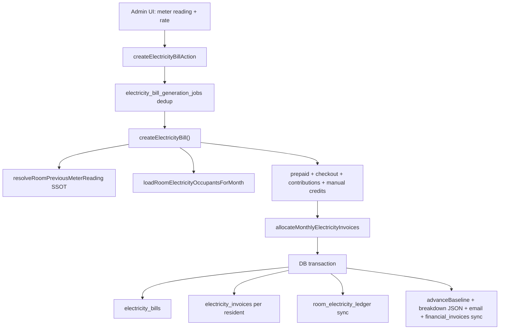

# Electricity Billing System — Complete Audit Report

**Scope:** Codebase + schema trace + admin audit UI (presentation layer).  
**Primary SSOT:** [`src/services/electricityBilling.ts`](../src/services/electricityBilling.ts) (`createElectricityBill`), [`src/lib/billing/roomElectricityMonthlyAllocation.ts`](../src/lib/billing/roomElectricityMonthlyAllocation.ts), [`docs/Electricity.md`](Electricity.md)

**Related docs:**
- [Worked examples (production)](ELECTRICITY_BILLING_AUDIT_SAMPLES.md)
- [Admin & resident UI walkthrough](ELECTRICITY_BILLING_UI_WALKTHROUGH.md)

---

## Review priorities (for stakeholder sign-off)

Use this checklist when deciding what to implement next:

| Priority | Item | Status |
|----------|------|--------|
| P0 | **Room Electricity Audit Panel** — single-table resident breakdown + sum validation | **Implemented** on `/admin/electricity/bills/[id]` |
| P1 | Paid electricity history in Billing Centre | Not started |
| P2 | Fix resident due-list copy (pro-rata vs equal) | Not started |
| P3 | Resurrect or remove dead UI (`ResidentElectricityHistory`, `PgElectricityMeterPanel`) | Not started |
| P4 | Export room audit to Excel/PDF | **Implemented** — `exportRoomElectricityAuditAction` + Excel/PDF builders |
| P5 | Unify credit paths (contributions SSOT vs legacy checkout fields) | Decision needed |

**Recommended focus:** P0 is done. Next highest impact is **P1** (admin payment history) and **P2** (resident clarity).

---

## 1. Electricity Bill Generation Flow (End-to-End Lifecycle)

### Trigger points (no auto monthly cron)

Electricity bills are **admin-triggered**, not cron-generated for all rooms monthly.

| Trigger | Entry | Core call |
|---------|-------|-----------|
| **Billing Center wizard** (primary) | [`/admin/billing/electricity/generate`](app/(admin)/admin/billing/electricity/generate/page.tsx) → [`NewElectricityBillForm`](src/components/admin/NewElectricityBillForm.tsx) | `createElectricityBillAction` → `createElectricityBill()` |
| **Legacy create page** | [`/admin/electricity/new`](app/(admin)/admin/electricity/new/page.tsx) | Same action |
| **PG meter panel** | [`recordMonthlyMeterAction`](app/(admin)/admin/pgs/electricity-actions.ts) | `recordMeterLog()` → `createBillFromMeterLogs()` → `createElectricityBill()` |
| **Estimated bill** | Same PG action with `useEstimate` | `createEstimatedMonthlyBill()` in [`meterElectricity.ts`](src/services/meterElectricity.ts) |
| **Ops scripts** | e.g. [`scripts/generate-june-2026-electricity-bills.ts`](scripts/generate-june-2026-electricity-bills.ts) | Batch repair/regeneration |

Cron routes exist only for **integrity repair/verification**, not normal generation:
- [`/api/cron/june-electricity-integrity-repair`](app/api/cron/june-electricity-integrity-repair/route.ts)
- [`/api/cron/billing-production-verify`](app/api/cron/billing-production-verify/route.ts)

### Lifecycle diagram



### Inputs

**Admin-entered:**
- `roomId`, `billingMonth` (`YYYY-MM-01`)
- `currentReadingUnits` (required)
- `previousReadingUnits` (auto-fetched; override only in repair mode)
- `ratePerUnitPaise` (default **₹16/unit = 1600 paise** from [`constants.ts`](src/lib/billing/constants.ts))
- `useProRataByActiveDays: true` (always set in admin actions)

**Auto-resolved from DB:**
- Previous reading chain: [`resolveRoomPreviousMeterReading()`](src/services/roomMeterReadingSsot.ts) — last monthly bill → last monthly meter log → 0
- Monthly occupants + weights: [`loadRoomElectricityOccupantsForMonth()`](src/lib/billing/roomElectricityOccupants.ts)
- Checkout/collected credits: `electricity_settlement_ledger`, `electricity_room_contributions`
- Room prepaid balance: `rooms.electricity_prepaid_credit_paise`
- Active bed count: [`countActiveBedsInRoom()`](src/lib/roomCapacitySsotDb.ts)

### Meter reading calculation

```
unitsConsumed = roundToHundredth(currentReadingUnits - previousReadingUnits)
grossTotalPaise = Math.round(unitsConsumed × ratePerUnitPaise)
```

Continuity enforced by [`validateContinuousPreviousReading()`](src/lib/billing/roomMeterReadingSsot.ts). Post-commit, [`advanceBaseline()`](src/services/meterTimelineService.ts) advances the official meter chain.

### Room consumption & resident split

1. **Room-level consumption** = meter delta (whole room, not per-bed meter).
2. **Credits reduce splittable pool** before fan-out (prepaid → contributions/checkout/manual → `netSplittablePaise`).
3. **Per-resident allocation** (pro-rata, admin default):
   - `weight` = active days in billing month per booking
   - `unitsShare = round((unitsConsumed × weight) / totalWeight, 2)`
   - `amountPaise = floor(netSplittable × weight / totalWeight)` via [`splitElectricityWeighted()`](src/services/billing.ts)
4. **Rounding remainder** stored on bill as `rounding_remainder_paise` (operator absorbs).

### Save path (single transaction)

Inside `createElectricityBill()` ([`electricityBilling.ts` L464–687](src/services/electricityBilling.ts)):

| Write | Table |
|-------|-------|
| Room bill header | `electricity_bills` |
| Per-resident invoices | `electricity_invoices` (number `ELE-YYYY-MM-NNNN`) |
| Prepaid decrement | `rooms`, `room_electricity_prepaid_ledger` |
| Room cycle ledger | `room_electricity_ledger_cycles`, `room_electricity_ledger_entries` |
| Audit | `audit_log` |

Post-transaction: `calculation_breakdown` JSON, email reminders, `financial_invoices` mirror.

### API routes involved

| Route | Purpose |
|-------|---------|
| `GET /api/admin/rooms/[id]/last-electricity-reading` | Form: previous reading + default rate |
| `GET /api/admin/rooms/[id]/electricity-reconciliation` | Pre-submit checkout credit preview |
| `GET /api/admin/electricity-bill-jobs/[jobId]` | Poll async generation job |

---

## 2. Room-wise Resident Breakdown

There is **no single admin screen** that renders exactly the template you specified (Room XXX → Resident A with all 8 fields in one table). That data **exists across multiple stores** and is partially surfaced in breakdown/ledger UIs.

### Per-resident data model (what the system stores)

For each generated bill, per resident:

| Field you asked for | Where stored | Notes |
|---------------------|--------------|-------|
| Check-in date | `bed_reservations` / timeline `stayStart` | Intersected with billing month |
| Check-out date | `stayEnd` / `vacatedOn` on timeline | Null if ongoing |
| Days charged | `electricity_invoices.active_days` + timeline | Pro-rata weight source |
| Units allocated | `electricity_invoices.units_share` | Pro-rata share of room units |
| Amount allocated | `electricity_invoices.amount_paise` | After credits, post-split |
| Amount already paid | `electricity_invoices.paid_paise` | Updated on payment |
| Previous outstanding | Not a dedicated column | Derived via `projectElectricityInvoice()` (principal + late fee − paid) |
| Current outstanding | Same projection | Shown in collections UI |

**Previous collections (before this bill):**
- Checkout: `electricity_settlement_ledger` + timeline `creditAppliedToRoomBillPaise`
- Historical/offline: `electricity_room_contributions` (`kind: historical`)
- Checkout recovery pool: `electricity_room_contributions` (`kind: checkout_recovery`)

### Example breakdown structure (from `calculation_breakdown` JSON)

Stored on `electricity_bills.calculation_breakdown` ([`electricityBillBreakdownTypes.ts`](src/lib/billing/electricityBillBreakdownTypes.ts)):

```
Room 203 · June 2026
Meter: 1250 → 1380 units (130 units) @ ₹16 = ₹2,080 gross
Adjustments: prepaid ₹0, checkout credits ₹400, manual ₹0
Remaining splittable: ₹1,680

Resident A (active)
  Stay: 2026-06-01 → ongoing (30 days)
  calculatedSharePaise: ₹840
  monthlyInvoiceAmountPaise: ₹840
  paid: ₹0 → outstanding: ₹840

Resident B (departed)
  Stay: 2026-06-01 → 2026-06-15 (15 days)
  Already collected at checkout: ₹420 (creditAppliedToRoomBillPaise)
  monthlyInvoiceAmountPaise: ₹0 (excluded from new invoice)

Reconciliation:
  Sum of resident invoices + credits + remainder = room gross (validated in reconciliation helpers)
```

### Where admin sees this today

- **Room audit table:** [`RoomElectricityAuditPanel`](../src/components/admin/electricity/RoomElectricityAuditPanel.tsx) on [`/admin/electricity/bills/[id]`](../app/(admin)/admin/electricity/bills/[id]/page.tsx)
- **Calculation breakdown:** [`ElectricityBillCalculationBreakdownPanel`](../src/components/billing/ElectricityBillCalculationBreakdownPanel.tsx)
- **Collection view:** [`ElectricitySettlementLedgerPanel`](../src/components/admin/electricity/ElectricitySettlementLedgerPanel.tsx) on [`/admin/electricity/ledger`](../app/(admin)/admin/electricity/ledger/page.tsx)

Full audit: [ELECTRICITY_BILLING_AUDIT.md](ELECTRICITY_BILLING_AUDIT.md)

**Gap (addressed):** Admin previously had to open bill detail + ledger separately. **`RoomElectricityAuditPanel`** now consolidates resident rows with sum-equals-room-bill validation on the bill detail page.

**Worked examples:** See [ELECTRICITY_BILLING_AUDIT_SAMPLES.md](ELECTRICITY_BILLING_AUDIT_SAMPLES.md). Regenerate from production with `npx tsx scripts/export-electricity-audit-samples.ts`.

---

## 3. Previous Collections

**Yes — the system tracks previous electricity collections extensively.**

| Collection type | Storage | Reduces future dues? | Linked to invoice? |
|-----------------|---------|----------------------|-------------------|
| **Monthly invoice payment** | `payments` (`purpose=electricity`) → `electricity_invoices.payment_id` | Yes — marks invoice paid | Direct FK |
| **Checkout electricity** | `checkout_settlements` → `electricity_settlement_ledger` | Yes — credit applied to room bill; resident excluded from new invoice | `electricity_bill_id` set when applied |
| **Historical offline payment** | `electricity_room_contributions` (`kind=historical`) | Yes — reduces splittable pool before split | Indirect (pool reduction) |
| **Checkout recovery** | `electricity_room_contributions` (`kind=checkout_recovery`) | Yes — same | Indirect |
| **Room prepaid credit** | `rooms.electricity_prepaid_credit_paise` + ledger | Yes — applied to next bill gross | `electricity_bill_id` on apply |
| **Combined UPI proof split** | `payment_approval_allocations.electricity_paid_paise` | Yes — allocated to oldest pending invoices | Via allocation engine |
| **Resident credit applied** | `resident_credit_ledger.related_electricity_invoice_id` | Yes | Direct FK |
| **Deposit deduction at vacating** | `deposit_ledger` + checkout settlement | Parallel path to settlement ledger | Reason text only on deposit ledger |

**Can previous collections reduce future dues?** Yes — via credit waterfall in [`allocateMonthlyElectricityInvoices()`](src/lib/billing/roomElectricityMonthlyAllocation.ts). Contributors can be excluded entirely (`excludedBecauseCheckoutPaid: true`, invoice amount = 0).

**Per-resident answers require DB query** — the schema supports full history per `customer_id` + `booking_id` + `billing_month`, but no admin UI lists "all electricity ever collected from Resident X" in one dedicated screen.

---

## 4. Billing Period Logic

| Rule | Implementation |
|------|----------------|
| **Billing month** | `billingMonth = YYYY-MM-01` (first day of calendar month) |
| **Period bounds** | [`monthBounds()`](src/services/billing.ts): `[monthStart, monthEnd)` — **inclusive start, exclusive end** |
| **DB overlap test** | PostgreSQL `daterange(stay, '[)')` overlaps billing month |
| **Due date** | Bill `createdAt + 3 days` (`ELECTRICITY_GRACE_DAYS`) |
| **Late fee** | 1% per day after due on outstanding principal |

### Mid-cycle join

- Resident included if stay overlaps billing month AND `duration_mode IN ('monthly','open_ended')` (fixed-stay only with explicit flag).
- **Default admin path uses pro-rata:** weight = active days in month.
- `activeDays = diffDays(intersectStart, intersectEnd)` — half-open interval length.

### Mid-cycle leave

- **Checkout path:** electricity settled at move-out via [`roomElectricityAllocation.ts`](src/lib/checkout/roomElectricityAllocation.ts) / checkout settlement engine.
- **Monthly bill path:** departed residents with checkout collection excluded via `listCheckoutSettledCustomerIdsForRoomMonth()`.
- Timeline shows departed residents as `role: 'departed'` with settlement status.

### Vacant days

- **No separate vacant-day charge** — room meter consumption is split among active occupants only.
- If room is empty: bill generation fails or produces no invoices (`no monthly occupants`).
- Vacant-period units implicitly absorbed by remaining occupants (equal/pro-rata) or operator remainder paise.

### Days inclusive vs exclusive

- **Calculation:** half-open `[start, end)` via [`diffDays()`](src/lib/dates.ts)
- **Display:** last occupied day shown as `end - 1 day` in timeline labels ([`electricityBillBreakdownPure.ts`](src/lib/billing/electricityBillBreakdownPure.ts))

---

## 5. What Admin Sees

### Screen inventory

| Screen | Route | Component | Data source | Key actions |
|--------|-------|-----------|---------------|-------------|
| **Billing Centre** | `/admin/billing?tab=electricity` | [`BillingCommandCentreHeader`](src/components/admin/billing/BillingCommandCentreHeader.tsx), pending panels | `listAdminElectricityInvoicesForReminders`, `listRoomsMissingElectricityBill` | WhatsApp links, cash mark paid, navigate to generate |
| **Generate bill** | `/admin/billing/electricity/generate` | [`NewElectricityBillForm`](src/components/admin/NewElectricityBillForm.tsx) | Room list, last reading API, reconciliation preview | Create bill (wizard room-by-room) |
| **Electricity dashboard** | `/admin/electricity/dashboard` | [`ElectricityRoomDashboardView`](src/components/admin/electricity/ElectricityRoomDashboardView.tsx) | `loadElectricityRoomDashboard()` | Open bill, open ledger |
| **Room bill detail** | `/admin/electricity/bills/[id]` | [`RoomElectricityOperatorDashboardClient`](src/components/admin/electricity/RoomElectricityOperatorDashboardClient.tsx) + [`RoomElectricityResidentCard`](src/components/admin/electricity/RoomElectricityResidentCard.tsx) (operator dashboard); Advanced Details accordion for audit/ledger/breakdown/exports | `loadRoomElectricityAuditBundle()` | Per-resident stay/charge/payment cards, invoice viewed/paid badges, cross-month history, **View as resident** preview; navigate sibling bills/months |
| **Resident bill preview (admin)** | `/admin/electricity/invoices/[invoiceId]/as-resident` | [`ResidentPayElectricityPageContent`](src/components/customer/account/resident/ResidentPayElectricityPageContent.tsx) | `loadResidentPayElectricityPageData()` | Same UI as resident pay page (read-only payment step) |
| **Room ledger** | `/admin/electricity/ledger?roomId=&month=` | [`ElectricitySettlementLedgerPanel`](src/components/admin/electricity/ElectricitySettlementLedgerPanel.tsx) | `getElectricitySettlementLedgerView()` | Record historical contribution, view reconciliation |
| **Room allocation (implicit)** | Bill detail breakdown | [`ElectricityBillCalculationBreakdownPanel`](src/components/billing/ElectricityBillCalculationBreakdownPanel.tsx) | `calculation_breakdown` JSON | Read-only audit |
| **Payment collection** | Billing tab queue, `/admin/collections`, operations | `FinancialRowActions`, `MarkAsPaidCashButton`, `ExpressCollectionButton` | `buildCollectionsQueue()` | Pay links, cash, proof approval |
| **Resident invoice view** | `/admin/invoices/[invoiceId]` | [`InvoiceDocument`](src/components/billing/InvoiceDocument.tsx) | `getInvoiceDocumentDetail()` | Print, PDF, void, WhatsApp |
| **History** | Fragmented — no dedicated electricity history page | Diagnostics tab meter timeline; ledger per room/month | `listRoomMeterTimelineEvents()` | Read-only |
| **Duplicate repair** | `/admin/electricity/duplicates` | [`ElectricityDuplicateRepairPanel`](src/components/admin/electricity/ElectricityDuplicateRepairPanel.tsx) | Duplicate detection service | Repair duplicates |
| **Checkout allocation** | `/admin/checkout-settlements/[id]` | [`CheckoutSettlementElectricitySection`](src/components/admin/CheckoutSettlementElectricitySection.tsx) | Checkout settlement calc | Move-out electricity |

### Notable admin navigation gaps

- **"Recent payments" tab** in Billing Centre shows **rent only**, not electricity.
- **PG "Rooms & electricity" nav** no longer embeds meter panel — generation moved to Billing Centre.
- **Dead components still in repo:** `PgElectricityMeterPanel`, `RoomElectricityCard` (unused).

---

## 6. What Residents See

| Capability | Available? | Where |
|------------|------------|-------|
| View electricity bills | Yes | [`ResidentPaymentsV2Hub`](src/components/customer/account/resident/ResidentPaymentsV2Hub.tsx) → Bills Due / Invoices tabs |
| Room usage breakdown | Yes (on pay page) | [`ElectricityBillCalculationBreakdownPanel`](src/components/billing/ElectricityBillCalculationBreakdownPanel.tsx) on [`/account/resident/pay-electricity/[invoiceId]`](app/(customer)/account/resident/pay-electricity/[invoiceId]/page.tsx) |
| Previous payments | Yes | Invoices tab (lifetime `electricityPaidPaise`), wallet history, breakdown "already collected" sections |
| Outstanding balance | Yes | `projectElectricityInvoice().outstandingPaise`, financial SSOT |
| Download invoice/PDF | Yes | `InvoicePdfDownloadLink` → `/api/invoices/{ref}/pdf`; HTML via `/i/[shareToken]` |
| Dispute bill | **No** | Only payment-proof rejection + re-upload; no `resident_request` type for electricity dispute |

### Resident UI gaps

- [`ResidentElectricityHistory`](src/components/customer/account/resident/ResidentElectricityHistory.tsx) exists but is **unreachable** (no caller passes data).
- Due-list copy always says "equal split" even when pro-rata applies ([`residentPortalPresentation.ts`](src/lib/residents/residentPortalPresentation.ts)).
- Pay page period label shows month start only, not date range.

---

## 7. Database Audit (Tables)

### Core electricity tables (9)

| Table | Purpose | PK | Key relationships |
|-------|---------|----|--------------------|
| `electricity_bills` | Room monthly bill header | `id` | `room_id`, `pg_id`; unique `(room_id, billing_month)` |
| `electricity_invoices` | Per-resident payable | `id` | `electricity_bill_id`, `booking_id`, `customer_id`, `payment_id`; **`first_viewed_at`**, **`viewed_source`** (pay page or public share) |
| `meter_logs` | Meter reading audit | `id` | `room_id`, optional `booking_id`; types: checkin/monthly/checkout |
| `electricity_settlement_ledger` | Checkout collections permanent record | `id` | `checkout_settlement_id`, `electricity_bill_id` when applied |
| `room_electricity_ledger_cycles` | Room reconciliation bucket per month | `id` | `room_id`; `collected + remaining = total_bill` |
| `room_electricity_ledger_entries` | Individual collection lines | `id` | `cycle_id`, `electricity_invoice_id`, `checkout_settlement_id` |
| `electricity_room_contributions` | Pre-split historical/checkout recovery | `id` | `room_id`, `customer_id`, `booking_id` |
| `room_electricity_prepaid_ledger` | Offline prepaid add/apply log | `id` | `room_id`, `electricity_bill_id` |
| `electricity_bill_generation_jobs` | Async dedup/concurrency | `id` | `room_id`, `bill_id` |

### Payment/collection tables (linked)

`payments`, `financial_invoices`, `payment_approval_allocations`, `pg_payment_records`, `payment_links`, `payment_receipts`, `resident_credit_ledger`, `invoice_audit_events`

### Context tables with electricity fields

`checkout_settlements` (meter inputs + share outputs), `rooms.electricity_prepaid_credit_paise`, `pgs.average_electricity_bill_paise`, `action_items` (`electricity_due`)

Schema files: [`src/db/schema/electricityBills.ts`](src/db/schema/electricityBills.ts), [`electricityInvoices.ts`](src/db/schema/electricityInvoices.ts), [`meterLogs.ts`](src/db/schema/meterLogs.ts), [`roomElectricityLedger.ts`](src/db/schema/roomElectricityLedger.ts), etc.

---

## 8. Current Problems

### Missing information for admins

- No single **operator dashboard** per room bill showing every resident's stay, charge, invoice, viewed/paid status, and cross-month payment history — **addressed** by [`RoomElectricityOperatorDashboard`](src/components/admin/electricity/RoomElectricityOperatorDashboard.tsx) on bill detail page
- Accountant reconciliation (sum check, gap banner, Excel/PDF) moved to **Advanced details** accordion — not the primary operator view
- No **electricity payment history** tab (paid electricity query exists but no list UI)
- **Billing Centre "Recent payments"** excludes electricity
- Reconciliation pass/fail not prominent on bill list — buried in ledger panel
- **Rounding remainder** on bill not clearly explained in UI ("operator absorbs ₹X")

### Missing information for residents

- Due list misstates split method ("equal" always)
- Dedicated electricity history component unreachable
- No formal dispute workflow
- Period shown as month start, not stay date range

### Confusing calculations / duplicate logic

- Two parallel credit paths: legacy checkout/manual vs `electricity_room_contributions` SSOT
- **Workflow A** (monthly split) vs **Workflow B** (checkout-only) documented in [`docs/BILLING_ENGINE.md`](docs/BILLING_ENGINE.md) — operators may confuse which applies
- Pro-rata share calculated in multiple places: generation (`electricityBilling.ts`), breakdown builder (`electricityBillBreakdownPure.ts`), checkout allocation (`roomElectricityAllocation.ts`)

### Possible bugs / edge cases

- [`docs/BUGS.md`](docs/BUGS.md): zero-refund checkout when electricity consumes full deposit (CHK-ZERO-01)
- Duplicate invoice groups — repair UI exists at `/admin/electricity/duplicates`
- Fixed-stay occupants excluded from normal admin flow unless `includeFixedStayOccupants` flag
- Daily/weekly residents never receive monthly electricity invoices
- Empty room / no occupants → generation failure (expected but may surprise admin)
- Settlement engine is **frozen** (`.cursor/rules/settlement-engine-freeze.mdc`) — changes require careful coordination

### Inconsistencies

- PG nav says "Rooms & electricity" but meter UI removed from rooms page
- Dead admin components (`PgElectricityMeterPanel`) vs active `NewElectricityBillForm` path
- Admin breakdown on dark theme; resident breakdown on light theme — same component, different themes

---

## 9. Improvement Suggestions

### Goal: Operator sees every resident on a room bill at a glance

**Room Electricity Operator Dashboard** — **implemented**:

- Bundle loader: [`src/services/roomElectricityAuditBundle.ts`](../src/services/roomElectricityAuditBundle.ts) — adds `operator` view with per-booking invoice history and cross-month payment history
- Operator view: [`buildRoomElectricityOperatorView.ts`](../src/lib/billing/buildRoomElectricityOperatorView.ts)
- UI: [`RoomElectricityOperatorDashboard`](../src/components/admin/electricity/RoomElectricityOperatorDashboard.tsx), [`RoomElectricityResidentCard`](../src/components/admin/electricity/RoomElectricityResidentCard.tsx)
- **View as resident**: [`/admin/electricity/invoices/[invoiceId]/as-resident`](../app/(admin)/admin/electricity/invoices/[invoiceId]/as-resident/page.tsx) renders the same content as [`/account/resident/pay-electricity/[invoiceId]`](../app/(customer)/account/resident/pay-electricity/[invoiceId]/page.tsx) via shared [`ResidentPayElectricityPageContent`](../src/components/customer/account/resident/ResidentPayElectricityPageContent.tsx)
- **Invoice viewed tracking**: `electricity_invoices.first_viewed_at` set on first resident open of pay page or `/i/{shareToken}` ([`recordElectricityInvoiceView`](../src/services/electricityInvoiceViews.ts))

Each resident card shows: check-in/out, days charged, units, electricity amount, previously collected, current bill, outstanding, payment status, invoice generated/viewed/paid, **lifetime electricity summary** (total billed/paid with **source breakdown**, current & prior outstanding, last payment/viewed, unpaid bill count), **running balance timeline** (chronological ledger with balance after each event), expandable cross-month invoice history (clickable to room bill / resident view), and **View as resident →**.

### Accountant audit (Advanced details)

The prior **Room Electricity Audit Panel** remains under Advanced details for reconciliation, exports, and ledger math:

- [`RoomElectricityAuditPanelClient`](../src/components/admin/electricity/RoomElectricityAuditPanelClient.tsx) — filters, export Excel/PDF
- [`RoomElectricityAuditPanel`](../src/components/admin/electricity/RoomElectricityAuditPanel.tsx) — reconciliation banner, sum check, timeline
- Export: [`roomElectricityAuditExcel.ts`](../src/lib/export/roomElectricityAuditExcel.ts), [`roomElectricityAuditPdf.ts`](../src/lib/export/roomElectricityAuditPdf.ts)

### Other recommendations

1. **Wire up paid electricity history** in Billing Centre using existing `listAdminPaidElectricityInvoicesForMonth()`
2. **Resurrect or remove** dead components (`ResidentElectricityHistory`, `PgElectricityMeterPanel`)
3. **Fix resident copy** to reflect actual split mode (pro-rata / equal / private)
4. **Promote reconciliation badge** on room dashboard (green/amber/red)
5. ~~**Export room audit to Excel/PDF** for accountant review~~ — **done**
6. **Add admin "previous collections per resident" drill-down** from ledger row
7. **Document operator playbook** linking generate → bill detail → ledger → invoice collection

---

## Deliverable Notes

- **Audit report:** This document (`docs/ELECTRICITY_BILLING_AUDIT.md`)
- **Worked examples:** [`docs/ELECTRICITY_BILLING_AUDIT_SAMPLES.md`](ELECTRICITY_BILLING_AUDIT_SAMPLES.md)
- **UI walkthrough:** [`docs/ELECTRICITY_BILLING_UI_WALKTHROUGH.md`](ELECTRICITY_BILLING_UI_WALKTHROUGH.md)
- **Admin audit UI:** `RoomElectricityAuditPanel` on `/admin/electricity/bills/[id]`

---

## Implementation log

| Date | Change |
|------|--------|
| 2026-07-31 | Full 9-section audit published |
| 2026-07-31 | `RoomElectricityAuditPanel` + `buildRoomElectricityAuditView` added |
| 2026-07-31 | Operator dashboard: resident cards, view tracking, admin as-resident preview |
| 2026-07-31 | SSOT enhancement: audit panel moved to Advanced details |

---

## Recommended Next Steps (after your review)

1. Confirm P1–P5 priorities in the review table above
2. Regenerate production worked examples: `npx tsx scripts/export-electricity-audit-samples.ts`
3. Capture screenshots per [UI walkthrough](ELECTRICITY_BILLING_UI_WALKTHROUGH.md)
4. Decide whether to unify credit paths (contributions SSOT vs legacy checkout fields)
5. Implement P1 (paid electricity history tab) if approved
