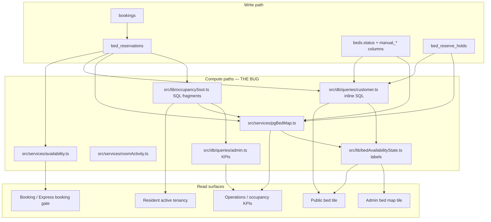

# Occupancy SSOT Audit Report

**Status:** Audit complete — **no implementation.** Awaiting approval before Phase 0.  
**Date:** 2026-07-02  
**Incident:** Admin bed map and Public PG page show different states for the same bed (e.g. Room 102 B1 — Dhruv occupied until 1 Aug 2026 on admin, incorrect state on public).

Related: [`BED_EXPLORER_SSOT_PLAN.md`](./BED_EXPLORER_SSOT_PLAN.md) (full Bed Explorer redesign plan).

---

## Pipeline trace (Booking → Admin/Public cards)



**There is no single service.** Data flows through **6 independent compute paths** before reaching **2 different label functions** (`deriveBedAvailabilityView` vs `deriveCustomerBedAvailabilityView`) fed with **different inputs**.

---

## 1. Every place occupancy / bed status is calculated

### Tier A — SQL predicate fragments (partial SSOT, not consumed everywhere)

| Location | Symbols | Predicate |
|----------|---------|-----------|
| `src/lib/occupancySsot.ts` | `occupancyReservationCoreSql` | `confirmed` + `active` + `primary` + `CURRENT_DATE <@ stay_range` |
| `src/lib/occupancySsot.ts` | `adminAssignedReservationSql_b` | Above OR future move-in for `monthly`/`open_ended` |
| `src/lib/occupancySsot.ts` | `bedOccupiedTodayExistsSql` | EXISTS occupant today (confirmed) — used on `beds` alias |

### Tier B — Full bed snapshot loaders (each reimplements logic)

| # | File | Function | Used by | Notes |
|---|------|----------|---------|-------|
| 1 | `src/services/pgBedMap.ts` | `getPgBedMap`, `buildBed` | Admin bed map, bed assignment command | Uses `occupancyReservationCoreSql` for `occ`; separate `res` lateral for future monthly; **`isAvailableNow` computed in TypeScript** |
| 2 | `src/db/queries/customer.ts` | `getRoomDetail`, `listPublicPgs`, `listRoomsForPg` | Public PG page, room page, browse | **Inline SQL — no `booking.status = confirmed`** on block checks |
| 3 | `src/services/availability.ts` | `isBedAvailable`, `getPgAvailability`, `getBedAvailabilityTimeline` | Booking engine, Express booking, room change, API | `confirmed` + `active`; date-range overlap |
| 4 | `src/services/roomActivity.ts` | `getRoomActivityStats` | Room detail insights | Duplicate of customer `isAvailableNow` pattern |
| 5 | `src/db/queries/admin.ts` | `getDashboardStats`, `getOccupancyByPg`, bed list queries | Platform KPIs, overview | Uses `bedOccupiedTodayExistsSql` |
| 6 | `src/lib/residentActiveTenancy.ts` | `getActiveTenancyForCustomer`, laterals | Resident portal, Express booking context, admin search | Uses `adminAssignedReservationSql_b` |

### Tier C — Display / label derivation (not data SSOT)

| # | File | Function | Fed by |
|---|------|----------|--------|
| 7 | `src/lib/bedAvailabilityState.ts` | `deriveBedAvailabilityView` | Admin map (`buildBed` inputs) |
| 8 | `src/lib/bedAvailabilityState.ts` | `deriveCustomerBedAvailabilityView` | Public (`customerBedUi.bedAvailability`) |

### Tier D — Shadow state (not reservation-backed)

| Mechanism | File | Effect |
|-----------|------|--------|
| `beds.manual_occupied` | `bookingAdminOps.setBedManualOccupied` | Public blocks; admin label; **ignored by `isBedAvailable` and KPI occupied count** |
| `beds.manual_reserved_*` | `bookingAdminOps.setBedManualReserved` | Admin/public “Reserved” display |
| `beds.status` maintenance/blocked | `updateBedInventoryStatus` | Blocks via availability + labels |

### Tier E — UI-local counting (duplicated room/bed math)

| File | Logic duplicated |
|------|------------------|
| `src/components/admin/PgBedMapPanel.tsx` | `openCount`, `occupiedCount` filters |
| `src/components/customer/CustomerBedMap.tsx` | Same counting pattern |
| `src/lib/beds/bedAssignmentCommand.ts` | `roomOccupiedCount`, free bed scans |
| `src/services/bedAssignmentCommand.ts` | Uses `getPgBedMap` + local filters |
| `src/services/pgBedMap.ts` | `PgBedMapSummary` aggregates |

### Tier F — Diagnostic / repair (not production path)

| File | Role |
|------|------|
| `src/services/occupancyDiagnostics.ts` | Compares residents vs map vs KPIs |
| `src/services/bedAudit.ts` | Ghost manual marks, double assignment |
| `src/services/occupancySync.ts` | Reconcile reservations with booking lifecycle |
| `src/services/shantinagarOccupancySsotRepair.ts` | One-off repair scripts |

### Consumer map (who calls what)

| Surface | Primary loader | Label function |
|---------|----------------|----------------|
| **Admin bed map** | `getPgBedMap` | `deriveBedAvailabilityView` |
| **Public PG / room page** | `getRoomDetail` (`customer.ts`) | `deriveCustomerBedAvailabilityView` |
| **Booking checkout** | `isBedAvailable` | N/A |
| **Express booking** | `isBedAvailable` + `getActiveTenancyForCustomer` | N/A |
| **Resident portal** | `getActiveTenancyForCustomer` | N/A (tenancy, not bed map) |
| **Operations dashboard** | `getOperationsCenterData` + `getOccupancyByPg` | Mixed; ops “move-ins” uses `bed_reserve_holds`, not reservations |
| **Occupancy KPIs** | `getDashboardStats` / `getOccupancyByPg` | `bedOccupiedTodayExistsSql` |
| **Bed assignment center** | `getPgBedMap` + `getOccupancyByPg` | **Two different occupancy definitions on same page** |
| **Public API** | `getPgAvailability` (`availability.ts`) | Third definition (date-range) |

**Count: 6 independent compute paths + 2 label functions + 3 shadow-state columns + 4 UI duplicate counters.**

---

## 2. Which one should become SSOT

### Recommended SSOT: new `src/services/bedOccupancyEngine.ts`

**Single read API:**

```typescript
getBedOccupancySnapshot(bedId, { asOfDate?, audience? })
getBedOccupancySnapshotsForRoom(roomId, ...)
getBedOccupancySnapshotsForPg(pgId, ...)
```

**Canonical states (engine output — one enum for all surfaces):**

| State | Maps to user-facing labels |
|-------|---------------------------|
| `available` | Available |
| `reserved` | Reserved |
| `occupied` | Occupied |
| `available_soon` | Available Soon (vacating / pre-bookable) |
| `maintenance` | Maintenance / Temporarily unavailable (public) |
| `blocked` | Blocked |
| `checkout_pending` | Checkout Pending (vacating overdue, settlement open) |
| `reservation_expired` | Transitional; must reconcile to available |

**Rules:**

- `occupancySsot.ts` SQL fragments become **private implementation detail** of the engine only — no other file imports them.
- `bedAvailabilityState.ts` becomes **label-only**: `deriveViewFromSnapshot(snapshot, audience)` — no caller-supplied boolean flags.
- `availability.ts` `isBedAvailable` delegates to engine + date overlap — no standalone EXISTS query.
- `customer.ts`, `pgBedMap.ts`, `roomActivity.ts` **stop computing** `isAvailableNow` / `reservedFrom` inline.

**Storage SSOT unchanged:** `bed_reservations` + `bookings` + `beds.status` remain source records; the engine is the **only read interpreter**.

---

## 3. Files to delete (logic removal, not necessarily file deletion)

| Target | Action |
|--------|--------|
| `customer.ts` — inline `isAvailableNow`, `reservedFrom`, `nextAvailableDate`, vacating laterals (~lines 465–550) | **Delete** SQL; replace with engine batch call |
| `roomActivity.ts` — duplicate `isAvailableNow` SQL | **Delete** duplicate; call engine |
| `pgBedMap.ts` — `buildBed` local `isAvailableNow` / `isOccupiedToday` TS logic | **Delete**; map engine snapshot fields |
| `PgBedMapPanel.tsx`, `CustomerBedMap.tsx`, `bedAssignmentCommand.ts` — local open/occupied filters | **Delete**; use engine aggregates |
| Dormant duplicate explorers (after Bed Explorer redesign) | **Delete or merge** `RoomDetailSheet` if unused |

**Do not delete yet:** `occupancySsot.ts`, `bedAvailabilityState.ts`, `availability.ts` — **gut and delegate** to engine first, then prune.

---

## 4. Files to refactor

| File | Refactor |
|------|----------|
| **`src/services/bedOccupancyEngine.ts`** | **CREATE** — SSOT read layer |
| `src/lib/occupancySsot.ts` | Internal predicates for engine only; export nothing public except via engine |
| `src/services/pgBedMap.ts` | Thin loader: SQL for metadata + `getBedOccupancySnapshotsForPg` |
| `src/db/queries/customer.ts` | `getRoomDetail` / `listPublicPgs` consume engine |
| `src/services/availability.ts` | `isBedAvailable` → engine + range check |
| `src/lib/bedAvailabilityState.ts` | Single entry: snapshot → label (admin vs public tone) |
| `src/components/customer/customerBedUi.tsx` | Read snapshot, not raw bed flags |
| `src/components/admin/PgBedMapPanel.tsx` | Read snapshot |
| `src/db/queries/admin.ts` | KPI counts from engine or shared aggregate function |
| `src/lib/residentActiveTenancy.ts` | Align predicates with engine (same confirmed+active rules) |
| `src/services/bookingAdminOps.ts` | Mark occupied/maintenance → invalidate engine cache; deprecate `manual_occupied` |
| `src/services/occupancySync.ts` | Reservation expiry reconciliation |
| `app/api/availability/route.ts` | Delegate to engine-backed availability |

### Regression tests to add (required before merge)

| File | Tests |
|------|-------|
| `tests/unit/bedOccupancyParity.test.ts` | Admin snapshot === Public snapshot per fixture |
| `tests/integration/bedOccupancyParity.test.ts` | `getPgBedMap` bed kind === `getRoomDetail` bed kind for same PG |

**Fixtures:** active tenancy (Dhruv/102-B1), future reservation, stale reservation, maintenance, vacating, checkout hold, legacy `manual_occupied`.

**CI:** `npm run test:occupancy-parity` must fail build on drift.

---

## 5. Why this regression happened

### 5.1 Architectural cause (primary)

**Occupancy was never one service.** It was implemented as:

1. SQL fragments in `occupancySsot.ts` (2024+ admin/resident alignment effort)
2. A large monolithic query in `pgBedMap.ts` (admin map)
3. Separate inline SQL in `customer.ts` (public, predates or parallel to SSOT migration)
4. A booking-focused `availability.ts` (overlap for checkout)
5. Shared **label** functions that look like SSOT but are fed different inputs

Sharing `deriveBedAvailabilityView` / `deriveCustomerBedAvailabilityView` created a **false sense of SSOT** — same label code, different truth.

### 5.2 Concrete predicate drift (Room 102 B1 class of bugs)

| Check | Admin (`pgBedMap`) | Public (`customer.ts`) |
|-------|-------------------|------------------------|
| Occupied today | `occupancyReservationCoreSql` → **`booking.status = 'confirmed'`** | `NOT EXISTS active in range` → **no booking status filter** |
| Future reserved | `res` lateral: **monthly/open_ended only** | `reservedFrom`: **any confirmed future active** |
| Available now | TS: `!occ && !reserved && !reserveCheckIn` | SQL: `status=available AND NOT manual_occupied AND NOT EXISTS active in range` |
| Manual occupied | Shown in label; included in room occupied count | Blocks `isAvailableNow` | 
| Dashboard KPI occupied | `bedOccupiedTodayExistsSql` (confirmed) | N/A |
| Booking gate | `isBedAvailable` (confirmed) | N/A |

**Example failure modes:**

- **`pending_approval` + active reservation:** Public may show bed unavailable; admin shows open (no confirmed occupant).
- **Confirmed occupant (Dhruv):** Both should agree on occupied — but **labels diverge** because public `deriveCustomerBedAvailabilityView` uses different vacating/pre-book/`nextAvailableDate` inputs than admin `buildBed` (admin shows “Until 1 Aug 2026” from `stay_upper` / vacating; public may miss `availableUntilDate` or miscompute `isAvailableNow`).
- **`manual_occupied`:** Admin map counts occupied; public blocks; KPIs and booking ignore — three truths.

### 5.3 Process cause

- Public `customer.ts` queries were not migrated when `occupancySsot.ts` was introduced.
- No cross-surface parity tests (only unit tests on label derivation with mocked inputs).
- `roomActivity.ts` copied customer SQL instead of importing SSOT.
- Feature work (bed reserves, manual marks, vacating notices) added **parallel state** instead of extending reservation model.

### 5.4 What will NOT fix it

- More conditionals in `customerBedUi.tsx` or `PgBedMapPanel.tsx`
- Another `getBedAvailabilityV2()` alongside existing functions
- Syncing label strings without syncing compute paths

---

## Approval gate

| Step | Status |
|------|--------|
| Audit report | ✅ This document |
| Architecture approval | ⏳ Pending |
| Phase 0: engine + parity tests | ⏳ Blocked |
| UI / Bed Explorer redesign | ⏳ Blocked until parity tests pass |

**Next action after approval:** Implement `bedOccupancyEngine.ts` + `bedOccupancyParity.test.ts` behind `OCCUPANCY_ENGINE_V2` flag. Wire admin map and public `getRoomDetail` first; verify Room 102 B1 parity in CI before any UI work.
