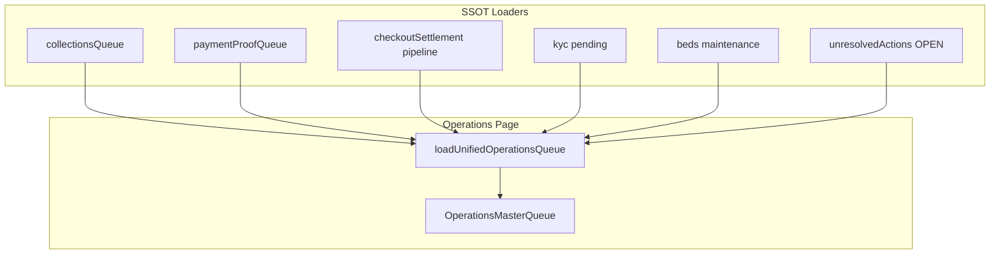

# Operations Center Audit (Phase 1 — No Code)

**Sprint:** P0 Production Operations Center Redesign  
**Date:** 2026-07-02  
**Status:** Awaiting approval before implementation  
**Scope:** Audit only — identify incorrect queues, wrong data sources, broken workflows, and non-actionable noise.

---

## Executive summary

Operations today is **not a single action center**. It is a merge of **four parallel systems** that disagree on filters, labels, and navigation:

| System | Primary file | Used on `/admin/operations`? |
|--------|--------------|------------------------------|
| **Unified Operations Queue** | `src/services/unifiedOperationsQueue.ts` | **Yes** — renders `OperationsMasterQueue` |
| **Resident Operations Dashboard** | `src/lib/residents/residentOperationsDashboard.ts` + `residentOperationsResidentsPage.ts` | **Yes** — feeds unified queue |
| **Legacy Operations Center** | `src/services/operationsCenter.ts` | **Partially** — `opsCenter.tasks` merged with wrong tags |
| **Action Items table** | `src/services/actionItems.ts` | **Partially** — only `financial_audit_review` surfaced; rest on Overview/Control Board |

**Critical production bugs confirmed in code:**

1. **Approved electricity still in “Waiting for payment”** — electricity queue uses `paymentProofUrl IS NULL` as proxy for “not awaiting admin”; after approval failure or partial settlement, invoice can be `pending` with no proof and reappear. Rent correctly excludes `payment_in_progress`; electricity has no equivalent lifecycle status.
2. **Missing unpaid electricity** — multiple loaders filter `electricity_invoices.status = 'pending'` only; invoices with projected overdue but DB `pending` should appear, but invoices@join path differs** (`electricity_bills` vs `floors`) and `operationsElectricityInvoiceFilter()` may exclude rows Overview/Billing still shows.
3. **Maintenance queue polluted** — `unifiedOperationsQueue.ts` L419–435 tags **every** legacy `opsCenter.tasks` row (KYC, PS4, electricity, refunds, reservations) as `maintenance`.
4. **Resident requests mis-tagged as maintenance** — `resident_request` category gets `filterTags: ['maintenance']` in unified queue (L123).
5. **Financial audit placeholders** — daily reconciliation creates `financial_audit_review` action items (MISSING_INVOICE, DUPLICATE_INVOICE, etc.) that open resident profile with nothing to review.
6. **Priority labels instead of workflow status** — UI shows Urgent/High/Normal/Waiting on resident, not “Waiting for Admin Approval” etc.
7. **Outstanding display** — merged rows lose billing-month clarity; no Total Outstanding line.
8. **Refund links** — still point to `/admin/deposits/{bookingId}` and `/admin/checkout-settlements/`, not `/admin/refunds`.
9. **Resident profile Pending Reviews** — includes approved vacating, approved resident requests, stale unresolved actions.
10. **Timeline noise** — `notification_sent`, `created_action_item`, `linked_upload` shown alongside business events.

**Recommendation:** Consolidate Operations onto **invoice/payment SSOT loaders** (`collectionsQueue` + `paymentProofQueue` + `unresolvedActions` + checkout pipeline), remove legacy task injection, and delete non-actionable chips.

Prior related docs: `docs/OPERATIONS_QUEUE_AUDIT.md`, `docs/operations-consolidation-audit.md`.

---

## Architecture map

```
/admin/operations/page.tsx
  └─ loadUnifiedOperationsQueue()
       ├─ loadResidentOperationsResidentsPage()
       │    ├─ loadResidentOperationsDashboard()
       │    │    ├─ listAdminOpenRentInvoices()
       │    │    ├─ listAdminElectricityInvoicesForReminders()
       │    │    ├─ buildCollectionsQueue()
       │    │    ├─ buildResidentOperationsDashboard()
       │    │    └─ getOperationsCenterData()  ← duplicate call
       │    └─ buildResidentOperationsResidentsView()
       ├─ getOperationsCenterData()  ← duplicate call (tasks only used here)
       ├─ listBillingGenerationFailures()
       ├─ listPendingBookingApprovals()
       ├─ listPendingPaymentReviews()
       └─ listOpenActionItems() → financial_audit_review only
```

**SSOT sources that should drive Operations (per product spec):**

| Domain | SSOT | Path |
|--------|------|------|
| Unpaid rent/electricity | Invoice rows + `collectionsQueue` | `listAdminOpenRentInvoices`, `listAdminElectricityInvoicesForReminders`, `buildCollectionsQueue` |
| Payment proof review | Pending proofs | `listPendingPaymentReviews` |
| Checkout / refund | Checkout settlements + vacating | `listPipelineCheckoutSettlements`, `getMoveOutPipelineSnapshot` |
| KYC | Pending submissions | `listPendingKycSubmissions` |
| Admin-required steps | Open unresolved actions | `unresolvedActions` via `unresolvedActionSync` |
| Maintenance | Beds in `maintenance` status | `beds.status = 'maintenance'` (actionItems `syncMaintenanceIssues`) |

**Not SSOT for Operations:** `action_items` sync on cron (parallel shadow queue), `audit_log` recent activity, journey stage counts, legacy `buildOperationsTasks`.

---

## Queue inventory

Legend: **Needed?** — Y = keep (action required), N = remove, Fix = keep but repair filters/navigation.

### A. Unified filter chips (`OperationsMasterQueue`)

| Chip | Loader / source | SQL / data | Filters applied | Navigation | Action | Needed? |
|------|-----------------|------------|-----------------|------------|--------|---------|
| **All** | `loadUnifiedOperationsQueue` merge | All sources below | PG scope via session | Row `openHref` | Open workflow | Y |
| **Waiting for payment** | `matchesFilter` → `rent_due` \|\| `electricity_due` tags | `buildCollectionsQueue` | Excludes rent if customer in `proofCustomerIds`; elec excludes `paymentProofUrl`; rent excludes `payment_in_progress` | Merged → `/admin/residents/{id}#open-bills` | Collect payment | **Fix** |
| **Waiting for admin review** | `payment_proof` \|\| `manual_review` tags | Payment proofs + financial audit items | Incomplete — proofs also in separate panel | Payment panel or resident | Approve/reject | **Fix** |
| **Payment review** | `listPendingPaymentReviews` count; queue rows from dashboard | QR pending + rent/elec/extension/deposit proofs per PG | `paymentProofUrl IS NOT NULL`, invoice pending | `/admin/operations?filter=payment_proof` + panel | Approve payment | Y |
| **Rent due** | `buildCollectionsQueue` rent rows | `rent_invoices` status ∈ pending, overdue, payment_in_progress → then `rentRowToQueueItem` drops payment_in_progress | `collectibleResidentFilters()`, outstanding > 0 | Invoice or resident open bills | WhatsApp / record (missing) | Y |
| **Electricity due** | `buildCollectionsQueue` elec rows | `electricity_invoices.status = 'pending'` + `operationsElectricityInvoiceFilter()` | Excludes if `paymentProofUrl` set; outstanding > 0 via `projectElectricityInvoice` | `/admin/electricity` or invoice | WhatsApp (missing) | **Fix** |
| **KYC** | `buildResidentOperationsDashboard` | `kyc_submissions.status = 'pending'` | Suppressed during active checkout | `/admin/residents/kyc/{id}` | Approve KYC | Y |
| **Booking approval** | `listPendingBookingApprovals` | `bookings.status = 'pending_approval'` | PG scope | `/admin/bookings/{id}` | Approve booking | Y (Express) |
| **Move-out** | Vacating pipeline | `vacating_requests` + checkout settlements | Active pipeline items | `/admin/vacating` or settlement | Approve / checkout | Y |
| **Checkout** | Refund + move_out tags | `checkout_settlements` refund_pending, vacating approved | Zero-refund stale excluded | Settlement URL | Complete checkout | Y |
| **Maintenance** | **WRONG** — legacy tasks + resident_request | Mixed | **All `opsCenter.tasks` forced to maintenance tag** | Various wrong targets | N/A | **Fix / N** |
| **Manual review** | `financial_audit_review` action items | Daily reconciliation audit | Opens resident with no audit UI | `/admin/residents/{id}` | None visible | **N** |
| **Overdue** | Subset of collections | Same as rent/elec with overdue priority | Rent overdue category | Same as rent due | Collect | Y (merge into Rent/Elec + sort) |
| **Bed assignment** | Unassigned residents | `isResidentBedAssignmentEligible` | Suppressed during checkout | `/admin/beds?customerId=` | Assign bed | Y |
| **Billing failure** | `listBillingGenerationFailures` | Scheduler failure log | unresolvedOnly | `/admin/billing?tab=failures` | Fix billing | **N** (dev/ops tooling) |
| **Blocked** | `detectBlockedResidents` | Heuristic on overdue + checkout | Loaded but **not in unified chips** | Resident profile | Unblock | **N** on Operations (duplicate) |

### B. Rows inside unified queue (by category)

| Category | Creator | Closer | Should disappear when | Opens | Stale risk | Duplicate elsewhere |
|----------|---------|--------|----------------------|-------|------------|---------------------|
| **rent_due / rent_overdue** | Billing scheduler / manual invoice | Payment approved or cash marked paid | Invoice paid/cancelled; or payment_in_progress (proof uploaded) | Invoice or open bills | Medium — payment_in_progress handled for rent only | Revenue billing, action_items `rent_due`, Control Board |
| **electricity_due** | Electricity billing run | `approveElectricityPaymentProof` → paid | Invoice paid/cancelled | Electricity admin / invoice | **High** — proof URL heuristic | action_items `electricity_due`, opsCenter electricity tasks |
| **payment_proof** | Resident upload / QR | Admin approve/reject | Proof cleared or invoice paid | Operations payment panel | Low if SSOT synced | Overview payments badge, unresolvedActions |
| **kyc** | Resident submission | Admin approve/reject | Submission not pending | KYC workspace | Low | action_items `kyc_pending`, unresolvedActions |
| **bed_assignment** | Booking confirmed, no bed | Admin assigns bed | Bed assigned | Bed map | Low after prior fix | unresolvedActions `bed_assignment` |
| **move_out** | Resident notice | Admin approves → checkout completes | Vacating completed/cancelled; settlement terminal | Vacating / settlement | Medium — approved vacating stays visible | Vacating page, move-out pipeline |
| **refund** | Checkout / deposit | Refund marked paid | refund_paid / completed | Deposits / settlement (**not Refund Console**) | Medium — zero refund | action_items `refund_pending`, Overview |
| **resident_request** | Resident portal | Admin completes request | Request completed/rejected | `/admin/requests` (list, not detail) | **Includes `approved` status** | Requests module |
| **booking_approval** | Customer booking | Admin approves | booking not pending_approval | Booking detail | Low | Bookings list |
| **billing_failure** | Scheduler error | Admin resolves failure | Failure marked resolved | Billing failures tab | N/A | Billing scheduler only |
| **financial_audit_review** | `runDailyFinancialReconciliation` | Manual resolve (no UI) | Audit issue fixed | Resident profile (**empty**) | **High — placeholders persist** | action_items, not unresolvedActions |
| **opsCenter.tasks** (legacy) | `buildOperationsTasks` | Varies | Should not be in unified queue at all | PS4, vacating list, deposits, etc. | **High — all tagged maintenance** | Overview cards, Control Board |

### C. Legacy / parallel surfaces (not on main Operations table but still live)

| Surface | Loader | Actionable? | Issue |
|---------|--------|-------------|-------|
| **OperationsCenter.tsx** | `getOperationsCenterData` | Mixed | Card grid with red/orange/green; **not mounted** on `/admin/operations` but used by Overview + Control Board |
| **ActionCenter** (`/admin/actions` → redirect?) | `listOpenActionItems` | Mixed | 13 action item types; duplicate of Operations queues |
| **Control Board drill-downs** | `controlBoard.ts` + action items | Mixed | Parallel counts |
| **Overview PriorityActionCenter** | `overviewData.ts` | Mixed | Surfaces opsCenter cards + action items |
| **Payment Reviews** (`OperationsPaymentReviewsPanel`) | `listPendingPaymentReviews` | Y | Canonical for proof approval when filter set |
| **Journey stage counts** | `buildResidentOperationsResidentsView` | **N** | Loaded, not rendered on Operations page — noise if exposed |
| **Recent audit activity** | `audit_log` last 40 rows | **N** | Activity feed, not actions |
| **Blocked residents list** | Heuristic | Partial | Informational duplicate of overdue/checkout |

### D. Action item types (`action_items` table — cron sync)

| Type | Sync function | On Operations page? | Needed on Operations? |
|------|---------------|---------------------|----------------------|
| `rent_due` | `syncRentDue` | No (dashboard uses collectionsQueue) | **N** — duplicate |
| `electricity_due` | `syncElectricityDue` | No | **N** — duplicate |
| `payment_received` | `syncPaymentReviews` | No | **N** — duplicate |
| `kyc_pending` | `syncKycPending` | No | **N** — duplicate |
| `refund_pending` | `syncRefundsPending` | No | **N** — use checkout SSOT |
| `vacating_alert` | vacating sync | No | **N** — duplicate move-out |
| `maintenance_issue` | `syncMaintenanceIssues` | **Mis-routed via opsCenter.tasks** | Y — real maintenance only |
| `deposit_collection_due` | `syncDepositCollectionDue` | No | Debatable — onboarding action |
| `financial_audit_review` | daily reconciliation | **Yes (manual_review)** | **N** — developer diagnostics |
| `fixed_stay_checkout_due` | sync | No | Case-by-case |
| `deposit_refund_request` | sync | No | Duplicate requests |
| `extension_request` | sync | No | Duplicate requests |
| `refund_request_submitted` | sync | No | Duplicate |

---

## Phase 2 — Per-queue verification

### Waiting for Payment (aggregate chip)

| Question | Answer |
|----------|--------|
| **Who creates?** | Billing engine generates invoices; resident owes when unpaid |
| **Who closes?** | Admin approves proof or marks cash paid; system marks invoice paid |
| **When disappear?** | Invoice: generated, NOT cancelled, NOT paid, NOT payment_in_progress (rent), NOT awaiting proof approval (elec) |
| **What screen?** | Resident `#open-bills` or specific invoice |
| **Stale?** | **Yes** — approved elec with pending DB status; merged row hides which bill is wrong |
| **Duplicated?** | Revenue billing, PG collections, action_items |
| **Admin action?** | **No** — resident action unless proof submitted (then moves to admin review) |

**Root cause (approved elec still shown):** `electricityRowToQueueItem` only checks `paymentProofUrl`. After approval, invoice should be `paid`. If approval succeeds but row stays `pending` (partial pay, atomic failure), or proof cleared without pay, row returns to waiting queue. Rent avoids this via `payment_in_progress` status SSOT.

**Root cause (missing elec):** `listAdminElectricityInvoicesForReminders` requires join to `electricity_bills`; invoices failing join/filter excluded. Filter `status = 'pending'` only — overdue is computed, not stored (OK), but **must match** Billing Centre query.

### Waiting for Payment Approval / Payment review

| Question | Answer |
|----------|--------|
| **Who creates?** | Resident uploads screenshot or QR payment pending |
| **Who closes?** | Admin approve/reject in payment panel |
| **When disappear?** | Immediately on approve → invoice paid / payment_in_progress cleared |
| **What screen?** | `OperationsPaymentReviewsPanel` on filter=payment_proof |
| **Stale?** | Low — `resolveStalePaymentReviewArtifacts` runs on sync |
| **Duplicated?** | Unified queue also lists payment_proof rows pointing back to same filter |
| **Admin action?** | **Yes** |

### Rent Due

| Question | Answer |
|----------|--------|
| **Who creates?** | Rent invoice generation |
| **Who closes?** | Payment |
| **When disappear?** | paid / cancelled / payment_in_progress |
| **What screen?** | Invoice detail or open bills |
| **Stale?** | Low for rent specifically |
| **Duplicated?** | action_items, billing page |
| **Admin action?** | Collect/remind — **WhatsApp missing** |

### Electricity Due

| Question | Answer |
|----------|--------|
| **Who creates?** | Meter reading → bill distribution |
| **Who closes?** | Payment approval |
| **When disappear?** | paid / cancelled |
| **What screen?** | Electricity module or invoice |
| **Stale?** | **High** |
| **Duplicated?** | opsCenter tasks, action_items |
| **Admin action?** | Collect/remind — **never maintenance** |

### Checkout / Move-out / Refund

| Question | Answer |
|----------|--------|
| **Who creates?** | Resident vacating notice → settlement pipeline |
| **Who closes?** | Admin approves notice, reviews settlement, marks refund paid |
| **When disappear?** | Settlement terminal (completed/refund_paid); zero-refund completed |
| **What screen?** | `/admin/checkout-settlements/{id}` or `/admin/vacating` |
| **Stale?** | Medium — approved vacating without settlement progress |
| **Duplicated?** | Vacating page, deposits, Overview cards |
| **Admin action?** | **Yes** |
| **Empty screen risk?** | Generic `/admin/checkout-settlements` when no settlementId — **needs empty state** |

### KYC Review

| Question | Answer |
|----------|--------|
| **Who creates?** | Resident KYC upload |
| **Who closes?** | Admin approve/reject |
| **When disappear?** | Submission not pending |
| **What screen?** | `/admin/residents/kyc/{id}` |
| **Admin action?** | **Yes** |

### Maintenance

| Question | Answer |
|----------|--------|
| **Who creates?** | Admin marks bed `maintenance` |
| **Who closes?** | Admin returns bed to available |
| **When disappear?** | Bed status ≠ maintenance |
| **What screen?** | Bed map / room |
| **Current bug?** | Queue shows KYC, electricity, PS4, refunds — **not maintenance** |
| **Admin action?** | **Yes** for real maintenance only |

### Overdue

| Question | Answer |
|----------|--------|
| **Who creates?** | Unpaid past due date |
| **Who closes?** | Payment |
| **When disappear?** | Paid |
| **Sort?** | Should be longest overdue first — `buildCollectionsQueue` sorts correctly but unified merge **re-sorts by priority label** |
| **Admin action?** | Remind/collect |

### Financial Audit / Invoice Exception / Missing Invoice

| Question | Answer |
|----------|--------|
| **Who creates?** | `runDailyFinancialReconciliation` → `financial_audit_review` action items |
| **Who closes?** | No admin UI — manual DB or wait for repair job |
| **When disappear?** | `resolveStaleFinancialAuditActionItems` when audit clean |
| **What screen?** | Resident profile — **no review surface** |
| **Admin action?** | **No** — internal diagnostics |
| **Verdict?** | **Remove from Operations** |

### Billing Failure

| Question | Answer |
|----------|--------|
| **Who creates?** | Billing scheduler exception |
| **Who closes?** | Engineer fixes data / retry |
| **Admin action?** | **Borderline** — not daily PG operator work |
| **Verdict?** | Move to Billing module only |

### Placeholder / developer queues

| Item | Verdict |
|------|---------|
| PS4 renewals in `opsCenter.tasks` | **Remove** — not Operations |
| Upcoming reservations / bed reserves | **Remove** — informational |
| Leaving soon / beds releasing | **Remove** — informational (not requiring top-3) |
| Journey stage counts | **Remove** |
| Recent audit_log activity | **Remove** |
| `financial_audit_review` | **Remove** |
| Legacy `/admin/actions` Action Center duplicate | **Deprecate** |

---

## Phase 3 — Remove non-actionable data

### Remove from Operations page

- [ ] Financial audit / invoice exception / missing invoice action items
- [ ] Billing generation failures chip
- [ ] Legacy `opsCenter.tasks` injection (entire block L419–435)
- [ ] `resident_request` → `maintenance` mis-tag (keep requests only if truly actionable; never as maintenance)
- [ ] Informational tasks: PS4 renewal, upcoming check-in, leaving soon, beds releasing
- [ ] Journey stage counts and audit activity feed (already not rendered — delete from loader to reduce cost)
- [ ] Blocked residents as Operations queue (keep overdue/checkout actionable rows only)
- [ ] Priority labels (Urgent/High/Normal/Waiting on resident)
- [ ] “Collect each invoice separately” merged messaging without breakdown

### Keep (required queues)

- [ ] Waiting for Payment (resident owes — with correct SSOT filters)
- [ ] Waiting for Payment Approval (`payment_proof`)
- [ ] Rent Due
- [ ] Electricity Due
- [ ] Checkout (active settlement workflow)
- [ ] Refund (refund_pending with amount > 0)
- [ ] KYC Review
- [ ] Maintenance (beds.status = maintenance only)
- [ ] Overdue (sort longest first; can be filter on rent/elec)
- [ ] Booking approval (Express)
- [ ] Bed assignment (onboarding)
- [ ] Move-out approval pending (subset of checkout)

### Resident profile — Pending Reviews cleanup

Remove from `buildPendingReviews` (`residentCommandCenter.ts`):

- Approved vacating (`status === 'approved'`) — belongs in Timeline
- Approved resident requests (`status === 'approved'`)
- Resolved action items / closed unresolved actions
- Duplicate payment proofs already approved

Keep only: pending KYC, open unresolved actions, pending payment proofs, pending vacating, draft/submitted room changes, open requests in `submitted`/`under_review` only.

### Timeline cleanup

Hide by default (show under “Show Technical Events”):

- `notification_sent`
- `created_action_item`
- `linked_upload` / raw `uploaded_document`
- Technical sync / queue linked events

Keep visible: booking, invoice, payment, approval, deposit, refund, room change, checkout, move-out.

---

## Phase 4 — Redesign specification

### Page purpose

Operations answers only:

1. **WHO** needs attention? → Resident name  
2. **WHAT** needs attention? → Outstanding issue with billing period  
3. **WHAT button fixes it?** → Single primary action  

### Row schema (target)

| Column | Content |
|--------|---------|
| Resident | Full name |
| PG | PG display name |
| Room | Room + bed |
| Issue | Workflow status label + detail |
| Amount | Rent / Electricity / Total breakdown |
| Action | One primary button + optional WhatsApp for rent/elec |

### Status labels (replace priority)

| Old | New |
|-----|-----|
| Urgent / High / Low | **Waiting for Resident Payment** |
| Payment proof row | **Waiting for Admin Approval** |
| Checkout awaiting resident | **Waiting for Meter Reading** / **Waiting for Checkout** |
| Refund pending | **Waiting for Refund** |
| KYC pending | **Waiting for KYC Review** |

### Outstanding display (target)

```
Rent        July 2026     ₹X,XXX
Electricity June 2026     ₹XXX
────────────────────────────────
Total Outstanding         ₹X,XXX
```

Never merge into unexplained single amount.

### WhatsApp shortcuts (Rent Due + Electricity Due)

Add **WhatsApp** button beside **Open Bills**:

```
Hi {{Resident}}

Your rent payment is pending.

Amount: ₹____

Open your payment page:
{{payment_link}}

You may pay using:
QR Code · UPI ID · Exact Amount

After payment upload screenshot.
```

(Same template for electricity with bill month.)

### Move-out empty state

If filter=move_out/checkout and zero rows:

> “No move-outs awaiting action.”

Never navigate to blank settlement list without context.

### Implementation approach (post-approval)

1. **Single loader** — refactor `loadUnifiedOperationsQueue` to call SSOT functions only; remove `getOperationsCenterData` from hot path.
2. **Fix electricity SSOT** — align `electricityRowToQueueItem` with rent: exclude invoices with pending proof in payment review queue; exclude paid/cancelled; use same query as Billing Centre.
3. **Fix maintenance tag** — map only `beds.status = 'maintenance'` (via `syncMaintenanceIssues` or direct query).
4. **Remove financial_audit** from unified merge.
5. **Refund Console links** — `/admin/refunds?bookingId=` for deposit refunds.
6. **UI** — update `OperationsMasterQueue.tsx`: status labels, outstanding breakdown, WhatsApp, drop priority column.
7. **Counts parity script** — extend `scripts/audit-operations-center.ts` to validate unified queue vs SQL SSOT.
8. **No parallel calculations** — all amounts from `computeRentInvoiceOutstandingPaise` / `projectElectricityInvoice`.

---

## Bug deep-dive: Waiting for Payment + Electricity

### Rent filter chain (mostly correct)

```
listAdminOpenRentInvoices()
  WHERE status IN (pending, overdue, payment_in_progress)
  AND collectibleResidentFilters()
    ↓
rentRowToQueueItem()
  SKIP IF payment_in_progress  ✓
  SKIP IF outstanding <= 0
  SKIP IF paid/cancelled
    ↓
buildResidentOperationsDashboard()
  SKIP rent IF customer in proofCustomerIds  ✓
```

### Electricity filter chain (broken)

```
listAdminElectricityInvoicesForReminders()
  WHERE status = 'pending'  ← no payment_in_progress equivalent
  AND operationsElectricityInvoiceFilter()
  JOIN electricity_bills  ← may drop orphans
    ↓
electricityRowToQueueItem()
  SKIP IF paymentProofUrl  ← only exclusion for “in review”
  NOT SKIP after approval if status still pending
    ↓
mergePaymentWaitingByResident()
  Groups rent + elec → loses per-invoice clarity
```

### Required fix criteria (from product spec)

Display only invoices where:

- generated  
- NOT cancelled  
- NOT paid  
- NOT approved (payment proof pending admin)  
- NOT refunded  

Immediately disappear after approval — **no cache** (`dynamic = 'force-dynamic'` already set).

---

## Validation checklist (pre-commit)

- [ ] Every chip count equals independent SQL count for same filter
- [ ] No resident with paid electricity in Waiting for Payment
- [ ] No resident with approved proof still in Waiting for Payment
- [ ] All unpaid electricity in Billing also in Operations Electricity Due
- [ ] Maintenance chip count = beds with status maintenance only
- [ ] Waiting for Admin Review = pending payment proofs + actionable admin items only
- [ ] No financial_audit rows on Operations
- [ ] No billing_failure rows for PG operators (or zero chip)
- [ ] No duplicate rows (same resident + same issue type)
- [ ] Every action button opens non-empty workflow
- [ ] Refund rows open Refund Console or settlement (not empty deposit page)
- [ ] Move-out filter shows empty state message when zero
- [ ] Resident Pending Reviews: no approved vacating / archived checkout
- [ ] Timeline hides technical events by default
- [ ] Second Grade Test: labels readable without training

### Verification commands (to implement/run in Phase 2)

```bash
# Existing — legacy ops center only
npx tsx scripts/audit-operations-center.ts

# Needed — unified queue parity (not yet written)
npx tsx scripts/audit-unified-operations-queue.ts

# Unresolved actions hygiene
npx tsx scripts/audit-open-unresolved-actions.ts
```

---

## Duplicate queue matrix

| Workflow | Operations | Also appears in |
|----------|--------------|-----------------|
| Rent due | unified rent_due | action_items, Revenue billing, Control Board |
| Electricity due | unified electricity_due | action_items, opsCenter tasks, Electricity admin |
| Payment proof | payment panel + queue rows | Overview, unresolvedActions, PG collections (link only) |
| KYC | unified kyc | action_items, KYC list |
| Refund | unified refund | action_items, deposits, checkout settlements, Overview |
| Move-out | unified move_out | Vacating, move-out pipeline, action_items vacating_alert |
| Maintenance | **wrong tasks** | action_items maintenance_issue (correct source) |
| Financial audit | manual_review | action_items only |

---

## Recommended target architecture



**Delete from loader path:** `getOperationsCenterData`, `listOpenActionItems` (financial audit), `listBillingGenerationFailures`, `buildOperationsTasks`, audit_log activity, journey counts.

---

## Delivery process status

| Step | Status |
|------|--------|
| 1. Produce `docs/OPERATIONS_CENTER_AUDIT.md` | **Done** |
| 2. Wait for approval | **Waiting** |
| 3. Implement fixes | Not started |
| 4. Test against production data | Not started |
| 5. Verify every queue manually | Not started |
| 6. Commit | Not started |
| 7. Push to main | Not started |
| 8. Deliverables (files, bugs, screenshots, checklist) | Not started |

---

## Approval requested

Please confirm:

1. **Required queue list** — booking approval + bed assignment kept? (Recommended: yes for Express/onboarding.)
2. **Billing failures** — remove from Operations entirely? (Recommended: yes — Billing tab only.)
3. **Deposit collection due** — show on Operations or onboarding only?
4. **Resident requests** — keep as Operations queue or `/admin/requests` only?
5. **Proceed to Phase 2 implementation** after approval.

No code changes have been made in this phase.
