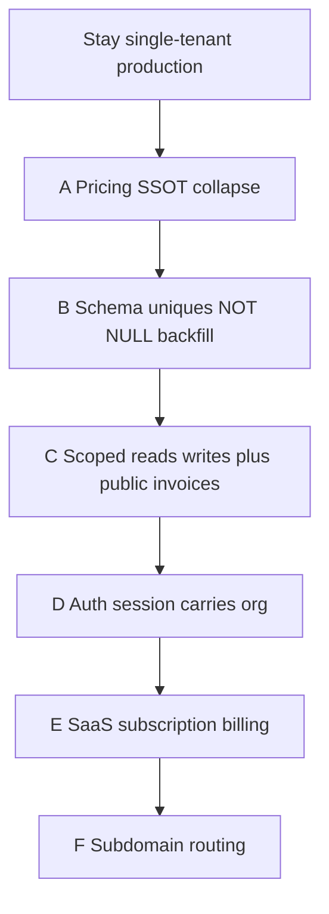

# Hair multi-tenant conversion plan

**Status:** Plan only — **do not implement** until this sequence is approved.  
**Input:** [`docs/SAAS_READINESS.md`](./SAAS_READINESS.md) (2026-08-22).  
**Rule:** Never leave a deploy where Org A can read or write Org B’s data, even “temporarily.” Prefer staying **single-tenant** (flag off, one org in Hair DB) over a half-scoped second tenant.

Tenant key in this codebase is **`organization_id`** (and **`location_id`** where the row is site-scoped). Do not invent a parallel `salon_id` / `tenant_id` unless Platform and Hair schemas are redesigned together.

**Do not enable `FYH_SAAS_TENANT` in production until Gate C (hostile two-org tests) passes on staging.**

Phases **A and B must not overlap** with C on the same money tables. **C and D must not overlap.** **E and F must not start until D is done.** Waitlist (`saas_waitlist_signups`) stays isolated; it is not a tenant.

---

## Phase A — Collapse `priceBasket` vs `invoiceMath` (one salon)

**Why first:** Dual GST/total formulas are a correctness bug. Tenant-scoping both paths doubles the surface and lets N salons depend on whichever helper a hold vs checkout still calls.

**Touch:** `src/hair/domain/basket/engine.ts` (`priceBasket`), `src/hair/lib/invoiceMath.ts`, callers:

- `src/hair/domain/checkout/pipeline.ts` (already `priceBasket`)
- `src/hair/components/quick-sale/QuickSaleShell.tsx` (`priceBasket`)
- `src/hair/services/quickSale.ts`
- `src/hair/services/invoices.ts`
- `src/hair/services/quickSaleHold.ts`
- `tests/hair/unit/quickSaleTotals.test.ts`

**Do not in this phase:** `orgFilter` on catalog, `FYH_SAAS_TENANT`, migrations on `fyh_invoices`, GST-per-tenant Settings (keep `SALON_GST_BPS` until a later settings phase after A).

**Work:**

1. Golden tests: same basket snapshot → `priceBasket` vs `sumCartLines` / `computeGrandTotalFromParts` — document every mismatch.
2. Make **holds, invoice helpers, and checkout** all use `priceBasket` (or a thin wrapper that only calls the engine).
3. Delete or `@deprecated` + lint-forbid `invoiceMath` production imports. Keep a test file that proves the old helper matches engine **or** remove the helper once parity is proven.
4. Run `npm run test:hair` (and any Quick Sale / invoice unit tests).

**Done and safe:**

- One pricing SSOT on the write path and the hold path.
- No production import of `invoiceMath` except tests (or the file is gone).
- Shantinagar-equivalent **not** required (Hair). Production FYH still **one salon**; totals for that salon match previous invoices on a sample of paid + hold bills (read-only compare script or fixture replay).
- **Stop.** Do not add tenant WHERE clauses in the same PR.

---

## Phase B — Schema: missing keys, uniques, backfill (still one salon in data)

**Why after A:** Schema/NOT NULL work is independent of formula choice, but **must not** ship in the same change as POS math. If A is unfinished, do not start B.

**Missing tenant column (readiness):** only **`wf_auth_sessions`** has no `organization_id`. All other `fyh_*` / `wf_*` ops tables already have (nullable) `organization_id`.

**Also in this phase (same tables / indexes — do not split across deploys that enable a second org):**

1. Production introspection (read-only): is `0036_saas_unique_indexes` applied? Are org columns still NULL?
2. Align **Drizzle** with 0036 (drop global `fyh_invoices_number_uidx` / `fyh_customers_code_uidx` in `billing.ts` / `customers.ts` in favor of org-composite uniques). Schema lying about uniques is a footgun.
3. Backfill: every operational row → **your** Platform `organization_id` (and `location_id` where required). Zero NULL orgs for tables that 0037 will lock.
4. Journal and apply **`0037_saas_not_null.sql` only after** backfill gates (row counts, NULL counts = 0). Today 0037 is an **orphan file** (not in `_journal.json`). Do not apply blindly on production.
5. Add `organization_id` to **`wf_auth_sessions`** (nullable first, backfill from `wf_employees.organization_id`, then NOT NULL). No second tenant yet — all sessions get the single org.
6. Unique on `fyh_settings (organization_id)` if missing.
7. Optional but recommended before C: `fyh_tenant_mirror` as a **local** org allow-list (Phase 0B). Still one row for your salon.

**Do not:** `FYH_SAAS_TENANT=1` in production. Do not create Org B in Hair.

**Done and safe:**

- Introspection notes stored (which uniques exist on prod).
- One org UUID on every ops row; NOT NULL applied on staging then prod.
- `wf_auth_sessions.organization_id` populated.
- Drizzle matches live indexes.
- Hair ERP still behaves as today for the single salon (`npm run test:hair`).
- **Stop.** Second org must not exist in Hair DB yet.

---

## Phase C — Scoped reads/writes + public invoices (staging two-org, prod still one)

**Depends on A + B.** This is the first phase that can make isolation **real**. Do not combine with A (money formulas) or D (session model) in one deploy.

**Touch:** every Hair query that lists/loads salon data, especially:

- `src/hair/domain/catalog/adapter.ts` — `loadBillableCatalog` **must** take `TenantContext` and `orgFilter`
- `src/hair/domain/checkout/pipeline.ts` — `tenantWriteDefaults` + load-by-id **and** org
- `src/hair/domain/ledger/service.ts` — org on write and read
- `src/hair/lib/tenant/filters.ts` — decide: fail closed if context missing when a **request** is authenticated (services already throw if flag on and ctx missing)

**Public invoices (breach if skipped):**

- Replace `/i/[invoiceNumber]` as the only key. Options (pick one, ship before a second org exists): signed token, or `/i/[orgSlug]/[invoiceNumber]`, or UUID-only public id.
- Change `isPublicInvoiceLookupAllowed`: **never** allow unscoped number lookup. Default-off SaaS flag must not mean “search whole DB.”

**Hardening tests (required before flag on):**

- Two synthetic orgs in **staging** Hair DB.
- Org A session: 404/empty for Org B customers, catalog, invoices, appointments, ledger.
- Org B cannot update Org A invoice by id.
- Public URL for Org A invoice does not return Org B (and guessing Org A’s old number-only URL fails closed).

**Print identity:** stop using `src/hair/lib/invoiceBranding.ts` constants for customer invoices; use `fyh_settings` (and location address). Can ship in C or a C.1 immediately after — **before** any external salon. Do not parallel with checkout scoping if the same invoice SELECT is in flight; prefer **after** scoped `getInvoiceDetailByNumber`.

**GST:** still global 18% until Settings-per-org is a dedicated follow-on **after** C tests pass (same money module — do not mix GST Settings refactor with catalog scoping in one PR).

**Done and safe:**

- Domain catalog/checkout/ledger are org-scoped **even if** someone forgets the flag — prefer requiring `TenantContext` on those functions (signature change, all callers updated in **this** phase).
- Hostile two-org tests green on staging.
- Public invoice is not “first row with this number.”
- Production may still have **one** org and flag **off** until you explicitly cut over — but unscoped number lookup must already be gone (fail closed).
- **Stop.** Do not add Stripe or subdomains here.

**Production cutover of `FYH_SAAS_TENANT=1`:** only after C tests pass and a single-org prod smoke (login, Quick Sale, public invoice). Still **one** real salon.

---

## Phase D — Auth / session scoping

**Depends on C.** Session today is employee-only (`wf_auth_sessions`). Org cookies are not the session.

**Work:**

1. Persist `organization_id` (and optional `location_id`) **on the session row** (column from B).
2. `getWorkforceSession` / Hair session loader returns tenant; cookie org must **match** session org or membership; reject mismatches.
3. Middleware: still presence-check is weak — at least session load on protected routes must bind org before any query (already closer after C).
4. `fyh_admin_users.email` global unique: move to `(organization_id, email)` or retire legacy admin in favor of workforce-only **before** a second admin of another salon signs up.
5. `/select-organization` only lists Platform memberships; switching location re-issues or updates session, not a forgeable cookie alone.

**Done and safe:**

- Stolen/forged `fyh_org_id` cannot select an org the employee is not a member of.
- Two employees in two orgs cannot see each other’s ERP with the same login unless membership says so.
- Tests: session org vs cookie org mismatch → 403 and no data.
- **Stop.** No payment provider in this phase.

---

## Phase E — SaaS subscription billing

**Depends on D.** Platform already has `platform.plans`, `organization_subscriptions`, `organization_entitlements` — **admin-set, no Stripe/Razorpay for SaaS.**

**Work:**

1. Product decision: Stripe vs Razorpay **for Platform**, not PG `PAYMENT_PROVIDER` (different DB, different customer).
2. Wire checkout → `organization_subscriptions` + `subscription_events`.
3. Gate `listActiveMembershipsForUser` / Hair login: inactive subscription → paywall, **not** unscoped ERP.
4. Entitlements must not be readable cross-org.

**Done and safe:**

- A second org can be **blocked** from ERP without being able to query Hair ops tables.
- Failed payments cannot leave a tenant “half created” with NULL org rows (create org + Hair mirror in one runbook with reconcile).
- No subdomain required yet (still cookie + picker).

**Do not** run E in parallel with C (memberships + invoices) or with Hair POS payment code.

---

## Phase F — Subdomain / tenant routing

**Depends on D (and E if you sell “yoursalon.fyhair.app” as a paid SKU).** Phase 0B: v1 = picker on one host; v2 = `{slug}.fyhair.app`.

**Work:** host allowlist in `src/hair/lib/host.ts` + middleware; map slug → `organization_id` via Platform or `fyh_tenant_mirror`; session must match host org (no switching to another org on that host).

**Done and safe:**

- Request to Org B host with Org A session → 403, empty body, no catalog leak.
- Public invoice URLs include org slug or stay on a token that embeds org.
- DNS/certs runbook. **Greenfield today — last, not first.**

---

## Explicit non-parallelism

| Must not ship together | Reason |
|------------------------|--------|
| A + C | Dual formulas + new WHERE clauses → cannot tell which broke totals vs isolation |
| B + C with `FYH_SAAS_TENANT` on | NOT NULL/uniques + live second org without scoped domain layer |
| C + D | Query scoping vs session identity — two ways to “forget org” |
| C + E | Subscription gate vs POS money |
| E + Hair Razorpay | Different products; do not share `PAYMENT_PROVIDER` |
| F before C+D | Subdomain without scoped queries is a **louder** breach |

---

## What “second salon” means (go-live bar)

Only after **A→D** (E if paid, F if branded hosts):

- Two orgs in Hair with **zero** shared customers/invoices/catalog in queries.
- Hostile tests in CI (`tests/hair` isolation suite).
- Print/legal identity from `fyh_settings`, not `invoiceBranding.ts`.
- Waitlist remains `saas_waitlist_signups` — converting a waitlist row to a tenant is a **new** Engine workflow, not an UPDATE on `fyh_customers`.

Until then, the landing page is marketing only.
