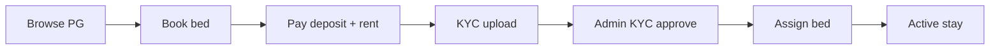
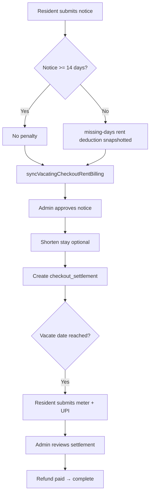

# Workflows

> Step-by-step business flows. Cross-ref: [[features]] · [[DATABASE]] · [[ARCHITECTURE]] · [[DECISIONS]] · [[BUGS]] · [[CHANGELOG]]

---

## Resident Onboarding

1. Customer selects PG/room/bed on `/pgs/[pgSlug]`.
2. Checkout at `/booking/new` — `pricingSnapshot` frozen on `bookings` row.
3. Payment via Razorpay or admin offline → `bookings.status = confirmed`.
4. Primary `bed_reservations` row created with `stay_range` `[check_in, end)`.
5. Resident uploads KYC at `/account/profile?section=identity`.
6. Admin approves at [[KYC]] `/admin/residents/kyc/[id]`.
7. Admin assigns bed if not already assigned — [[Bed Assignment]].
8. Monthly rent invoices generated from 1st of month — [[Billing]].

**Key services:** `bookingLifecycle.ts`, `tenantAssignment.ts`, `kyc.ts`

---

## KYC Approval

1. Submission created → `kyc_submissions.status = pending`.
2. Appears in [[Operations]] queue and `/admin/residents/kyc`.
3. Admin reviews documents → `approved` or `rejected`.
4. On approve: `customers.kyc_status = approved` → resident eligible for bed assignment.

**Rules:** Website signups need KYC before "Assign bed" CTA unlocks.

---

## Bed Assignment

1. **Entry points:** `/admin/pgs/[pgId]/map`, `/admin/residents/[id]`, `/admin/bookings/new`.
2. System checks `occupancySsot` — bed available for date range.
3. Create/update `bed_reservations` (`kind=primary`, `status=active`).
4. Revalidate occupancy views (`revalidateOccupancyViews`).
5. Bed map and residents list must agree — same SSOT query (`88a16e8`).

**Rules:** GiST EXCLUDE prevents double-booking. Future assignments only for `monthly` / `open_ended` duration modes in some views.

---

## Billing

### Rent (monthly)

1. Cron or manual generation → `ensureMonthlyRentInvoice` / `generateRentInvoicesForMonth`.
2. Pro-rate if partial month (check-in mid-month).
3. Due date = 5th of billing month (`billing.ts`).
4. Late fee: 1% of original rent per day from 6th.
5. Resident pays via UPI proof or [[Payment Links]].
6. Admin approves proof → `rent_invoices.status = paid`.

### Electricity

1. Admin uploads room meter reading → `electricity_bills`.
2. System splits among active monthly occupants in room.
3. `electricity_invoices` per booking; due 3 days after bill issued.
4. Resident pays + admin approves (same pattern as rent).

**SSOT:** `residentFinancialEngine.ts` — all outstanding figures.

---

## Deposit Collection

1. Required amount on `bookings.deposit_paise`.
2. Collected at checkout and/or offline via `/admin/deposits/add`.
3. Ledger entries in `deposit_ledger` (collected, deducted, refunded).
4. `getDepositSummaryForBooking` → refundable balance.
5. Partial collection tracked via `deposit_due_paise` / `deposit_collection_status`.
6. **Admin allocation** — Operations payment review: admin sets confirmed received + rent/deposit split (`applyAdminPaymentAllocation`); balances via `getBookingMoneyBalances()`.
7. **Checkout** — refund = collected deposit − notice − electricity − outstanding rent − damage; `deposit_due_paise` zeroed when checkout settlement opens.

---

## Vacating

### Resident submit

1. `/account/resident/request-vacating/[bookingId]`.
2. `submitVacatingRequest` — snapshots deduction, creates `vacating_requests` (`pending`).
3. **`syncVacatingCheckoutRentBilling`** — pro-rates move-out month rent, cancels future months.

### Admin approve

1. `/admin/vacating` or [[Operations]] → Approve.
2. `approveVacatingRequest` — status `approved`.
3. May shorten `bed_reservations` to vacating date (future move-outs only).
4. **`createCheckoutSettlementFromVacating`** — settlement row created.

### Admin complete

1. `completeVacatingRequest` — deposit ledger entries, booking `completed`, customer `vacated`.
2. Cancel future rent/electricity invoices.

**Past vacate date (before complete):** Bed stays occupied and not bookable until checkout settlement finishes ([[DECISIONS#Checkout settlements as refund SSOT]]). UI shows “move-out overdue”; daily cron upserts high-priority `vacating_alert` action items (`vacatingPastDue.ts`).

### Cancel / reject / withdraw

- `restoreRentBillingAfterVacatingCancel` — uncancels vacating-cancelled invoices, recalculates amounts.

**See also:** [[Checkout Settlements]], [[DECISIONS#Vacating checkout rent sync]]

---

## Refund Processing

1. Gates: [[Vacating]] approved + vacate date passed (`depositRefundEligibility.ts`).
2. Resident submits deposit refund request (meter photo + UPI/QR).
3. Data flows into `checkout_settlements` (electricity calc, deductions).
4. Admin at `/admin/checkout-settlements/[id]`:
   - Review electricity (meter / average / manual)
   - Approve refund amount
   - Mark refund paid (UPI reference)
5. Ledger: `deposit_ledger` refunded entry; settlement → `refund_paid` / `completed`.

---

## Notifications

### Email

- Vacating status updates (`notifyVacatingUpdate`).
- Billing reminders via automation engine.

### Action Center

1. `syncActionItems()` derives tasks from live DB state.
2. Types: rent_due, electricity_due, kyc_pending, vacating, payment proof, etc.
3. Execute: WhatsApp URL, email, create payment link.
4. Surfaces on [[Operations]] overview and Action Drawer.

### Admin notifications

- Mirror of action items in `/admin/notifications`.

---

## Related

[[features]] · [[Vacating]] · [[Billing]] · [[KYC]] · [[Bed Assignment]] · [[DATABASE]]

<!-- DOC_SYNC_TOUCH_2026-06-21 -->
> **2026-06-21 18:33:10 UTC** — Code changed in: Vacating. Manual review recommended.

<!-- DOC_SYNC_TOUCH_2026-06-22 -->
> **2026-06-22 00:25:15 UTC** — Code changed in: Routes, Auth, Billing. Manual review recommended.

<!-- DOC_SYNC_TOUCH_2026-06-23 -->
> **2026-06-23 07:25:58 UTC** — Code changed in: Routes, Auth, Billing. Manual review recommended.

<!-- DOC_SYNC_TOUCH_2026-06-24 -->
> **2026-06-24 07:11:28 UTC** — Code changed in: Bookings. Manual review recommended.

<!-- DOC_SYNC_TOUCH_2026-06-25 -->
> **2026-06-25 13:43:37 UTC** — Code changed in: Routes, Billing, Bookings. Manual review recommended.

<!-- DOC_SYNC_TOUCH_2026-06-26 -->
> **2026-06-26 07:02:31 UTC** — Code changed in: Routes, Vacating. Manual review recommended.

<!-- DOC_SYNC_TOUCH_2026-06-27 -->
> **2026-06-27 08:37:59 UTC** — Code changed in: Vacating, Action Center, Residents. Manual review recommended.

<!-- DOC_SYNC_TOUCH_2026-06-29 -->
> **2026-06-29 08:55:28 UTC** — Code changed in: Routes, Billing, Vacating, Action Center. Manual review recommended.

<!-- DOC_SYNC_TOUCH_2026-06-30 -->
> **2026-06-30 06:36:43 UTC** — Code changed in: Routes, Residents. Manual review recommended.

<!-- DOC_SYNC_TOUCH_2026-07-01 -->
> **2026-07-01 06:24:39 UTC** — Code changed in: Routes, Residents. Manual review recommended.

<!-- DOC_SYNC_TOUCH_2026-07-02 -->
> **2026-07-02 08:18:26 UTC** — Code changed in: Routes, Billing, Electricity. Manual review recommended.

<!-- DOC_SYNC_TOUCH_2026-07-03 -->
> **2026-07-03 08:28:00 UTC** — Code changed in: Routes, Billing. Manual review recommended.

<!-- DOC_SYNC_TOUCH_2026-07-04 -->
> **2026-07-04 07:48:05 UTC** — Code changed in: Database, Electricity, Billing. Manual review recommended.

<!-- DOC_SYNC_TOUCH_2026-07-05 -->
> **2026-07-05 10:29:21 UTC** — Code changed in: Routes, Database, Billing, Bookings, Vacating. Manual review recommended.

<!-- DOC_SYNC_TOUCH_2026-07-06 -->
> **2026-07-06 16:23:12 UTC** — Code changed in: Routes, Database, Vacating. Manual review recommended.

<!-- DOC_SYNC_TOUCH_2026-07-07 -->
> **2026-07-07 06:19:57 UTC** — Code changed in: Database, Billing. Manual review recommended.

<!-- DOC_SYNC_TOUCH_2026-07-08 -->
> **2026-07-08 08:33:09 UTC** — Code changed in: Routes, Billing. Manual review recommended.

<!-- DOC_SYNC_TOUCH_2026-07-09 -->
> **2026-07-09 08:00:44 UTC** — Code changed in: Routes, Billing, Bookings. Manual review recommended.

<!-- DOC_SYNC_TOUCH_2026-07-10 -->
> **2026-07-10 09:24:52 UTC** — Code changed in: Bed Assignment, Bookings. Manual review recommended.

<!-- DOC_SYNC_TOUCH_2026-07-11 -->
> **2026-07-11 06:40:31 UTC** — Code changed in: Bed Assignment. Manual review recommended.

<!-- DOC_SYNC_TOUCH_2026-07-21 -->
> **2026-07-21 08:32:20 UTC** — Code changed in: Routes, Bed Assignment, Bookings, Residents, Vacating. Manual review recommended.

<!-- DOC_SYNC_TOUCH_2026-07-22 -->
> **2026-07-22 04:46:18 UTC** — Code changed in: Routes, Database, Billing, Bookings. Manual review recommended.

<!-- DOC_SYNC_TOUCH_2026-07-23 -->
> **2026-07-23 07:13:33 UTC** — Code changed in: Database, Vacating, Bookings. Manual review recommended.

<!-- DOC_SYNC_TOUCH_2026-07-24 -->
> **2026-07-24 04:40:42 UTC** — Code changed in: Routes, Database, Vacating, Bookings. Manual review recommended.
