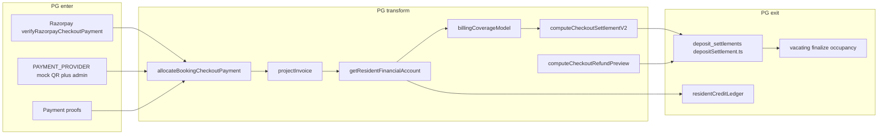

# System architecture and logic audit

**Date:** 2026-08-22  
**Audience:** An engineer or AI who has never seen this repo.  
**Tone:** Working document, not a marketing summary. Uncertainties are labeled **Unclear** rather than guessed.

This is a **single Next.js 16 App Router application** (`package.json` name `awesomepg`). It is **not** an npm-workspaces monorepo: there is no `packages/` directory and no `workspaces` field. Isolation is folders + separate Neon databases + host/path middleware.

Amounts are almost always **integer paise** (`number`). Ecosystem constitution: Engines write; Brains project/explain. Most “Brains” in `docs/ECOSYSTEM_V2_INVENTORY.md` are still **Gap** or **Partial**. Docs MEMORY / `brain-*.sh` is vault intelligence, **not** a product Brain.

---

## 1. Products and structure

### 1.1 Distinct products / sites

| Product | What it actually does | App Router | Code home | DB env | Public host (code/docs) |
|---------|----------------------|------------|-----------|--------|-------------------------|
| **Awesome PG** (customer + APG OS admin) | Bed-first PG: discovery, booking, rent/electricity/deposits, vacating/checkout settlement, resident portal, ops | `app/(customer)/`, `app/(admin)/admin/` | `src/services/`, `src/db/`, `src/lib/`, `src/roomOs/`, `src/components/{admin,customer}` | `DATABASE_URL` (aliases `POSTGRES_URL`, `POSTGRES_PRISMA_URL`) | `www.awesomepg.in` (apex `awesomepg.in` → www 308 in `middleware.ts`) |
| **For Your Hair (FYH)** | Salon ERP: appointments, Quick Sale POS, catalog, inventory, CRM, reports | `app/(hair)/fyh/` (internal prefix `/fyh`; salon host rewrites `/dashboard` → `/fyh/dashboard`, etc.) | `src/hair/` | `HAIR_DATABASE_URL` (+ Neon aliases) | `fyhair.awesomepg.in`; legacy `foryourhair.awesomepg.in` |
| **Automotive Capital** | Private auto-investment OS: vehicles, seller payments, costs, TVI/ROI, deals | `app/(capital)/` (root paths **on invest host**) | `src/capital/` | `INVEST_DATABASE_URL` (+ aliases) | `invest.awesomepg.in` |
| **Owner OS** | Personal/life financial OS; event inbox from other engines | `app/(owner)/owner/` (host rewrites `/dashboard` → `/owner/dashboard`) | `src/owner/`, math in `src/personalFinance/` | `OWNER_DATABASE_URL` | `owner.awesomepg.in` |
| **Platform** | Cross-product SaaS identity: orgs, plans, subscriptions, FYH multi-tenant onboarding | `app/(platform)/platform/` | `src/platform/` | `PLATFORM_DATABASE_URL` | Path `/platform/*` (host-agnostic in root middleware) |
| **Workforce Engine** | Employee identity, ranks, permissions, schedules, payroll **helpers** | UI under FYH `app/(hair)/fyh/(app)/workforce/` | `src/workforce/` | **Same as Hair DB** (`wf_*` tables) | Not a separate domain |

**Not separate sites:** Room OS (`src/roomOs/`) is PG Engine intelligence. Brand QA at `app/brand/*`. Health/docs “brains” are not products.

**Entry points:**

- Next: `app/layout.tsx`, `middleware.ts`, `next.config.ts`
- Dev: `npm run dev` → `src/db/startupMigrationGate.ts` then `next dev`
- Deploy: **one** Vercel/Next build (`scripts/vercel-build.sh`, `vercel.json` is **crons only**, not a multi-app domain map)

**Routing isolation:** `middleware.ts` order is Preview FYH → Platform → Hair host → Capital host → Owner host → PG apex redirect → cookie presence checks for `/account/*`, `/booking/*`, `/admin/*`. On the PG host, Capital-only paths 404.

**Unclear:** Live Vercel project domain list was not read from the Vercel API. `docs/ENV_CONTRACT.md` still says the deploy “hosts **three** products” — stale vs Owner + Platform + Workforce.

### 1.2 Shared vs duplicated vs product-specific

**Genuinely shared**

- One Next process, one `node_modules`, root `app/globals.css`
- UI primitives: `src/components/ui/`, `src/components/shared/`, brand tokens `src/lib/brand/`
- Tooling: Playwright, `scripts/regression-report.ts`, cert scripts
- Constitution docs: `docs/ECOSYSTEM_V2*.md`

**Product-specific by design**

- Separate `src/{hair,capital,owner,platform,workforce}` trees, Drizzle configs in `hair/`, `capital/`, `owner/`, `platform/` (those dirs are **not** Next apps)
- Separate session cookies (see §5)
- Engine-local money: PG RFE, Capital TVI, FYH basket/ledger — **not** Finance Brain

**Duplicated patterns (not shared packages)**

- Host allowlists / `resolveRequestHostname` copied in `src/hair/lib/host.ts`, `src/capital/lib/host.ts`, `src/owner/lib/host.ts`
- Parallel `actions/`, `db/`, `services/` per product
- Separate customer identity per engine (Customer Brain = **Gap**)

There is **no** `src/types/` folder. PG contracts are TypeScript types + Drizzle columns; Capital has more Zod (`src/capital/lib/validation/schemas.ts`).

Feature inventory: **no** root `docs/FEATURES.md`. Use `docs/feature-inventory.md`, `docs/PROJECT/features.md`, `docs/foryourhair/FEATURES.md`, `docs/automotive-capital/FEATURES.md`. `docs/ROUTES.md` is PG-heavy.

---

## 2. Core domain logic (money / business)

Classification: **Engine** (writes/workflows) vs **Brain** (projections). Room OS must not replace frozen settlement math.

### 2.1 Awesome PG — engines and SSOTs

#### Checkout settlement waterfall (FROZEN math)

| | |
|--|--|
| **Current SSOT** | `computeCheckoutSettlementV2` in `src/lib/checkout/checkoutSettlementEngineV2.ts` |
| **Computes** | Two-bucket waterfall: unused rent first, then deposit. Stay dates → rent bucket → notice (from unused rent then deposit) → electricity/other from deposit → refund |
| **Input type** | `CheckoutSettlementV2Input` (`stayCheckInDate`, `stayCheckoutDate`, `rentPaidPaise`, `monthlyRentPaise`, `depositCollectedPaise`, `missingNoticeDays`, electricity/damage/cleaning/custom, `noticeApplies`, `checkoutTailRentPaise`, `prepaidAfterVacatingPaise`, `periodDailyRentPaise`, …) |
| **Output type** | `CheckoutSettlementWaterfall` with `engineVersion: 2`, `stay`, `rentBucket`, `notice`, `depositBucket`, `refund`, `lines[]` |
| **Wiring** | Preview: `src/lib/vacating/computeVacatingSettlementPreview.ts`. Presentation SSOT for UI: `loadVacatingBillingPresentation` / `loadVacatingBillingPresentationBundle`. Writer: `src/services/checkoutSettlement.ts` |
| **Freeze** | `docs/SETTLEMENT_ENGINE_FREEZE.md` + `.cursor/rules/settlement-engine-freeze.mdc`. Companions: `src/lib/billing/billingCoverageModel.ts` (`buildBillingCoverageModel`), `src/lib/vacating/noticeDeductionEngine.ts`, `src/lib/billing/vacatingFinalPeriodRent.ts`, `src/lib/billing/billingEngineValidation.ts` |
| **Versioning** | `checkout_settlements.settlement_engine_version` in `src/db/schema/checkoutSettlements.ts` **defaults to 1**. `settlementUsesEngineV2` in `src/lib/checkout/checkoutSettlementV2Flag.ts` is true when `settlementEngineVersion >= 2` |
| **Legacy (still live)** | `computeCheckoutRefundPreview` in `src/lib/billing/checkoutRefundPreview.ts` — deposit held minus deductions only (`CheckoutRefundPreviewInput` → totals). Used when engine &lt; 2 / unlocked paths (`checkoutSettlement.ts`, `src/lib/moveOut/moveOutPipeline.ts`) |

**Duplication (explicit, not deprecated-and-deleted):** V1 refund preview vs V2 full waterfall. UI that recomputes totals instead of the presentation bundle **violates freeze**.

#### Billing coverage, rent pricing, invoices, RFE

| Concern | SSOT | Notes |
|---------|------|--------|
| Monthly rent for a booking | `resolveMonthlyRentPaiseForBooking(bookingId, billingMonth)` in `src/lib/billing/rentPricingSsot.ts` | bed_price → private_room → billing_profile → snapshot fallback; returns `{ rentPaise, source }` |
| Quote / stay pricing | `computePriceBreakdown` / `quoteBedPrice` / `quoteBookingPrice` in `src/services/pricing.ts` | Daily/weekly/monthly/open_ended/fixed_stay |
| Daily rate | `dailyRateFromMonthly` in `src/services/billing.ts` | Shared by V2 + BCM — not a second formula |
| Invoice projection | `projectInvoice(invoice, asOf?)` → `RentInvoiceView` in `src/services/rentInvoices.ts`; `computeRentDuePaise` | |
| Resident account | `getResidentFinancialAccount(customerId)` in `src/services/residentFinancialEngine.ts` → `ResidentFinancialAccount` / types in `src/lib/billing/residentFinancialTypes.ts` | Categories rent/deposit/electricity/other; `requiredPaise` / `paidPaise` / `outstandingPaise` |
| Booking cash slices | `getBookingMoneyBalances(bookingId)` in `src/services/bookingMoneyBalances.ts` | Pure slices in `src/lib/billing/bookingMoneyBalances.ts` |
| BCM | `buildBillingCoverageModel` + loader `loadBillingCoverageModel` in `src/services/billingCoverage.ts` | Frozen with settlement |
| Admin revenue rollup | `src/services/financialMetricsEngine.ts` | Engine-local, **not** Finance Brain |
| Property Performance tiles | `getRevenueCommandCenterData` only (decision 2026-07-29) | Must not parallel `getCachedPgBusinessMetrics` on Overview |

#### Booking payment allocation (pay-in waterfall)

`allocateBookingCheckoutPayment` in `src/lib/billing/bookingPaymentAllocation.ts`.

- **Inputs:** booking `{ subtotalPaise, discountPaise, depositPaise, totalPaise, pricingSnapshot? }` + `bookingPaymentPaise`
- **Order:** rent → deposit cash → prior outstanding → unallocated (via `splitBookingPayment` / `breakdownBookingCheckoutPayment`)
- **Output `BookingPaymentAllocation`:** `rentPaise`, `depositCashPaise`, `priorOutstandingPaise`, `depositTransferCreditPaise`, `unallocatedPaise`, due fields

Related: `src/lib/billing/bookingCheckoutTotals.ts`, `src/services/depositCollection.ts`.

#### Occupancy / Room OS (read layer)

- Legacy occupancy SSOT: `src/lib/bedOccupancyEngine.ts`
- Bed Brain: `src/roomOs/engines/occupancy/` (`buildBedBrain`, `resolveBookingContext`)
- Ledger projection: `src/roomOs/engines/ledger/` (`buildBookingLedger`, `resolveBookingLedgerFacts`) — may call `applyLedgerTotalsToSummary`; **must not** reimplement V2 settlement
- Writers remain Engine: occupancy, electricity (`src/services/electricityBilling.ts` `projectElectricityInvoice`), rent, deposit
- Flags: `ROOM_OS_OPERATIONS_QUEUE`, `ROOM_OS_BILLING_CENTRE` in `src/lib/operations/featureFlag.ts` — **default off**

Checkout **workflow** (states, ops queues, “checkout ≠ payout”) is a **separate freeze**: `docs/CHECKOUT_PAYOUT_PLATFORM_FREEZE.md`, display strings `src/lib/payout/payoutDisplayTerminology.ts`.

#### Electricity at checkout

`src/lib/checkout/electricitySettlement.ts` + `electricitySettlementCalc.ts`; room ledger `src/services/roomElectricityLedger.ts`. Room OS electricity engines are projections.

### 2.2 Hair — Quick Sale / POS

| Path | File | Role |
|------|------|------|
| **Intended checkout SSOT** | `priceBasket(basket) → PricedBasket` in `src/hair/domain/basket/engine.ts`; persist via `checkoutFromBasket` in `src/hair/domain/checkout/pipeline.ts` | 2026-08-01 decision: Basket → PricedBasket → Financial Ledger → Invoice |
| **Write wrappers** | `finalizeQuickSale` in `src/hair/services/invoices.ts` dynamically imports `checkoutFromBasket`. `src/hair/actions/quickSale.ts` also calls `checkoutFromBasket` | `createInvoiceFromAppointment` marked `@deprecated` in favor of basket pipeline |
| **Parallel cart math** | `sumCartLines`, `computeGrandTotalFromParts` in `src/hair/lib/invoiceMath.ts` | Still imported by `src/hair/services/quickSale.ts`, `invoices.ts`, `quickSaleHold.ts` |
| **UI** | Quick Sale components also call `priceBasket` / `priceLineFromParts` for display | Preview can drift from `invoiceMath` if those paths still compute totals independently |
| Commission (salon) | `src/hair/services/commissionEngine.ts` | **Not** Workforce `computeCommissionPaise` |
| Purchase / vendor | `purchaseEngine.ts`, `purchaseReturnEngine.ts`, `vendorPaymentEngine.ts` | Purchase Brain frozen in registry |

**Duplication:** Dual pricing (GST-inclusive basket engine vs `invoiceMath` tax-on-net). Writes appear to funnel through `checkoutFromBasket`, but **totals used for holds / catalog helpers still go through `invoiceMath`**. Treat as a live dual-path risk, not fully retired.

### 2.3 Capital — TVI / deal economics

| | |
|--|--|
| **Live TVI SSOT** | `computeCurrentInvestment` in `src/capital/lib/investmentMath.ts` (used by `src/capital/services/assets.ts`) — seller price + costs − refunds |
| **Deal profit** | `src/capital/lib/dealEconomics.ts` — Gross = Sale − TVI + Additional Income; SELF / 50-50 |
| **Alternate helper** | `computeTviFromCosts` in `src/capital/lib/threeLedgers.ts` — **tests-oriented**; not the assets service path |
| Decision | 2026-07-26: TVI prefers `ac_vehicle_costs`; legacy expenses must not enter TVI |

### 2.4 Workforce payroll

- `computeCommissionPaise`, `payrollNetPaise({ salary, commission, incentive, deductions })` in `src/workforce/lib/compensationMath.ts`
- Service: `src/workforce/services/compensation.ts` (`wfPayrollRuns`, `wfPayrollLines`)
- **Unclear:** Bank/UPI payout beyond generating payroll lines — inventory status **Partial**

### 2.5 Money flows (end to end)

**PG enter:** Booking payments and proofs; `verifyRazorpayCheckoutPayment` in `src/services/paymentVerification.ts` when `PAYMENT_PROVIDER=razorpay` (`src/lib/payments/config.ts` requires `RAZORPAY_KEY_ID`, `RAZORPAY_KEY_SECRET`, `RAZORPAY_WEBHOOK_SECRET`). Production **requires** `PAYMENT_PROVIDER` (`src/lib/env.ts`); non-prod defaults to `mock`. Credits: `src/services/residentCreditLedger.ts`. Custom `financial_invoices`.

**PG exit:** `settleDepositRefund` / deduction helpers in `src/services/depositSettlement.ts`; checkout status machine (frozen terminology).

**Hair enter/transform/exit:** Basket payments, wallet/gift/membership redemptions → `priceBasket` / ledger posts → paid invoice; vendor payments via purchase engines.

**Capital enter/transform/exit:** Seller payments + vehicle costs + additional income → TVI / deal profit. Payout types exist in Zod/schemas (`capital_returned`, `profit`, `refund`). **Unclear:** complete investor payout service map in this audit pass.

**Owner / personalFinance:** Composes adapters; Finance Brain still **Gap**. Must not duplicate rent/TVI/salon formulas.

---

## 3. Data and contracts

### 3.1 Databases

| Env (canonical) | Resolver | Drizzle | Schema | Products |
|-----------------|----------|---------|--------|----------|
| `DATABASE_URL` | `src/lib/db/env.ts` | `drizzle.config.ts` | `src/db/schema` | Awesome PG + Room OS tables |
| `HAIR_DATABASE_URL` | `src/hair/lib/db/env.ts` — also `FORYOURHAIR_DATABASE_URL`, `HAIR_DATABASE_DATABASE_URL`, `HAIR_POSTGRES_URL`, `HAIR_POSTGRES_PRISMA_URL` | `hair/drizzle.config.ts` | `src/hair/db/schema` **+ workforce schema re-export** | FYH + Workforce |
| `INVEST_DATABASE_URL` | `src/capital/lib/db/env.ts` — aliases `INVEST_DATABASE_DATABASE_URL`, `INVEST_POSTGRES_URL` | `capital/drizzle.config.ts` | `src/capital/db/schema` | Capital |
| `PLATFORM_DATABASE_URL` | `src/platform/lib/db/env.ts` | `platform/drizzle.config.ts` | `src/platform/db/schema` (`platform` pgSchema) | Platform SaaS |
| `OWNER_DATABASE_URL` | `src/owner/lib/db/env.ts` | `owner/drizzle.config.ts` | `src/owner/db/schema` | Owner OS |

Isolation: Hair asserts ≠ PG / Invest / Owner / Platform (`assertHairDatabaseIsolated`). FYH SaaS Phase 0B: Platform `platform.*` is tenant SSOT; Hair **mirrors** `organization_id` / `location_id` / `user_id` **without cross-DB FKs** (sign-off still pending per MEMORY 2026-08-18).

**Contract gaps**

- `docs/ENV_CONTRACT.md` documents PG / Capital / Hair / Platform only. **`OWNER_DATABASE_URL` is missing from that doc** despite code.
- `scripts/check-env.ts` `--product` is only `pg|hair|capital|platform` — **no owner**.
- Overview printer uses `envLine('HAIR_DATABASE_URL', resolveHairDatabaseUrl())` which reports **Missing** if the canonical key is absent even when an **alias** resolves. This workspace: `npm run env:check` showed all four canonical keys **Missing**, Hair and Capital still **resolved via aliases**, PG failed, Platform failed.

### 3.2 Shared types / schemas

| Contract | Location | Dependents |
|----------|----------|------------|
| Env contract (incomplete vs code) | `docs/ENV_CONTRACT.md` | `scripts/check-env.ts`, onboarding |
| Resident money | `src/lib/billing/residentFinancialTypes.ts` | RFE, portal, admin |
| Settlement V2 | `CheckoutSettlementWaterfall` / `CheckoutSettlementV2Input` in `checkoutSettlementEngineV2.ts` | Vacating preview, checkout service, admin UI |
| Vacating presentation | `loadVacatingBillingPresentation*` | Admin/resident vacating UI (freeze: no alternate formulas in components) |
| Booking `PricingSnapshot` | Drizzle `src/db/schema/bookings.ts` | Allocation, rent SSOT fallback |
| Capital Zod | `src/capital/lib/validation/schemas.ts` | Capital forms/API |
| Ecosystem ownership | `docs/ECOSYSTEM_V2_INVENTORY.md`, `docs/ECOSYSTEM_V2_BRAIN_REGISTRY.md` | Agents, not runtime |
| Billing invariants | `docs/BILLING_ENGINE_INVARIANTS.md` | Freeze + tests |

Zod is sparse outside Capital. PG APIs often assume Drizzle row shapes and hand-written TS types.

### 3.3 Hidden coupling (implicit contracts)

1. **`settlement_engine_version` default 1** vs “V2 is SSOT” — many production rows may still be V1 until upgraded; UI branches on `waterfall` **or** version ≥ 2 (`CheckoutSettlementSummary.tsx`, `CheckoutRefundSummaryRail.tsx`).
2. **Paise integers everywhere** — mixing rupees would silently drift ₹1 certs (`cert:shantinagar-phase1`).
3. **Host header → product middleware** — wrong host serves the wrong product or 404; `resolveRequestHostname` copies must stay consistent.
4. **Hair tenant IDs** mirrored from Platform without FKs — reconcile scripts (`hair:saas:tenant-reconcile`) are the real integrity layer.
5. **Room OS projections vs ledger writers** — UI behind `ROOM_OS_*` flags can show different ops/billing queues than legacy composers.
6. **`PAYMENT_PROVIDER` production throw** vs local `mock` default — same code path, different persistence (QR proof vs Razorpay ids).
7. **Cookie presence in middleware ≠ cryptographic session** for PG/Hair/Capital (Platform HMAC is verified at edge). Invalid cookies can pass the gate then fail in loaders.
8. **`stability:report` path globs** (`scripts/regression-report.ts`) treat `src/workforce/`, `src/owner/`, `src/platform/` as **PG** if they match `/^src\//` and are not hair/capital — or skip product-specific tests. `BILLING_GLOBS` omit some money files (e.g. `src/services/residentCreditLedger.ts`, `bookingFinancialWorkspace.ts`) so billing-settlement suite may **not** run when those change.
9. **`cert:room-os-wave3` in `package.json` is the same script as `cert:room-os-wave2`** — name implies Wave 3 checks; implementation may not match docs that mention `RFE_BED_BRAIN_BRIDGE`.

---

## 4. Environment and configuration

### 4.1 Documented vs actual required vars

**`docs/ENV_CONTRACT.md` required (per product):**

- PG: `DATABASE_URL` or `POSTGRES_URL`
- Capital: `INVEST_DATABASE_URL`
- Hair: `HAIR_DATABASE_URL`
- Platform: `PLATFORM_DATABASE_URL`
- Shared: `AUTH_SECRET` (≥32 chars)

**`scripts/check-env.ts`:** same four products; capital also accepts `INVEST_DATABASE_DATABASE_URL` / `INVEST_POSTGRES_URL`. Does **not** validate `AUTH_SECRET`, Razorpay, Owner, Room OS flags, or cron.

**`src/lib/env.ts` (PG app, lazy accessors) — not in ENV_CONTRACT:**

| Var | Role | Silent behavior |
|-----|------|-----------------|
| `PAYMENT_PROVIDER` | `mock` \| `razorpay` | Required in production; else default `mock` |
| `RAZORPAY_*` | Checkout + webhooks | Optional until provider=razorpay |
| `CRON_SECRET` | Bearer on cron routes | Optional accessor |
| `AUTH_SECRET` | Sessions | **Falls back to `dev-only-auth-secret-change-me` if unset** |
| `AUTH_*_SESSION_*` | Cookie lifetimes | Numeric defaults |
| `ADMIN_INITIAL_PASSWORD`, `ADMIN_RECOVERY_EMAIL` | Bootstrap / reset | Optional |
| `RESEND_*` / `SMTP_*` / `EMAIL_FROM` | Mail | Optional |
| `COCKROACH_AI_ENABLED` | Customer AI guide | Hidden only if `"false"` (default **on**) |
| `BILLING_TIMEZONE` | Rent anniversary | Default `Asia/Kolkata` |
| `BOOKING_HOLD_MINUTES`, reservation TTLs | Holds | Defaults 15 / 24h / 48h |
| PostHog / Sentry / VAPID | Analytics, PWA | Optional |
| `DEVELOPER_TEST_EMAIL` | Resident dev bypass | Optional |

**Feature flags (change behavior without code):**

| Flag | Default | Effect |
|------|---------|--------|
| `ROOM_OS_OPERATIONS_QUEUE` | **off** | Operations Centre Room OS adapters |
| `ROOM_OS_BILLING_CENTRE` | **off** | Billing Centre collections via Room OS |
| `WORKFORCE_ENGINE` | **ON if unset** (`isWorkforceEngineEnabled` in `src/workforce/types.ts`) | Docs often say set `=1` to enable — **code is opt-out** (`0`/`false`/`off`) |
| `--product=` on `env:check` | `pg` | Scopes which DB is required |

**This workspace `npm run env:check` (2026-08-22):** canonical `DATABASE_URL` / `HAIR_DATABASE_URL` / `INVEST_DATABASE_URL` / `PLATFORM_DATABASE_URL` all reported **Missing**. Hair and Capital **still resolved** (Neon alias keys). PG: fail. Platform: fail. **Do not treat this as production Vercel env.** ENV_CONTRACT warns `vercel env pull` often leaves keys **present but empty**.

No root `.env.example` was found in this audit.

---

## 5. Cross-cutting systems

### 5.1 Auth

**No NextAuth / Clerk.** Custom cookies + DB sessions (Platform: HMAC cookie).

| Surface | Cookie | Store | Key files |
|---------|--------|-------|-----------|
| PG customer | `apg_customer_session` (`CUSTOMER_SESSION_COOKIE`) | SHA-256 token → `authSessions` + `customers` | `src/lib/auth/session.ts`, `src/lib/auth/customer.ts` |
| PG admin | `apg_admin_session` | `adminUsers` | same session module; `/admin/login` |
| PG extra | `apg_signup_session`, `apg_impersonation` | Signup / super-admin impersonation | `src/lib/auth/constants.ts` |
| Hair | Hair session cookie (`HAIR_SESSION_COOKIE`) | `fyh_auth_sessions` | `src/hair/lib/auth/session.ts`, `src/hair/middleware/hairMiddleware.ts` |
| Workforce | **Reuses Hair cookie** | `wf_auth_sessions` + `wf_employees` | `src/workforce/auth/session.ts` |
| Capital | `CAPITAL_SESSION_COOKIE` | `ac_auth_sessions` | `src/capital/lib/auth/session.ts` |
| Owner | `OWNER_SESSION_COOKIE` | `oo_auth_sessions` | `src/owner/lib/auth/session.ts` |
| Platform | `PLATFORM_SESSION_COOKIE` | HMAC payload (`sessionCookieEdge.ts`); secret `AUTH_SECRET` \|\| `PLATFORM_SESSION_SECRET` \|\| `SESSION_SECRET` \|\| **dev fallback** | `src/platform/lib/auth/` |

Login identifiers (email vs phone vs mobile) differ per product; PG has OTP modules (`src/lib/auth/otp.ts`). **Unclear:** every identifier matrix was not fully traced.

### 5.2 Always-on Cursor / process guardrails

From `.cursor/rules/`:

| Rule | Enforces |
|------|----------|
| `stability-phase.mdc` (`alwaysApply`) | Map dependents and **list blast radius before edits**; shared contracts all-or-stop; min diff; baseline tests; `npm run stability:report`; no duplicated money math; billing/Room OS certs; Impact Summary; Health Score 100 |
| `ecosystem-brains.mdc` | Engine vs Brain; no mixing; shared knowledge in Brains; no cross-Brain DB |
| `memory-agent.mdc` / `memory-classification.mdc` | Docs vault → MEMORY append; no agent vault git |
| `settlement-engine-freeze.mdc` (glob) | Settlement math frozen; UI via presentation bundle |
| `checkout-payout-platform-freeze.mdc` (glob) | State machine + terminology frozen |

Human runbook: `docs/STABILITY_PHASE.md`, `docs/ECOSYSTEM_BASELINE_V1.md`.

### 5.3 Testing, `stability:report`, CI

| Command | What it actually runs |
|---------|------------------------|
| `npm run test:pg` | `scripts/run-unit-tests.mjs pg` → `tests/unit/**` + `tests/integration/**` |
| `npm run test:hair` | Hair migrate then `tests/hair` |
| `npm run test:capital` | `tests/capital` |
| `npm run test:owner` | `tests/owner` (exists; **not** in `stability:report` product set) |
| `npm run test:billing-settlement` | **Four files only:** `billingEngineValidation`, `moveOutSettlementExplanation`, `settlementRuleRegistry`, `billingCoverageRegression` |
| `npm run stability:report` | Build → inferred `test:pg`/`hair`/`capital` → billing suite if `BILLING_GLOBS` match → upload/blob lints → optional certs if `DATABASE_URL` |
| CI `.github/workflows/ci.yml` | Image/blob lints; **full** `run-unit-tests.mjs` (includes owner); `npm run build` with stub `AUTH_SECRET`, `SKIP_MIGRATION_GATE=1`; Playwright **`tests/e2e/smoke.spec.ts` only** |
| Hair E2E | `.github/workflows/hair-e2e.yml` (not every PR) |

**Blind spots**

- Shantinagar / Room OS certs are **release gates**, not default CI.
- `test:billing-settlement` does not include all settlement unit files (e.g. `checkoutRefundPreview.test.ts`, vacating preview tests).
- Path heuristics miss owner/platform/workforce as first-class products; workforce/owner under `src/` can be labeled **pg**.
- Hair Playwright not on PR CI.
- Ecosystem Health Score is a process rule, not the CI unit step.
- Production read-only audits are operator-run (`scripts/audit-*-readonly.ts`).

---

## 6. Known fragile areas

The 10 places most likely to break from an “unrelated” change:

1. **Settlement V1 + V2 coexistence** — `settlement_engine_version` default 1, live `computeCheckoutRefundPreview` plus frozen V2. Changing notice/rent helpers without both paths and the presentation bundle produces admin vs resident vs cert drift.

2. **Shantinagar portal cert (₹1)** — `npm run cert:shantinagar-phase1` reconciles many portal vs backend fields. Any duplicate outstanding math in `src/lib/residents/*`, `residentPortalTabData.ts`, or UI will fail production cert. `BILLING_GLOBS` may not even trigger the billing suite.

3. **Vacating / unused-rent / notice date immutability** — recent engine work (move-out notice dates, unused rent wallet, approval preview) sits on frozen modules. Drive-by refactors here cascade to occupancy + refunds.

4. **Hair `invoiceMath` vs `priceBasket`** — two GST stories; holds and helpers still on `invoiceMath`. A “simple POS UI tweak” can desync printed invoice vs ledger.

5. **Room OS flag cutover** — `ROOM_OS_OPERATIONS_QUEUE` / `ROOM_OS_BILLING_CENTRE` switch queues. Default off in code; enabling without Wave certs splits ops/billing truth. Forbidden-import tests exist for Wave 3; `cert:room-os-wave3` npm alias is **wave2 script**.

6. **Host middleware copies** — Hair/Capital/Owner host allowlists. Fixing one product’s hostname without the others leaks routes or 404s.

7. **Platform ↔ Hair tenant mirror (no FKs)** — SaaS Phase 0B. Changing org/location IDs on one DB without reconcile scripts orphans FYH rows.

8. **`AUTH_SECRET` fallback + middleware cookie presence** — unset secret in non-prod; edge does not verify PG sessions. Easy to think a route is “protected” when only the cookie **name** is checked.

9. **`stability:report` product inference** — changing `src/workforce/` or `src/owner/` may run **PG** tests and skip `test:owner` / hair migrate. False green.

10. **PII at rest** — `customers.idProofNumber` is plaintext (`TODO(security)` in `src/db/schema/customers.ts`). Schema/API changes around KYC are high-sensitivity even if “just a form field.”

Honorable mention: Capital `computeTviFromCosts` vs `computeCurrentInvestment`; Property Performance must stay on `getRevenueCommandCenterData`; checkout vs payout **words** (`payoutDisplayTerminology.ts`) if someone “fixes copy” in a random component.

---

## 7. Recent decisions and memory

Sources: `docs/MEMORY/decisions.md`, `docs/MEMORY/changelog.md` (head of files, 2026-08-22 working tree). Formal ADRs live in `docs/DECISIONS.md` / product ADRs — MEMORY is the operational log.

### Last several architectural / process decisions (why)

| When | Decision | Why |
|------|----------|-----|
| 2026-08-22 | Cascade-breakage guardrails merged into Stability Phase (not a second always-on rule) | List dependents before edits; all contract consumers or stop; Impact Summary; min diff |
| 2026-08-18 | FYH SaaS Phase 0B: Platform SSOT; Hair mirrors IDs **without** cross-DB FKs | Multi-DB Neon; stakeholder sign-off **pending** |
| 2026-08-05 | Ecosystem Baseline v1 frozen — Health Score must stay **100** | Floor for new Engines/Brains; independent audit `scripts/independent-ecosystem-baseline-audit.ts` |
| 2026-08-04 | Workforce Engine Phase 1 in FYH DB; Ecosystem v2 Brain/Engine constitution | Universal employees; Engines execute, Brains own intelligence; Room OS = PG-scoped only |
| 2026-08-01 | OR-0 Operations Recovery freeze; Room OS architecture (truth ladder, outbox); FYH notification template order; Quick Sale basket/ledger foundation | Stop duplicate-invoice chaos; strangler projections; no hardcoded WA copy; POS money SSOT |
| 2026-07-29 | Property Performance SSOT = `getRevenueCommandCenterData` only | Stop dual metrics on Overview |
| 2026-07-26 | Capital: settle = deal closed; TVI from `ac_vehicle_costs`; dealer UI hides stakes | Dealership OS honesty vs funding UI |

### Changelog highlights (same window)

- 2026-08-22: `STABILITY-CASCADE-GUARDRAILS`
- 2026-08-05: Workforce v1 close + Ecosystem Baseline
- 2026-08-04: Workforce + Ecosystem v2 constitution
- 2026-08-02: Room OS Waves 0–4 / rollout docs
- 2026-08-01: OR-0 + Stability Phase introduced

---

## Restated process (from AGENTS.md / STABILITY_PHASE)

Priority is **not** shipping the feature fastest; it is not breaking dependents. Map blast radius, run `test:pg` / `test:hair` / `test:capital` (+ `test:billing-settlement` on money), then `npm run stability:report`. Billing Centre releases need `cert:shantinagar-phase1` on production (zero ₹1 drift). Do not duplicate rent/deposit/settlement/occupancy/invoice math in UI. Shared contract changes must update every consumer or stop.

---

## How this document was produced

Code and docs as of **2026-08-22**. `env:check` ran in this workspace (canonical keys missing; Hair/Capital aliases resolved). Production Vercel/Neon inventory was **not** queried. Payment ingress beyond Razorpay verify + mock provider, and Capital payout services, are **not fully mapped**.

If two sources disagree, prefer **code + freeze docs** over `ENV_CONTRACT.md` (known stale on product count and Owner DB).
