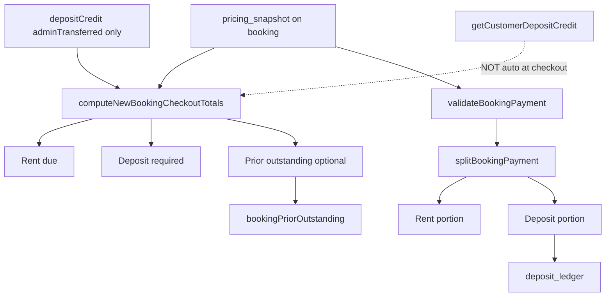
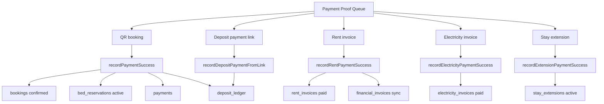
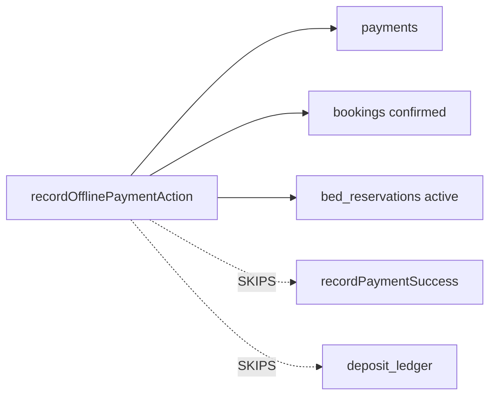
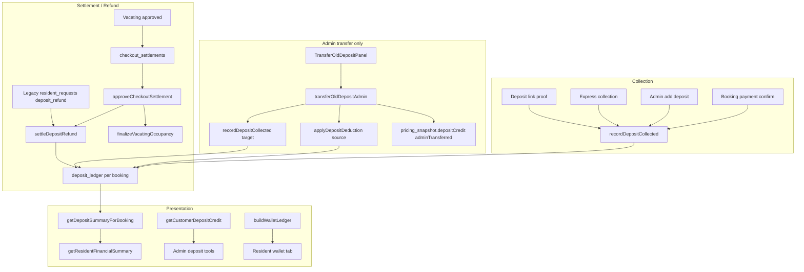
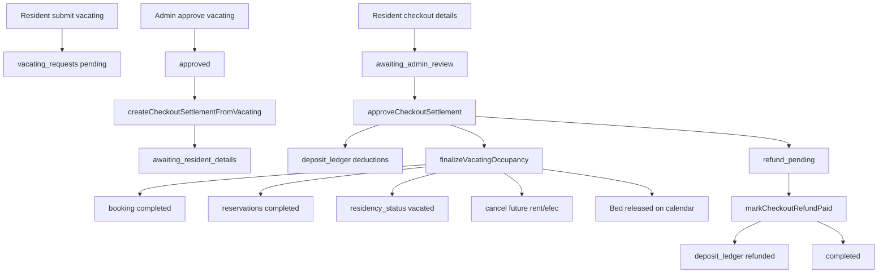
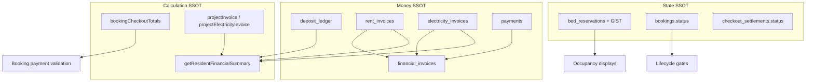

# Awesome PG — System Graph

**Purpose:** Visual map of how every major workflow connects.  
**Mode:** Static audit — no runtime verification.  
**Date:** 13 June 2026  
**Companion:** [`SYSTEM_TRUTH_MAP.md`](./SYSTEM_TRUTH_MAP.md) · [`MASTER_TEST_MATRIX.md`](./MASTER_TEST_MATRIX.md)

---

## 1. Master workflow graph

```mermaid
flowchart TB
  subgraph acquisition [Acquisition]
    BROWSE[/pgs browse]
    BOOK[Booking]
    PRICING[Pricing SSOT]
  end

  subgraph payment [Payment & Proof]
    BPAY[Booking Payment]
    PROOF[Payment Proof Approval]
    RECEIPT[Payment Receipt]
  end

  subgraph billing [Billing]
    REV[Revenue / Rent Gen]
    RENT[Rent Billing]
    ELEC[Electricity Billing]
    INV[Invoices]
  end

  subgraph deposit [Deposits]
    DEP[Deposits]
    DTRANS[Deposit Transfers]
    WALLET[Wallet / Ledger]
  end

  subgraph resident [Resident]
    KYC[KYC]
    BED[Bed Assignment]
    LIFE[Resident Lifecycle]
    REQ[Requests]
    NOTIF[Notifications]
  end

  subgraph moveout [Move-out]
    VAC[Vacating]
    CHECK[Checkout Settlement]
    REF[Refunds]
  end

  BROWSE --> BOOK
  BOOK --> PRICING
  PRICING --> BPAY
  BPAY --> PROOF
  PROOF --> DEP
  PROOF --> RECEIPT
  BOOK --> BED
  BPAY --> LIFE
  BED --> LIFE
  KYC --> BED
  LIFE --> REV
  REV --> RENT
  RENT --> INV
  ELEC --> INV
  INV --> REV
  DEP --> WALLET
  DTRANS --> WALLET
  DTRANS --> DEP
  LIFE --> REQ
  REQ --> REF
  VAC --> CHECK
  CHECK --> REF
  CHECK --> DEP
  REF --> WALLET
  LIFE --> NOTIF
  VAC --> LIFE
  CHECK --> LIFE
```

---

## 2. Booking → Resident activation

```mermaid
flowchart LR
  A[/booking/new] --> B[createBooking]
  B --> C{createdVia}
  C -->|customer| D[pending_payment + hold]
  C -->|admin| E[confirmed + active]
  D --> F[/booking/code/pay]
  F --> G[submitBookingPaymentRecord]
  G --> H[pending_approval]
  H --> I[Payment Proof Approval]
  I --> J[recordPaymentSuccess]
  J --> K[confirmed + active]
  K --> L[deposit_ledger collected]
  K --> M[Resident Lifecycle unlocked]
  M --> N[/account/resident hub]
  E --> N
  B --> O[bed_reservations]
  O --> P[Occupancy SSOT]
```

---

## 3. Pricing & checkout money split



---

## 4. Payment proof → downstream effects



**Parallel path (inconsistent):**



---

## 5. Revenue & invoice pipeline

```mermaid
flowchart TB
  CRON[/api/cron/generate-monthly-rent] --> GEN[generateRentInvoicesForMonth]
  ADMIN[/admin/revenue/billing generate] --> GEN
  GEN --> RI[rent_invoices]
  RI --> SYNC[syncRentInvoiceToUnified]
  SYNC --> FI[financial_invoices SSOT registry]

  EMETER[Admin electricity bill entry] --> EB[createElectricityBill]
  EB --> EBill[electricity_bills]
  EB --> EI[electricity_invoices fan-out]
  EI --> SYNC2[syncElectricityInvoiceToUnified]
  SYNC2 --> FI

  IGEN[invoiceGeneration combined] --> FI
  FI --> DOC[invoiceDocumentModel]
  DOC --> SHARE[/resident/invoices/ref]
  DOC --> ADMININV[/admin/invoices/id]

  PAY2[Paid via proof or Razorpay] --> ALLOC[invoicePayment allocate]
  ALLOC --> FI
  ALLOC --> RI
  ALLOC --> EI

  REFUND[refundUnifiedInvoice] --> FI
  REFUND --> REVERSAL[reverseInvoicePaymentAllocation]
```

---

## 6. Deposit, transfer, wallet, settlement



---

## 7. KYC → Bed assignment → Lifecycle

```mermaid
flowchart LR
  ID[/account/profile section=identity] --> SUB[submitKyc]
  SUB --> KS[kyc_submissions pending]
  ADMKYC[/admin/residents/kyc] --> REV[reviewKycSubmission]
  REV --> APPROVED[kyc_status approved]

  APPROVED --> VERIFY[getCustomerVerificationStatus]
  VERIFY --> ASSIGN[assignTenantToBed]
  ASSIGN --> CB[createBooking admin]
  CB --> BR[bed_reservations active]
  CB --> RS[residency_status active]

  CB --> LIFE[Resident Lifecycle]
  LIFE --> BILL[rent + elec + deposit billing]
  LIFE --> HUB[Resident hub tabs]
```

---

## 8. Vacating → Checkout → Refund → Occupancy release



---

## 9. Requests vs Checkout (duplicate path)

```mermaid
flowchart TB
  subgraph canonical [Canonical move-out refund]
    VAC2[Vacating] --> CS2[checkout_settlements]
    CS2 --> REF2[settleDepositRefund]
  end

  subgraph legacy [Legacy path]
    REQ[resident_requests deposit_refund] --> ADMR[/admin/requests review]
    ADMR --> SD2[settleDepositWithDeductions]
  end

  ARQ[adminRefundQueue] --> DEDUP{checkout settlement exists?}
  DEDUP -->|yes| SKIP[Skip legacy queue item]
  DEDUP -->|no| SHOW[Show legacy request]
```

---

## 10. Notifications graph

```mermaid
flowchart TB
  subgraph triggers [Event triggers]
    BOOKC[Booking confirmed] --> EMAIL1[notifyBookingConfirmed]
    PAYR[Payment receipt] --> EMAIL2[notifyPaymentReceipt]
    RENTR[Rent reminder cron] --> EMAIL3[notifyRentReminder]
    VACU[Vacating update] --> EMAIL4[notifyVacatingUpdate]
  end

  EMAIL1 --> SEND[sendEmail / sendEmailAsync]
  EMAIL2 --> SEND
  EMAIL3 --> SEND
  EMAIL4 --> SEND
  SEND --> LOG[email_delivery_log]

  LOG --> RESUI[NotificationCenterPanel resident tab]
  LOG --> TIMELINE[residentTimeline events]

  ACT[action_items sync] --> ADMINN[/admin/notifications API]
  ADMINN --> ADUI[AdminNotificationCenter]
```

---

## 11. SSOT dependency graph



---

## 12. Admin surface map (by workflow)

```mermaid
flowchart LR
  subgraph ops [Operations]
    PR[/admin/operations/payment-reviews]
    RES[/admin/operations/residents]
  end

  subgraph money_admin [Money]
    REV[/admin/revenue]
    BILL[/admin/revenue/billing]
    DEP[/admin/deposits]
    INV[/admin/invoices]
    CS[/admin/checkout-settlements]
  end

  subgraph people [People & beds]
    RES2[/admin/residents]
    KYC[/admin/residents/kyc]
    BEDS[/admin/beds]
    MAP[/admin/pgs/pgId/map]
  end

  PROOF[Payment Proof] --> PR
  PROOF --> BILL
  REV --> BILL
  DEP --> CS
  VAC[Vacating] --> CS
```

---

## Workflow adjacency matrix

| Workflow | Directly feeds | Directly consumes |
|----------|----------------|-------------------|
| Booking | Pricing, Occupancy | KYC (indirect), Availability |
| Booking Payment | Deposits, Occupancy, Lifecycle | Booking, Pricing snapshot |
| Payment Proof | All payment types | Upload APIs |
| Revenue | Rent invoices | Occupancy eligibility, Booking |
| Invoices | Revenue reporting | Rent, Electricity, Deposits |
| Deposits | Wallet | Booking Payment, Settlement |
| Deposit Transfers | Deposits, Wallet | Admin action only |
| Rent Billing | Invoices, Revenue | Lifecycle, Billing profiles |
| Electricity Billing | Invoices, Revenue | Occupancy in room |
| KYC | Bed Assignment | Customer upload |
| Bed Assignment | Lifecycle, Occupancy | KYC, Availability |
| Resident Lifecycle | All billing tabs | Booking Payment, KYC, Bed |
| Requests | Refunds (legacy) | Vacating, Deposits |
| Vacating | Checkout Settlement | Lifecycle |
| Checkout Settlement | Refunds, Occupancy | Vacating, Deposits |
| Refunds | Wallet, Revenue | Settlement or Invoice |
| Wallet | — (read mostly) | Deposits, Payments, RFE |
| Notifications | — (read log) | Email send hooks |
