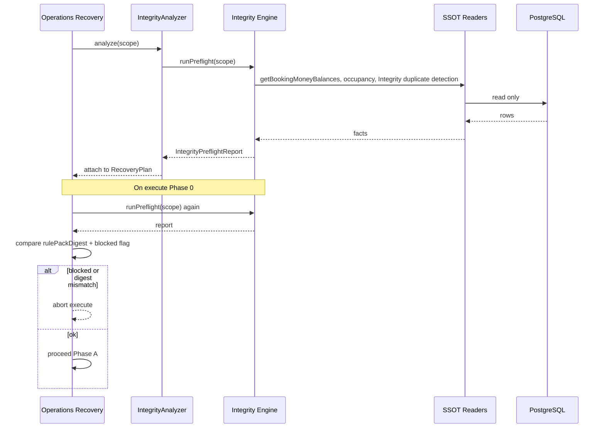

# ADR-OR-001: Integrity Preflight

| Field | Value |
|-------|-------|
| **Status** | Accepted (OR-0 gate — architecture freeze) |
| **Date** | 2026-08-01 |
| **Owner module** | Integrity Engine |
| **Consumers** | Operations Recovery, Recovery Discovery, Property OS Integrity summaries, Operations Centre (read-only) |
| **Cross-links** | [[ARCHITECTURE]] · [[ROOM_OS]] · [[OPERATIONS_RECOVERY]] · ADR-OR-005 |

---

## Purpose

Provide a **single read-only preflight service** that detects duplicate financial/occupancy artifacts and violated invariants before operational mutations run. Operations Recovery and admin surfaces **consume** this service; they **never** define duplicate or invariant rules themselves.

Integrity Preflight answers: *“Is it safe to plan or execute this operational change?”*

---

## Scope

### In scope

- Duplicate detection for rent invoices, electricity invoices, deposit ledger rows, primary reservations, open residencies, open checkout settlements (within declared scope).
- Invariant checks for booking/reservation/occupancy consistency, deposit held vs required, paid-invoice regeneration risk.
- Blocking vs warning classification with stable reason codes.
- Scoped execution: one `pgId`, optional `bookingId`, `roomId`, `billingMonth`.

### Out of scope

- Executing repairs or mutations.
- Defining recovery plans or phased execution.
- Payment approval or billing calculations.
- Full Property OS certification (12/12 gates) — preflight is a **subset** suitable for plan/execute gates.
- Historical analytics across all PGs in one call (batch jobs use separate Integrity batch API).

---

## Ownership

| Artifact | Owner |
|----------|-------|
| Duplicate detection rules | **Integrity Engine** |
| Invariant rule catalog | **Integrity Engine** |
| `IntegrityPreflightReport` schema | **Integrity Engine** (versioned) |
| Rule version registry | **Integrity Engine** |
| Operations Recovery | Consumer only — attaches report snapshot to session plan |

---

## Responsibilities

1. Expose `runPreflight(scope)` as the canonical entry point for pre-execution validation.
2. **Own all duplicate detection logic** — absorb legacy scanners (see § Legacy scanner absorption); internal implementation may delegate during migration but **Integrity Engine is the canonical owner**.
3. Load SSOT readers (`getBookingMoneyBalances`, occupancy SSOT) for invariant checks — **read only**, do not duplicate money formulas.
4. Return a structured report with `blocked`, findings, and digests for plan snapshot comparison.
5. Support **scenario-aware** rule packs (e.g. `REGENERATE_ELECTRICITY` enables room-month duplicate rules).
6. Emit audit-friendly reason codes stable across API versions.
7. Re-run idempotently: same inputs + same DB state → same report digest.

**Recovery rule:** Operations Recovery and Recovery Discovery **consume Integrity only**. They must not implement duplicate detection, invariant rules, or parallel scanner logic.

---

## Explicit non-responsibilities

- Writing to any table.
- Approving payments or creating invoices.
- Orchestrating recovery phases.
- Auto-creating recovery sessions.
- Replacing `shantinagarPhase1PortalCertification` or full certification suites.
- Storing recovery session state.

---

## Public interface / contract

**Service:** `IntegrityEngine`  
**Method:** `runPreflight(scope): IntegrityPreflightReport`  
**API (future HTTP):** `POST /integrity/v1/preflight`  
**Version header:** `X-Integrity-Contract-Version: 1`

### `PreflightScope`

| Field | Type | Required | Description |
|-------|------|----------|-------------|
| `pgId` | uuid | yes | Property scope; all checks constrained to this PG |
| `scenario` | enum | yes | Operations Recovery scenario ID (e.g. `RENT_ONLY_ONBOARDING`) |
| `bookingId` | uuid | conditional | Required for booking-scoped scenarios |
| `customerId` | uuid | conditional | Required when `bookingId` omitted |
| `roomId` | uuid | conditional | Required for `REGENERATE_ELECTRICITY` |
| `bedId` | uuid | no | Optional; enables bed-level occupancy checks |
| `billingMonth` | date (first-of-month) | conditional | Required for electricity scenarios |
| `linkedPayment` | object | no | `{ kind, entityId }` for payment-aware checks |
| `constraints` | object | no | e.g. `{ depositAlreadyHeld: true }` |
| `requestedAt` | timestamp | yes | For audit; server may use DB `now()` |

### `IntegrityPreflightReport`

| Field | Type | Description |
|-------|------|-------------|
| `reportId` | uuid | Unique report instance |
| `contractVersion` | string | e.g. `"1.0.0"` |
| `rulePackId` | string | e.g. `"integrity-preflight-v1"` |
| `rulePackDigest` | string | Hash of active rules at compute time |
| `scopeDigest` | string | Hash of normalized scope input |
| `computedAt` | timestamp | |
| `blocked` | boolean | If true, recovery execute must not proceed |
| `blockReasons` | string[] | Human-readable blockers |
| `duplicates` | `DuplicateFinding[]` | |
| `invariants` | `InvariantFinding[]` | |
| `warnings` | `Finding[]` | Non-blocking issues |
| `summary` | object | Counts by severity |

### `DuplicateFinding`

| Field | Type | Description |
|-------|------|-------------|
| `kind` | enum | `rent_invoice` \| `electricity_invoice` \| `deposit_ledger` \| `primary_reservation` \| `residency_open` \| `checkout_settlement` |
| `severity` | enum | `block` \| `warn` |
| `entityIds` | uuid[] | Conflicting row IDs |
| `naturalKey` | string | e.g. `booking:{id}:month:2026-07-01` |
| `reasonCode` | string | Stable code, e.g. `DUP_ELEC_INVOICE_ACTIVE` — **Discovery maps scenarios from this field only** |
| `description` | string | Operator-facing |

### `InvariantFinding`

| Field | Type | Description |
|-------|------|-------------|
| `kind` | enum | `occupancy` \| `deposit` \| `booking_status` \| `vacating` \| `electricity_paid_skip` |
| `severity` | enum | `block` \| `warn` |
| `reasonCode` | string | e.g. `INV_DEPOSIT_NOT_FULLY_HELD` |
| `description` | string | |
| `context` | object | Structured facts (amounts, statuses) |

---

## State transitions

Integrity Preflight is **stateless**. Each call is independent.

```
[Request] → runPreflight(scope) → [Report]
                ↓ (blocked=true)
         Consumer aborts plan/execute
                ↓ (blocked=false)
         Consumer may proceed (subject to other gates)
```

Recovery session states that **reference** preflight:

```
draft → planned   (requires preflight attached, may be blocked at plan UI)
approved → executing → Phase 0 re-run preflight → must match plan digest OR abort
executed → validated → Phase E re-run preflight (post state)
```

---

## Error handling

| Condition | HTTP / service result | Consumer behavior |
|-----------|----------------------|-------------------|
| Invalid scope (missing required fields) | `400 INVALID_SCOPE` | Do not plan |
| Unknown scenario | `400 UNKNOWN_SCENARIO` | Do not plan |
| PG not found | `404 PG_NOT_FOUND` | Abort |
| Booking not in PG | `403 SCOPE_MISMATCH` | Abort |
| DB timeout | `503 PREFLIGHT_UNAVAILABLE` | Retry with backoff; do not execute |
| Internal rule error | `500 RULE_EVALUATION_FAILED` | Block execute; log with `rulePackDigest` |

Reports with `blocked: true` are **successful responses**, not errors.

---

## Idempotency rules

- `runPreflight` is **pure relative to DB state**: no side effects.
- Same scope + unchanged DB → identical `scopeDigest`; report content should match (except `reportId`, `computedAt`).
- Recovery stores `integrity_snapshot` + `rulePackDigest` at approve time.
- Phase 0 execute: re-run preflight; **`rulePackDigest` must match** approved snapshot OR execute aborts (rules changed since approval).
- **`blocked` flag must not flip from false→true** between approve and execute without abort (concurrency violation).

---

## Concurrency rules

- Preflight does not acquire locks.
- Callers (Operations Recovery orchestrator) must hold booking/room-month locks **before** Phase 0 re-run during execute.
- If concurrent mutation changes DB between plan and execute, Phase 0 re-run may set `blocked: true` → execute aborts (safe).

---

## Versioning strategy

| Layer | Strategy |
|-------|----------|
| **Contract version** | Semver in `contractVersion`; breaking finding shape → major bump |
| **Rule pack** | `rulePackId` + `rulePackDigest`; new rules append without breaking digest compare if optional |
| **Reason codes** | Append-only; never reuse codes with different meaning |
| **API path** | `/integrity/v1/` frozen; v2 only for incompatible scope model |

Recovery plan snapshots store `rulePackDigest` to detect rule drift between approve and execute.

---

## Event emission

Integrity Preflight **does not emit domain events** on read.

Optional audit (Integrity module):

| Event | When |
|-------|------|
| `integrity.preflight.completed` | After each call (metrics) |
| `integrity.preflight.blocked` | When `blocked=true` (ops alerting) |

No Room OS outbox events from preflight.

---

## Rule precedence (with Recovery and Discovery)

When modules interact at plan or execute time:

```
Integrity Block  >  Recovery Execute Gate  >  Discovery Recommendation  >  Work Queue Ordering
```

- `blocked: true` → Recovery execute forbidden; Discovery must not imply bypass.
- Discovery recommendations derive **only** from Integrity `reasonCode` / findings (ADR-OR-005).
- See [[OPERATIONS_RECOVERY#Rule precedence (normative)]].

---

## Legacy scanner absorption

Integrity Engine **subsumes** the following legacy duplicate-detection implementations. These modules remain in the codebase during migration but are **not** independent sources of truth for Recovery or Discovery.

| Legacy module | Functions / checks absorbed | Preflight rule(s) |
|---------------|----------------------------|-------------------|
| `src/services/electricityInvoiceDuplicates.ts` | `countActiveElectricityInvoiceDuplicates`, `listElectricityInvoiceDuplicateGroups`, `findActiveElectricityInvoiceForResidentMonth` | `DUP_ELEC_INVOICE_ACTIVE` |
| `src/services/billingIntegrityCheck.ts` | `checkDuplicateSourceInvoices` (rent + electricity source dupes) | `DUP_RENT_INVOICE_ACTIVE`, `DUP_ELEC_INVOICE_ACTIVE` |
| `src/services/billingIntegrityCheck.ts` | `checkDuplicateApprovedPayments` | *(batch audit only — not Recovery preflight v1)* |
| `src/services/checkoutAudit.ts` | `duplicate_settlement` detection | `DUP_CHECKOUT_SETTLEMENT_OPEN` |
| `src/services/checkoutSettlementRepair.ts` | Duplicate active settlement listing | `DUP_CHECKOUT_SETTLEMENT_OPEN` |
| `src/services/bedAudit.ts` | Duplicate primary reservation detection / release | `DUP_PRIMARY_RESERVATION` |
| `src/services/financialIntegrityAudit.ts` | `checkDuplicateInvoices` | *(feeds batch audit; unified-registry dupes deferred Integrity v1.1)* |
| `src/services/billingCycleReconciliation.ts` | `countActiveElectricityInvoiceDuplicates` consumer | Delegates to Integrity after absorption |
| Occupancy / residency readers | Open residency + bed conflict predicates | `DUP_RESIDENCY_OPEN`, `INV_BED_DOUBLE_OCCUPIED` |

**Write-time guards** (e.g. `findActiveElectricityInvoiceForResidentMonth` in `electricityBilling.ts`) call through Integrity-owned detection APIs after migration; until then, Billing calls legacy module but **preflight authority** is Integrity only.

---

## Interaction with Property OS, Room OS, Operations Recovery

| System | Interaction |
|--------|-------------|
| **Operations Recovery** | Calls at plan (Analyzer → IntegrityAnalyzer) and Phase 0 / Phase E. Stores snapshot on session. **Never defines duplicate rules.** |
| **Recovery Discovery** | Calls `runPreflight` (or reads cached report); maps `reasonCode` → scenario suggestions only. |
| **Property OS** | Integrity summary projections may aggregate preflight block rates (future); not in v1. |
| **Room OS** | No direct call; Room OS projectors reflect DB state after recovery execute. |
| **Operations Centre** | May display Integrity warnings on queue items (via Recovery Discovery ADR-OR-005). |
| **Payment Review** | No direct call; may show Recovery Discovery recommendation only. |

---

## Sequence diagram



---

## Blocking rules (v1 catalog)

| Rule ID | Condition | Severity | Scenarios |
|---------|-----------|----------|-----------|
| `DUP_RENT_INVOICE_ACTIVE` | ≥2 non-cancelled rent invoices same booking + billing period | block | all money scenarios |
| `DUP_ELEC_INVOICE_ACTIVE` | ≥2 non-cancelled elec invoices same booking + room + month | block | REGENERATE_ELECTRICITY (OR-3); SUPERSEDE scenario OR-4 only |
| `DUP_PRIMARY_RESERVATION` | >1 active primary reservation same booking | block | all lifecycle |
| `DUP_RESIDENCY_OPEN` | >1 open residency lifecycle same customer | warn | REACTIVATE, RENT_ONLY |
| `DUP_CHECKOUT_SETTLEMENT_OPEN` | >1 open settlement same booking | warn | lifecycle |
| `INV_DEPOSIT_NOT_FULLY_HELD` | depositOutstanding > 0 when constraint deposit_already_held required | block | RENT_ONLY_ONBOARDING |
| `INV_ELEC_PAID_REGEN_RISK` | regenerate would create invoice for occupant with paid_paise > 0 same month | block | REGENERATE_ELECTRICITY |
| `INV_BOOKING_PG_MISMATCH` | booking not in scope pgId | block | all |
| `INV_BED_DOUBLE_OCCUPIED` | target bed has conflicting active booking | block | ROOM_TRANSFER, REACTIVATE |

---

## Future evolution

- **v1.1:** Batch preflight for Operations Centre queue (async job); `financial_invoices` unified registry duplicate rules.
- **v2:** Cross-PG residency chain checks for deposit transfer scenarios (deferred).
- Rule packs loaded from DB (Wave 5 Room OS rules) — digest pinning remains mandatory.

---

## Resolved decisions

| Topic | Decision |
|-------|----------|
| Duplicate scanner ownership | **Integrity Engine subsumes legacy scanners** (§ Legacy scanner absorption). Open question #2 **closed**. |
| `warn`-severity on approve | **`block` aborts execute.** `warn` requires explicit operator acknowledgment on approve before execute is enabled (OR-1+). OR-0 is plan-only — warn displayed in plan UI. |
| `financial_invoices` registry dupes | **Deferred Integrity v1.1** (OR-3 gate). Not in preflight v1 scope. |

---

**Decision:** Integrity Engine is the **canonical owner** of all duplicate and invariant preflight logic. Operations Recovery and Recovery Discovery call `runPreflight` only — never parallel duplicate logic.
