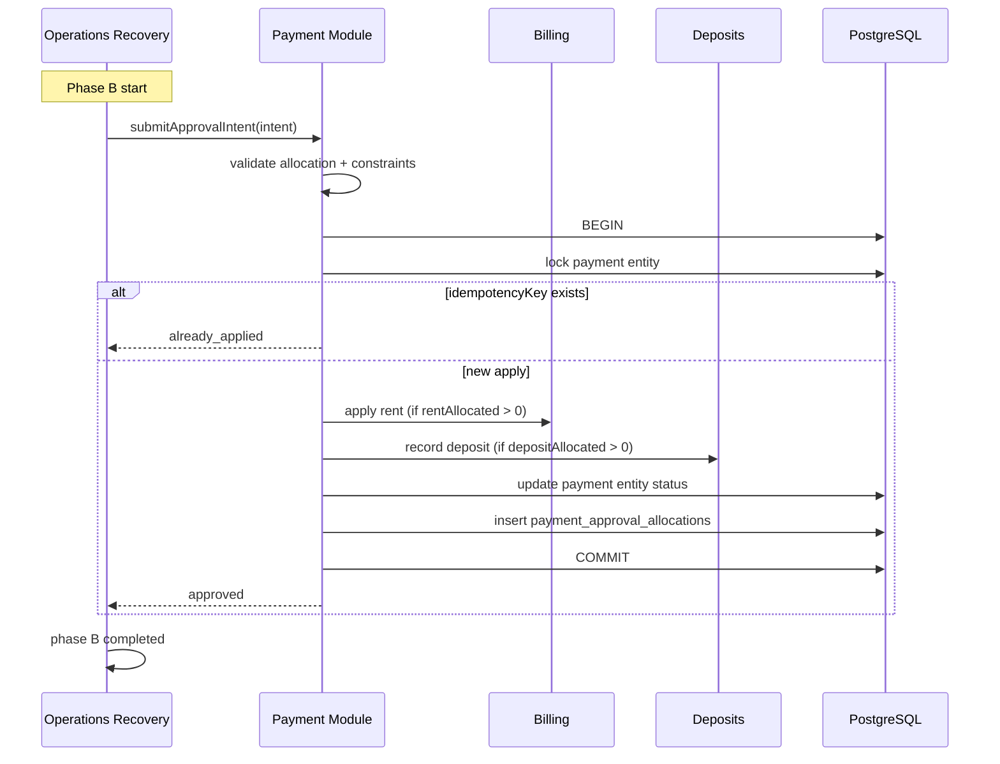

# ADR-OR-002: Payment ApprovalIntent

| Field | Value |
|-------|-------|
| **Status** | Proposed (dependency gate for Operations Recovery OR-2) |
| **Date** | 2026-08-01 |
| **Owner module** | Payment |
| **Consumers** | Operations Recovery (Phase B), Admin Payment Review (standard path), Operations Centre |
| **Cross-links** | [[ARCHITECTURE]] · [[OPERATIONS_RECOVERY]] |

---

## Purpose

Define **`PaymentApprovalIntent`** as the sole contract for approving a payment proof with explicit allocation. Operations Recovery **submits** intents; the Payment module **owns** validation, settlement, ledger effects, and idempotency. Recovery never calls settlement atomic paths or writes payment rows directly.

---

## Scope

### In scope

- QR booking payment records (`pg_payment_records`).
- Rent invoice payment proofs (`rent_invoices` with proof URL).
- Explicit allocation: rent, deposit, electricity, other (paise fields).
- Constraint enforcement: `depositAllocatedPaise = 0` when `depositAlreadyHeld` constraint active.
- Idempotent execution keyed by recovery/session reference.
- Audit linkage to `payment_approval_allocations` and `audit_log`.

### Out of scope

- Creating new payment proofs (resident submit flows).
- Deposit payment links (`deposit_link` kind) — separate Payment API in v1.
- Electricity-only proof approval without Payment module — still owned by Payment.
- Recovery orchestration or lifecycle mutations.
- Razorpay webhook reconciliation (unchanged).

---

## Ownership

| Responsibility | Owner |
|----------------|-------|
| Allocation validation | **Payment** |
| `applyApprovedPaymentAtomic` / settlement | **Payment** |
| Deposit ledger writes from allocation | **Payment** → Deposits service |
| Rent invoice paid state | **Payment** → Billing |
| `PaymentApprovalIntent` schema | **Payment** |
| Submitting intent | **Operations Recovery** (Phase B invoker) |
| Plan-time allocation preview | **Payment** `previewApprovalIntent` (read-only) |

---

## Responsibilities

1. Define and version `PaymentApprovalIntent` structure.
2. Expose `submitApprovalIntent(intent): PaymentApprovalResult` — single write entry for allocated approval.
3. Expose `previewApprovalIntent(intent): PaymentApprovalPreview` — read-only for Recovery MoneyAnalyzer.
4. Enforce business rules: allocation sum = confirmed received; deposit rules; invoice state gates.
5. Record idempotency via `idempotencyKey` — duplicate submit returns prior result.
6. Emit payment domain events / audit after successful commit.

---

## Explicit non-responsibilities

- Vacating rollback, booking reactivation, occupancy (Recovery Phase A).
- Electricity bill regeneration (Billing Phase C).
- Computing “expected payment” for Payment Review UI (Payment Review SSOT remains separate).
- Integrity duplicate detection (Integrity Preflight).
- Auto-submitting intent from Payment Review Approve without operator linking recovery session (Payment Review standard path uses existing approve flows until unified in v2).

---

## Public interface / contract

**Service:** `PaymentService`  
**Methods:**

| Method | Mutates | Purpose |
|--------|---------|---------|
| `previewApprovalIntent(intent)` | No | Plan / analyzer |
| `submitApprovalIntent(intent)` | Yes | Execute Phase B |

**API (future):** `POST /payment/v1/approval-intents/preview` · `POST /payment/v1/approval-intents/submit`  
**Version:** `X-Payment-Contract-Version: 1`

### `PaymentApprovalIntent`

| Field | Type | Required | Description |
|-------|------|----------|-------------|
| `intentId` | uuid | yes | Client-generated or server-assigned at submit |
| `idempotencyKey` | string | yes | `hash(recoverySessionId, phase, 'B', paymentEntityRef)` |
| `source` | enum | yes | `operations_recovery` \| `payment_review` \| `admin_manual` |
| `recoverySessionId` | uuid | conditional | Required when source = operations_recovery |
| `approvedByAdminId` | uuid | yes | |
| `pgId` | uuid | yes | Must match payment entity PG |
| `bookingId` | uuid | yes | |
| `customerId` | uuid | yes | |
| `paymentKind` | enum | yes | `qr` \| `rent` |
| `paymentEntityId` | uuid | yes | record id or rent invoice id |
| `confirmedReceivedPaise` | integer | yes | Verified proof amount |
| `rentAllocatedPaise` | integer | yes | |
| `depositAllocatedPaise` | integer | yes | Must be 0 if constraint deposit_already_held |
| `electricityAllocatedPaise` | integer | yes | Default 0 for recovery rent-only |
| `otherAllocatedPaise` | integer | yes | Remainder bucket |
| `constraints` | object | no | `{ depositAlreadyHeld: true }` — enforced |
| `allocationNotes` | string | no | Audit |
| `contractVersion` | string | yes | `"1.0.0"` |

### `PaymentApprovalPreview`

| Field | Type | Description |
|-------|------|-------------|
| `valid` | boolean | |
| `validationErrors` | string[] | |
| `projectedBalances` | object | rent/deposit/electricity after apply |
| `willWrite` | object | Tables affected summary (informational) |

### `PaymentApprovalResult`

| Field | Type | Description |
|-------|------|-------------|
| `ok` | boolean | |
| `outcome` | enum | `approved` \| `already_applied` \| `rejected` |
| `paymentId` | string | Provider/settlement reference |
| `appliedAt` | timestamp | |
| `allocationRecordId` | uuid | `payment_approval_allocations` |
| `errorCode` | string | When ok=false |
| `errorMessage` | string | |

---

## State transitions

### Payment entity (qr record or rent invoice)

```
pending / payment_in_progress
        ↓ submitApprovalIntent (success)
approved / paid
```

### Intent (logical — may be stored in payment_approval_allocations metadata)

```
submitted → validated → applied
         ↘ rejected (validation)
         ↘ already_applied (idempotent replay)
```

Recovery Phase B:

```
phase B: pending → running → completed | failed
```

If Phase B fails, Phase A remains committed (phased saga). Intent idempotency prevents double-apply on retry.

---

## Error handling

| Code | Condition | Recovery behavior |
|------|-----------|-------------------|
| `ALLOCATION_MISMATCH` | Sum(allocations) ≠ confirmedReceived | Phase B failed; session partial_failed |
| `DEPOSIT_NOT_ALLOWED` | deposit > 0 when deposit_already_held | Block at preview; reject at submit |
| `INVOICE_NOT_PAYABLE` | Wrong rent invoice status | Phase B failed |
| `PROOF_MISSING` | No proof URL on entity | Block at plan |
| `ALREADY_PAID` | Idempotent: return `already_applied` | Phase B completed (noop success) |
| `PG_SCOPE_DENIED` | Admin lacks pg scope | Fail |
| `SETTLEMENT_FAILED` | Atomic apply failed | Phase B failed; no partial settlement |

Payment module guarantees **no partial allocation persist** on settlement failure (single txn inside Payment).

---

## Idempotency rules

| Key | Uniqueness | Behavior on replay |
|-----|------------|-------------------|
| `idempotencyKey` | UNIQUE per payment module store | Return prior `PaymentApprovalResult` with `already_applied` |
| `paymentEntityId + status=paid` | DB constraint | Second submit → already_applied |
| Recovery `execution_attempt_id` | One active execute per session | Orchestrator prevents parallel Phase B |

Intent must include stable `idempotencyKey` derived from recovery session + phase — never regenerate on retry within same attempt.

---

## Concurrency rules

- Payment module acquires row lock on `paymentEntityId` during submit.
- Lock order: after Recovery booking lock released, before Billing Phase C.
- Concurrent Payment Review approve + Recovery Phase B on same entity: **second caller fails** with `ENTITY_LOCKED` or `ALREADY_PAID`.
- Recovery orchestrator must not start Phase B until Phase A commits.

---

## Versioning strategy

| Item | Strategy |
|------|----------|
| `contractVersion` on intent | Semver; Payment rejects unsupported major |
| Allocation fields | Additive only in v1.x |
| New payment kinds | Require contract v2 |
| Audit payload | Store full intent JSON on allocation row |

---

## Event emission

| Event | Layer | When |
|-------|-------|------|
| `payment.approval_intent.submitted` | audit_log | Submit start |
| `payment.approval_intent.applied` | audit_log | Success |
| `payment.rent_invoice.paid` | Billing lifecycle | Rent path |
| `ledger.deposit.collected` | Deposits | Only if depositAllocated > 0 |
| Room OS outbox | **Not emitted by Payment directly in v1** | Recovery Phase D may emit after B+C |

Payment does **not** emit Property OS index invalidate — Recovery Phase D handles projection refresh.

---

## Interaction with Property OS, Room OS, Operations Recovery

| System | Interaction |
|--------|-------------|
| **Operations Recovery** | Phase B: `payment.submitApprovalIntent` only. MoneyAnalyzer uses `previewApprovalIntent`. |
| **Payment Review** | Standard approve remains separate in v1; optional read-only link to recovery session. Does **not** auto-submit intent. |
| **Billing** | Payment invokes billing rent apply on success. |
| **Property OS** | Indirect via outbox after Recovery Phase D. |
| **Room OS** | No direct interaction. |
| **Integrity** | Preflight validates invoice/duplicate state before plan; Payment validates at submit. |

---

## Sequence diagram



---

## Future evolution

- Unify Payment Review Approve to submit same intent shape (v2).
- Support `electricity` payment kind on intent for combined approvals (deferred).
- Support `partial approval` with explicit remainder to resident credit.
- Webhook correlation id on intent for online payments.

---

## Open questions

1. Should `previewApprovalIntent` live on Payment or Billing? **Decision: Payment** (owns allocation validation).
2. Store intents in dedicated `payment_approval_intents` table vs metadata on allocations only?
3. Maximum age of proof for recovery-linked intent (staleness gate)?

---

**Decision:** Payment module owns all approval and allocation writes. Operations Recovery submits `PaymentApprovalIntent` and never performs payment logic.
