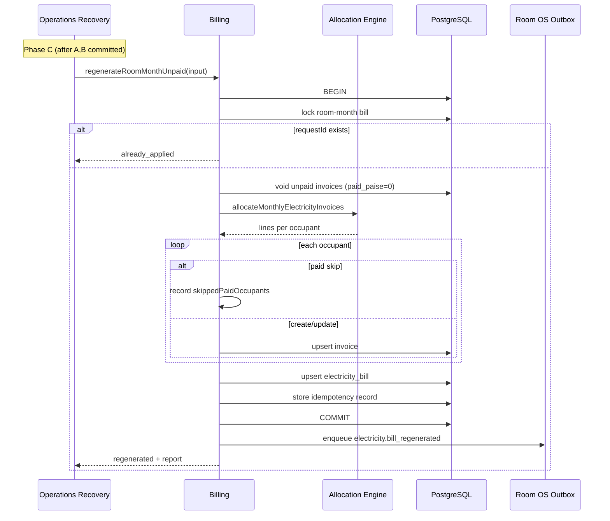

# ADR-OR-003: Billing Regenerate Room Month (Unpaid)

| Field | Value |
|-------|-------|
| **Status** | Proposed (dependency gate for Operations Recovery OR-3) |
| **Date** | 2026-08-01 |
| **Owner module** | Billing |
| **Consumers** | Operations Recovery (Phase C), Admin Electricity UI (may delegate), Integrity Preflight |
| **Cross-links** | [[Electricity]] · [[BILLING_ENGINE]] · [[OPERATIONS_RECOVERY]] |

---

## Purpose

Define **`regenerateRoomMonthUnpaid`** as the **single billing entry point** for voiding unpaid room-month electricity artifacts and regenerating per-resident invoices using the canonical allocation engine. Operations Recovery invokes this method in Phase C; it **never** voids bills, creates invoices, or runs allocation math directly.

---

## Scope

### In scope

- One room + one billing month (first-of-month date).
- Void **unpaid** electricity invoices linked to room-month bills.
- Regenerate room bill + fan-out invoices via `allocateMonthlyElectricityInvoices` / `createElectricityBill` internals.
- **Paid invoice skip policy** — occupants with paid invoices for same natural key are unchanged.
- **Update-in-place** for unpaid duplicates where amount changed (prefer over cancel+insert).
- Idempotency via `requestId`.
- Sync to `financial_invoices` unified registry.

### Out of scope

- Checkout electricity settlement.
- Refund of paid electricity invoices.
- Room meter reading entry (must exist or be supplied via existing meter SSOT).
- Cross-room or PG-wide regeneration batch (separate batch API).
- Recovery orchestration or locking (caller responsibility).

---

## Ownership

| Responsibility | Owner |
|----------------|-------|
| Electricity allocation formulas | **Billing** |
| Meter continuity / previous reading SSOT | **Billing** (meterTimelineService) |
| Void unpaid invoices | **Billing** |
| Create/update electricity bills and invoices | **Billing** |
| `regenerateRoomMonthUnpaid` contract | **Billing** |
| When to call regenerate | **Operations Recovery** (scenario + Phase C) |
| Duplicate detection before call | **Integrity Preflight** |

---

## Responsibilities

1. Implement `regenerateRoomMonthUnpaid(input): RegenerateRoomMonthResult` as atomic billing transaction.
2. Enforce paid-invoice policy: **never** void or supersede invoices with `paid_paise > 0`.
3. Enforce duplicate prevention: at most one active unpaid invoice per `(bookingId, roomId, billingMonth)` after completion.
4. Record idempotent outcome for same `requestId`.
5. Return detailed before/after report for Recovery audit attachment.
6. Emit billing domain events / outbox hooks for Room OS (`electricity.bill_regenerated`).

---

## Explicit non-responsibilities

- Detecting duplicates (Integrity Preflight).
- Approving resident payment proofs.
- Modifying booking/reservation/vacating state.
- Changing deposit or rent invoices.
- Operating on checkout settlement ledger except read for allocation credits (existing engine behavior).

---

## Public interface / contract

**Service:** `BillingElectricityService`  
**Method:** `regenerateRoomMonthUnpaid(input): RegenerateRoomMonthResult`  
**API (future):** `POST /billing/v1/electricity/regenerate-room-month-unpaid`  
**Version:** `X-Billing-Contract-Version: 1`

### `RegenerateRoomMonthUnpaidInput`

| Field | Type | Required | Description |
|-------|------|----------|-------------|
| `requestId` | uuid | yes | Idempotency key (Recovery: hash(sessionId, phase, 'C')) |
| `roomId` | uuid | yes | |
| `billingMonth` | date | yes | First of month |
| `pgId` | uuid | yes | Must match room's PG |
| `source` | enum | yes | `operations_recovery` \| `admin_electricity` \| `batch_job` |
| `recoverySessionId` | uuid | conditional | When source = operations_recovery |
| `requestedByAdminId` | uuid | yes | |
| `allowPreviousReadingOverride` | boolean | no | Default false; true only when meter SSOT documents override |
| `includeFixedStayOccupants` | boolean | no | Default true for recovery scenarios |
| `useProRataByActiveDays` | boolean | no | Default true |
| `notes` | string | no | Audit notes on bill |
| `contractVersion` | string | yes | `"1.0.0"` |

### `RegenerateRoomMonthResult`

| Field | Type | Description |
|-------|------|-------------|
| `ok` | boolean | |
| `outcome` | enum | `regenerated` \| `already_applied` \| `no_op` \| `rejected` |
| `requestId` | uuid | Echo |
| `roomId` | uuid | |
| `billingMonth` | date | |
| `previousBillId` | uuid | null if none existed |
| `newBillId` | uuid | null if no_op |
| `voidedUnpaidInvoiceIds` | uuid[] | |
| `updatedInvoiceIds` | uuid[] | In-place updates |
| `createdInvoiceIds` | uuid[] | |
| `skippedPaidOccupants` | object[] | `{ customerId, bookingId, invoiceId, paidPaise }` |
| `occupantAllocations` | object[] | `{ customerId, bookingId, amountPaise, action: created\|updated\|skipped\|excluded }` |
| `grossTotalPaise` | integer | Room bill total |
| `errorCode` | string | |
| `errorMessage` | string | |

### `RegenerateRoomMonthPreview` (read-only companion)

**Method:** `previewRegenerateRoomMonthUnpaid(input): RegenerateRoomMonthPreview`  
Same input minus `requestId` mutation concern; used by Recovery ElectricityAnalyzer and Integrity `INV_ELEC_PAID_REGEN_RISK` rule.

---

## Paid invoice policy (normative)

| Occupant state for (booking, room, month) | Action |
|-------------------------------------------|--------|
| Active invoice, `paid_paise >= amount_paise` | **SKIP** — no void, no new invoice |
| Active invoice, `paid_paise > 0` partial | **SKIP** — manual repair required (out of scope) |
| Active invoice, `paid_paise = 0`, status pending/overdue | **VOID or UPDATE** per amount delta |
| No active invoice, occupant in allocation | **CREATE** |
| Occupant excluded (checkout credit) | **NO invoice** (amount 0, excluded flag) |

**Hard rule:** Regenerate **must not** increase total billed amount for a fully paid occupant.

---

## Duplicate prevention

After successful regenerate:

1. At most **one** non-cancelled, non-superseded invoice per `(bookingId, roomId, billingMonth)`.
2. Superseded chain tracked via `superseded_by_invoice_id` when schema supports (existing electricity duplicate repair pattern).
3. Integrity Preflight re-run post-execute must show no `DUP_ELEC_INVOICE_ACTIVE` for affected bookings.

---

## State transitions

### Room-month electricity bill

```
[existing bill] → void/delete (if no ledger lock) → [new bill row]
OR
[existing bill] → update readings/totals in place (when policy allows)
```

### Per-resident invoice

```
unpaid pending → cancelled OR updated
(no invoice)   → created
paid           → unchanged (skipped)
```

### Idempotent replay

```
requestId seen → return stored RegenerateRoomMonthResult (already_applied)
```

---

## Error handling

| Code | Condition | Recovery behavior |
|------|-----------|-------------------|
| `ROOM_NOT_FOUND` | Invalid roomId | Phase C failed |
| `PG_SCOPE_MISMATCH` | pgId ≠ room.pgId | Phase C failed |
| `METER_DISCONTINUITY` | Previous reading validation fails | Phase C failed; no partial void |
| `LEDGER_LOCKED` | Bill linked to room_electricity_ledger | Reject; manual ops |
| `PAID_REGEN_CONFLICT` | Policy would require touching paid invoice | Reject |
| `ALLOCATION_EMPTY` | No billable occupants | `no_op` with report |
| `ALREADY_APPLIED` | Same requestId | Success noop |

All failures roll back **entire** billing transaction — no partial void without regenerate.

---

## Idempotency rules

| Mechanism | Rule |
|-----------|------|
| `requestId` | UNIQUE in `billing_regenerate_requests` (or equivalent store); replay returns cached result |
| Same session retry | Same requestId → `already_applied` |
| Different requestId, same room-month | Allowed only if prior session completed; Integrity preflight must pass |

Store: `requestId`, input digest, result JSON, `created_at` for 7-year retention.

---

## Concurrency rules

- Caller must hold `advisory_lock('or:elec:' + roomId + ':' + billingMonth)` before invoke.
- Billing method acquires `SELECT ... FOR UPDATE` on `electricity_bills` for room+month.
- Concurrent admin electricity UI regenerate + Recovery Phase C: second transaction blocks or fails with `ROOM_MONTH_LOCKED`.
- Do not run two regenerates for same room-month in parallel.

---

## Versioning strategy

| Item | Strategy |
|------|----------|
| `contractVersion` | Semver on input |
| Allocation engine version | Recorded in result `engineDigest` |
| Paid policy changes | Minor version bump + Integrity rule pack update |
| Breaking input shape | `/billing/v2/` |

---

## Event emission

| Event | Layer | When |
|-------|-------|------|
| `billing.electricity.room_month_regenerated` | audit_log | Success |
| `electricity.bill_regenerated` | **Room OS outbox** | Post-commit; `{ roomId, billingMonth, pgId, requestId }` |
| `financial_invoices.synced` | Billing internal | Per invoice create/update |

Property OS `property_index.invalidate` emitted by Recovery Phase D, not Billing directly.

---

## Interaction with Property OS, Room OS, Operations Recovery

| System | Interaction |
|--------|-------------|
| **Operations Recovery** | Phase C only; invokes with session-derived `requestId`. |
| **Integrity Preflight** | Uses preview API for `INV_ELEC_PAID_REGEN_RISK` and duplicate checks. |
| **Room OS** | Consumes outbox `electricity.bill_regenerated` to refresh room electricity projections. |
| **Property OS** | Indirect via index invalidate after Recovery Phase D. |
| **Admin Electricity UI** | May call same API with `source=admin_electricity` (same rules). |

---

## Sequence diagram



---

## Future evolution

- **OR-4 / v1.1:** `supersedeDuplicateInvoice(invoiceId, keepId)` as separate narrow API for **`SUPERSEDE_DUPLICATE_INVOICE` scenario (S7)** — **not available in OR-0**; requires dedicated Billing ADR before Recovery OR-4.
- **v1.2:** Batch regenerate for incident response (N rooms) with job queue — not Recovery session scope.
- **v2:** Partial paid occupant adjustment workflow (requires settlement review).

---

## Open questions

1. Prefer **update-in-place** vs **cancel+create** for unpaid amount changes — default decision: **update-in-place when invoice unpaid and no payments allocated**.
2. Persist idempotency in new table vs reuse `room_os_outbox` event id?
3. Should preview be mandatory on Integrity rule path or embedded in single preflight call?

---

**Decision:** Billing owns all electricity regeneration logic. Operations Recovery calls `regenerateRoomMonthUnpaid` only; paid invoices are never voided by this contract.
