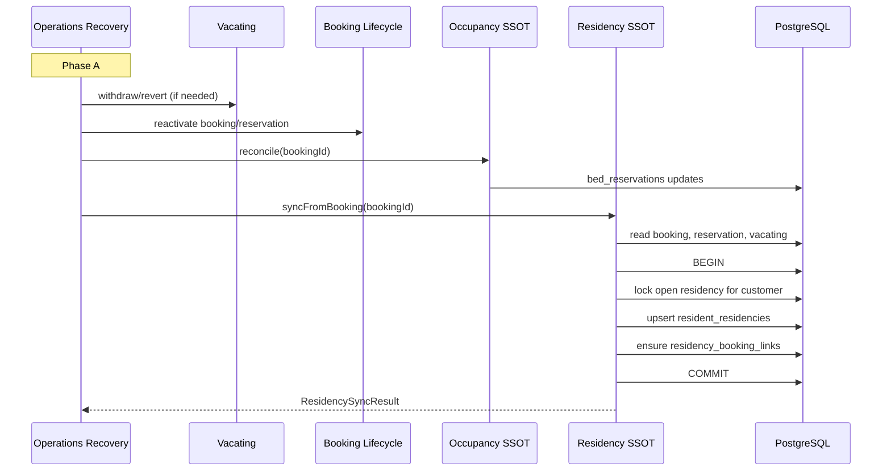

# ADR-OR-004: Residency Sync

| Field | Value |
|-------|-------|
| **Status** | Proposed (dependency gate for Operations Recovery OR-1) |
| **Date** | 2026-08-01 |
| **Owner module** | Residency SSOT |
| **Consumers** | Operations Recovery (Phase A), Booking lifecycle, Portal read paths |
| **Cross-links** | [[ARCHITECTURE]] · `resident_residencies` schema · [[OPERATIONS_RECOVERY]] |

---

## Purpose

Establish **Residency SSOT** as the owner of `resident_residencies` and `residency_booking_links` truth for portal and ops surfaces. Define **`syncFromBooking(bookingId)`** as the single write entry for aligning residency rows with booking/reservation state after lifecycle changes. Operations Recovery **invokes** sync; it **never** UPDATEs residency tables directly.

---

## Scope

### In scope

- Table `resident_residencies` — lifecycle, current booking/bed pointers, expected move-out.
- Table `residency_booking_links` — booking chain within one continuous residency.
- Derivation from: `bookings`, primary `bed_reservations`, active `vacating_requests`, deposit booking pointer rules.
- Portal-facing `currentBookingId`, `currentBedId`, `lifecycle` enum alignment.
- One open residency per customer per PG (partial unique index constraint).

### Out of scope

- Creating new bookings or reservations.
- Deposit ledger or payment state.
- KYC status.
- Resident financial summaries (`residentFinancialEngine`).
- Continuous residency **business policy** for deposit transfer across bookings (read rules only; transfer is separate future ADR).

---

## Ownership

| Artifact | Owner |
|----------|-------|
| `resident_residencies` writes | **Residency SSOT** |
| `residency_booking_links` writes | **Residency SSOT** |
| Residency lifecycle enum semantics | **Residency SSOT** + product policy doc |
| When to call sync | **Callers** (Recovery Phase A, booking lifecycle hooks) |
| Booking/reservation truth | **Booking lifecycle / Occupancy** (Residency reads) |

---

## Responsibilities

1. Implement `syncFromBooking(bookingId): ResidencySyncResult`.
2. Implement `getResidencyForCustomer(customerId, pgId): ResidencyView` (read SSOT for portal).
3. Enforce `resident_residencies_one_open_per_customer` constraint — resolve conflicts explicitly, never silent duplicate open rows.
4. Set `depositBookingId` per continuous residency policy (first booking in chain holding deposit unless overridden by documented transfer).
5. Update `lifecycle`: `onboarding` | `active` | `vacating` | `checkout` | `ended` based on booking + vacating state.
6. Append `residency_booking_links` when booking joins existing open residency.
7. Emit residency domain events for portal cache invalidation.

---

## Explicit non-responsibilities

- Approving payments or invoices.
- Electricity or rent calculations.
- Vacating withdraw/revert (Vacating service) — Residency reacts via sync after vacating changes.
- Recovery orchestration or phased execution.
- Occupancy reconcile (`reconcileBookingOccupancy`) — separate Occupancy SSOT; sync may call reconcile **after** residency write or assume caller order: **Occupancy first, Residency second** (see sequencing).

---

## Public interface / contract

**Service:** `ResidencySsotService`  
**Primary method:** `syncFromBooking(bookingId): ResidencySyncResult`  
**Read method:** `getResidencyForCustomer(customerId, pgId): ResidencyView`  
**API (future):** `POST /residency/v1/sync-from-booking` · `GET /residency/v1/customers/:id`  
**Version:** `X-Residency-Contract-Version: 1`

### `ResidencySyncResult`

| Field | Type | Description |
|-------|------|-------------|
| `ok` | boolean | |
| `outcome` | enum | `created` \| `updated` \| `linked` \| `closed` \| `no_op` \| `conflict` |
| `residencyId` | uuid | |
| `bookingId` | uuid | Input |
| `customerId` | uuid | |
| `pgId` | uuid | |
| `previousState` | ResidencySnapshot | null if created |
| `newState` | ResidencySnapshot | |
| `bookingLinkAction` | enum | `none` \| `created` \| `existing` |
| `errorCode` | string | |
| `errorMessage` | string | |

### `ResidencySnapshot`

| Field | Type | Description |
|-------|------|-------------|
| `lifecycle` | enum | onboarding/active/vacating/checkout/ended |
| `currentBookingId` | uuid | null if ended |
| `currentBedId` | uuid | null if ended |
| `depositBookingId` | uuid | |
| `startedAt` | date | |
| `expectedMoveOut` | date | null if open-ended |
| `endedAt` | date | null if not ended |

### `ResidencyView` (read model)

Same as snapshot plus `bookingChain: uuid[]` ordered by sequence.

---

## Sync rules (normative)

| Booking + reservation + vacating state | Residency lifecycle | currentBookingId | expectedMoveOut |
|----------------------------------------|---------------------|------------------|-----------------|
| confirmed + active reservation, no vacating | `active` | bookingId | null (open-ended) or vacating date if approved notice |
| confirmed + active, vacating approved | `vacating` | bookingId | vacating_date |
| completed / cancelled | `ended` or close open row | null | set endedAt |
| pending_payment onboarding | `onboarding` | bookingId | from booking |
| booking reactivated after mistaken completion | `active` | bookingId | clear expectedMoveOut if open-ended restored |

**depositBookingId:** unchanged on reactivation unless explicit deposit transfer scenario (future); Recovery `deposit_already_held` constraint reads deposit via Billing/Deposits, not residency.

---

## State transitions

### Residency row lifecycle

```
(onboarding) → active → vacating → checkout → ended
                    ↘ ended (cancellation)
```

### syncFromBooking outcomes

```
invoke syncFromBooking
  → compute target snapshot from booking SSOT
  → if matches current: no_op
  → else UPDATE residency
  → ensure booking_link exists
  → return result
```

### Recovery Phase A ordering

```
1. Vacating primitives (if scenario requires)
2. Booking/reservation primitives
3. occupancy.reconcile(bookingId)
4. residency.syncFromBooking(bookingId)   ← this ADR
5. billing.ensureProfile(bookingId)
```

---

## Error handling

| Code | Condition | Recovery behavior |
|------|-----------|-------------------|
| `BOOKING_NOT_FOUND` | Invalid id | Phase A failed |
| `CUSTOMER_MISMATCH` | booking.customerId inconsistent | Phase A failed |
| `OPEN_RESIDENCY_CONFLICT` | Two open residencies would result | Phase A failed; manual merge required |
| `PG_MISMATCH` | booking PG ≠ residency PG | Phase A failed |
| `BED_NOT_IN_BOOKING` | bedId resolution failed | Phase A failed |
| `ALREADY_SYNCED` | Idempotent no_op | Phase A step success |

---

## Idempotency rules

- `syncFromBooking` is **idempotent**: repeated call with unchanged inputs → `no_op` with same snapshot.
- No separate idempotency key required; safe to call on every Phase A completion and booking lifecycle hook.
- Recovery must still log step outcome in `recovery_session_steps`.

---

## Concurrency rules

- Residency service locks `resident_residencies` row for `customerId` (open lifecycle) via `SELECT FOR UPDATE` inside transaction.
- Caller must not hold lock across phases — sync runs inside Phase A transaction only.
- Concurrent sync from Recovery Phase A and booking webhook: second transaction waits; last writer must produce consistent state (booking SSOT wins at commit time).

---

## Versioning strategy

| Item | Strategy |
|------|----------|
| `X-Residency-Contract-Version` | Semver |
| Lifecycle enum | Append-only values |
| Sync rules | Versioned in `residency-sync-rules-v1`; digest in sync result |
| Breaking snapshot shape | v2 API |

---

## Event emission

| Event | Layer | When |
|-------|-------|------|
| `residency.synced` | audit_log | Every successful sync |
| `residency.lifecycle_changed` | audit_log | When lifecycle enum changes |
| `portal.residency.invalidate` | optional cache bus | Post-commit |
| Room OS outbox | **Not in v1** | Portal reads residency SSOT directly |

Property OS may consume residency lifecycle for future KPI "active residents" — deferred.

---

## Interaction with Property OS, Room OS, Operations Recovery

| System | Interaction |
|--------|-------------|
| **Operations Recovery** | Phase A: invoke `syncFromBooking` after occupancy reconcile. Never direct SQL on residency tables. |
| **Booking lifecycle** | Calls sync on confirm, complete, cancel hooks (existing gaps filled by this service). |
| **Portal / Resident hub** | Reads `getResidencyForCustomer` — must match post-recovery state. |
| **Integrity Preflight** | `DUP_RESIDENCY_OPEN` rule reads residency SSOT. |
| **Certification** | Post-recovery validation includes portal residency probe. |
| **Room OS** | Indirect — occupancy events may precede residency sync. |

---

## Sequence diagram



---

## Future evolution

- **`syncFromBookingChain`:** Explicit continuous residency spanning multiple booking IDs.
- **`transferDepositBookingPointer`:** Separate mutation for deposit transfer ADR (not sync default).
- **Residency read model materialized view** for Property OS resident index.
- Hook sync into Room OS projector pipeline via outbox `residency.synced`.

---

## Open questions

1. On mistaken completion reactivation, should `startedAt` change or remain original chain start? **Proposed: remain** (continuous residency).
2. Should `checkout` lifecycle be set automatically when vacating completed, or only on settlement complete?
3. Module folder name: `src/residencySsot/` vs `src/services/residency/` — align with occupancySsot pattern.

---

**Decision:** Residency SSOT owns all writes to `resident_residencies` and `residency_booking_links`. Operations Recovery calls `syncFromBooking` only.
