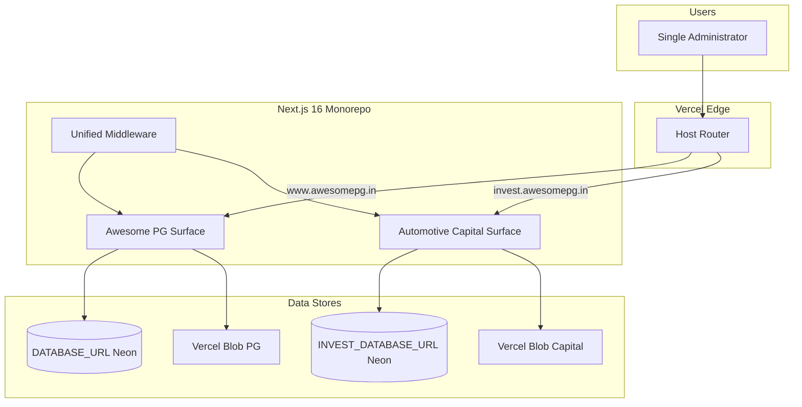
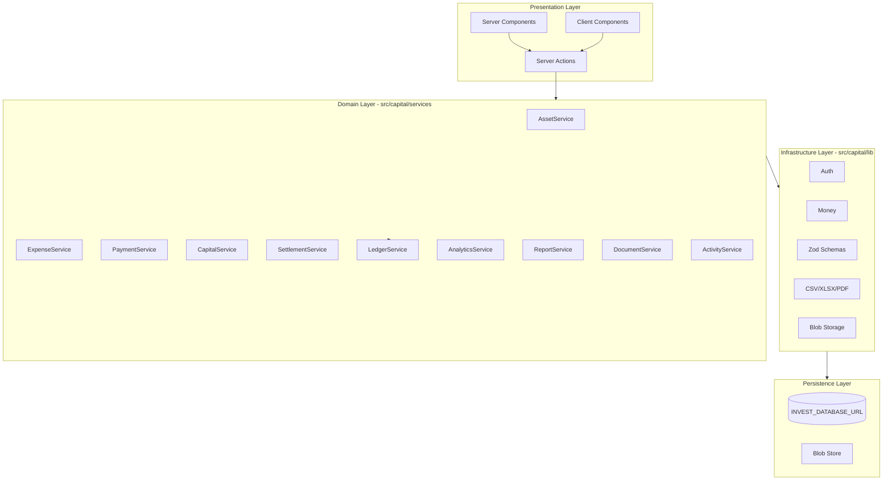
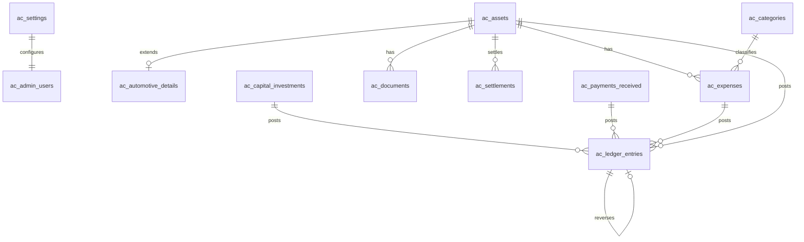

# Architecture — Automotive Capital

## 1. Executive Summary

Automotive Capital is a **host-isolated financial operating system** deployed inside the existing Awesome PG Next.js repository but behaving as a completely separate product. It uses its own Neon database, schema, auth, UI, and business logic. Host-based routing at the edge determines which product surface is served.

Design principle: **Assets first, cars second.** The domain model is built around generic `assets` with type-specific detail tables. Cars are the first `asset_class`. Property, gold, machinery, business investments, and loans extend the same core without schema redesign.

---

## 2. System Context



---

## 3. Host Routing

### 3.1 Host Map

| Host | Product | Root redirect |
|------|---------|---------------|
| `awesomepg.in` | Awesome PG | PG home |
| `www.awesomepg.in` | Awesome PG | PG home |
| `invest.awesomepg.in` | Automotive Capital | `/dashboard` or `/login` |
| `invest.localhost` (dev) | Automotive Capital | same |

### 3.2 Middleware Strategy

Extend [`middleware.ts`](../../middleware.ts) with a **host guard as the first decision**:

```typescript
// Pseudocode — not implementation
const host = request.headers.get('host') ?? '';
const isCapitalHost = isCapitalHostname(host);

if (isCapitalHost) {
  return capitalMiddleware(request);  // NEW — all Capital logic here
}
// Existing PG middleware unchanged below this line
```

**Capital middleware responsibilities:**

1. Block PG paths (`/admin`, `/account`, `/booking`, `/pgs`, etc.) → 404
2. Protect Capital paths → require `ac_session` cookie
3. Allow `/login` when unauthenticated
4. Redirect `/` → `/dashboard` (auth) or `/login` (no auth)
5. Attach monitoring headers (reuse `attachMonitoringHeaders` pattern)
6. Set `x-capital-app: 1` request header for layout detection

**PG middleware responsibilities (unchanged):**

- Existing customer/admin auth gates
- Existing matcher paths
- No awareness of Capital routes

### 3.3 Route Group Isolation

Capital routes live in `app/(capital)/`:

```
app/(capital)/
  layout.tsx          # Capital shell — nav, metadata, theme
  login/page.tsx
  dashboard/page.tsx
  assets/
  expenses/
  payments/
  ledger/
  documents/
  reports/
  analytics/
  settings/
  activity/
```

Capital paths are served at the **root** on `invest.awesomepg.in` (not `/capital/...`). Internal route group name is organizational only.

---

## 4. Module Architecture



### 4.1 Layer Rules

| Layer | Location | May import |
|-------|----------|------------|
| Routes | `app/(capital)/` | `src/capital/actions`, `src/capital/components` |
| Actions | `src/capital/actions/` | `src/capital/services`, `src/capital/lib` |
| Services | `src/capital/services/` | `src/capital/db`, `src/capital/lib` |
| Lib | `src/capital/lib/` | Generic shared utils only |
| Components | `src/capital/components/` | `src/capital/lib`, actions via props |

**Forbidden imports:**

- `src/capital/**` → `src/services/**` (PG business logic)
- `src/capital/**` → `src/db/schema/**` (PG schema)
- `src/capital/**` → `src/components/admin/**` or `customer/**`

Enforce via ESLint `no-restricted-imports` rule.

### 4.2 Ledger as Single Source of Financial Truth

All monetary mutations flow through `LedgerService`:

```
CapitalService.create()  ──┐
ExpenseService.create()  ──┤
PaymentService.create()  ──┼──► LedgerService.post() ──► ac_ledger_entries
SettlementService.create() ─┤
AssetService.recordSale() ─┘
```

UI "edit" and "delete" operations create **reversal entries**, never `DELETE` from ledger.

Cached aggregates on `ac_assets` and portfolio summary tables are **derived** and rebuildable from ledger + detail tables.

---

## 5. Domain Model

### 5.1 Core Entities



### 5.2 Asset Lifecycle

```
Capital Invested
      ↓
Asset Purchased (status: purchased)
      ↓
Expenses Accrued (repairing → painting → ready → listed)
      ↓
Asset Sold (status: sold)
      ↓
Payments Received (partial or full, over time)
      ↓
Settlement Complete (status: settled)
```

Cancelled assets remain in history with reversal ledger entries.

### 5.3 Future Asset Classes

| `asset_class` | Detail table | Notes |
|---------------|--------------|-------|
| `automotive` | `ac_automotive_details` | Phase 1 |
| `property` | `ac_property_details` | Phase N |
| `gold` | `ac_gold_details` | Phase N |
| `machinery` | `ac_machinery_details` | Phase N |
| `business` | `ac_business_details` | Phase N |
| `loan` | `ac_loan_details` | Phase N |

All financial tables reference `asset_id` (nullable for portfolio-level events). Expense categories and payment types remain shared.

---

## 6. Technology Stack

| Concern | Choice | Notes |
|---------|--------|-------|
| Framework | Next.js 16 App Router | Shared build with PG |
| Language | TypeScript 5 | Strict mode |
| Styling | Tailwind CSS v4 | Separate token file |
| Components | shadcn/ui + Radix | New install under `src/capital/components/ui` |
| ORM | Drizzle ORM | Independent schema + migrations |
| Database | Neon PostgreSQL | `INVEST_DATABASE_URL` |
| Auth | Custom DB sessions | Pattern from PG `auth_sessions`; separate tables |
| Forms | React Hook Form + Zod | |
| Charts | Recharts | Lazy-loaded |
| Storage | Vercel Blob | Separate token recommended |
| Motion | Framer Motion | Already in repo |
| Export | exceljs + pdf-lib | pdf-lib already in repo |
| Testing | Node test runner + Playwright | Capital-specific test dirs |
| Monitoring | Sentry | Shared integration, separate tags |

### 6.1 Dependencies to Add

```
zod
react-hook-form
@hookform/resolvers
recharts
@radix-ui/react-* (via shadcn)
class-variance-authority
clsx
tailwind-merge
lucide-react
cmdk
exceljs
```

### 6.2 Reusable from Awesome PG (copy/adapt, not import)

| Source | Target | Adaptation |
|--------|--------|------------|
| `src/db/client.ts` | `src/capital/db/client.ts` | `INVEST_DATABASE_URL`, `__capitalDb` global key |
| `src/lib/db/env.ts` | `src/capital/lib/db/env.ts` | Single env key resolver |
| `src/lib/db/connectionOptions.ts` | `src/capital/lib/db/connectionOptions.ts` | `application_name: capital-*` |
| `src/lib/auth/crypto.ts` | `src/capital/lib/auth/crypto.ts` | Direct copy |
| `src/lib/auth/password.ts` | `src/capital/lib/auth/password.ts` | Direct copy |
| `src/lib/auth/loginRateLimit.ts` | `src/capital/lib/auth/loginRateLimit.ts` | Capital login path |
| `src/lib/storage/blob.ts` | `src/capital/lib/storage/blob.ts` | `capital/` path prefix |
| `src/lib/monitoring/requestContext.ts` | Reuse via import | Generic, no PG coupling |
| `middleware.ts` `attachMonitoringHeaders` | Extract or duplicate | Generic |

---

## 7. Database Architecture

See [DATABASE.md](./DATABASE.md) for full DDL.

Key decisions:

- Money: `bigint` paise (signed where appropriate)
- Timestamps: `timestamptz`
- IDs: UUID v4 (`gen_random_uuid()`)
- Soft delete: **none** for financial tables; use `status = cancelled` + reversals
- Migrations: `src/capital/db/migrations/` with `capital/drizzle.config.ts`
- Scripts: `capital:db:generate`, `capital:db:migrate`, `capital:db:seed`

Build integration: extend `scripts/vercel-build.sh` to run Capital migrations when `INVEST_DATABASE_URL` is set.

---

## 8. Authentication Architecture

Single administrator model:

1. Seed creates one row in `ac_admin_users` from `INVEST_ADMIN_EMAIL` + `INVEST_ADMIN_PASSWORD` (env vars, never in source)
2. Login: email + password → bcrypt verify → create `ac_auth_sessions` row → set `ac_session` httpOnly cookie
3. Session validation on every protected Server Action and page
4. No signup, no forgot password, no OAuth
5. Logout: revoke session row + clear cookie

Cookie attributes: `httpOnly`, `secure` (prod), `sameSite=lax`, `path=/`, host-scoped to invest domain.

---

## 9. Caching Strategy

| Data | Strategy | TTL |
|------|----------|-----|
| Settings singleton | `React.cache()` per request | Request |
| Dashboard KPIs | `unstable_cache` | 60s |
| Chart series | `unstable_cache` | 60s |
| Asset list (paginated) | No cache | — |
| Search index | DB query + indexes | — |

Invalidate dashboard cache on any financial mutation via `revalidateTag('capital-dashboard')`.

---

## 10. File Storage

Documents stored in Vercel Blob with path convention:

```
capital/documents/{asset_id}/{document_type}/{uuid}.{ext}
capital/settings/logo.{ext}
```

Never expose private blob URLs in ``. Use authenticated proxy route `/api/capital/files/[id]`.

---

## 11. PWA Architecture

Capital-specific assets (PG manifest untouched):

```
public/capital/manifest.webmanifest
public/capital/sw.js
public/capital/icons/icon-192.png
public/capital/icons/icon-512.png
public/capital/splash/
```

Capital layout links manifest. Service worker caches offline shell (login + dashboard skeleton). No web push in Phase 1.

---

## 12. Observability

- Sentry: tag events with `product: capital`
- Structured logs: `[capital]` prefix
- Activity log: all user actions in `ac_activity_log`
- Request ID: propagated via `x-request-id` header

---

## 13. Deployment

Single Vercel project, multiple domains:

1. Add `invest.awesomepg.in` domain in Vercel dashboard
2. Set `INVEST_DATABASE_URL` and Capital env vars
3. Build runs both PG and Capital migrations (Capital skipped if env unset)
4. No Capital crons in Phase 1

---

## 14. Testing Strategy

```
tests/capital/unit/        # Ledger, money, ROI, reversals
tests/capital/integration/ # Auth, asset lifecycle
tests/capital/e2e/         # Login → dashboard smoke
```

PG test suite must remain green after every Capital change.

---

## 15. Non-Goals (Phase 1)

- Multi-user / roles
- Mobile native apps
- Dealer portal
- Bank feed integration
- AI insights
- Real-time collaboration
- Web push notifications
