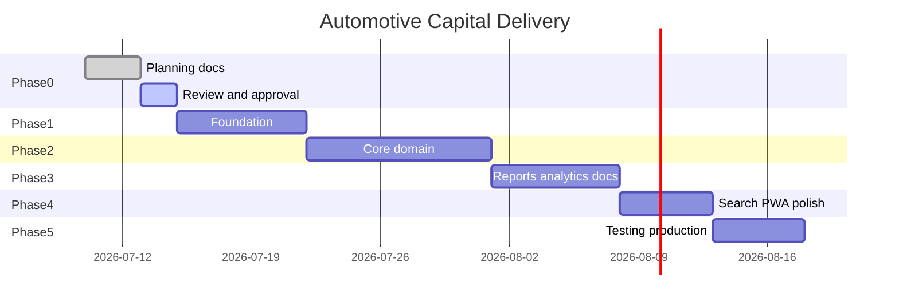

# Roadmap — Automotive Capital

Phased delivery plan from planning through production.

---

## Overview

Timelines are estimates for a single developer working full-time.

---

## Phase 0 — Planning & Approval

**Goal:** Complete system design before any code.

**Deliverables:**
- [x] All 13 planning documents in `docs/automotive-capital/`
- [ ] Architecture review
- [ ] Database schema review
- [ ] Security review
- [ ] Approval to proceed

**Exit criteria:** All docs complete, no open architectural questions, PG isolation verified in design.

---

## Phase 1 — Foundation

**Goal:** Runnable shell on `invest.awesomepg.in` with auth and empty dashboard.

### Week 1

| Day | Focus |
|-----|-------|
| 1 | Scaffolding: directory structure, drizzle config, env vars, npm scripts |
| 2 | Database: schema, migration, seed, client |
| 3 | Host routing: middleware extension, host guard tests |
| 4 | Auth: session, login/logout, rate limiting |
| 5 | Design system: tokens, shadcn init, layouts, login page |
| 6 | Dashboard shell: KPI cards with real aggregate queries |
| 7 | Buffer / integration testing with PG coexistence |

**Exit criteria:**
- `invest.localhost:3000/login` works
- Admin can log in and see dashboard with KPI data
- PG on `localhost:3000` completely unaffected
- Capital migrations run independently

---

## Phase 2 — Core Domain

**Goal:** Full asset lifecycle with expenses, payments, capital, and ledger.

### Week 2–3

| Focus | Features |
|-------|----------|
| Ledger engine | Post, reverse, integrity check |
| Assets | CRUD, status workflow, sale, cancel |
| Expenses | Create, reverse, recalculate |
| Payments | Create, split, reverse, outstanding |
| Capital | Create, reverse |
| Settlements | Profit sharing, status → settled |
| Activity log | All mutations logged |
| Asset detail | Timeline, tabs, inline actions |

**Exit criteria:**
- Complete workflow from [WORKFLOWS.md §18](./WORKFLOWS.md) works end-to-end
- Every financial action has ledger entry
- Reversals work correctly
- Asset detail page is functional command center

---

## Phase 3 — Reports, Analytics, Documents

**Goal:** Full visibility, document management, and export capabilities.

### Week 4

| Focus | Features |
|-------|----------|
| Documents | Upload, proxy, gallery |
| Reports | 9 report types, 3 export formats |
| Analytics | 8 charts, smart insights |
| Ledger UI | Explorer page, asset-scoped view |
| Dashboard | Wire charts and insights |

**Exit criteria:**
- All dashboard questions from FEATURES.md answered
- Reports export correctly in Excel, CSV, PDF
- Documents upload and view securely

---

## Phase 4 — Search, PWA, Polish

**Goal:** Premium UX and mobile-native feel.

### Week 5

| Focus | Features |
|-------|----------|
| Search | Global search, typeahead |
| Command palette | Cmd+K, shortcuts |
| UX polish | Optimistic updates, undo, autosave, skeletons, animations |
| Settings | Business config, categories |
| PWA | Manifest, service worker, icons, splash |

**Exit criteria:**
- App installable on phone
- Cmd+K works for nav and actions
- All pages have loading/empty/error states
- Feels like Stripe/Linear quality

---

## Phase 5 — Testing & Production

**Goal:** Production deployment with confidence.

### Week 6

| Focus | Features |
|-------|----------|
| Unit tests | Ledger, money, ROI, auth |
| Integration tests | Asset lifecycle, settlement |
| E2E tests | Login, dashboard, asset flow |
| Production | Vercel domain, env vars, migration |
| Regression | PG test suite green |

**Exit criteria:**
- All tests pass in CI
- `invest.awesomepg.in` live in production
- Admin account seeded
- PG production unaffected
- Security checklist complete

---

## Post-Launch (Future Phases)

### Phase 6 — Enhancements
- Change password in settings
- Password rotation reminder
- Data import from spreadsheet
- Bulk expense entry

### Phase 7 — Additional Asset Classes
- Property investments UI
- Gold investments UI
- Schema tables already designed

### Phase 8 — Advanced Analytics
- Cash flow forecasting model
- Manufacturer trend analysis
- Portfolio comparison views

### Phase 9 — Integrations
- Bank statement import (CSV)
- WhatsApp payment reminders
- Email report delivery

---

## Milestones

| Milestone | Phase | Definition of Done |
|-----------|-------|-------------------|
| M0: Planning complete | 0 | All docs approved |
| M1: Login works | 1 | Admin can authenticate on invest host |
| M2: First asset tracked | 2 | Create car with expenses and ledger |
| M3: First payment recorded | 2 | Payment with split and outstanding calc |
| M4: Full lifecycle | 2 | Buy → repair → sell → pay → settle |
| M5: Reports export | 3 | PDF/Excel/CSV download works |
| M6: Premium UX | 4 | Cmd+K, PWA, animations |
| M7: Production live | 5 | invest.awesomepg.in deployed |

---

## Dependencies

| Dependency | Required by | Status |
|------------|-------------|--------|
| Neon database (Invest) | Phase 1 | Not created |
| Vercel domain config | Phase 5 | Not configured |
| Vercel Blob token (Capital) | Phase 3 | Optional shared |
| Env vars on Vercel | Phase 5 | Not set |
| Planning approval | Phase 1 | Pending |

---

## Risk to Timeline

See [RISKS.md](./RISKS.md) for full register. Top risks:

1. PG middleware regression — mitigated by host guard isolation
2. Schema changes mid-build — mitigated by completing planning first
3. shadcn setup complexity — mitigated by dedicated component dir
