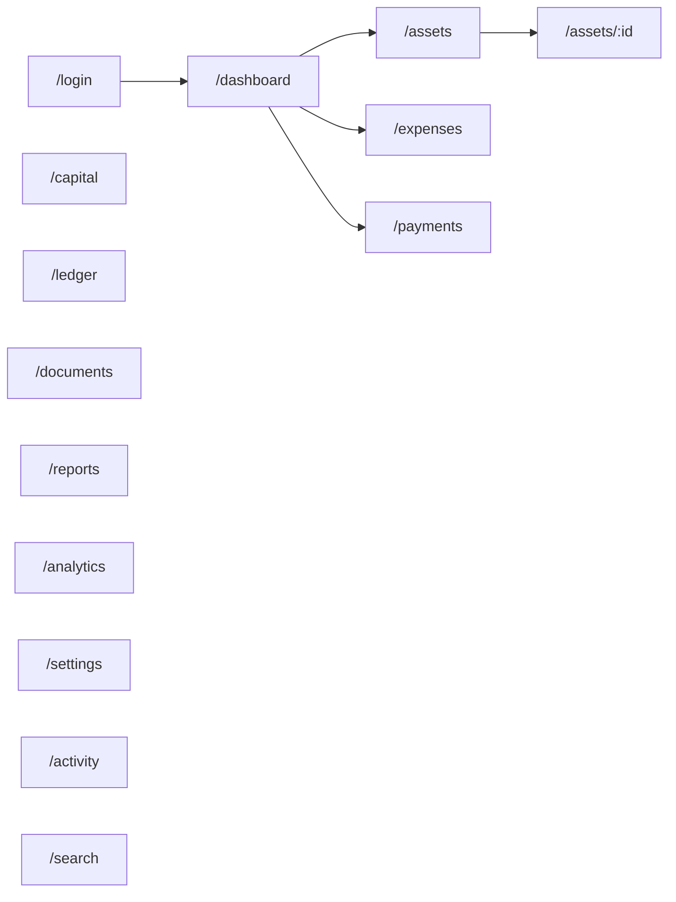

# Routes — Automotive Capital

All routes below are served on **`invest.awesomepg.in`** at the root path. They are **not accessible** on `www.awesomepg.in` (middleware returns 404).

Route group: `app/(capital)/`

---

## 1. Route Map



---

## 2. Public Routes

| Path | Component | Auth | Description |
|------|-----------|------|-------------|
| `/login` | `app/(capital)/login/page.tsx` | None | Email + password login |
| `/api/capital/auth/login` | Route handler | None | POST login (alternative to Server Action) |
| `/api/capital/auth/logout` | Route handler | Session | POST logout |

**Redirects:**

| Condition | From | To |
|-----------|------|-----|
| Unauthenticated | any protected path | `/login?next={path}` |
| Authenticated | `/login` | `/dashboard` |
| Authenticated | `/` | `/dashboard` |
| Unauthenticated | `/` | `/login` |

---

## 3. Protected Routes — Core Modules

| Path | Page | Description |
|------|------|-------------|
| `/dashboard` | Dashboard | KPI cards, charts, smart insights |
| `/assets` | Asset list | Searchable, filterable car inventory |
| `/assets/new` | Create asset | New automotive asset form |
| `/assets/[id]` | Asset command center | Timeline, expenses, docs, payments, ledger |
| `/assets/[id]/edit` | Edit asset | Inline/edit form |
| `/expenses` | Expense list | Cross-asset expense view |
| `/expenses/new` | Create expense | Quick add expense |
| `/payments` | Payment list | All payments received |
| `/payments/new` | Record payment | Payment entry form |
| `/capital` | Capital investments | Capital injection history |
| `/capital/new` | Add capital | New investment entry |
| `/ledger` | Ledger explorer | Immutable financial history |
| `/documents` | Document library | All uploaded files |
| `/reports` | Reports hub | Report type selector |
| `/reports/monthly` | Monthly report | |
| `/reports/quarterly` | Quarterly report | |
| `/reports/yearly` | Yearly report | |
| `/reports/lifetime` | Lifetime report | |
| `/reports/investment` | Investment report | |
| `/reports/outstanding` | Outstanding report | |
| `/reports/cash-flow` | Cash flow report | |
| `/reports/roi` | ROI report | |
| `/reports/profit-loss` | P&L report | |
| `/analytics` | Analytics deep dive | Extended charts and comparisons |
| `/settings` | Settings | Business config, categories, theme |
| `/activity` | Activity log | Audit trail |
| `/search` | Global search | Full-text search results |

---

## 4. API Routes

| Method | Path | Purpose |
|--------|------|---------|
| POST | `/api/capital/auth/login` | Authenticate |
| POST | `/api/capital/auth/logout` | Revoke session |
| GET | `/api/capital/files/[id]` | Authenticated document proxy |
| GET | `/api/capital/export/[type]` | Generate export (CSV/XLSX/PDF) |
| GET | `/api/capital/health` | Health check (DB connectivity) |
| GET | `/api/capital/search` | Typeahead search endpoint |

All API routes validate `ac_session` cookie. Rate limited.

---

## 5. Layouts

### 5.1 Root Capital Layout

`app/(capital)/layout.tsx`

- Capital metadata (title, description, OG)
- Capital favicon (`/capital/icons/favicon.ico`)
- Capital manifest link
- Dark theme class on `<html>`
- Font loading (Geist / Inter)
- No PG nav, no PG footer, no PG analytics

### 5.2 Auth Layout

`app/(capital)/login/layout.tsx`

- Full-screen gradient mesh background
- No sidebar
- Centered glass card

### 5.3 App Shell Layout

`app/(capital)/(app)/layout.tsx` (nested group for authenticated pages)

```
┌─────────────────────────────────────────────────────┐
│ TopBar: Logo | Search | QuickAdd | Cmd+K | Profile  │
├──────────┬──────────────────────────────────────────┤
│ Sidebar  │ Main content area                        │
│ Nav      │                                          │
│          │                                          │
│ Dashboard│                                          │
│ Assets   │                                          │
│ Expenses │                                          │
│ Payments │                                          │
│ Capital  │                                          │
│ Ledger   │                                          │
│ Documents│                                          │
│ Reports  │                                          │
│ Analytics│                                          │
│ Settings │                                          │
│ Activity │                                          │
└──────────┴──────────────────────────────────────────┘
```

Mobile: sidebar collapses to bottom tab bar.

---

## 6. Navigation Structure

| Label | Path | Icon | Shortcut |
|-------|------|------|----------|
| Dashboard | `/dashboard` | LayoutDashboard | `G D` |
| Assets | `/assets` | Car | `G A` |
| Expenses | `/expenses` | Receipt | `G E` |
| Payments | `/payments` | Banknote | `G P` |
| Capital | `/capital` | TrendingUp | `G C` |
| Ledger | `/ledger` | BookOpen | `G L` |
| Documents | `/documents` | FileText | `G O` |
| Reports | `/reports` | FileBarChart | `G R` |
| Analytics | `/analytics` | LineChart | `G N` |
| Settings | `/settings` | Settings | `G S` |
| Activity | `/activity` | History | `G H` |

`G` = `Cmd/Ctrl` then key (Linear-style).

---

## 7. Server Actions

All actions in `src/capital/actions/`. Every action calls `requireCapitalAuth()` first.

### 7.1 Auth

| Action | Input | Effect |
|--------|-------|--------|
| `loginAction` | email, password | Create session, redirect |
| `logoutAction` | — | Revoke session, redirect |

### 7.2 Assets

| Action | Input | Effect |
|--------|-------|--------|
| `createAssetAction` | AssetFormData | Create asset + automotive details + ledger |
| `updateAssetAction` | id, partial | Update fields, log activity |
| `updateAssetStatusAction` | id, status | Status transition + activity |
| `recordSaleAction` | id, salePrice, saleDate | Set sale fields, update status |
| `cancelAssetAction` | id, reason | Cancel + reversals |
| `deleteAssetDraftAction` | draftKey | Clear autosave |

### 7.3 Expenses

| Action | Input | Effect |
|--------|-------|--------|
| `createExpenseAction` | ExpenseFormData | Expense + ledger + recalc asset |
| `reverseExpenseAction` | id, reason | Reversal entry + mark reversed |

### 7.4 Payments

| Action | Input | Effect |
|--------|-------|--------|
| `createPaymentAction` | PaymentFormData | Payment + ledger + recalc |
| `reversePaymentAction` | id, reason | Reversal |

### 7.5 Capital

| Action | Input | Effect |
|--------|-------|--------|
| `createCapitalInvestmentAction` | CapitalFormData | Investment + ledger |

### 7.6 Settlements

| Action | Input | Effect |
|--------|-------|--------|
| `createSettlementAction` | assetId | Settlement snapshot + status → settled |

### 7.7 Documents

| Action | Input | Effect |
|--------|-------|--------|
| `uploadDocumentAction` | file, metadata | Blob upload + DB row |
| `deleteDocumentAction` | id | Soft metadata delete (blob retained) |

### 7.8 Settings

| Action | Input | Effect |
|--------|-------|--------|
| `updateSettingsAction` | partial settings | Update singleton |
| `updateCategoryAction` | id, label | Custom category edit |
| `createCategoryAction` | slug, label | Custom category |

### 7.9 Drafts

| Action | Input | Effect |
|--------|-------|--------|
| `saveDraftAction` | key, payload | Upsert draft |
| `loadDraftAction` | key | Return payload |

### 7.10 Exports

| Action | Input | Effect |
|--------|-------|--------|
| `exportReportAction` | type, format, params | Generate file, log activity |

---

## 8. Metadata

### 8.1 Default

```typescript
export const metadata = {
  title: 'Automotive Capital',
  description: 'Private Automotive Investment Operating System',
  applicationName: 'Automotive Capital',
  manifest: '/capital/manifest.webmanifest',
  icons: { icon: '/capital/icons/favicon.ico' },
  appleWebApp: { capable: true, title: 'Auto Capital' },
};
```

### 8.2 Per-Page Examples

| Page | Title |
|------|-------|
| Dashboard | `Dashboard · Automotive Capital` |
| Asset detail | `{Registration} · Assets · Automotive Capital` |
| Login | `Sign In · Automotive Capital` |

No "Awesome PG" in any title, meta, or OG tag.

---

## 9. Middleware Matcher (Capital Extension)

Add to middleware config:

```typescript
// Capital paths — only evaluated on invest host
const CAPITAL_PROTECTED = [
  '/dashboard', '/assets', '/expenses', '/payments',
  '/capital', '/ledger', '/documents', '/reports',
  '/analytics', '/settings', '/activity', '/search',
];
const CAPITAL_PUBLIC = ['/login', '/api/capital/auth/login'];
```

PG matcher unchanged. Capital matcher additive.

---

## 10. Error Pages

| Path | Page |
|------|------|
| `app/(capital)/not-found.tsx` | Capital-branded 404 |
| `app/(capital)/error.tsx` | Capital-branded error boundary |

---

## 11. Blocked on PG Host

If any Capital route is accidentally accessed on `www.awesomepg.in`:

→ `404 Not Found` (not redirect to invest — avoids leaking product existence)

---

## 12. Blocked on Capital Host

PG routes on `invest.awesomepg.in`:

| PG Path pattern | Response |
|-----------------|----------|
| `/admin/*` | 404 |
| `/account/*` | 404 |
| `/booking/*` | 404 |
| `/pgs/*` | 404 |
| `/login` (PG customer) | 404 — Capital has its own `/login` |
