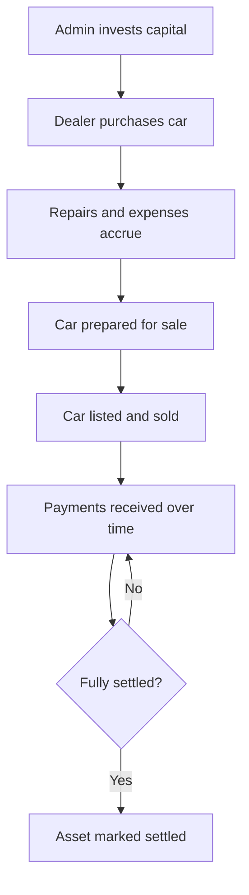
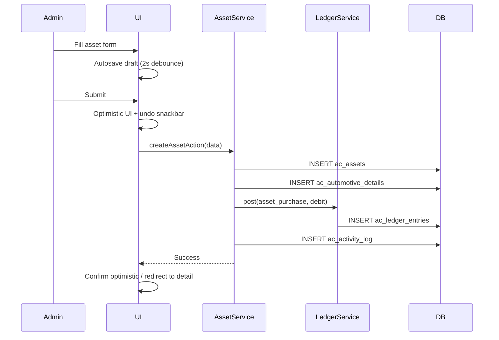
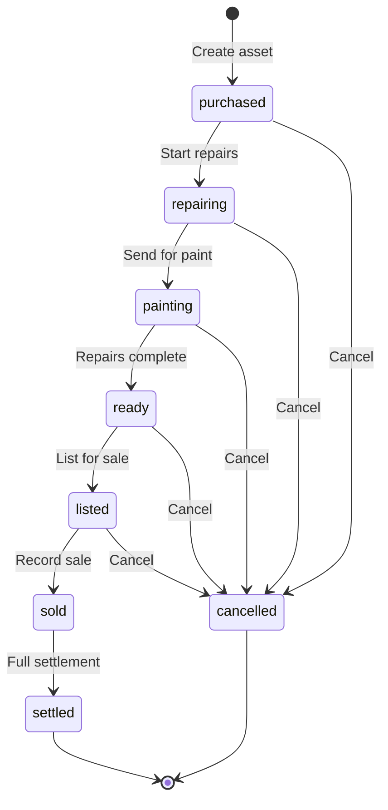
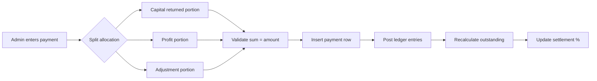
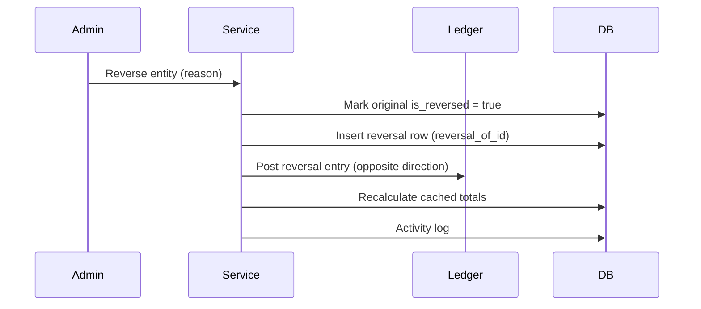
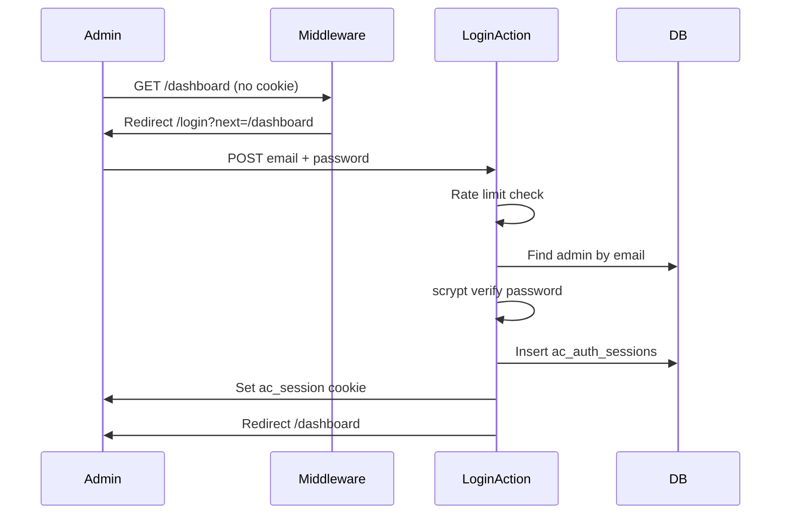

# Workflows — Automotive Capital

End-to-end business flows and state machines.

---

## 1. Investment Lifecycle (Macro)



Every step creates ledger entries. Nothing is deleted.

---

## 2. Capital Investment Flow

### 2.1 Steps

1. Admin navigates to `/capital/new`
2. Enters: date, amount, payment mode, reference, notes
3. Submits form
4. System:
   - Inserts `ac_capital_investments` row
   - Posts ledger entry (`capital_investment`, debit)
   - Logs activity (`capital_invested`)
   - Revalidates dashboard cache
5. Dashboard "Total Capital Invested" updates

### 2.2 Reversal

1. Admin clicks "Reverse" on capital entry
2. Confirmation dialog with reason
3. System:
   - Creates reversal capital investment row (`reversal_of_id` set)
   - Posts reversal ledger entry
   - Marks original `is_reversed = true`
   - Logs activity

---

## 3. Asset Purchase Flow

### 3.1 Create Asset



### 3.2 Validation Rules

- Registration number required and unique
- Purchase price > 0
- Purchase date not in future
- Year between 1990 and current year + 1
- Manufacturer and model required

---

## 4. Asset Status State Machine



### Transition Rules

| From | To | Side effects |
|------|----|--------------|
| any → sold | Requires `actual_sale_price` and `sale_date` |
| sold → settled | Requires settlement record + 100% settlement % |
| any → cancelled | Requires reason; reversal entries for all financial data |

Invalid transitions return error. No backward transitions except cancel.

---

## 5. Expense Flow

### 5.1 Add Expense to Asset

1. From asset detail → Expenses tab → "Add expense"
2. Fill: date, category, vendor, amount, description, payment method, bill, notes
3. Submit
4. System:
   - Insert `ac_expenses`
   - Upload bill to blob (if provided)
   - Post ledger entry (`expense`, debit)
   - Recalculate asset: `total_expense_paise`, `total_investment_paise`, `profit_paise`, `roi_bps`
   - Add timeline event
   - Log activity

### 5.2 Expense Impact on Metrics

```
Before: total_investment = purchase_price + existing_expenses
After:  total_investment = purchase_price + existing_expenses + new_expense
        profit = sale_price - total_investment (if sold)
        roi = profit / total_investment
```

---

## 6. Sale Flow

### 6.1 Record Sale

1. Admin on asset detail → "Record sale"
2. Enter **sale price + sale date only** (vehicle must be fully funded: stakes = Net Vehicle Cost)
3. System auto-calculates:
   - Net Vehicle Cost, Business Profit
   - Sufii (operating partner) share from Settings ratio (default 50%)
   - Investor Pool → each capital investor by stake %
   - Business ROI, My ROI
   - Update `ac_assets` + `ac_asset_investors`; status → `sold`
4. Timeline + activity + dashboard KPIs update

### 6.2 Post-Sale

Asset remains in `sold` status until all money is received and settlement is formalized.

---

## 7. Payment Received Flow

### 7.1 Record Payment



### 7.2 Payment Types

| Type | Effect on outstanding |
|------|----------------------|
| `capital_returned` | Reduces capital outstanding |
| `profit` | Reduces profit pending |
| `adjustment` | Corrects previous allocation |
| `refund` | Money returned to dealer (increases outstanding) |

### 7.3 Installment Pattern

Multiple small payments over time:

```
Sale price: ₹5,00,000
Investment: ₹4,20,000

Payment 1: ₹1,00,000 (₹80,000 capital + ₹20,000 profit)
Payment 2: ₹50,000 (₹50,000 capital)
Payment 3: ₹2,00,000 (₹1,40,000 capital + ₹60,000 profit)
...

Settlement % = (total received / total investment) × 100
```

---

## 8. Settlement Flow

### 8.1 Formal Settlement

When all money is received:

1. Admin clicks "Mark as settled" on sold asset
2. System verifies: `settlement_pct >= 100%` (or admin override with reason)
3. Creates `ac_settlements` row with snapshot:
   - Total investment
   - Total received
   - Gross profit
   - Admin share (per profit ratio)
   - Partner share
4. Posts settlement ledger entry
5. Status → `settled`
6. Timeline event + activity log

### 8.2 Profit Sharing (vehicle sales)

```
operating_partner_share = business_profit × (settings.numerator / settings.denominator)  -- Sufii
investor_pool = business_profit − operating_partner_share
each_investor = investor_pool × (invested / total_invested)
```

Default Settings: 50/50 (numerator=1, denominator=2). Settlement snapshots use stored shares.

---

## 9. Reversal Workflow (Universal)

All corrections follow this pattern:



**Never:**
- DELETE from `ac_ledger_entries`
- UPDATE amount on existing ledger entry
- Hard delete expenses, payments, or capital records

---

## 10. Document Upload Flow

1. Admin selects file (drag-drop or picker)
2. Client validates size and MIME type
3. Server Action:
   - Upload to Vercel Blob (`capital/documents/{asset_id}/...`)
   - Insert `ac_documents` row
   - Activity log
4. UI shows thumbnail in document grid
5. View: authenticated proxy serves file

---

## 11. Report Generation Flow

1. Admin selects report type + date range
2. Chooses format (Excel, CSV, PDF)
3. `ReportService` queries aggregated data
4. Generates file in memory
5. Returns download response
6. Activity log: `export_generated` with params

---

## 12. Search Flow

1. Admin types in search bar or Cmd+K
2. Debounced query (300ms) to `SearchService`
3. SQL full-text search across:
   - `ac_automotive_details.registration_number`
   - `ac_automotive_details.manufacturer`, `model`
   - `ac_assets.notes`, `display_name`
   - `ac_assets.status`, `year`
4. Results returned grouped by entity type
5. Click → navigate to entity

---

## 13. Login Flow



---

## 14. Dashboard Refresh Flow

On any financial mutation:

1. Service completes transaction
2. Calls `revalidateTag('capital-dashboard')`
3. Calls `revalidateTag('capital-analytics')`
4. Asset-specific: `revalidatePath('/assets/[id]')`
5. Next dashboard load fetches fresh aggregates

---

## 15. Autosave Draft Flow

1. User types in form
2. Client debounces 2 seconds
3. `saveDraftAction({ key, payload })` upserts `ac_drafts`
4. On page load: `loadDraftAction(key)` pre-fills form
5. On successful submit: `deleteAssetDraftAction(key)`

---

## 16. Optimistic Update + Undo Flow

1. User submits action
2. UI immediately shows result (optimistic)
3. Toast: "Expense added" with "Undo" button (5s timer)
4. Server Action runs in background
5. If success: toast dismisses
6. If user clicks Undo: reversal action called
7. If server error: rollback optimistic state + error toast

---

## 17. Cancel Asset Flow

1. Admin selects "Cancel" on asset (not sold/settled)
2. Enters cancellation reason
3. System:
   - Reverses all expenses (ledger reversals)
   - Reverses purchase ledger entry
   - Sets `status = cancelled`, `cancelled_at`, `cancel_reason`
   - Asset remains visible in list (filtered by default)
   - Timeline shows cancellation event

---

## 18. End-to-End Example

**Scenario:** Buy a 2019 Honda City, repair it, sell it, receive payments in installments.

| Step | Action | Ledger | Asset state |
|------|--------|--------|-------------|
| 1 | Invest ₹10,00,000 capital | capital_investment debit ₹10L | — |
| 2 | Buy car for ₹3,50,000 | asset_purchase debit ₹3.5L | purchased |
| 3 | Engine repair ₹25,000 | expense debit ₹25K | repairing |
| 4 | Painting ₹15,000 | expense debit ₹15K | painting |
| 5 | Insurance ₹8,000 | expense debit ₹8K | ready |
| 6 | List car | — | listed |
| 7 | Sell for ₹4,50,000 | — | sold |
| 8 | Receive ₹2,00,000 (₹1.5L capital + ₹50K profit) | payment credit | sold, 44% settled |
| 9 | Receive ₹1,98,000 (₹1.48L capital + ₹50K profit) | payment credit | sold, 88% settled |
| 10 | Receive ₹50,000 (₹50K profit) | payment credit | sold, 100% settled |
| 11 | Mark settled | settlement credit | settled |

**Final numbers:**
- Total investment: ₹3,98,000
- Sale price: ₹4,50,000
- Gross profit: ₹52,000
- Admin share (50%): ₹26,000
- Partner share: ₹26,000
