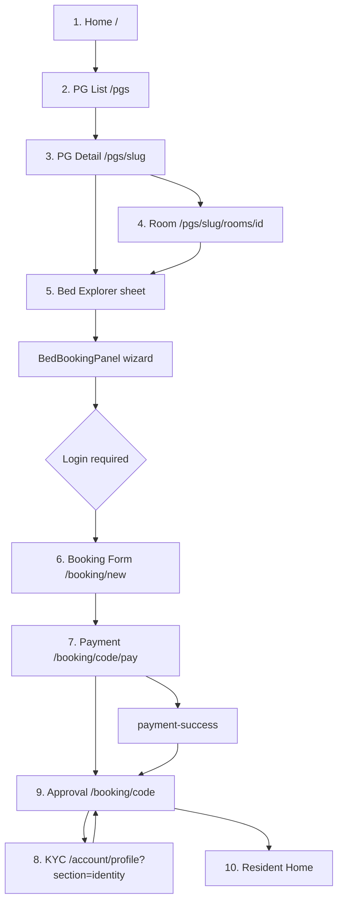

# H9 Booking Conversion Audit

**Scope:** Visitor journey from marketing home through resident home.  
**Method:** Code and copy audit only — no redesign, no implementation.  
**Date:** June 2026

---

## Executive summary — biggest conversion killers (ranked)

| Rank | Killer | Where it hits | Why it loses bookings |
|------|--------|---------------|------------------------|
| **1** | **“Reserve” means three different things** | Bed sheet, cart footnote, checkout | Available bed CTA is **“Reserve this bed”** (start booking). Separate product is **“Reserve early (50% rent)”**. Cart tries to disambiguate in a footnote. Users who want to book today may think they are only “holding” — or reserve-holders may think they booked. |
| **2** | **Login wall after bed selection** | `/booking/new` | `requireCustomerSession` redirects to login only after stay type, dates, and bed are chosen. High-intent users hit auth with no account — classic drop-off. |
| **3** | **Two parallel browse paths with different UX** | PG detail vs room page | Path A (PG detail, `max-w-lg`): no `BookingFlowStepper`, scroll-to-rooms hero. Path B (room page): stepper + sticky CTA. Same user intent, different mental model. |
| **4** | **Progress indicators disappear mid-funnel** | PG detail → bed wizard → `/booking/new` → pay | Global stepper shows on room/pay pages but **not** on PG detail, `BedBookingPanel`, or cart. Users cannot see “step 4 of 5”. |
| **5** | **Price unit flip (/day vs /mo)** | PG list cards, PG hero, room insights | List cards show **/mo**; PG hero shows **From ₹X/day**. Users compare apples to oranges and may abandon when cart total differs. |
| **6** | **Payment = manual UPI + screenshot** | `/booking/[code]/pay` | Not card/checkout-in-app. Four sub-steps (scan QR → pay exact amount → upload screenshot → submit). High friction vs “Pay now” expectation from landing (“Pay securely”). |
| **7** | **Profile completeness gate at payment** | Pay page | Incomplete profile redirects to `/account/profile?next=…` after booking exists — second interruption before money moves. |
| **8** | **Repeated totals and rules** | Bed review → cart → pay → booking dashboard | Same breakdown, deposit line, and 11 AM stay rules appear 3–4 times. Fatigue + “did the price change?” distrust. |
| **9** | **Admin approval black box** | Booking dashboard | “Awaiting booking approval” with no SLA, no WhatsApp escalation CTA, operator jargon (“admin”, “KYC queue”). |
| **10** | **Geographic hardcoding in reserve copy** | Bed sheet | “When you reach **Nagpur**” — irrelevant or confusing for non-local searchers. |

---

## Funnel map

**Path A (common from PG cards):** Home → PG list → PG detail → bed tile → sheet → wizard → login → cart → pay.  
**Path B (spatial / room links):** … → room page (stepper + sticky CTA) → bed selector → same wizard onward.

---

## 1. Home (`/`)

**Files:** `app/page.tsx`, `SpatialLandingPage.tsx`, `LiveAvailabilityStrip`, `SiteHeader`

### 1. What user sees in first 5 seconds
- Dark hero: “Awesome PG” badge, headline “Not just a room. A universe you'll never want to leave.”
- Subcopy: gaming, cleaning, laundry, “Book your exact bed in minutes.”
- Two buttons: orange **“Explore PGs & pick your bed”** and outline **“Resident sign in”**.
- Below fold: live availability strip (X beds available across Y properties).

### 2. Primary CTA
**“Explore PGs & pick your bed”** → `/pgs`

### 3. Secondary CTAs
- “Resident sign in” → `/login?next=/account/profile`
- Footer / later sections: “Start browsing →”, lifestyle cards, 4-step marketing journey (Discover → Pick bed → Move in → Live awesome)

### 4. Drop-off risks
- Promise “in minutes” — actual funnel includes login, manual payment proof, admin wait.
- No PG preview or price anchor on home — user must click through before knowing affordability.
- “Resident sign in” competes with browse CTA for returning vs new users.

### 5. Mobile issues
- Hero text scales well; CTAs stack. No sticky bottom CTA on scroll.
- Heavy animation (`framer-motion`) — may feel slow on low-end devices.

### 6. Duplicate information
- Journey steps (01–04) repeat what PG list and bed flow will show again.
- Lifestyle amenities overlap with PG detail amenity lists later.

### 7. Confusing language
- “Universe”, “live awesome” — brand-heavy; weak action clarity vs “Find a bed in Nagpur”.
- “Premium paying-guest living” — jargon for first-time renters.

### 8. Missing trust signals
- No reviews, ratings, Google presence, or “X residents live here”.
- No refund/cancellation policy link above fold.
- “Coming soon” on gym/farmhouse — honest but reduces premium claim.

### 9. Missing urgency signals
- `LiveAvailabilityStrip` provides real bed count — good.
- No “recently booked” or property-level scarcity on home itself.

### 10. Missing progress indicators
- Marketing 4-step list only — not tied to user session.

---

## 2. PG List (`/pgs`)

**Files:** `app/(customer)/pgs/page.tsx`, `PgBrowseList` / `SpatialPgGrid`, `PgCard`, `ElectricityMeterNotice`

### 1. First 5 seconds
- **Electricity meter notice** banner (AC billing) — first thing seen.
- “Discover” label + H1 **“Find your next home base”**.
- Search/filter input.
- Grid of PG cards with photos, gender badge, “N of M beds free today”.

### 2. Primary CTA
**Whole card click** → `/pgs/{slug}?{defaultBrowseStayQuery}` — footer text “View beds →”

### 3. Secondary CTAs
- Header: Browse, Compare, Trust (`/about`), Sign in, Favorites, Bookings
- Empty state: link to browse / clear filters

### 4. Drop-off risks
- AC electricity banner before value prop — feels like a bill warning, not discovery.
- “Fully occupied · no beds” cards still clickable — dead-end frustration.
- Default stay query in URL may not match user intent (monthly vs fixed).

### 5. Mobile issues
- `max-w-6xl` grid; 1-column cards on mobile — OK.
- No sticky “Map view” or sort by availability.

### 6. Duplicate information
- AC notice repeats on KYC check-in and resident flows later.
- Starting **/mo** price here vs **/day** on PG detail.

### 7. Confusing language
- “Home base” vs “PG” vs “property” — mixed metaphors.
- Gender badge without explanation for mixed-gender searchers.

### 8. Missing trust signals
- No photos of actual rooms on list (property exterior only).
- No “Verified listing” or management contact on card.

### 9. Missing urgency signals
- Per-card “N of M beds free today” — strong when accurate.
- No “last booked X hours ago” on list (only on room page insights).

### 10. Missing progress indicators
- None — user does not know they are “step 1 of 5”.

---

## 3. PG Detail (`/pgs/[pgSlug]`)

**Files:** `app/(customer)/pgs/[pgSlug]/page.tsx`, `PgBlockBooking`, `PgMobileHero`, `PgRoomTypeCards`, `BlockRoomCard`, `PgBillingRulesBox`

### 1. First 5 seconds
- Breadcrumb “← All PGs”.
- Full-width hero image, PG name, address.
- **“From ₹X/day”** pricing line.
- Primary button **“View rooms”** (scrolls to `#pg-room-blocks`, does not navigate).

### 2. Primary CTA
**“View rooms”** — in-page scroll, not forward navigation

### 3. Secondary CTAs
- Room type cards “Select” (filter).
- Tap bed → `CustomerBedDetailSheet`.
- WhatsApp float, Roachie guide.

### 4. Drop-off risks
- **“View rooms”** requires extra scroll + bed tap — two steps before action.
- No global booking stepper — users on Path A miss progress context.
- Narrow `max-w-lg` — long pages, easy to lose context.

### 5. Mobile issues
- Hero gallery horizontal scroll — good.
- Bed booking in bottom sheet — good.
- **No sticky “Pick a bed” bar** on PG detail (unlike room page).
- `pb-24` padding for sheet — content hidden behind sheet footer.

### 6. Duplicate information
- Daily rate in hero vs monthly on room-type cards.
- `PgBillingRulesBox` duplicates stay rules shown at cart and checkout.

### 7. Confusing language
- “View rooms” when beds are visible below — unclear if rooms or beds are the unit of purchase.
- Bed legend: Available / Notice / Reserved / Occupied — “Reserved” overloaded.

### 8. Missing trust signals
- Amenities listed; no resident testimonials or move-in photos.
- Address shown; no map embed or “near landmark”.

### 9. Missing urgency signals
- Per-room “N open” counts — good.
- No site-wide “only X beds left in this PG today” in hero.

### 10. Missing progress indicators
- **None on this path** — major gap vs room page.

---

## 4. Room Explorer (`/pgs/[pgSlug]/rooms/[roomId]`)

**Files:** `app/(customer)/pgs/[pgSlug]/rooms/[roomId]/page.tsx`, `RoomDetailFlowShell`, `BookingFlowStepper`, `RoomDetailInsights`, `StickyBookCta`

### 1. First 5 seconds
- Breadcrumb: Browse / PG / Room.
- H1 **“Room {n} · {type}”** + sharing/AC/bath line.
- Badge: **“X free now · Y of Z bookable”**.
- `BookingFlowStepper` (horizontal): Choose PG → room → bed → preview → confirm.

### 2. Primary CTA
**StickyBookCta (mobile):** “Pick a bed to continue” → `#bed-selector`  
(Desktop: sticky CTA hidden — user must find bed grid manually.)

### 3. Secondary CTAs
- Breadcrumbs back to PG/list.
- `RoomBedMapCta` (spatial/world link).
- Decorative “Room preview” card.

### 4. Drop-off risks
- Sticky CTA is **scroll anchor only** — does not open booking.
- Desktop users lack sticky guidance.
- `RoomDetailInsights` “live activity” may feel gimmicky if numbers are low.

### 5. Mobile issues
- Fixed bottom sticky CTA — good pattern.
- Stepper in glass card may wrap awkwardly on narrow screens.

### 6. Duplicate information
- Room header + preview card + insights repeat room number, AC, sharing, floor.
- Rates in insights repeat in bed sheet.

### 7. Confusing language
- “Bookable” vs “free now” — subtle distinction unclear.
- Activity disclaimer says “not fake urgency” — meta-commentary erodes trust slightly.

### 8. Missing trust signals
- Live activity counts (viewers, interested) — soft social proof.
- No photo tour of actual room interior beyond preview card.

### 9. Missing urgency signals
- Header count-up badge — strong.
- “Beds leaving soon”, pending payments in insights.

### 10. Missing progress indicators
- **`BookingFlowStepper` active = `bed`** — best progress UX in funnel so far.
- Disconnect: next step (`BedBookingPanel`) uses its own 3-step wizard, not this stepper.

---

## 5. Bed Explorer (bed tile → detail sheet → booking panel)

**Files:** `CustomerBedTile`, `CustomerBedDetailSheet` (`customerBedUi.tsx`), `BedBookingPanel`, `BedReservePanel`, `BedSelector`, `BookingEducationBar`

### 1. First 5 seconds (bed sheet)
- Bed code, availability label (e.g. “Available now”, “On notice”).
- Monthly rent, deposit reference label.
- Status-colored tile context.
- Primary orange button (label varies — see below).

### 2. Primary CTA (varies by bed state)

| Bed state | Button label | Meaning |
|-----------|--------------|---------|
| Available now | **“Reserve this bed”** | Opens `BedBookingPanel` — **this is booking, not 50% reserve** |
| Future availability | **“Pre-book this bed”** | Opens panel for future move-in |
| On notice | **“Pre-book — check in when bed opens”** | Wait for vacating date |
| Any + eligible | **“Reserve early (50% rent) — move in when you reach Nagpur”** | Opens **`BedReservePanel`** — different product |
| Reserved bed | **“Book fixed-date stay”** | Short-stay only |

**BedBookingPanel wizard CTAs:**  
Stay type → **“Continue →”** | Dates → **“Review booking →”** | Review → **“Confirm booking”** → `/booking/new?…`

### 3. Secondary CTAs
- “Close” on sheet.
- “Reserve early (50% rent)” as secondary when pre-book is primary.
- Roachie coach tooltips.

### 4. Drop-off risks
- **#1 terminology collision** (see executive summary).
- Three-step wizard inside sheet — small viewport, date picker complexity.
- Stay type choice (Monthly vs Fixed-Date) before user has seen total price.
- Server quote fetch loading state — blank or stale totals on slow network.

### 5. Mobile issues
- Bottom sheet on PG path — good.
- Modal on room path — inconsistent.
- Wizard footer buttons compete with sheet drag-to-dismiss.

### 6. Duplicate information
- Rent/deposit on tile, sheet, panel review, and cart.
- `BookingEducationBar` example math may not match live quote.

### 7. Confusing language
- **“Reserve this bed”** for immediate booking — highest-risk copy on site.
- “Pre-book” vs “Pre-book — check in when bed opens” vs “Confirm booking”.
- “Nagpur” hardcoded in reserve strings.
- Deposit “2 weeks rent” / “50%” references scattered.

### 8. Missing trust signals
- No “Free cancellation before payment” on sheet.
- No link to billing rules until later pages.

### 9. Missing urgency signals
- Notice beds: “N people are interested”.
- Hold interest counts on some states.

### 10. Missing progress indicators
- Internal wizard steps (stayType → dates → review) — **not** aligned with global 5-step stepper.
- User on step “Choose bed” globally may be on step 2 of 3 locally — cognitive mismatch.

---

## 6. Booking Form (`/booking/new`)

**Files:** `app/(customer)/booking/new/page.tsx`, `BookingCartForm`, `BookingPriceBreakdown`, `SimpleStayRules`

**Gate:** `requireCustomerSession` — **login redirect** if anonymous.

### 1. First 5 seconds
- “← Back” to PG.
- H1 **“Almost done!”**
- “Check the price below, then tap continue to pay.”
- `SimpleStayRules` (11 AM check-in/out).
- Price breakdown.

### 2. Primary CTA
**“Continue to Pay”** (`simpleCheckout` mode) — creates booking server-side → `/booking/{code}/pay`  
(Full cart mode: **“Book bed & continue to payment”** / **“Pre-book & continue to payment”**)

### 3. Secondary CTAs
- Back to PG slug.
- If profile incomplete: **“Go to profile →”**
- Empty cart: **“Browse PGs”**

### 4. Drop-off risks
- **Login wall** — user may have spent 5+ minutes on bed/dates before seeing this.
- Title metadata “Pay for your room” vs H1 “Almost done!” — mismatch.
- **No BookingFlowStepper** despite being “Preview stay / Confirm” in global model.
- Profile incomplete side quest.

### 5. Mobile issues
- `max-w-lg` — readable.
- Long breakdown + rules — push CTA below fold.

### 6. Duplicate information
- Full price breakdown again (3rd+ time).
- Stay rules again.

### 7. Confusing language
- “Almost done!” before payment + KYC + admin approval — overpromise.
- Footnote tries to explain reserve vs hold — admission of confusion.

### 8. Missing trust signals
- No SSL/payment security badges.
- No “what happens after I pay” summary.

### 9. Missing urgency signals
- “Your bed is held briefly while you complete payment” — weak time box, no countdown.

### 10. Missing progress indicators
- **Absent** — user falls off the room-page stepper cliff.

---

## 7. Payment (`/booking/[bookingCode]/pay`)

**Files:** `pay/page.tsx`, `BookingCheckoutExperience`, `BookingFlowStepper`, `CheckoutProgressStepper`

### 1. First 5 seconds
- “← Back to bookings”.
- Badge **“Payment pending”**.
- Dual steppers: browse flow (confirm) + checkout flow (Bed Selected → Payment → Approval → Check-In).
- Heading **“Complete payment”**.

### 2. Primary CTA
**Sticky bottom (all viewports):** **“Submit payment”** / **“Upload screenshot to continue”** / **“Submitting…”**

### 3. Secondary CTAs
- Download QR, Copy UPI.
- After submit: “View booking status →”.
- Existing proof: “View uploaded screenshot →”.

### 4. Drop-off risks
- Manual UPI + screenshot — highest friction step in funnel.
- Must pay **exact amount** — partial/overpay anxiety.
- Profile incomplete → redirect to profile mid-payment.
- PS4 add-on, prior outstanding, deposit credit lines — cognitive load.

### 5. Mobile issues
- Fixed bottom submit bar with safe-area — good.
- QR + upload on small screen — fiddly.
- `pb-28` on form — long scroll to see all line items before pay.

### 6. Duplicate information
- Full booking summary + breakdown **again**.
- Deposit “Refundable deposit (50%)” + electricity explainer + checkout time rules.

### 7. Confusing language
- “Submit payment” vs “Upload screenshot” — two actions, one button state.
- “Payment pending” vs “pending_approval” status later — status vocabulary shifts.
- Reserve booking: “Complete reserve payment” + non-refundable fee warning.

### 8. Missing trust signals
- UPI QR from PG — no “official Awesome PG” payment branding beyond QR.
- No estimated admin verification time.

### 9. Missing urgency signals
- None — bed hold timer not visible here.

### 10. Missing progress indicators
- **Strongest in funnel:** `CheckoutProgressStepper` + 4 in-form micro-steps (scan → pay → upload → submit).
- Still two parallel stepper systems (browse + checkout).

---

## 8. KYC (`/account/profile?section=identity`, `/account/kyc` redirect)

**Files:** `DocumentsModule`, `KycUploadForm`, `KycCheckInBanner`, `ApplicationStatusTracker` (on profile)

### 1. First 5 seconds
- Profile shell (dark) or documents section.
- **“Documents”** card — “Identity verification (KYC) and document uploads — separate from billing.”
- Aadhaar + selfie upload fields.

### 2. Primary CTA
**“Submit for review”** (`KycUploadForm`)

### 3. Secondary CTAs
- From booking dashboard: **“Complete identity verification”** / **“Upload documents”**.
- `ApplicationStatusTracker`: **“Complete identity check”**.

### 4. Drop-off risks
- KYC **after** payment — user may think they are done after paying.
- Aadhaar + selfie — privacy friction.
- “Separate from billing” — confusing why it is required for move-in.

### 5. Mobile issues
- Camera upload for selfie — OK on mobile, awkward on desktop.
- `scroll-mt-24` on documents — deep link may land mid-page.

### 6. Duplicate information
- KYC status on booking dashboard, profile, resident home, application tracker.
- `ElectricityMeterNotice` again at check-in context.

### 7. Confusing language
- **“KYC”** — operator jargon; “Identity verification” better but still formal.
- “Admin reviews from KYC queue” — internal language in help copy.

### 8. Missing trust signals
- Selfie privacy explanation exists — good.
- No “Documents encrypted / deleted after verification” unless in form copy.

### 9. Missing urgency signals
- “Required before check-in” — stated on dashboard, not always on upload form hero.

### 10. Missing progress indicators
- `ApplicationStatusTracker` on main profile: Applicant → Verified → Assigned → Moved in.
- KYC is one sub-step — not isolated progress bar on upload form itself.

---

## 9. Approval / Application Dashboard (`/booking/[bookingCode]`)

**Files:** `booking/[bookingCode]/page.tsx`, `ApplicationBookingPrimaryActions`, `AwaitingBookingApprovalPanel`, `KycCheckInBanner`

### 1. First 5 seconds
- Status banner: **“Awaiting booking approval”** / **“Booking awaiting payment”** / **“Confirmed”**.
- Booking code + explanatory paragraph.
- `ApplicationBookingPrimaryActions` — “What to do next”.

### 2. Primary CTA (phase-dependent)
- Pending payment: **“Pay now”**
- Confirmed, KYC incomplete: **“Complete identity check”**
- Confirmed, KYC done: **“Open resident home”**

### 3. Secondary CTAs
- **“All bookings”**, **“Refresh status”**
- Approval panel: **“View payment submission”**, **“Upload documents”**

### 4. Drop-off risks
- **Admin approval black box** — no SLA, no push notification promise.
- User refreshes obsessively (“Refresh status” enables anxiety loop).
- Full booking recap — feels like paperwork, not celebration.

### 5. Mobile issues
- `max-w-3xl`, light theme — readable.
- Long page: summary + beds + extensions + price breakdown — scroll fatigue.

### 6. Duplicate information
- Entire booking summary repeated from pay page.
- Step checklist duplicates checkout stepper states.

### 7. Confusing language
- **“Pending approval”** vs **“pending_payment”** — two pendings.
- “You will not see rent invoices until then” — negative framing.

### 8. Missing trust signals
- No office phone/WhatsApp on this screen (site-wide WhatsApp only).
- No “typical approval within X hours”.

### 9. Missing urgency signals
- None — correct post-payment, but no “complete KYC while you wait” nudge timing.

### 10. Missing progress indicators
- **`AwaitingBookingApprovalPanel`:** Bed selected → Payment proof → Documents → Admin review — **good**.
- Not shown until `pending_approval` — payment-only users see less guidance.

---

## 10. Resident Home (`/account/profile?section=resident&tab=home`)

**Files:** `ResidentAreaSection`, `ResidentHubShell`, `ResidentHomePanel`, `ResidentHomeStatusCard`, `ResidentHomePrimaryAction`

**Gate:** `hasConfirmedBooking` — applicants without confirmed stay stay on legacy profile hub.

### 1. First 5 seconds
- Gradient **“Your stay”** hero with status chip + dynamic headline (e.g. “₹X waiting to be paid”, “You are all caught up”).
- Single orange primary action below.
- “What happens next” explainer line.

### 2. Primary CTA (context-driven, one only)
Examples: **“Pay ₹X now”**, **“Upload documents”**, **“Continue move-out”**, **“View open bills”**, **“View your requests”**

### 3. Secondary CTAs
- Bottom nav (mobile): Home, Wallet, Requests, Concierge, Profile.
- Top tabs (desktop): Payments, Vacating, Room, etc.
- Links in copy to Payments / Wallet / Move-out.

### 4. Drop-off risks
- Low for conversion (post-move-in) — but new residents may not discover pay path if headline says “all caught up” while deposit due exists.
- Tab overload — Payments vs Wallet vs inline bills confusion carries from admin audit.

### 5. Mobile issues
- Bottom nav — good for thumb reach.
- `max-w-4xl` — wider than browse funnel; theme shift from dark browse to light cards.

### 6. Duplicate information
- Next payment card vs Payments tab vs Wallet statement.
- Move-out status on home + Vacating tab.

### 7. Confusing language
- “Resident home” vs “My account” vs “My stay” tab in legacy hub.
- Status chip labels (“Under review”, “Bill due”) — OK.

### 8. Missing trust signals
- `DepositRefundNotice`, Roachie briefing — moderate.
- No “Your PG manager” contact card.

### 9. Missing urgency signals
- Overdue rent headline — good when applicable.
- No push for upcoming check-in countdown.

### 10. Missing progress indicators
- Status chip + `ResidentHomeWhatNext` — lightweight progress.
- `ApplicationStatusTracker` disappears once resident — handoff OK.

---

## Cross-cutting themes

### Three progress systems (not aligned)

| System | Steps | Where shown |
|--------|-------|-------------|
| `BookingFlowStepper` | PG → room → bed → preview → confirm | Room page, pay page (partial) |
| `BedBookingPanel` wizard | stayType → dates → review | Bed sheet only |
| `CheckoutProgressStepper` | Bed → Payment → Approval → Check-In | Pay page |
| `ApplicationStatusTracker` | Applicant → Verified → Assigned → Moved in | Pre-resident profile |
| `AwaitingBookingApprovalPanel` | Bed → proof → docs → admin | Booking dashboard |

**Gap:** PG detail path and `/booking/new` have **no** global stepper.

### Auth interruption points

1. `/booking/new` — full login/signup required  
2. `/booking/{code}/pay` — profile must be complete  
3. KYC — can be deferred but blocks approval narrative  

Each is a measurable drop-off cliff.

### Trust vs urgency balance

- **Real data used well:** live bed counts, room availability badges, notice interest counts.
- **Weak trust:** no reviews, no approval SLA, manual payment feels informal.
- **Overpromise:** “minutes”, “Almost done!”, “Pay securely” (manual UPI).

### Mobile vs desktop parity

- Sticky CTAs on room page (mobile only) and pay page (all) — good.
- PG detail lacks sticky CTA — **mobile browse path is harder than room path**.
- Desktop room page loses sticky CTA entirely.

---

## Recommended audit follow-up (not in scope to implement)

When redesign begins, address killers in this order:

1. Rename/disambiguate **Reserve / Pre-book / Book / Hold** — one verb per product.
2. Move auth **earlier or later** deliberately (browse-as-guest until pay vs account-first).
3. **Unify browse path** or align steppers on both PG detail and room page.
4. **Single progress model** from PG pick through resident home.
5. **Normalize pricing display** (/mo vs /day) at first price anchor.
6. **Payment UX** — reduce screenshot steps or set expectations on home/list.
7. **Approval screen** — SLA + WhatsApp + “what we’re checking”.
8. **Remove Nagpur** from generic reserve copy or geo-personalize.

---

## File reference index

| Screen | Primary page | Key components |
|--------|--------------|----------------|
| Home | `app/page.tsx` | `SpatialLandingPage`, `LiveAvailabilityStrip` |
| PG List | `app/(customer)/pgs/page.tsx` | `PgCard`, `ElectricityMeterNotice` |
| PG Detail | `app/(customer)/pgs/[pgSlug]/page.tsx` | `PgBlockBooking`, `PgMobileHero` |
| Room | `app/(customer)/pgs/.../rooms/[roomId]/page.tsx` | `BookingFlowStepper`, `StickyBookCta` |
| Bed | `customerBedUi.tsx`, `BedBookingPanel.tsx` | `CustomerBedDetailSheet`, `BedReservePanel` |
| Booking form | `app/(customer)/booking/new/page.tsx` | `BookingCartForm` |
| Payment | `app/(customer)/booking/[bookingCode]/pay/page.tsx` | `BookingCheckoutExperience` |
| KYC | `app/(customer)/account/profile/page.tsx` | `DocumentsModule`, `KycUploadForm` |
| Approval | `app/(customer)/booking/[bookingCode]/page.tsx` | `AwaitingBookingApprovalPanel` |
| Resident home | `ResidentAreaSection` → `ResidentHomePanel` | `ResidentHubShell` |

---

*Audit only. No code changes. No redesign proposals beyond prioritized killer list.*
