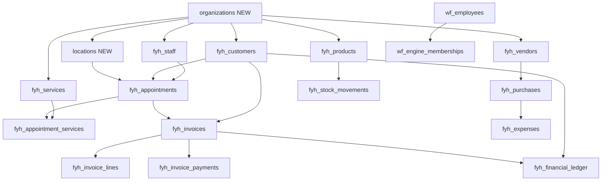

# PHASE 0A — FYHAIR → SAAS MIGRATION AUDIT

**Audit date:** 2026-08-18  
**Mode:** 100% read-only — **code and schema inspection only**  
**Safety verification (Phase 0A):** `git status` clean — no files modified, no migrations, no commits, **no database queries executed**.

---

## Audit phases (read this first)

This document is the **Phase 0A** audit: repository structure, Drizzle schemas, auth patterns, and classification **without connecting to any database**.

| Phase | What it covers | DB queries? | Row counts / live FK list? |
|-------|----------------|-------------|----------------------------|
| **Phase 0A** (this file) | Code, schema, architecture | **No** | **Not included** — see §3 note |
| **Phase 0B introspection** | Live Hair DB metrics | Yes — **read-only SELECT** | [PHASE_0B_INTROSPECTION.md](./PHASE_0B_INTROSPECTION.md), [PHASE_0B_INTROSPECTION.json](./PHASE_0B_INTROSPECTION.json) |
| **Phase 0B decisions** | Architecture choices | No | N/A — [PHASE_0B_DECISIONS.md](./PHASE_0B_DECISIONS.md) |

Do not mix Phase 0B production row estimates into Phase 0A conclusions. Migration sizing uses **Phase 0B introspection** only.

---

## 1. Executive Summary

FYHAIR today is a **single-tenant salon ERP** embedded in a **multi-product Next.js monorepo**. It uses a **dedicated Postgres database** (`HAIR_DATABASE_URL`) with **67 operational tables** (54 `fyh_*` + 13 `wf_*` Workforce tables co-located in the same DB). There is **no `organization_id`, `location_id`, `tenant_id`, or multi-org membership model** anywhere in the Hair schema.

**Tenant boundary today:** implicit — the entire Hair database is one salon. Business identity lives in a **singleton** `fyh_settings` row (`getSalonSettings().limit(1)`). Workforce scopes employees via hardcoded `engine_id = 'fyh_salon'`.

**Authentication:** isolated from PG/Capital/Owner — separate admin tables, session tables, and `fyh_session` cookie. Workforce Engine adds a second identity path (`wf_employees` + `wf_auth_sessions`) bridged to legacy `fyh_admin_users` at session time.

**Authorization:** layered at middleware (cookie presence) → app layout (page permissions) → server actions — but **44 service modules query `hairDb` with zero auth checks**. Any new unguarded caller bypasses RBAC.

**Cross-product:** four isolated Postgres databases in one Vercel deployment, host-routed via [`middleware.ts`](middleware.ts). Owner OS reads PG/Capital/Hair summaries via service adapters (read-only cross-DB). No shared user/session tables.

**SaaS readiness:** structurally **not ready** for multi-tenant isolation. Migration is feasible because Hair is already DB-isolated, but requires: new Platform/Organization/Location/Membership tables, `organization_id` on all org-scoped data, `location_id` on location-scoped transactions, global User identity separate from org membership, tenant-safe FKs, and application-level guards throughout services — plus optional future RLS.

**Highest risks:** (1) service-layer auth bypass surface, (2) dual staff/identity models (`fyh_staff` vs `wf_employees`, `fyh_admin_users` vs workforce), (3) global unique constraints and invoice sequences, (4) product stock on `fyh_products.stock_qty` (single-location assumption), (5) no row-level tenant filters anywhere.

---

## 2. Current Architecture

```mermaid
flowchart TB
  subgraph vercel [Single Vercel Deployment]
    MW[middleware.ts host routing]
  end

  MW -->|fyhair.*| HairApp[app/(hair)/fyh]
  MW -->|www.*| PGApp[app/(admin)/(customer)]
  MW -->|invest.*| CapApp[app/(capital)]
  MW -->|owner.*| OwnerApp[app/(owner)]

  HairApp --> HairServices[src/hair/services/*]
  HairServices --> HairDB[(HAIR_DATABASE_URL\nfyh_* + wf_*)]

  PGApp --> PGServices[src/services/*]
  PGServices --> PGDB[(DATABASE_URL\n~100 tables)]

  CapApp --> CapServices[src/capital/services/*]
  CapServices --> CapDB[(INVEST_DATABASE_URL\nac_*)]

  OwnerApp --> OwnerServices[src/owner/services/*]
  OwnerServices --> OwnerDB[(OWNER_DATABASE_URL\noo_*)]

  OwnerServices -. read-only adapters .-> PGServices
  OwnerServices -. read-only adapters .-> HairServices
  OwnerServices -. read-only adapters .-> CapServices
```

| Layer | FYHAIR implementation |
|-------|------------------------|
| Routing | [`src/hair/middleware/hairMiddleware.ts`](src/hair/middleware/hairMiddleware.ts) — host `fyhair.awesomepg.in` |
| UI | [`app/(hair)/fyh/`](app/(hair)/fyh/) — ~60+ RSC pages |
| Mutations | [`src/hair/actions/*.ts`](src/hair/actions/) — 25 server action modules |
| Reads | RSC pages call [`src/hair/services/*.ts`](src/hair/services/) directly |
| DB client | [`src/hair/db/client.ts`](src/hair/db/client.ts) → `hairDb` (postgres.js + Drizzle) |
| Schema | [`src/hair/db/schema/`](src/hair/db/schema/) + [`src/workforce/db/schema.ts`](src/workforce/db/schema.ts) |
| Migrations | [`src/hair/db/migrate.ts`](src/hair/db/migrate.ts) — custom per-file transactions, schema `drizzle_hair` |
| Workforce | Phase 1 tables in Hair DB; `WORKFORCE_ENGINE=1` default |

**Ecosystem constitution** ([`docs/ECOSYSTEM_V2.md`](docs/ECOSYSTEM_V2.md)): FYH is an **Engine** (actions/writes); Brains (Salon Brain, Customer Brain, Finance Brain) are largely **gaps** — intelligence still inside Engine modules.

---

## 3. Complete Database Inventory

**Total tables in monorepo:** 211 Drizzle `pgTable` definitions across 4 physical databases.  
**Row counts (Phase 0A):** **Not collected** — Phase 0A did not query any database. For live Hair DB row estimates and index/FK inventory from production, see **[PHASE_0B_INTROSPECTION.md](./PHASE_0B_INTROSPECTION.md)** (separate read-only follow-up).

### 3A. Hair / FYH database (67 tables) — **SaaS migration scope**

#### Auth / admin (ORGANIZATION-scoped today, no column)

| Table | Purpose | PK | Key FKs | Financial | PII | Status fields | Timestamps |
|-------|---------|-----|---------|-----------|-----|---------------|------------|
| `fyh_admin_users` | Legacy salon admin login | `id` | — | No | Yes (email) | `role`, JSON `permissions` | `created_at` |
| `fyh_auth_sessions` | Legacy admin sessions | `id` | — | No | No | `expires_at`, token hash | `created_at` |

#### Settings (singleton org config)

| Table | Purpose | PK | Notes |
|-------|---------|-----|-------|
| `fyh_settings` | Business name, GSTIN, timezone, invoice seq, hours | `id` | **Single row pattern** — no org key; contains financial config |

#### Customers (ORGANIZATION-scoped)

| Table | Purpose | PK | Key FKs | Financial | PII |
|-------|---------|-----|---------|-----------|-----|
| `fyh_customers` | CRM customers | `id` | — | Wallet via ledger | Yes (phone, email, DOB, etc.) |
| `fyh_customer_notes` | Staff notes | `id` | `customer_id`, `created_by_admin_id` | No | Yes |
| `fyh_customer_timeline` | Activity timeline | `id` | `customer_id` | No | Yes |

#### Staff / scheduling (ORGANIZATION-scoped; operational at locations)

| Table | Purpose | PK | Key FKs | Notes |
|-------|---------|-----|---------|-------|
| `fyh_staff` | Salon stylists (scheduler) | `id` | — | **Separate from `wf_employees`** — no FK link in schema |
| `fyh_staff_schedules` | Weekly hours per stylist | `id` | `staff_id` | Per-staff, not per-location |
| `fyh_resources` | Chairs/rooms (scheduler lanes) | `id` | — | `is_active` |

#### Services / catalog (ORGANIZATION-scoped)

| Table | Purpose | PK | Key FKs | Soft delete |
|-------|---------|-----|---------|-------------|
| `fyh_service_categories` | Service taxonomy | `id` | — | — |
| `fyh_services` | Service catalog | `id` | — | `archived_at`, `is_active` |
| `fyh_service_staff` | M2M service↔staff | `(service_id, staff_id)` | both | — |
| `fyh_service_consumables` | Service→product BOM | `id` | `service_id`, `product_id` | — |

#### Appointments (LOCATION-scoped in target; no column today)

| Table | Purpose | PK | Key FKs | Status |
|-------|---------|-----|---------|--------|
| `fyh_appointments` | Visit lifecycle | `id` | `customer_id`, `staff_id`, `resource_id`, `invoice_id` | `status` enum (booked…paid) |
| `fyh_appointment_services` | Service line snapshots | `id` | `appointment_id`, `service_id` | — |

#### Billing / revenue (LOCATION-scoped transactions)

| Table | Purpose | PK | Key FKs | Financial | Status |
|-------|---------|-----|---------|-----------|--------|
| `fyh_invoices` | Money engine header | `id` | `customer_id`, `appointment_id`, `stylist_id` | **Yes** | `status`, `voided_at`, `paid_at` |
| `fyh_invoice_lines` | Line items | `id` | `invoice_id`, `service_id`, `product_id`, `staff_id` | **Yes** | — |
| `fyh_invoice_payments` | Payment rows | `id` | `invoice_id` | **Yes** | — |
| `fyh_credit_notes` | Credit notes | `id` | `invoice_id`, `customer_id` | **Yes** | — |
| `fyh_financial_ledger` | Customer wallet/AR ledger | `id` | `customer_id`, `invoice_id` | **Yes** | — |
| `fyh_invoice_line_attributions` | Sales attribution | `id` | `invoice_line_id`, `staff_id` | **Yes** | — |
| `fyh_commission_entries` | Staff commissions | `id` | `invoice_id`, `staff_id` | **Yes** | `status` |
| `fyh_commission_rules` | Commission rules | `id` | scope refs | No | `is_active` |

#### Inventory / products (catalog ORG; stock LOCATION)

| Table | Purpose | PK | Key FKs | Notes |
|-------|---------|-----|---------|-------|
| `fyh_brands` | Product brands | `id` | `vendor_id` | ORG catalog |
| `fyh_products` | Product catalog + **on-row `stock_qty`** | `id` | `brand_id` | **Single-location stock assumption** |
| `fyh_stock_movements` | Stock ledger | `id` | `product_id` | No `location_id` |
| `fyh_stock_adjustments` | Manual adjustments | `id` | `product_id` | — |
| `fyh_floor_issues` | Floor stock issues | `id` | `product_id` | — |

#### Vendors / purchases (ORG vendors; LOCATION transactions)

| Table | Purpose | PK | Key FKs | Financial | Status |
|-------|---------|-----|---------|-----------|--------|
| `fyh_vendors` | Vendor master | `id` | — | No | `is_active` |
| `fyh_vendor_notes` | Vendor notes | `id` | `vendor_id` | No | — |
| `fyh_purchase_orders` | PO header | `id` | `vendor_id` | No | `status` |
| `fyh_purchase_order_lines` | PO lines | `id` | `purchase_order_id` | No | — |
| `fyh_goods_receipts` | GRN | `id` | `purchase_order_id` | No | — |
| `fyh_goods_receipt_lines` | GRN lines | `id` | `goods_receipt_id` | No | — |
| `fyh_product_batches` | Batch tracking | `id` | `product_id` | No | — |
| `fyh_purchases` | Posted purchases | `id` | `vendor_id` | **Yes** | `status` |
| `fyh_purchase_lines` | Purchase lines | `id` | `purchase_id` | **Yes** | — |
| `fyh_vendor_payables` | AP open items | `id` | `vendor_id`, `purchase_id` | **Yes** | `status` |
| `fyh_vendor_payments` | Vendor payments | `id` | `vendor_id` | **Yes** | `status` |
| `fyh_vendor_payment_allocations` | Payment allocations | `id` | payment + payable | **Yes** | — |
| `fyh_purchase_returns` | Returns | `id` | `vendor_id` | **Yes** | — |
| `fyh_purchase_return_lines` | Return lines | `id` | `purchase_return_id` | **Yes** | — |
| `fyh_purchase_audit_events` | Purchase audit | `id` | `purchase_id` | No | — |

#### Expenses (LOCATION-scoped in target)

| Table | Purpose | PK | Key FKs | Financial |
|-------|---------|-----|---------|-----------|
| `fyh_expenses` | Operating expenses | `id` | `purchase_id` (optional) | **Yes** |

#### Loyalty (ORG customers)

| Table | Purpose | PK | Key FKs |
|-------|---------|-----|---------|
| `fyh_membership_plans` | Plan catalog | `id` | — |
| `fyh_customer_memberships` | Customer memberships | `id` | `customer_id`, `plan_id` |
| `fyh_package_plans` | Package catalog | `id` | `service_id` |
| `fyh_customer_packages` | Customer packages | `id` | `customer_id`, `plan_id` |
| `fyh_bridal_profiles` | Bridal CRM | `id` | `customer_id` |
| `fyh_bridal_events` | Bridal events | `id` | `bridal_profile_id` |

#### Notifications / import / misc

| Table | Purpose |
|-------|---------|
| `fyh_notification_templates` | WhatsApp/template config |
| `fyh_notification_outbox` | Outbound queue (`status`) |
| `fyh_historical_import_batches` | Legacy data import (`status`) |
| `fyh_historical_import_row_errors` | Import errors |

#### Workforce tables in Hair DB (13 `wf_*`) — MEMBERSHIP-like today via `engine_id`

| Table | Purpose | PK | Key FKs | PII | Notes |
|-------|---------|-----|---------|-----|-------|
| `wf_employees` | HR identity + login | `id` | `legacy_admin_user_id` → `fyh_admin_users` | **Yes** | Unique mobile/email |
| `wf_engine_memberships` | Employee↔engine | `id` | `employee_id` | No | `engine_id` text, not org UUID |
| `wf_permission_grants` | Permission overrides | `id` | `membership_id` | No | JSON permissions array |
| `wf_role_templates` | Role templates | `id` | — | No | Per `engine_id` |
| `wf_auth_sessions` | Workforce sessions | `id` | `employee_id` | No | Shares `fyh_session` cookie |
| `wf_schedules` | Work schedules | `id` | `employee_id`, `engine_id` | No | |
| `wf_attendance` | Attendance | `id` | `employee_id`, `engine_id` | No | |
| `wf_payroll_runs` | Payroll runs | `id` | — | **Yes** | Per `engine_id` |
| `wf_payroll_lines` | Payroll lines | `id` | `payroll_run_id`, `employee_id` | **Yes** | |
| `wf_incentive_plans` | Incentive config | `id` | `employee_id` | No | |
| `wf_incentives` | Incentive entries | `id` | `employee_id` | **Yes** | |
| `wf_audit_log` | HR audit | `id` | `employee_id` | No | |
| `wf_events` | Workforce events | `id` | — | No | |

### 3B. PG database (~100 tables) — **not migrating; shared infra only**

Hub: `pgs` (property tenant ≈ future Organization analog via `owner_id` → `admin_users`), `bookings`, `customers` (residents), `rent_invoices`, `payments`. Full list in schema [`src/db/schema/`](src/db/schema/). Active, production-critical.

### 3C. Capital database (21 `ac_*` tables) — **not migrating**

Hub: `ac_assets`, `ac_expenses`, `ac_ledger_entries`. Documented as not multi-tenant ([`docs/automotive-capital/README.md`](docs/automotive-capital/README.md)).

### 3D. Owner database (23 `oo_*` tables) — **PERSONAL_OWNER_OS; must stay User-scoped**

Hub: `oo_assets`, `oo_liabilities`, `oo_journal_entries`, `oo_financial_accounts`, `oo_businesses` (attribution registry, not tenant boundary).

---

## 4. Complete Scope Classification

| Table | Classification | Reason | Confidence |
|-------|----------------|--------|------------|
| **fyh_admin_users** | ORGANIZATION | Salon staff admin identity (legacy) | High |
| **fyh_auth_sessions** | ORGANIZATION | Admin sessions | High |
| **fyh_settings** | ORGANIZATION | Business config singleton | High |
| **fyh_customers** | ORGANIZATION | Customers org-wide per target arch | High |
| **fyh_customer_notes** | ORGANIZATION | Customer CRM | High |
| **fyh_customer_timeline** | ORGANIZATION | Customer activity | High |
| **fyh_staff** | ORGANIZATION | Staff roster (org-scoped; works at locations) | High |
| **fyh_staff_schedules** | LOCATION | Per-location schedules in target; today per-staff global | Medium |
| **fyh_resources** | LOCATION | Physical chairs/rooms at a site | High |
| **fyh_service_categories** | ORGANIZATION | Catalog | High |
| **fyh_services** | ORGANIZATION | Catalog | High |
| **fyh_service_staff** | ORGANIZATION | Catalog M2M | High |
| **fyh_service_consumables** | ORGANIZATION | Catalog BOM | High |
| **fyh_appointments** | LOCATION | Operational transaction at site | High |
| **fyh_appointment_services** | LOCATION | Child of appointment | High |
| **fyh_invoices** | LOCATION | Operational transaction | High |
| **fyh_invoice_lines** | LOCATION | Child of invoice | High |
| **fyh_invoice_payments** | LOCATION | Child of invoice | High |
| **fyh_credit_notes** | LOCATION | Child of invoice | High |
| **fyh_financial_ledger** | ORGANIZATION | Customer wallet — org-scoped customer | High |
| **fyh_invoice_line_attributions** | LOCATION | Invoice child | High |
| **fyh_commission_entries** | LOCATION | Tied to invoice/staff | High |
| **fyh_commission_rules** | ORGANIZATION | Org policy | High |
| **fyh_brands** | ORGANIZATION | Catalog | High |
| **fyh_products** | ORGANIZATION | Catalog (stock column is location debt) | High |
| **fyh_stock_movements** | LOCATION | Physical stock events | High |
| **fyh_stock_adjustments** | LOCATION | Stock ops | High |
| **fyh_floor_issues** | LOCATION | Floor stock | High |
| **fyh_vendors** | ORGANIZATION | Vendor master | High |
| **fyh_vendor_notes** | ORGANIZATION | Vendor CRM | High |
| **fyh_purchase_orders** | LOCATION | Site purchase flow | Medium |
| **fyh_purchase_order_lines** | LOCATION | PO child | Medium |
| **fyh_goods_receipts** | LOCATION | Site receipt | Medium |
| **fyh_goods_receipt_lines** | LOCATION | GRN child | Medium |
| **fyh_product_batches** | LOCATION | Batch at site | Medium |
| **fyh_purchases** | LOCATION | Posted purchase | High |
| **fyh_purchase_lines** | LOCATION | Purchase child | High |
| **fyh_vendor_payables** | ORGANIZATION | AP ledger (org vendor) | Medium |
| **fyh_vendor_payments** | ORGANIZATION | Vendor payments | Medium |
| **fyh_vendor_payment_allocations** | ORGANIZATION | Payment child | Medium |
| **fyh_purchase_returns** | LOCATION | Return transaction | Medium |
| **fyh_purchase_return_lines** | LOCATION | Return child | Medium |
| **fyh_purchase_audit_events** | LOCATION | Audit child | Medium |
| **fyh_expenses** | LOCATION | Site opex | High |
| **fyh_membership_plans** | ORGANIZATION | Loyalty catalog | High |
| **fyh_customer_memberships** | ORGANIZATION | Customer entitlement | High |
| **fyh_package_plans** | ORGANIZATION | Package catalog | High |
| **fyh_customer_packages** | ORGANIZATION | Customer package | High |
| **fyh_bridal_profiles** | ORGANIZATION | Bridal CRM | High |
| **fyh_bridal_events** | ORGANIZATION | Bridal events | High |
| **fyh_notification_templates** | ORGANIZATION | Org comms config | High |
| **fyh_notification_outbox** | ORGANIZATION | Outbound queue | High |
| **fyh_historical_import_batches** | ORGANIZATION | Data import | High |
| **fyh_historical_import_row_errors** | ORGANIZATION | Import errors | High |
| **wf_employees** | ORGANIZATION | HR identity (needs global User link) | High |
| **wf_engine_memberships** | MEMBERSHIP | Proto-membership via `engine_id` | High |
| **wf_permission_grants** | MEMBERSHIP | Permission grants | High |
| **wf_role_templates** | ORGANIZATION | Per-engine templates | High |
| **wf_auth_sessions** | USER | Login sessions | High |
| **wf_schedules** | LOCATION | Per engine + employee | Medium |
| **wf_attendance** | LOCATION | Per engine + employee | Medium |
| **wf_payroll_runs** | ORGANIZATION | Org payroll | High |
| **wf_payroll_lines** | ORGANIZATION | Payroll detail | High |
| **wf_incentive_plans** | ORGANIZATION | HR config | High |
| **wf_incentives** | ORGANIZATION | HR entries | High |
| **wf_audit_log** | ORGANIZATION | HR audit | High |
| **wf_events** | SYSTEM | Event bus | High |
| **PG ~100 tables** | ORGANIZATION (PG) / SYSTEM | Awesome PG engine — separate product | High |
| **ac_* 21 tables** | ORGANIZATION (Capital) | Capital engine — separate product | High |
| **oo_* 23 tables** | PERSONAL_OWNER_OS | Personal wealth — User-scoped | High |

**Tables that do not exist yet (target Platform layer):** `platform_memberships`, `plans`, `organizations`, `subscriptions`, `locations`, `memberships`, `membership_locations`, `staff_locations`, global `users` — **DECISION REQUIRED** on where these live (see Section 20).

---

## 5. Authentication & Identity Architecture

### Per-product identity (no shared tables)

| Product | User tables | Session | Cookie | Login mechanism |
|---------|-------------|---------|--------|-----------------|
| PG | `customers`, `admin_users` | `auth_sessions` (kind enum) | `apg_customer_session`, `apg_admin_session` | REST API + forms; OTP signup |
| FYH | `fyh_admin_users`, `wf_employees` | `fyh_auth_sessions`, `wf_auth_sessions` | `fyh_session` (one cookie, dual backend) | Server actions only |
| Capital | `ac_admin_users` | `ac_auth_sessions` | `ac_session` | Server actions |
| Owner | `oo_admin_users` | `oo_auth_sessions` | `oo_session` | Server actions |

### FYH auth flow (dual path)

1. **Workforce path (default):** `wf_employees` → `wf_auth_sessions` → `employeeToHairAdmin()` bridge
2. **Legacy path:** `fyh_admin_users` → `fyh_auth_sessions`
3. Link: `wf_employees.legacy_admin_user_id` → `fyh_admin_users.id` (not `fyh_staff`)

### Cross-product bootstrap only

[`src/lib/auth/ecosystemAdmin.ts`](src/lib/auth/ecosystemAdmin.ts) upserts same email into **each product's admin table separately** — not unified identity.

### Multi-product membership today

- **Users cannot belong to multiple organizations** — concept does not exist.
- **Workforce `wf_engine_memberships`** allows one employee across engines (`fyh_salon`, `awesome_pg`, etc.) but each engine is a separate product DB today.
- **PG residents** (`customers`) are PG-only; **FYH customers** (`fyh_customers`) have no login.

### Password / crypto

Per-product `crypto.ts` copies; `AUTH_SECRET` shared env (≥32 chars per [`docs/ENV_CONTRACT.md`](docs/ENV_CONTRACT.md)).

---

## 6. FYHAIR / Awesome PG / Automotive Capital Relationship

| Shared? | Detail |
|---------|--------|
| Codebase | **Yes** — single Next.js monorepo |
| Vercel deployment | **Yes** — one project, host routing |
| Postgres database | **No** — 4 separate URLs with isolation asserts |
| Neon project | **Likely same Neon project** (`neon-champagne-ribbon` per [`docs/NEON_BRANCH_SETUP.md`](docs/NEON_BRANCH_SETUP.md)) with **separate database endpoints/branches** — not verified against live Neon console |
| Users / sessions | **No** |
| Tables | **No** cross-DB FKs |
| Env vars | Partially shared (`AUTH_SECRET`); DB URLs product-specific |
| Cron jobs | **PG-only** — no Hair cron routes in `app/api/cron/` |
| Common services | Owner adapters, Personal Finance Brain, ecosystem admin bootstrap |

**Owner OS** reads Hair/PG/Capital via service adapters; writes only to Owner DB.

**Workforce Engine** is Hair-colocated but designed for multi-engine (`WorkforceEngineId` enum includes `awesome_pg`, `automotive_capital`).

---

## 7. Owner OS Analysis

### Personal wealth (`oo_*` — PERSONAL_OWNER_OS)

| Domain | Tables |
|--------|--------|
| Assets | `oo_assets`, `oo_properties`, `oo_movable_assets`, valuations |
| Liabilities / loans | `oo_liabilities`, `oo_liability_schedules`, `oo_liability_accruals` |
| Income / expenses | `oo_journal_entries`, `oo_journal_lines`, `oo_recurring_obligations` |
| Accounts | `oo_financial_accounts` |
| Business attribution | `oo_businesses` (slug registry — PG/FYH/Capital tags, **not tenant boundary**) |
| Integration projections | `oo_integration_facts` (synced engine summaries) |

### Cross-access risk

- Owner services read PG/Capital/Hair summaries (read-only).
- **No organization member can access another user's Owner OS data today** because Owner DB is separate and single-owner deployment — but there is **no RLS** if DB URLs were ever shared.
- Composition risks: double-counting in Personal Finance Brain (loans + EMIs, revenue + profit facts) — documented in Owner audit, not SaaS-blocking but affects Business Financial OS separation.

### Organization references in Owner

`oo_journal_lines.business_id`, `oo_integration_facts` engine tags — attribution only. **Personal Owner OS must not become Organization-scoped** per agreed architecture.

---

## 8. Organization Scope Analysis

**Every `fyh_*` and `wf_*` table will eventually need `organization_id`** (or live in a DB where org is implicit via connection — less desirable for SaaS).

| Current ownership identifier | Migration note |
|------------------------------|----------------|
| Entire Hair DB | Bootstrap: create one `organizations` row + backfill all tables |
| `fyh_settings` singleton | Becomes per-org (or per-org defaults + per-location overrides) |
| `engine_id = 'fyh_salon'` | Replace with `organization_id` UUID |
| Global unique indexes (`wf_employees.mobile`, `wf_employees.email`) | Must become **per-org or global User** unique — **DECISION REQUIRED** |
| `fyh_invoices.invoice_number` unique | Must become per-org unique |
| `fyh_customers` phone uniqueness (if enforced in app) | Per-org unique within organization |

**Migration difficulty:** **HIGH** — 67 tables, no existing column, services have no filter predicate to extend.

**Equivalent tenant identifiers today:** none. closest analogs:
- PG: `pgs.id` + `admin_users.pgScope`
- Workforce: `engine_id` text slug
- Owner: single implicit owner

---

## 9. Location Scope Analysis

**No `location_id` exists.** Target architecture requires it on location-scoped transactions.

### Will need `location_id`

| Category | Tables |
|----------|--------|
| Appointments / visits | `fyh_appointments`, `fyh_appointment_services` |
| Revenue transactions | `fyh_invoices`, lines, payments, credit notes, attributions, commissions |
| Site opex | `fyh_expenses` |
| Physical stock | `fyh_stock_movements`, `fyh_stock_adjustments`, `fyh_floor_issues` — plus **split `fyh_products.stock_qty`** into per-location stock |
| Site purchases | `fyh_purchases`, lines, PO/GRN chain (if purchases are site-specific) |
| Scheduler resources | `fyh_resources` (chairs at a site) |
| Staff schedules (target) | `fyh_staff_schedules`, possibly `wf_schedules`, `wf_attendance` via `staff_locations` |

### Remain organization-wide (no `location_id`)

| Category | Tables |
|----------|--------|
| Customers | `fyh_customers` + CRM children |
| Catalog | services, products (master), brands, vendors (master) |
| Loyalty plans | membership/package plans |
| Customer entitlements | memberships, packages, bridal |
| Vendor AP (likely) | payables, payments — org-level AP unless split by site |
| Workforce HR | `wf_employees`, payroll (org-level unless multi-site payroll differs) |
| Settings (split decision) | org defaults in `fyh_settings`; location overrides for hours/printer? |

### Bootstrap for existing single salon

One org + **one default location** backfill is the minimal path; all existing rows get the same `location_id`.

---

## 10. Foreign-Key Dependency Graph (Hair — SaaS-critical)



**Tenant-safe FK requirement:** child `organization_id` must match parent (e.g. appointment.customer.org = appointment.org). Today FKs are **not composite** — cross-tenant FK injection would be possible without app guards.

**Implicit tenant relationships without FK:** `reference_type`/`reference_id` on stock movements; `staff_employee_id` on expenses (wf employee, no FK in schema).

**Staff-location gap:** `fyh_staff` ↔ `wf_employees` — **no schema FK**; `fyh_staff` used for scheduler/commissions, `wf_employees` for HR/login.

---

## 11. Junction / Many-to-Many Tables

| Table | Relationship | SaaS note |
|-------|--------------|-----------|
| `fyh_service_staff` | service ↔ staff | Org-scoped; both parents must share org |
| `wf_engine_memberships` | employee ↔ engine | **Replace with** memberships + membership_locations |
| `wf_permission_grants` | membership ↔ permissions | Target: relational membership_locations, not JSON |
| `fyh_invoice_line_attributions` | line ↔ staff | Location transaction child |
| `fyh_vendor_payment_allocations` | payment ↔ payable | Org-scoped |
| **NEW: staff_locations** | staff ↔ location | Required by target arch |
| **NEW: membership_locations** | membership ↔ location | Required by target arch |

---

## 12. Soft Delete / Historical Data

### Repo-wide patterns

- **`deleted_at`:** **not used anywhere**
- **`archived_at`:** `fyh_products`, `fyh_services`; PG `beds`, `rooms`, `floors`, `pgs`, `customers`; `admin_notification_states`
- **Status enums:** appointments, invoices, purchases, payables, commissions, import batches, notification outbox, workforce employee status

### Migration impact

- Archived catalog rows must retain `organization_id` when backfilled.
- Historical invoices/appointments with `voided_at`, `cancelled` status remain location-scoped rows — backfill `location_id` to default site.
- `fyh_historical_import_batches` — org-scoped audit trail; do not split across tenants incorrectly during bootstrap.
- Workforce `wf_employees.status` inactive — still org-bound.

---

## 13. Current Authorization Architecture

### Layers

| Layer | Enforcement | Gap |
|-------|-------------|-----|
| Edge middleware | Cookie presence | No permission check |
| `app/(hair)/fyh/(app)/layout.tsx` | `requirePagePermissionForPath` | Coarse path→permission map |
| Server actions | `requirePermission` / `requireHairAuth` / `requireWorkforcePermission` | **Inconsistent** — many actions use `requireHairAuth` only |
| Services (44 modules) | **None** | **Critical bypass surface** |
| RSC pages | Layout only | Direct service reads |

### Permission systems (dual)

1. Legacy `HairPermission` keys on `fyh_admin_users.permissions` JSON
2. Workforce `WorkforcePermissionKey` on `wf_permission_grants` — bridged at session

### Public unauthenticated paths

- `/i/[invoiceNumber]`, `/invoice/[invoiceNumber]` — invoice number as secret
- No Hair-specific cron endpoints

### Direct DB bypass paths

- Scripts importing `hairDb` directly
- Unguarded API routes (only 6 Hair API routes; 2 global `app/api/hair/*`)
- New internal callers of services

---

## 14. Database Driver / Pooling / Transaction Architecture

| Aspect | Implementation |
|--------|----------------|
| Driver | `postgres` (postgres.js) via `drizzle-orm/postgres-js` |
| Neon serverless driver | **Not used** in app code |
| Pooling | In-process: `max=1` on Vercel, `3` otherwise; `prepare=false` for pooler |
| Hair client | [`src/hair/db/client.ts`](src/hair/db/client.ts) — lazy singleton proxy |
| Isolation | [`assertHairDatabaseIsolated()`](src/hair/lib/db/env.ts) at init |
| Transactions | `hairDb.transaction()` in purchase, invoice, checkout, loyalty engines |
| Migrations | Custom per-file transactions; schema `drizzle_hair.__drizzle_migrations` |
| Owner DB | No `.transaction()` usage found |

---

## 15. Future Tenant-Isolation Compatibility

### Application guards (required)

- Introduce `TenantContext { organizationId, locationId?, userId, membershipId }` resolved once per request.
- **Every service query** must filter by `organization_id`; location-scoped services also filter `location_id`.
- Tenant-safe FK validation before insert (customer belongs to org).
- Refactor dual permission systems into membership-based auth.

### RLS compatibility (optional backstop)

| Factor | Assessment |
|--------|------------|
| Driver | postgres.js supports session variables — `SET app.organization_id = ...` per transaction possible |
| Transaction pattern | Heavy use of `hairDb.transaction()` — good place to set tenant context |
| Connection pooling | `max=1` on Vercel — session vars per connection workable |
| Drizzle | No built-in RLS — policies must be raw SQL in migrations |
| Cross-tenant FKs | Must add composite unique constraints before RLS is meaningful |
| Workforce JSON permissions | RLS cannot enforce JSON grants — app layer still required |

**Verdict:** Architecture is **compatible with transaction-scoped tenant context + optional RLS**, but **RLS alone is insufficient** due to JSON permissions and service-layer bypass. Application guards are mandatory.

---

## 16. Migration Dependency Order

1. **Platform tables** — `users`, `organizations`, `locations`, `memberships`, `membership_locations`, `platform_memberships`, `plans`, `subscriptions` (**DECISION:** which DB)
2. **Bootstrap org** — create org + default location for existing FYH data
3. **Backfill `organization_id`** — catalog + customers + staff + vendors first (parents)
4. **Backfill `location_id`** — appointments, invoices, expenses, stock movements, resources
5. **Staff model** — `staff_locations`, link `fyh_staff` ↔ `wf_employees` ↔ memberships
6. **Tenant-safe FKs** — composite constraints + validation
7. **Authorization** — membership-based guards in services
8. **Owner OS separation** — ensure Business Financial OS events don't leak into `oo_*`
9. **Subscription / entitlements** — gate org access
10. **PG/Capital** — out of scope; document reuse patterns only

---

## 17. Migration Risk Matrix

| Existing Table | Future Scope | Required Change | Dependencies | Risk | Confidence |
|----------------|--------------|-----------------|--------------|------|------------|
| `fyh_settings` | ORGANIZATION | Add `organization_id`; split location overrides | organizations | HIGH | High |
| `fyh_customers` | ORGANIZATION | `organization_id`; per-org unique phone | organizations | HIGH | High |
| `fyh_appointments` | LOCATION | `organization_id`, `location_id` | org, loc, customers, staff | CRITICAL | High |
| `fyh_invoices` | LOCATION | `organization_id`, `location_id`; per-org invoice seq | org, loc, customers | CRITICAL | High |
| `fyh_financial_ledger` | ORGANIZATION | `organization_id` | customers | CRITICAL | High |
| `fyh_products` | ORG catalog + LOC stock | `organization_id`; **relocate stock_qty** | org, loc, stock model | CRITICAL | Medium |
| `fyh_stock_movements` | LOCATION | `organization_id`, `location_id` | products, loc | HIGH | High |
| `fyh_staff` | ORGANIZATION | `organization_id`; staff_locations | org, wf_employees | HIGH | Medium |
| `fyh_services` | ORGANIZATION | `organization_id` | org | MEDIUM | High |
| `wf_employees` | USER+ORG | Link to global `users`; `organization_id` | users, org | CRITICAL | Medium |
| `wf_engine_memberships` | MEMBERSHIP | Replace engine_id with membership model | users, org | CRITICAL | High |
| `wf_permission_grants` | MEMBERSHIP | membership_locations table | memberships | HIGH | High |
| `fyh_admin_users` | USER/MEMBERSHIP | Deprecate or link to users | users | HIGH | Medium |
| `fyh_vendors` | ORGANIZATION | `organization_id` | org | MEDIUM | High |
| `fyh_purchases` | LOCATION | `organization_id`, `location_id` | vendors, loc | HIGH | Medium |
| `fyh_expenses` | LOCATION | `organization_id`, `location_id` | org, loc | MEDIUM | High |
| All other `fyh_*` | (as classified) | `organization_id` (+ loc where applicable) | parent tables | MEDIUM–HIGH | High |
| All `wf_*` | ORG/MEMBERSHIP | `organization_id` + membership refactor | platform users | HIGH | High |
| **NEW platform tables** | PLATFORM | Create from scratch | — | HIGH | High |

*(PG/Capital/Owner tables excluded — not in FYH SaaS migration scope.)*

---

## 18. Critical Risks

1. **No tenant filters in services** — 44 unguarded service modules.
2. **Dual identity stacks** — `fyh_admin_users` + `wf_employees` + `fyh_staff` without unified model.
3. **Singleton settings + global sequences** — invoice/customer code seq not per-org.
4. **Single-location stock on product row** — multi-location inventory requires schema redesign.
5. **Global unique constraints** — employee mobile/email, invoice numbers.
6. **Public invoice URLs** — invoice number secrecy doesn't scale across tenants (collision risk).
7. **No Hair cron/background jobs** — subscription enforcement, outbox draining patterns undefined for SaaS.
8. **Owner OS cross-reads** — Business Financial OS must not conflate with Personal Owner OS during SaaS billing events.
9. **Workforce JSON permissions** — conflicts with target relational `membership_locations`.
10. **Bootstrap complexity** — 67 tables backfill must be atomic and verified.

---

## 19. Unknowns / Ambiguities

1. **Production row counts** — **not part of Phase 0A**; collected separately in [PHASE_0B_INTROSPECTION.md](./PHASE_0B_INTROSPECTION.md) (read-only queries).
2. **Same Neon project vs separate Neon projects** for the 4 DB URLs — docs suggest one project with branches; not verified in Neon console.
3. **`fyh_staff` ↔ `wf_employees` linkage** — application-level only (`staffEmployeeId` on expenses); no FK.
4. **Purchase/vendor AP scope** — org vs location for payables (classified medium confidence).
5. **Per-location service price overrides** — target arch mentions optional; not implemented.
6. **Existing production FYH customers with duplicate phones across future orgs** — N/A today but affects unique index design.
7. **Subscription provider** — none in codebase.
8. **Multi-location staff schedules** — `fyh_staff_schedules` is per-staff global today.
9. **Whether `fyh_resources` (chairs) are location-specific** — logically yes; not encoded.
10. **Workforce payroll multi-location** — `engine_id` only, no location dimension.

---

## 20. Decisions Required Before Phase 0B

### **DECISION REQUIRED: Platform database placement**

| Option | Pros | Cons |
|--------|------|------|
| A. New 5th `PLATFORM_DATABASE_URL` | Clean separation; PG/Capital unaffected | Another DB to manage |
| B. Extend Hair DB with platform tables | Fewer connections; FYH-first | Platform not reusable cleanly for PG later |
| C. Unified mega-database | Single RLS surface | Violates current isolation; huge blast radius |

### **DECISION REQUIRED: Global User model**

| Option | Pros | Cons |
|--------|------|------|
| A. New `users` table + link all admin/employee rows | Matches target arch | Migration from 4 admin tables |
| B. Email as global identifier across products | Simpler bootstrap | No formal user row; weak for Owner OS link |
| C. Keep per-product identities; SaaS users only in platform DB | Less churn | User "global identity" is incomplete |

### **DECISION REQUIRED: Staff unification**

| Option | Pros | Cons |
|--------|------|------|
| A. `fyh_staff` becomes view/alias of `wf_employees` + `staff_locations` | Single roster | Large refactor of scheduler |
| B. Keep both; link via new `staff_id` FK on `wf_employees` | Lower scheduler risk | Permanent dual model |
| C. Deprecate `fyh_staff`; scheduler uses workforce only | Clean long-term | High migration risk |

### **DECISION REQUIRED: Stock model for multi-location**

| Option | Pros | Cons |
|--------|------|------|
| A. `location_stock` table; remove `stock_qty` from products | Correct per-site qty | Migration + engine changes |
| B. Stock movements only; derive qty per location | Append-only | Complex queries |
| C. Single location per org in v1 SaaS | Defers problem | Limits product |

### **DECISION REQUIRED: SaaS routing model**

| Option | Pros | Cons |
|--------|------|------|
| A. Subdomain per org (`{org}.fyhair.app`) | Strong tenant boundary | DNS + middleware |
| B. Path-based (`/o/{orgId}/...`) | Simpler deploy | Weaker isolation feel |
| C. Keep single host; org picker after login | Minimal routing change | Easy to mis-scope |

### **DECISION REQUIRED: Invoice numbering**

Per-organization sequence (replace `fyh_settings.invoice_next_seq` singleton) vs per-location sequences.

### **DECISION REQUIRED: Customer phone uniqueness**

Per-organization unique vs global unique within platform.

### **DECISION REQUIRED: Workforce `engine_id` evolution**

Replace with `organization_id` on memberships vs keep engine slug as secondary tag.

### **DECISION REQUIRED: Business Financial OS boundary**

Which FYH tables feed org-level Business Financial OS vs stay in salon operational engine only.

---

## 21. Recommended Phase 0B Preparation

**Do not implement yet.** Phase 0B follow-up work (partially completed — see `docs/foryourhair/PHASE_0B_*.md`):

1. ~~Readonly production introspection script~~ → `npm run hair:db:introspect` — results in [PHASE_0B_INTROSPECTION.json](./PHASE_0B_INTROSPECTION.json) (**not part of this Phase 0A audit**)
2. Resolve Section 20 decisions → [PHASE_0B_DECISIONS.md](./PHASE_0B_DECISIONS.md) (stakeholder review)
3. **Tenant context design doc** — `TenantContext` type, resolution from session/membership, middleware injection.
4. **Service layer audit spreadsheet** — map each of 44 services to required `organization_id`/`location_id` filters.
5. **Bootstrap migration plan** — one org + one location for existing FYH; verification checksums (invoice totals, customer counts).
6. **Auth migration plan** — global `users` + `memberships` without breaking current `fyh_session` login.
7. **Forbidden-import / guard tests** — services must not be callable without tenant context (pattern from Room OS matrix).
8. **Owner OS impact assessment** — how `oo_integration_facts` receives per-org FYH summaries in multi-tenant world.
9. **Subscription stub** — entitlements table design only (no provider integration).
10. **Regression test strategy** — existing FYH 209+ tests must pass on single-tenant bootstrap before multi-tenant cutover flag.

---

## Read-Only Safety Confirmation (Phase 0A only)

This table applies to the **original Phase 0A audit pass** (code/schema inspection). It does **not** describe the separate Phase 0B introspection run (read-only SELECTs — see [PHASE_0B_INTROSPECTION.md](./PHASE_0B_INTROSPECTION.md)).

| Check | Phase 0A status |
|-------|-----------------|
| Source files modified | **No** (`git status` clean at audit time) |
| Migrations created | **No** |
| Database schema changed | **No** |
| Production data changed | **No** (no DB queries in Phase 0A) |
| Authentication changed | **No** |
| Authorization changed | **No** |
| RLS enabled | **No** |
| Commits / deploy | **No** |

**Phase 0B introspection** (separate): read-only queries only; no mutations — documented in PHASE_0B_INTROSPECTION.md.

**Schema implementation not started** pending [PHASE_0B_DECISIONS.md](./PHASE_0B_DECISIONS.md) sign-off.
