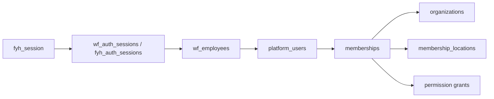

# FYHAIR SaaS — Auth Migration Plan

> Migrate to global `platform_users` + `memberships` **without breaking** existing `fyh_session` login.  
> Phase 0B design only — no implementation.

---

## 1. Constraints

| Must preserve | Detail |
|---------------|--------|
| `fyh_session` cookie name | Staff bookmarks, mobile sessions |
| Workforce login path | `wf_employees` email/password default |
| Legacy admin fallback | `fyh_admin_users` when workforce disabled |
| `employeeToHairAdmin()` bridge | Nav + `requirePermission` during transition |
| No forced logout on deploy | Dual-read auth for at least one release |

---

## 2. Target auth model



| Layer | Table | DB |
|-------|-------|-----|
| Session | `wf_auth_sessions` | Hair |
| HR identity | `wf_employees` | Hair |
| Global user | `platform_users` | Platform |
| Org access | `memberships` | Platform |
| Location scope | `membership_locations` | Platform |
| Legacy admin | `fyh_admin_users` | Hair (sunset) |

---

## 3. Migration phases

### A1 — Platform users (no login change)

1. Create Platform DB schema.
2. `INSERT platform_users` from distinct emails in:
   - `wf_employees.email` (active, can_login)
   - `fyh_admin_users.email` (if not in workforce)
3. `UPDATE wf_employees SET user_id = ...` by email match.
4. `UPDATE fyh_admin_users SET user_id = ...` where legacy link exists.

**Login unchanged** — still workforce → session.

### A2 — Memberships for bootstrap org

For each `platform_users` row that should access FYH:

```sql
INSERT INTO memberships (user_id, organization_id, role)
VALUES (...);
INSERT INTO membership_locations (membership_id, location_id) ...
```

Map from current access:

| Current signal | Target role |
|----------------|-------------|
| `wf_engine_memberships.rank = owner` | `co_owner` or `owner` |
| `super_admin` legacy | `owner` |
| `staff.view` grant | `member` with location grants |
| Default stylist | `member` + `staff_locations` |

### A3 — Session enrichment (dual-read)

Extend `getHairSession()`:

```typescript
// After resolving employee + legacy admin bridge:
const tenant = await resolveTenantFromUser({
  userId: employee.userId,
  preferredOrgId: cookieStore.get('fyh_org_id'),
});
// Attach to session: organizationId, locationId, membershipId, permissions
```

**No cookie rename.** Optionally set `fyh_org_id` / `fyh_location_id` on login if single membership.

### A4 — Permission source switch (feature flag)

`WORKFORCE_MEMBERSHIP_AUTH=1`:

- `requireWorkforcePermission` reads Platform `memberships` + `membership_locations` grants
- `wf_permission_grants` becomes fallback when flag off
- `employeeToHairAdmin()` still maps grants → `HairPermission[]` for nav

### A5 — Legacy sunset

| Component | Sunset |
|-----------|--------|
| `fyh_admin_users` login path | After all users have `wf_employees` row |
| `fyh_auth_sessions` | After workforce-only login verified |
| `engine_id`-only scope | After membership_locations live |
| JSON-only `wf_permission_grants` | After relational permission matrix |

---

## 4. Cookie & session details

### Existing

| Cookie | Purpose |
|--------|---------|
| `fyh_session` | Session token → `wf_auth_sessions` or `fyh_auth_sessions` |

### New (v1 SaaS)

| Cookie | Purpose | Required |
|--------|---------|----------|
| `fyh_org_id` | Active organization UUID | When user has multiple memberships |
| `fyh_location_id` | Active location UUID | When membership spans locations |

Set on:

- Login (if unambiguous single org/loc)
- Org picker UI
- Location switcher in header

**HttpOnly, Secure, SameSite=Lax** — same as session cookie policy.

### Session TTL

Keep existing workforce session TTL — no change for migration.

---

## 5. Login UX (v1)

### Single membership (bootstrap salon)

1. User logs in at `/login` (unchanged).
2. `resolveTenantContext` auto-selects sole membership.
3. No org picker shown.

### Multiple memberships (future)

1. Login succeeds.
2. Redirect to `/select-organization` if `memberships.length > 1`.
3. Store `fyh_org_id`; then location picker if needed.

---

## 6. `requireHairAuth` / guards mapping

| Guard | Migration behavior |
|-------|-------------------|
| `requireHairAuth` | + implicit `requireTenantContext` when `FYH_SAAS_TENANT=1` |
| `requirePermission` | Check membership grants in org context |
| `requireWorkforcePermission` | Platform membership permissions |
| `requireSuperAdmin` | Platform `memberships.role = owner` OR platform_memberships |
| `getHairAuthOptional` | Public API routes — no tenant |

---

## 7. Public / unauthenticated paths

| Path | Migration change |
|------|------------------|
| `/i/[invoiceNumber]` | Query must include org scope: `WHERE organization_id = $resolved OR invoice_number globally unique per org prefix` |
| `/invoice/[invoiceNumber]` | Same |

Invoice numbers may collide across orgs — public URLs need org slug in v2 (see [PHASE_0B_DECISIONS.md](./PHASE_0B_DECISIONS.md)).

---

## 8. Ecosystem admin bootstrap

[`ecosystemAdmin.ts`](../../src/lib/auth/ecosystemAdmin.ts) continues to seed per-product admin tables **plus**:

- `platform_users` row
- `memberships` owner role on bootstrap org
- `platform_memberships` if platform super-admin needed

---

## 9. Testing strategy

| Test | Purpose |
|------|---------|
| Existing hair auth tests | Login/logout still pass |
| `tenantAuthMigration.test.ts` (new) | Dual-read session includes org |
| `getHairSession` with `WORKFORCE_MEMBERSHIP_AUTH=0/1` | Flag parity |
| E2E login → appointments | No regression with single org |

Run full `npm run test:hair` before and after each auth phase.

---

## 10. Rollback

| Phase | Rollback |
|-------|----------|
| A1 user_id columns | Nullable — ignore user_id in session |
| A3 session enrichment | `FYH_SAAS_TENANT=0` disables tenant resolution |
| A4 permission flag | `WORKFORCE_MEMBERSHIP_AUTH=0` restores wf_permission_grants |

---

## Related

- [PHASE_0B_DECISIONS.md](./PHASE_0B_DECISIONS.md)
- [PHASE_0B_TENANT_CONTEXT.md](./PHASE_0B_TENANT_CONTEXT.md)
- [PHASE_0B_BOOTSTRAP_MIGRATION.md](./PHASE_0B_BOOTSTRAP_MIGRATION.md)
