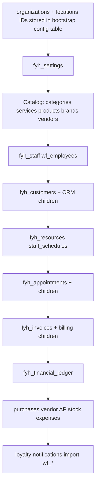

# FYHAIR SaaS — Bootstrap Migration Plan

> Phase 0B design: backfill existing single-salon Hair DB into Organization + Location model.  
> **No implementation in this document.**

---

## 1. Objective

Migrate today's implicit single-tenant Hair database to:

- One `organizations` row (Platform DB)
- One `locations` row (default site — e.g. "For Your Hair" main salon)
- `organization_id` on all 67 `fyh_*` / `wf_*` tables
- `location_id` on location-scoped transaction tables
- **Zero change** to visible business data (customers, invoices, balances)

---

## 2. Preconditions

- [PHASE_0B_DECISIONS.md](./PHASE_0B_DECISIONS.md) signed off
- Platform DB provisioned (`PLATFORM_DATABASE_URL`)
- Readonly introspection baseline: [PHASE_0B_INTROSPECTION.json](./PHASE_0B_INTROSPECTION.json)
- Production maintenance window or dual-write flag for cutover

---

## 3. Bootstrap identity (from `fyh_settings`)

| Field | Source | Target |
|-------|--------|--------|
| Org name | `fyh_settings.business_name` | `organizations.name` |
| Timezone | `fyh_settings.timezone` | `organizations.default_timezone` |
| GSTIN | `fyh_settings.gstin` | `organizations.gstin` |
| Address | `fyh_settings.business_address` | `locations.address` |
| Invoice prefix | `fyh_settings.invoice_prefix` | `fyh_org_invoice_sequences.prefix` |

```sql
-- Platform DB (conceptual)
INSERT INTO organizations (id, name, slug, ...) VALUES (...);
INSERT INTO locations (id, organization_id, name, is_primary, ...) VALUES (...);
```

Slug example: `for-your-hair` from business name.

---

## 4. Migration phases

### Phase B1 — Schema add (nullable columns)

Hair DB migration file `0034_saas_tenant_nullable.sql`:

```sql
-- Every fyh_* / wf_* table: organization_id uuid NULL
-- Location-scoped tables: location_id uuid NULL
-- Indexes: (organization_id) WHERE organization_id IS NOT NULL — concurrent where possible
```

**No NOT NULL yet.** App continues without tenant filters (flag `FYH_SAAS_TENANT=0`).

### Phase B2 — Platform bootstrap + membership

1. Create Platform org + location rows (IDs chosen in Platform DB).
2. Create `platform_users` from `wf_employees` + `fyh_admin_users` emails.
3. Create `memberships` for each operator (owner role for ecosystem admin).
4. Create `membership_locations` for all locations user can access.
5. Backfill `wf_employees.user_id`, `wf_employees.fyh_staff_id` where matchable.

### Phase B3 — Backfill Hair DB (batched)

**Order (parents first):**



**Batch strategy:**

| Table group | Approx rows | Batch size | Method |
|-------------|-------------|------------|--------|
| Catalog | &lt;500 | single UPDATE | `UPDATE ... SET organization_id = $bootstrap_org` |
| Customers | ~2,910 | 500 | keyed by `id > last_id` |
| Appointments | ~1,953 | 500 | same |
| Invoices | ~1,992 | 500 | same |
| Ledger | ~2,769 | 500 | same |
| Timeline | ~6,225 | 1000 | same |

Script: `scripts/hair-saas-backfill-organization.ts` (future — not Phase 0B implementation).

**Location backfill:** single default `location_id` for all location-scoped rows in v1 bootstrap.

### Phase B4 — Stock bootstrap

Per [PHASE_0B_DECISIONS.md](./PHASE_0B_DECISIONS.md):

```sql
INSERT INTO fyh_location_stock (organization_id, location_id, product_id, quantity)
SELECT $org, $loc, id, stock_qty FROM fyh_products;
```

### Phase B5 — Constraints (NOT NULL + composite uniques)

```sql
ALTER TABLE fyh_customers ALTER COLUMN organization_id SET NOT NULL;
-- Drop global unique on invoice_number
CREATE UNIQUE INDEX fyh_invoices_org_number_uidx ON fyh_invoices (organization_id, invoice_number);
-- Per-org customer phone
CREATE UNIQUE INDEX fyh_customers_org_phone_uidx ON fyh_customers (organization_id, phone)
  WHERE phone IS NOT NULL AND is_active = true;
```

Run during maintenance window — validates no NULLs remain.

### Phase B6 — Enable tenant mode

- `FYH_SAAS_TENANT=1` env flag
- `requireTenantContext()` enforced in layout
- Service migrations complete for CRITICAL path

---

## 5. Verification checksums (mandatory)

Run **before** and **after** backfill. All must match.

### Financial integrity

| Check | Query concept | Expected |
|-------|---------------|----------|
| Invoice grand total sum | `SUM(grand_total_paise)` all invoices | Unchanged |
| Paid invoice sum | `SUM(grand_total_paise) WHERE status IN ('paid','partial')` | Unchanged |
| Ledger net by customer | `SUM(credit)-SUM(debit)` per customer | Unchanged per customer |
| Customer wallet UI spot check | 5 random customers | Same balance |
| Expense MTD sum | `SUM(amount_paise)` current month | Unchanged |

### Row counts

| Table | Pre | Post | Match |
|-------|-----|------|-------|
| fyh_customers | introspection | same | required |
| fyh_invoices | 1992 | 1992 | required |
| fyh_appointments | 1953 | 1953 | required |
| fyh_financial_ledger | 2769 | 2769 | required |

Script: `scripts/hair-saas-bootstrap-verify.ts` — readonly compares checksum file.

### Orphan checks (post backfill)

```sql
SELECT COUNT(*) FROM fyh_invoices WHERE organization_id IS NULL;
SELECT COUNT(*) FROM fyh_appointments WHERE location_id IS NULL;
-- Must be 0 before NOT NULL
```

### FK consistency

```sql
-- Appointment customer org mismatch (must be 0)
SELECT COUNT(*) FROM fyh_appointments a
JOIN fyh_customers c ON c.id = a.customer_id
WHERE a.organization_id != c.organization_id;
```

---

## 6. Rollback plan

| Phase | Rollback |
|-------|----------|
| B1 nullable columns | Drop columns (if no NOT NULL yet) |
| B3 backfill | `UPDATE SET organization_id = NULL` — only before B5 |
| B5 NOT NULL | Restore from Neon branch snapshot |

**Neon:** take manual branch snapshot before B5.

---

## 7. Production checklist

1. Run `npx tsx scripts/hair-db-introspection-readonly.ts --json` → commit checksum baseline
2. Run `hair-saas-bootstrap-verify.ts --pre` → save `bootstrap-checksums-pre.json`
3. Execute B1–B4 in staging; full FYH test suite green
4. Execute B5 on staging; re-run verify
5. Repeat on production with snapshot
6. Enable `FYH_SAAS_TENANT=1` on production after 24h soak

---

## 8. Multi-org future (not bootstrap)

Adding **second** organization is a product flow (signup), not a migration:

- New Platform org + location
- Empty Hair tables with new `organization_id`
- No shared customers between orgs

---

## Related

- [PHASE_0B_INTROSPECTION.md](./PHASE_0B_INTROSPECTION.md)
- [PHASE_0B_TENANT_CONTEXT.md](./PHASE_0B_TENANT_CONTEXT.md)
- [PHASE_0B_AUTH_MIGRATION.md](./PHASE_0B_AUTH_MIGRATION.md)
