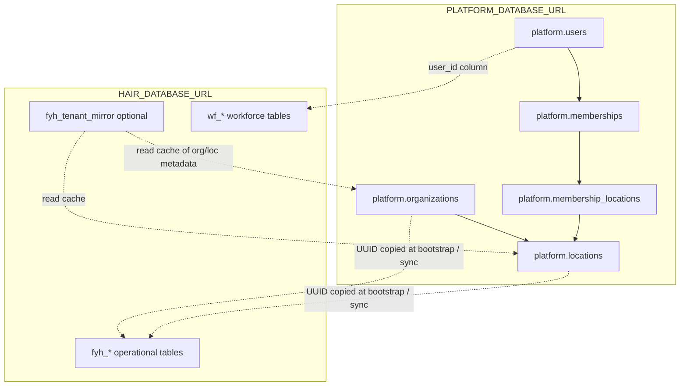

# FYHAIR SaaS — Phase 0B Architecture Decisions (Revised)

> Resolves Section 20 open questions from [PHASE_0A_SAAS_AUDIT.md](./PHASE_0A_SAAS_AUDIT.md).  
> **Revision:** cross-database identity model, mirrored IDs, consistency validation — no cross-DB PostgreSQL FKs.  
> Status: **For stakeholder review** — no schema or production code changes until approved.

---

## Document status

| Item | State |
|------|--------|
| Phase 0A audit | Code/schema inspection only — **no DB queries** ([PHASE_0A_SAAS_AUDIT.md](./PHASE_0A_SAAS_AUDIT.md)) |
| Phase 0B introspection | **Separate follow-up** — read-only production queries ([PHASE_0B_INTROSPECTION.md](./PHASE_0B_INTROSPECTION.md)) |
| This document | Architecture decisions for implementation planning |
| Schema / app code | **Not modified** pending sign-off |

---

## Decision summary

| # | Topic | Recommendation | Phase |
|---|--------|----------------|-------|
| 1 | Platform database | New `PLATFORM_DATABASE_URL`; schema `platform.*` | 0B schema |
| 2 | Global identity | `platform.users` (one conceptual model; not a separate `platform_users` table name) | 0B schema |
| 3 | Cross-DB tenant IDs | Mirrored UUIDs in Hair DB — **no PostgreSQL FK to Platform** | 0B design |
| 4 | Staff unification | Keep `fyh_staff` + `wf_employees`; link via `wf_employees.fyh_staff_id` (Hair FK only) | 0B link column |
| 5 | Stock model | `fyh_location_stock`; deprecate `fyh_products.stock_qty` | 1A |
| 6 | SaaS routing | Org picker on single host for v1; subdomain per org in v2 | 1A / 2 |
| 7 | Invoice numbering | Per-organization sequence in Hair DB | 1A |
| 8 | Customer phone uniqueness | Per-organization unique in Hair DB | 1A |
| 9 | Workforce `engine_id` | Product tag only; org scope from Platform `memberships` | 1A |
| 10 | Business Financial OS | Org-level aggregates; location detail in Salon Engine | 1B |

---

## 0. Cross-database boundary (critical)

### Problem

`PLATFORM_DATABASE_URL` and `HAIR_DATABASE_URL` are **different PostgreSQL databases** (same monorepo pattern as PG / Capital / Owner today). PostgreSQL **cannot enforce foreign keys across databases**.

Therefore:

- Hair DB columns like `organization_id` and `location_id` are **logical references** (opaque UUIDs copied from Platform).
- They are **not** `REFERENCES platform.organizations(id)` — that syntax is impossible cross-DB.
- Tenant-safe integrity is enforced by **application guards**, optional **local mirror tables**, and **reconciliation jobs** — not cross-DB FK constraints.



### What lives where (source of truth)

| Concern | Owner DB | SSOT tables |
|---------|----------|-------------|
| Global login identity | **Platform** | `platform.users` |
| Tenant (salon business) | **Platform** | `platform.organizations` |
| Sites under a tenant | **Platform** | `platform.locations` |
| User access to an org | **Platform** | `platform.memberships` |
| Location scope of a membership | **Platform** | `platform.membership_locations` |
| SaaS plan / subscription | **Platform** | `platform.plans`, `platform.organization_subscriptions` |
| Platform super-admin | **Platform** | `platform.platform_memberships` |
| Salon CRM, appointments, invoices | **Hair** | `fyh_*` |
| Workforce HR / payroll rows | **Hair** | `wf_*` |
| Session tokens (FYH) | **Hair** | `wf_auth_sessions`, `fyh_auth_sessions` |

**Rule:** Platform owns **who** and **which org/location they may access**. Hair owns **salon operational data** tagged with mirrored org/location UUIDs.

---

## 0B. Mirrored IDs in Hair DB (exact list)

These UUID values originate in Platform (or are allocated there first at org creation) and are **stored again** in Hair without cross-DB FK.

### Columns added to Hair / Workforce tables

| Mirrored ID | Hair column | Mirrors (Platform) | On which Hair tables | PostgreSQL FK in Hair? |
|-------------|-------------|-------------------|----------------------|------------------------|
| Organization | `organization_id` | `platform.organizations.id` | All `fyh_*`, all `wf_*` operational tables | **No** — logical reference only |
| Location | `location_id` | `platform.locations.id` | Location-scoped `fyh_*` (appointments, invoices, expenses, stock, purchases, resources, …) | **No** — logical reference only |
| Global user | `user_id` | `platform.users.id` | `wf_employees`, `fyh_admin_users` (legacy link) | **No** — logical reference only |

### IDs that stay Platform-only (never duplicated on every Hair row)

| ID | Platform table | Resolved at |
|----|----------------|-------------|
| `membership_id` | `platform.memberships` | Request/session (`user_id` + `organization_id`) |
| `membership_location` rows | `platform.membership_locations` | Permission / location picker |
| `subscription_id` | `platform.organization_subscriptions` | Entitlement gate before app access |
| `plan_id` | `platform.plans` | Subscription only |

Session/cookies carry `organization_id` and `location_id` (mirrored UUIDs). `membership_id` is computed from Platform, not stored on `fyh_invoices`.

### Optional local mirror table (Hair DB — recommended)

Read-optimized cache and reconciliation anchor. **Not** the SSOT.

```sql
-- Hair DB only; no FK to Platform
fyh_tenant_mirror (
  organization_id uuid PRIMARY KEY,  -- same id as platform.organizations
  organization_slug text NOT NULL,
  organization_name text NOT NULL,
  organization_status text NOT NULL, -- active | suspended
  default_location_id uuid NOT NULL, -- same id as platform.locations
  synced_at timestamptz NOT NULL
);

fyh_tenant_location_mirror (
  location_id uuid PRIMARY KEY,       -- same id as platform.locations
  organization_id uuid NOT NULL,    -- matches fyh_tenant_mirror
  name text NOT NULL,
  is_primary boolean NOT NULL DEFAULT false,
  status text NOT NULL,
  synced_at timestamptz NOT NULL
);
```

Purpose:

- Fast `assertOrgActive(organization_id)` without Platform round-trip on every query (with TTL / event refresh).
- Reconciliation: orphan rows in `fyh_customers` whose `organization_id` ∉ mirror → alert.
- Bootstrap verification: mirror row must exist before Hair backfill marks NOT NULL.

### Hair-only FKs (unchanged — same database)

These remain real PostgreSQL FKs **inside Hair DB**:

| Relationship | FK |
|--------------|-----|
| `wf_employees.fyh_staff_id` → `fyh_staff.id` | Hair → Hair |
| `fyh_appointments.customer_id` → `fyh_customers.id` | Hair → Hair |
| `fyh_invoices.customer_id` → `fyh_customers.id` | Hair → Hair |
| All existing `fyh_*` child → parent FKs | Hair → Hair |

**Tenant-safe Hair FK rule (post-migration):** child and parent must share the same `organization_id`; enforced in application before insert (composite FK optional **within Hair** later: `(organization_id, customer_id)` — still no Platform FK).

### `staff_locations` (Hair DB)

Operational roster ↔ site assignment. Uses **mirrored** `location_id` (no Platform FK).

```sql
-- Hair DB
fyh_staff_locations (
  staff_id uuid NOT NULL REFERENCES fyh_staff(id),
  organization_id uuid NOT NULL,  -- mirrored; must match staff.organization_id
  location_id uuid NOT NULL,      -- mirrored; must exist in tenant_location_mirror
  is_primary boolean NOT NULL DEFAULT false,
  PRIMARY KEY (staff_id, location_id)
);
```

Authorization to *use* a location still comes from `platform.membership_locations`; `fyh_staff_locations` defines where the stylist *works*.

---

## 0C. Cross-DB consistency validation

Because PostgreSQL cannot enforce cross-DB FKs, validation is **explicit and layered**.

### 1. Request-time (every protected FYH request)

```
fyh_session → Hair: wf_auth_sessions / employee
           → Platform: platform.users (via employee.user_id)
           → Platform: platform.memberships (user_id + cookie fyh_org_id)
           → Platform: platform.membership_locations (membership + cookie fyh_location_id)
           → TenantContext { userId, organizationId, locationId, membershipId, permissions }
```

If cookie `fyh_org_id` is not in the user's memberships → **403** (do not query Hair with that org id).

### 2. Write-time (server actions / services)

Before any Hair insert/update with `organization_id` / `location_id`:

| Check | Mechanism |
|-------|-----------|
| Org exists and active | Platform read OR `fyh_tenant_mirror.organization_status = 'active'` |
| Location belongs to org | Platform read OR `fyh_tenant_location_mirror` row |
| User may access location | `platform.membership_locations` (always Platform for auth) |
| Hair parent row same org | `assertSameOrg(child.organization_id, parent.organization_id)` in app |
| Customer belongs to org | `fyh_customers.organization_id = ctx.organizationId` before linking appointment |

No Hair write proceeds with a stale or forged org UUID if session resolution passed.

### 3. Bootstrap / provisioning (two-phase, not one transaction)

Platform and Hair **cannot share a single DB transaction**. Order:

1. **Platform DB:** `INSERT platform.organizations`, `platform.locations`, `platform.users`, `platform.memberships`, …
2. **Hair DB:** `INSERT fyh_tenant_mirror` + `fyh_tenant_location_mirror` with **same UUIDs**
3. **Hair DB:** backfill `organization_id` / `location_id` on all rows
4. **Verify:** reconciliation script (below)
5. **Hair DB:** `NOT NULL` constraints only after verify green

Failure handling: if step 3 fails, Platform org exists but Hair empty — mark org `provisioning` in Platform until retry (no partial NOT NULL).

### 4. Ongoing sync

| Event | Action |
|-------|--------|
| Org created / updated | Platform writer updates mirror (sync job or inline after Platform commit) |
| Location added | Insert `fyh_tenant_location_mirror` |
| Org suspended | Mirror `organization_status`; Hair reads reject writes |
| Subscription lapses | Platform entitlement gate blocks login before Hair touched |

### 5. Reconciliation jobs (read-only + alerts)

Script: `hair-saas-tenant-reconcile-readonly.ts` (future)

| Check | Query concept |
|-------|----------------|
| Orphan org ids in Hair | `DISTINCT organization_id` in `fyh_customers` not in mirror / Platform |
| Orphan location ids | location-scoped rows with `location_id` not in mirror for that org |
| Mirror drift | Platform org count vs mirror count |
| Cross-org FK violation | appointments where customer.organization_id ≠ appointment.organization_id |

Run on staging before cutover; weekly on production (read-only).

### 6. What we do **not** rely on

- Cross-database PostgreSQL FKs
- Assuming `HAIR_DATABASE_URL` isolation equals tenant isolation (multi-org shares one Hair DB)
- `engine_id = 'fyh_salon'` as tenant boundary (product tag only)

---

## 1. Platform database placement

**Recommendation: Option A — new `PLATFORM_DATABASE_URL`**

### Rationale

- Matches target architecture: Platform → Organizations → Memberships → Locations above product Engines.
- PG, Capital, Owner remain on existing URLs.
- Clear boundary for cross-DB identity rules (this document §0).

### Platform schema: `platform` (not `public.platform_users`)

All Platform tables live in PostgreSQL schema **`platform`**. Documentation and SQL refer to **`platform.users`** — the global identity table — not a parallel concept called `platform_users`.

| Table (documented name) | Purpose |
|-------------------------|---------|
| `platform.users` | Global identity (email, password hash, status) |
| `platform.platform_memberships` | Platform-level admin access |
| `platform.plans` | SaaS plan catalog |
| `platform.organizations` | Tenant boundary (= Account v1) |
| `platform.organization_subscriptions` | Plan + status + period |
| `platform.locations` | Sites under an organization |
| `platform.memberships` | `platform.users` ↔ `platform.organizations` (+ role) |
| `platform.membership_locations` | Membership ↔ location scope (relational, not JSON) |
| `platform.organization_entitlements` | Feature flags / limits from plan |

Drizzle may map these to `platformUsers` in TypeScript; **architecture name** remains `platform.users`.

### Env contract

```
PLATFORM_DATABASE_URL=postgresql://...
assertPlatformDatabaseIsolated() — must ≠ DATABASE_URL, HAIR_DATABASE_URL, INVEST_DATABASE_URL, OWNER_DATABASE_URL
```

### Alternatives rejected

- **Extend Hair DB only:** Platform layer not reusable for PG; blurs Engine vs Platform constitution.
- **Unified mega-database:** Violates isolation asserts; unacceptable blast radius.
- **`public.platform_users` table name:** Avoid — use schema-qualified `platform.users` for clarity.

---

## 2. Global identity — `platform.users`

**Recommendation:** One global user row per person in **`platform.users`**. Product-specific tables hold **links**, not parallel identity models.

### Model

```
platform.users (id, email, password_hash?, status, created_at)
platform.memberships (user_id → platform.users, organization_id → platform.organizations, role, ...)

Hair DB (mirrored user_id only):
  wf_employees.user_id     → platform.users.id  (logical, no cross-DB FK)
  fyh_admin_users.user_id  → platform.users.id  (legacy sunset)
```

### Rules

- **One email = one `platform.users` row** (login identifier).
- Multiple org access = multiple `platform.memberships` rows, not multiple user rows.
- **Owner OS** `oo_admin_users.user_id` → `platform.users.id` when linked (Phase 2).
- **PG residents** (`customers`) remain PG-only unless they become staff via `platform.users`.

### Login path (unchanged cookie)

`fyh_session` → Hair session table → `wf_employees` → `platform.users` → `platform.memberships` for active org.

Password hash may live on `platform.users` (preferred long-term) or remain on `wf_employees` during migration with dual-read — **decision at implementation**, not duplicate identity tables.

### Alternatives rejected

- Treating `platform_users` as a different entity from `platform.users` — naming confusion only; one model.
- SaaS users only in Platform while workforce keeps separate identity forever.

---

## 3. Staff unification

**Recommendation: Option B — dual roster with Hair-only FK link**

| Table | DB | Used for |
|-------|-----|----------|
| `fyh_staff` | Hair | Scheduler, commissions, invoice stylist |
| `wf_employees` | Hair | HR profile, login bridge, payroll |

### Target (v1)

```sql
-- Hair DB only
ALTER wf_employees ADD COLUMN fyh_staff_id uuid REFERENCES fyh_staff(id);
-- fyh_staff_locations: see §0B (mirrored location_id, no Platform FK)
```

- Scheduler keeps `fyh_staff` — no scheduler rewrite in v1.
- Salon operators: `wf_employees.fyh_staff_id` required after migration.
- `platform.memberships` controls *access*; `fyh_staff_locations` controls *which chair/stylist roster* at which site.

---

## 4. Stock model for multi-location

**Recommendation:** `fyh_location_stock` in Hair DB (mirrored `organization_id`, `location_id`).

```sql
fyh_location_stock (
  id uuid PRIMARY KEY,
  organization_id uuid NOT NULL,  -- mirrored
  location_id uuid NOT NULL,      -- mirrored
  product_id uuid NOT NULL REFERENCES fyh_products(id),
  quantity numeric NOT NULL DEFAULT 0,
  UNIQUE (organization_id, location_id, product_id)
)
```

- Deprecate `fyh_products.stock_qty` after backfill to default location row.
- v1 may ship with one location per org; schema still location-aware.

---

## 5. SaaS routing model

**Phased: org picker on single host (v1) → subdomain per org (v2)**

- v1: `fyhair.awesomepg.in`; cookies `fyh_org_id`, `fyh_location_id` (mirrored UUIDs validated against Platform).
- v2: `{slug}.fyhair.app` resolves `platform.organizations.slug` before session.

---

## 6. Invoice numbering

**Per-organization sequence in Hair DB** (mirrored `organization_id`):

- Table `fyh_org_invoice_sequences (organization_id, prefix, next_seq)` — **Hair DB**, no FK to Platform.
- Unique index `(organization_id, invoice_number)` on `fyh_invoices`.
- Bootstrap copies current `fyh_settings` sequence into bootstrap org row.

---

## 7. Customer phone uniqueness

**Per-organization unique in Hair DB:**

```sql
UNIQUE (organization_id, phone) WHERE phone IS NOT NULL AND is_active = true
```

Cross-org duplicates allowed (different salons, different `fyh_customers` rows).

---

## 8. Workforce `engine_id` evolution

**Retain `engine_id` as product/engine tag only.** Tenant boundary = `platform.organizations.id` mirrored as `organization_id`, not `engine_id`.

```sql
wf_engine_memberships (
  employee_id,
  organization_id uuid NOT NULL,  -- mirrored from platform.organizations
  engine_id text NOT NULL DEFAULT 'fyh_salon',
  ...
)
```

Authorization: `platform.memberships` + `platform.membership_locations` (Platform DB). `wf_permission_grants` sunsets toward membership-based grants.

---

## 9. Business Financial OS boundary

Org-level aggregates from Hair (filtered by mirrored `organization_id`):

- Revenue: `fyh_invoices`
- Opex: `fyh_expenses`
- AP: `fyh_vendor_payables` / payments
- Labor: `wf_payroll_*`, `fyh_commission_entries`

Owner OS: `oo_integration_facts` keyed by `(platform.users.id, organization_id, engine, period)` — explicit user consent link.

Personal Owner OS never stores org-operational row detail.

---

## 10. Phase 0A vs Phase 0B introspection (documentation split)

| Phase | Method | Row counts | FK/index inventory |
|-------|--------|------------|-------------------|
| **Phase 0A** | Code + Drizzle schema only | **Not collected** | From schema files only |
| **Phase 0B introspection** | Read-only SQL against `HAIR_DATABASE_URL` | [PHASE_0B_INTROSPECTION.md](./PHASE_0B_INTROSPECTION.md) | [PHASE_0B_INTROSPECTION.json](./PHASE_0B_INTROSPECTION.json) |

Phase 0A conclusions do not use production row counts. Sizing and index lists for migration planning come **only** from Phase 0B introspection artifacts.

---

## Sign-off checklist

- [ ] Accept **5th DB** (`PLATFORM_DATABASE_URL`) with schema `platform.*`
- [ ] Accept **no cross-DB PostgreSQL FKs** — mirrored UUIDs + app validation + mirror/reconcile
- [ ] Accept **`platform.users`** as sole global identity name
- [ ] Accept **`fyh_tenant_mirror`** (or equivalent) in Hair for reconcile/cache
- [ ] Accept v1 **single host + org picker** (no subdomain at launch)
- [ ] Accept **per-org** invoice sequence and customer phone uniqueness
- [ ] Accept **dual staff model** (`fyh_staff` + `wf_employees.fyh_staff_id`)
- [ ] Engineering accepts service-layer tenant filters ([PHASE_0B_TENANT_CONTEXT.md](./PHASE_0B_TENANT_CONTEXT.md)) — to be updated for cross-DB rules after this approval

---

## Related documents

| Doc | Notes |
|-----|-------|
| [PHASE_0A_SAAS_AUDIT.md](./PHASE_0A_SAAS_AUDIT.md) | Code-only audit; introspection cross-refs §10 |
| [PHASE_0B_INTROSPECTION.md](./PHASE_0B_INTROSPECTION.md) | Production read-only metrics (separate from 0A) |
| [PHASE_0B_TENANT_CONTEXT.md](./PHASE_0B_TENANT_CONTEXT.md) | Update pending this approval |
| [PHASE_0B_BOOTSTRAP_MIGRATION.md](./PHASE_0B_BOOTSTRAP_MIGRATION.md) | Update pending this approval |
| [PHASE_0B_AUTH_MIGRATION.md](./PHASE_0B_AUTH_MIGRATION.md) | Update pending this approval |

**Next after approval:** Revise bootstrap/auth/tenant docs for two-DB provisioning; then **staging-only** migration plan — not production.
