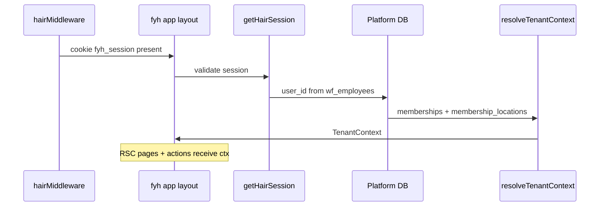

# FYHAIR SaaS — TenantContext Design & Service Layer Audit

> Phase 0B design artifact. No implementation in this document.  
> Decisions: [PHASE_0B_DECISIONS.md](./PHASE_0B_DECISIONS.md) · Audit: [PHASE_0A_SAAS_AUDIT.md](./PHASE_0A_SAAS_AUDIT.md)

---

## 1. Goals

1. **One authoritative tenant context** per request — no ad-hoc `organizationId` parameters scattered without validation.
2. **Every `hairDb` query** filters by `organization_id`; location-scoped modules also filter `location_id`.
3. **Services become tenant-aware** — callers pass `TenantContext` (or `TenantDb` wrapper); raw `hairDb` imports forbidden outside tenant layer (future forbidden-import test).
4. **Compatible with existing `fyh_session`** during migration (see [PHASE_0B_AUTH_MIGRATION.md](./PHASE_0B_AUTH_MIGRATION.md)).

---

## 2. TenantContext type

```typescript
/** Resolved once per server request / server action / API route. */
export type TenantContext = {
  /** Platform user — global identity */
  userId: string;

  /** Active organization (tenant boundary) */
  organizationId: string;

  /** Membership row — authorization source */
  membershipId: string;

  /** Role within org: owner | co_owner | member | ... */
  membershipRole: MembershipRole;

  /** Locations this membership may access (from membership_locations) */
  allowedLocationIds: string[];

  /** Active location for this request — set by UI picker or default primary */
  locationId: string;

  /** Workforce bridge — optional during migration */
  employeeId?: string;
  legacyAdminId?: string;

  /** Resolved permission grants for this membership + location */
  permissions: WorkforcePermissionKey[];
};

export type MembershipRole = 'owner' | 'co_owner' | 'member' | 'staff';
```

### TenantDb executor

```typescript
/** hairDb wrapper that injects org/location predicates */
export type TenantDb = {
  organizationId: string;
  locationId: string;
  /** Drizzle transaction executor with tenant SET vars for optional RLS */
  db: typeof hairDb;
  tx?: HairTx;
};
```

---

## 3. Resolution flow



### Resolution rules

| Step | Source | Rule |
|------|--------|------|
| 1. User | `wf_auth_sessions` or `fyh_auth_sessions` | Valid, non-revoked session |
| 2. Employee / admin | Workforce or legacy bridge | `employee.user_id` |
| 3. Organization | Cookie `fyh_org_id` or single membership | Must be in user's memberships |
| 4. Location | Cookie `fyh_location_id` or primary `staff_locations` / org default | Must be in `allowedLocationIds` |
| 5. Permissions | `membership_locations` + grants | Not JSON-only long term |

### Middleware headers (optional)

After resolution in layout, set for downstream:

- `x-fyh-organization-id`
- `x-fyh-location-id`

Edge middleware **cannot** resolve tenant (no DB on edge) — resolution stays server-side.

---

## 4. Service layer contract (post-migration)

### Required pattern

```typescript
export async function listCustomers(ctx: TenantContext, opts?: ListOpts) {
  return hairDb
    .select()
    .from(fyhCustomers)
    .where(eq(fyhCustomers.organizationId, ctx.organizationId))
    ...
}
```

### Location-scoped pattern

```typescript
export async function listAppointments(ctx: TenantContext, day: string) {
  return hairDb
    .select()
    .from(fyhAppointments)
    .where(
      and(
        eq(fyhAppointments.organizationId, ctx.organizationId),
        eq(fyhAppointments.locationId, ctx.locationId),
      ),
    )
    ...
}
```

### Insert validation

Before insert, assert parent row belongs to same org:

```typescript
await assertCustomerInOrg(ctx, customerId);
await assertStaffInOrg(ctx, staffId);
```

### Transaction + RLS hook (future)

```typescript
await hairDb.transaction(async (tx) => {
  await tx.execute(sql`SELECT set_config('app.organization_id', ${ctx.organizationId}, true)`);
  ...
});
```

---

## 5. Authorization integration

| Layer | Change |
|-------|--------|
| `requirePermission(key)` | Also require `resolveTenantContext()` — permission checked **in org context** |
| `requireWorkforcePermission` | Map membership grants, not global `engine_id` alone |
| Services | Accept `TenantContext` first parameter |
| RSC pages | `const ctx = await requireTenantContext()` then pass to services |
| Public routes | No tenant — invoice lookup must include org scope in query |

---

## 6. Forbidden-import matrix (Phase 1 target)

Pattern from Room OS (`docs/ROOM_OS.md`):

| Forbidden | Allowed |
|-----------|---------|
| `import { hairDb } from '@/src/hair/db/client'` in `app/**` pages | `requireTenantContext` + service with ctx |
| Direct `hairDb` in new feature services | `tenantDb` module only |
| Scripts without `--org` flag touching fyh tables | Readonly audit scripts only |

Test file target: `tests/hair/unit/tenantForbiddenImports.test.ts`

---

## 7. Service layer audit — all 44 modules

**Legend**

- **Org filter:** must add `organization_id` predicate on all queries/writes
- **Loc filter:** must add `location_id` predicate (or join through location-scoped parent)
- **Auth today:** none in service layer (layout/actions only)
- **Priority:** migration order risk

| Service | Primary tables | Org | Loc | Auth today | Priority |
|---------|----------------|-----|-----|------------|----------|
| `appointments.ts` | appointments, appointment_services, timeline | Yes | Yes | None | CRITICAL |
| `invoices.ts` | invoices, lines, payments, ledger, settings | Yes | Yes | None | CRITICAL |
| `customers.ts` | customers, notes, timeline | Yes | No | None | CRITICAL |
| `financialLedger.ts` (via invoices) | financial_ledger | Yes | No* | None | CRITICAL |
| `quickSale.ts` | invoices, lines, products, services | Yes | Yes | None | CRITICAL |
| `quickSaleHold.ts` | invoices, lines, attributions | Yes | Yes | None | CRITICAL |
| `purchaseEngine.ts` | purchases, stock, payables | Yes | Yes | None | HIGH |
| `vendorPaymentEngine.ts` | vendor_payments, allocations | Yes | No** | None | HIGH |
| `vendorBrain.ts` | vendors, purchases, payments | Yes | Mixed | None | HIGH |
| `purchaseBrain.ts` | purchases, payables | Yes | Yes | None | HIGH |
| `purchaseReturnEngine.ts` | purchase_returns, stock | Yes | Yes | None | HIGH |
| `purchases.ts` | purchases, PO, GRN | Yes | Yes | None | HIGH |
| `stock.ts` | stock_movements, products | Yes | Yes | None | HIGH |
| `products.ts` | products, brands, stock | Yes | Loc stock | None | HIGH |
| `floorStock.ts` | floor_issues, products | Yes | Yes | None | MEDIUM |
| `expenses.ts` | expenses | Yes | Yes | None | MEDIUM |
| `loyaltyOps.ts` | memberships, packages, ledger | Yes | No | None | MEDIUM |
| `commissionEngine.ts` | commission_entries, rules | Yes | Yes | None | MEDIUM |
| `salesAttribution.ts` | invoice_line_attributions | Yes | Yes | None | MEDIUM |
| `bookingContext.ts` | customers, appointments, ledger | Yes | Yes | None | MEDIUM |
| `customerTimeline.ts` | timeline, invoices, appointments | Yes | No | None | MEDIUM |
| `search.ts` | customers, invoices, appointments, catalog | Yes | Partial | None | MEDIUM |
| `dashboard.ts` | invoices, appointments, expenses | Yes | Yes | None | MEDIUM |
| `revenueDashboard.ts` | invoices, appointments, customers | Yes | Yes | None | MEDIUM |
| `financialDashboard.ts` | invoices, expenses, ledger | Yes | Mixed | None | MEDIUM |
| `staffPerformanceDashboard.ts` | invoices, attributions, staff | Yes | Yes | None | MEDIUM |
| `staffPerformance.ts` | invoices, commissions | Yes | Yes | None | MEDIUM |
| `staffPerformanceExport.ts` | (pure transform) | — | — | None | LOW |
| `reportQueries.ts` | cross-table analytics | Yes | Optional | None | MEDIUM |
| `reports.ts` | invoices, expenses | Yes | Mixed | None | MEDIUM |
| `invoiceRegisterQueries.ts` | invoices, payments | Yes | Yes | None | MEDIUM |
| `invoiceRegisterExport.ts` | (export) | Yes | Yes | None | LOW |
| `historicalImport.ts` | import batches, invoices | Yes | Yes | None | MEDIUM |
| `historicalImportCustomers.ts` | customers | Yes | No | None | MEDIUM |
| `historicalImportExport.ts` | invoices, lines | Yes | Yes | None | LOW |
| `historicalImportServiceMap.ts` | services map | Yes | No | None | LOW |
| `salonServices.ts` | services, categories | Yes | No | None | MEDIUM |
| `staff.ts` | staff | Yes | No | None | MEDIUM |
| `staffSchedules.ts` | staff_schedules | Yes | Loc | None | MEDIUM |
| `resources.ts` | resources | Yes | Yes | None | MEDIUM |
| `brands.ts` | brands | Yes | No | None | LOW |
| `vendors.ts` | vendors | Yes | No | None | MEDIUM |
| `settings.ts` | settings | Yes | No | None | HIGH |
| `notifications.ts` | outbox, templates, customers | Yes | No | None | LOW |
| `ownerFinancialSummary.ts` | expenses (Owner adapter) | Yes | No | None | LOW |

\* Ledger is org-scoped (customer wallet); invoice link is location child — filter via customer org.  
\*\* Vendor AP org-level per [PHASE_0B_DECISIONS.md](./PHASE_0B_DECISIONS.md); payments may need org filter only.

### Modules with zero DB access

| Service | Notes |
|---------|-------|
| `staffPerformanceExport.ts` | Builds export from snapshot passed in — tenant on caller |

---

## 8. Implementation phases for services

| Phase | Work |
|-------|------|
| **1A** | `tenantContext.ts`, `requireTenantContext()`, cookies `fyh_org_id` / `fyh_location_id` |
| **1B** | Add nullable `organization_id` / `location_id` columns; backfill (bootstrap) |
| **1C** | Migrate CRITICAL services (appointments, invoices, customers) |
| **1D** | Migrate HIGH (purchases, stock, vendors) |
| **1E** | Migrate MEDIUM + reports |
| **1F** | Forbidden-import test; remove direct `hairDb` from pages |

---

## 9. Owner OS adapter note

`ownerFinancialSummary.ts` must accept `organizationId` when Owner integration is org-specific:

```typescript
getFyhOwnerFinancialSummary({ organizationId, period })
```

Owner OS calls with explicit org link — never global Hair singleton.

---

## Related

- [PHASE_0B_BOOTSTRAP_MIGRATION.md](./PHASE_0B_BOOTSTRAP_MIGRATION.md)
- [PHASE_0B_AUTH_MIGRATION.md](./PHASE_0B_AUTH_MIGRATION.md)
