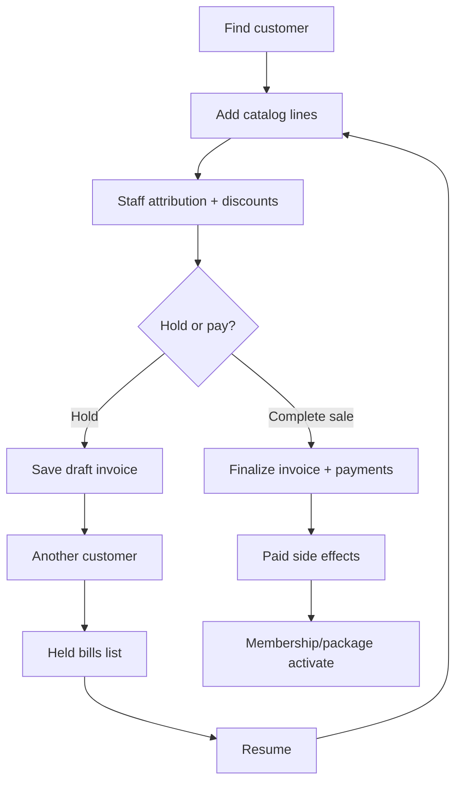

# For Your Hair — Workflows

## Quick actions vs + New

| Control | Purpose |
|---------|---------|
| 9-dot (top bar, before search) | **Express Sale** (`/quick-sale`), **Advance Payment** (`/advance-payment`) |
| + New (top bar) | New appointment, customer, service, product, package/membership (loyalty hub), staff |

Hold bill remains inside Express Sale only—not in the launcher.

## Quick Sale (happy path)

### Hold bill

1. Select customer and build cart (same as checkout).
2. **Hold bill** → persists `fyh_invoices` row (`status = draft`, `source = quick_sale`, `HOLD-*` number).
3. Lines + `fyh_invoice_line_attributions` + `pos_draft` (payment fields) saved.
4. Reception returns to customer search; **Held bills** lists open drafts.
5. **Resume** restores cart, staff picks, discounts, and payment draft inputs.
6. **Complete sale** converts hold → real invoice number, clears `pos_draft`, records payments → `paid`. Hold disappears from list automatically.

Held bills are hidden from the main Billing list until finalized.

## Appointment checkout (unchanged)

Booked → … → Completed → Invoice → Pay. Attributions sync on pay if not already present (Quick Sale writes them at create).

## Sales attribution on pay

| Source | When attributions written |
|--------|---------------------------|
| Quick Sale | Invoice create (including hold save) |
| Appointment | Pay (`syncInvoiceLineAttributions` from line staff) |

Reports aggregate `attributed_net_paise` for paid invoices in the selected period.

## Future: inventory & redemption

Documented in [FEATURES.md](./FEATURES.md) — implemented only in the next phase; Quick Sale cart and invoice engine already accept all line kinds.
