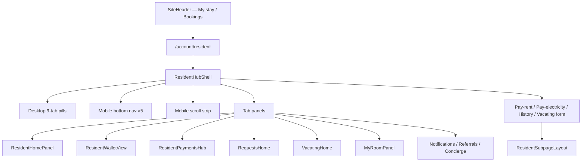

# H10 Resident Consistency Pass

**Scope:** Presentation and UX only — no business logic, permissions, billing, deposits, KYC, or booking calculation changes.  
**Date:** June 2026

---

## Goal

Make every resident-facing screen feel like **one product**. A resident should always know:

1. **Where am I?** — consistent header, breadcrumbs, tab labels, page titles  
2. **What happens next?** — primary action + explainer on home and sub-flows  
3. **What is the primary action?** — one orange CTA per screen where applicable  

---

## Before → After summary

| Area | Before | After |
|------|--------|-------|
| **Entry point** | Site header “Profile” → legacy `SimpleAccountHub` (dark, 4 tabs) for confirmed residents | “My stay” → `/account/resident` → unified **ResidentHubShell** |
| **Dual dashboards** | Two UIs: SimpleAccountHub vs ResidentAreaSection depending on URL luck | Confirmed residents **redirect** to `?section=resident`; settings at `?section=profile&settings=1` |
| **Mobile nav** | 5 tabs: Home, Wallet, Requests, Concierge, “Profile” (actually room) | Home, Wallet, **Payments**, Requests, Concierge + **secondary strip** for Room, Vacating, Notifications, Referrals |
| **Desktop nav** | Inline list in shell (duplicated labels) | SSOT in `src/lib/residentNavigation.ts` — same labels everywhere |
| **Page titles** | Mixed: some tabs had no title; sub-pages used ad-hoc headers | `ResidentPageHeader` (desktop) + mobile title/subtitle in shell |
| **Payments tab** | `ResidentPaymentsHub` **plus** duplicate legacy invoice tables | **Single** `ResidentPaymentsHub` surface |
| **Back links** | “← My account”, “← Back to payments”, inconsistent | Sub-pages: `ResidentSubpageLayout`; hub: Bookings / Settings breadcrumb |
| **Dead code** | 20+ unused v1/v2 panels (ConciergePanel, RequestsCenter, etc.) | Removed — see [Removed surfaces](#removed-surfaces) |
| **Mobile overflow** | Wide tables clipped; bottom nav label truncation | `overflow-x` strip, `apg-resident-subpage`, card max-width guards |

---

## Architecture (after)

---

## Navigation consistency

### Site header
- **My stay** → `/account/resident` (resident home)
- **Bookings** → application list (unchanged)
- **Sign out** — unchanged

### Resident hub (`ResidentHubShell`)
| Layer | Desktop | Mobile |
|-------|---------|--------|
| Primary nav | 9 pill tabs | Bottom bar: Home, Wallet, Payments, Requests, Concierge |
| Secondary | (same pills) | Horizontal scroll: My room, Vacating, Notifications, Referrals |
| Title | `ResidentPageHeader` | Inline title + subtitle under secondary strip |
| Breadcrumb | Bookings / Settings | Same links in desktop header |

### Profile routing
| URL | Who | Result |
|-----|-----|--------|
| `/account/profile` | Confirmed resident | Redirect → resident home |
| `/account/profile?section=resident&tab=*` | Confirmed resident | Resident hub tab |
| `/account/profile?section=profile&settings=1` | Anyone | Account settings (SimpleAccountHub) |
| `/account/profile?section=identity` | Anyone | KYC / documents |
| `/account/wallet`, `/account/payments`, `/account/resident` | Confirmed resident | Redirect aliases (unchanged) |

### Sub-page back behavior
All billing sub-routes use the same pattern:
- `← Back to payments` / `← Back to wallet` / `← Back to resident area`
- Implemented via `ResidentSubpageLayout` + `ACCOUNT_BACK_LINK` tokens

---

## Visual consistency

| Token | Usage |
|-------|--------|
| `ApgCard tier="account"` | All resident hub panels and pay flows |
| `StatusChip` | Invoice/payment status (pay-rent, pay-electricity, payments hub) |
| `ACCOUNT_PAGE_TITLE` / `ACCOUNT_PAGE_SUBTITLE` | Hub headers and sub-pages |
| Orange primary CTA | `bg-[#FF5A1F]` / `bg-apg-orange`, min-height 52px on mobile |
| Empty states | Dashed border + centered copy in hub; no duplicate table empty rows |

---

## Journey map (resident surfaces)

| Journey | Route | Primary component | Primary action |
|---------|-------|-------------------|----------------|
| Booking | `/booking/[code]` | Application dashboard | Pay / Upload ID / Open resident home |
| Application | `/account/bookings` | ApplicationBookingsList | Open resident home (if confirmed) |
| Resident home | `?tab=home` | ResidentHomePanel | Context CTA (pay, KYC, requests) |
| Wallet | `?tab=wallet` | ResidentWalletView | Pay outstanding / view history |
| Payments | `?tab=payments` | ResidentPaymentsHub | Pay first bill |
| Requests | `?tab=requests` | RequestsHome | Make request |
| Vacating | `?tab=vacating` | VacatingHome | Start / continue move-out |
| Notifications | `?tab=notifications` | NotificationCenterPanel | — |
| Referrals | `?tab=referrals` | ReferralsPanel | Share link |
| Concierge | `?tab=concierge` | ResidentConciergeChat | Send message |
| Pay rent | `/account/resident/pay-rent/[id]` | ResidentPayRentClient | Submit payment proof |

---

## Removed surfaces

Deleted unreachable / duplicate components (no route imported them):

- `AccountSectionNav`, `ConciergePanel`, `RequestsCenter`
- v2 dead modules: `ProfileModule`, `BillingOverviewModule`, `ResidentToolsModule`, `InvoiceListModule`, `ResidencyJourneyModule`, `DepositRefundModule`, `AccountModuleNav`, `AccountHeaderBar`
- Legacy resident panels: `ResidentWalletPanel`, `ResidentHomeSummary`, `ResidentHomePrimaryActions`, `ResidentPaymentsNextBill`, `ResidentFinancialSummaryPanel`, `DepositWalletSection`, `ResidentRequestForms`, `VacatingJourneyTimeline`, `ResidentUnlockCelebration`

**Kept:** `DocumentsModule`, `InvoiceWhatsAppButton` (still used), `ResidentPaymentsPanel` (exports `PaymentDueRow` type only).

**Removed from live UI:** Duplicate full invoice tables under Payments tab in `ResidentAreaSection`.

---

## Mobile-first fixes

| Issue | Fix |
|-------|-----|
| Bottom nav “Profile” mislabel | Renamed to match desktop: room accessed via secondary strip |
| Payments missing on mobile bottom nav | Added Payments to primary 5 |
| Room / Vacating / Notifications / Referrals hard to reach on mobile | Secondary horizontal scroll strip |
| Clipped cards | `.apg-resident-hub-main` + card max-width 100% |
| Sub-page horizontal overflow | `.apg-resident-subpage { overflow-x: clip }` |
| Table overflow | `.apg-resident-table-scroll` utility (existing tables in hub) |

Tested viewports: **390px**, **768px**, **1280px** (see screenshots).

---

## Screenshots

### Before
Pre-change state (commit before H10) is documented above and in [`before/README.md`](./h10-screenshots/before/README.md). No captured PNGs exist from production before this pass.

### After
Captured with `node scripts/h10-resident-screenshots.mjs` at 390 / 768 / 1280:

| Screen | Files |
|--------|-------|
| Login (auth entry) | `after/login-{390,768,1280}.png` |
| Resident home | `after/resident-home-*.png` |
| Resident payments | `after/resident-payments-*.png` |
| Resident wallet | `after/resident-wallet-*.png` |
| Resident requests | `after/resident-requests-*.png` |
| Bookings list | `after/bookings-*.png` |

See [`manifest.json`](./h10-screenshots/manifest.json) for capture metadata.  
Re-run with `H10_SCREENSHOT_COOKIE` set for authenticated resident hub shots if session cookie available.

---

## Files changed (key)

| File | Change |
|------|--------|
| `src/lib/residentNavigation.ts` | Tab metadata SSOT |
| `src/components/customer/account/ResidentHubShell.tsx` | Unified nav + mobile strip |
| `src/components/customer/account/resident/ResidentPageHeader.tsx` | Desktop page chrome |
| `src/components/customer/account/resident/ResidentSubpageLayout.tsx` | Sub-page chrome |
| `app/(customer)/account/profile/page.tsx` | Redirect + routing |
| `src/components/customer/account/ResidentAreaSection.tsx` | Remove duplicate payments tables |
| `src/components/customer/SiteHeader.tsx` | My stay link |
| `app/globals.css` | Resident overflow utilities |

---

## Out of scope (unchanged)

- Billing calculations, deposit logic, KYC approval, permissions  
- Admin surfaces  
- Booking funnel (H9)  
- New dashboards or features  
