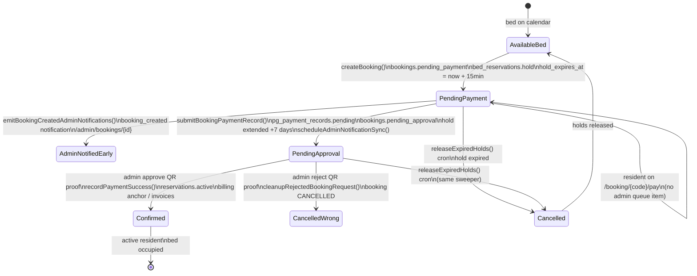
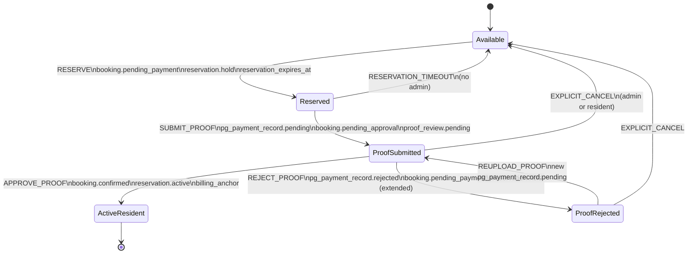
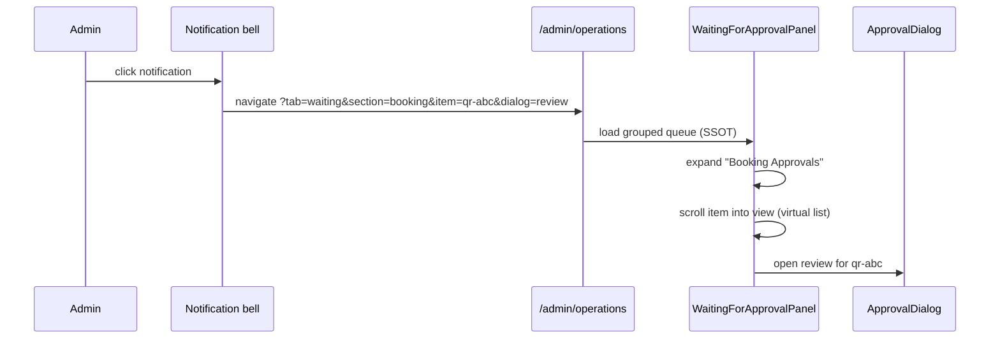

# Booking Approval + Waiting For Approval UX — Architecture Report

**Date:** 2026-07-03  
**Scope:** Booking lifecycle · Reservation holds · Admin approval queues · Notifications · Operations UI  
**Status:** Planning only — **no implementation** until this plan is approved  

Cross-links: [[PAYMENT_PROOF_APPROVAL_PIPELINE_AUDIT]] · [[ROUTES]] · `src/lib/bookingApproval.ts` · `src/services/unifiedOperationsQueue.ts`

---

## Executive summary

The product intent is clear: **a bed reservation is invisible to admin approval until the resident uploads booking payment proof**. Today the system treats “booking created” as an admin action, cancels the booking on proof rejection, shows only one of many pending approvals, and derives counts from multiple independent aggregators.

| # | Problem | Current verdict | Severity |
|---|---------|-----------------|----------|
| P1 | Notification on bed select, not proof upload | `booking_created` fires in `createBooking()` | Critical |
| P2 | Reject cancels booking | `cleanupRejectedBookingRequest` → `cancelled` | Critical |
| P3 | Waiting For Approval shows 1 of N | `reviewMode` slices to `items[0]` | Critical |
| P4 | Notifications don’t open the item | `key` vs `focus` param mismatch; page ignores both | High |
| P5 | Pre-proof in wrong queue | No “Pending Reservations”; `booking_created` not in WFA | High |
| P6 | Reservation expiry | Works via cron but conflates pre/post-proof timeouts | Medium |
| P7 | Count SSOT | 5+ independent count sources; booking double-listed | Critical |

**Recommendation:** Introduce a canonical **`admin_approval_queue`** (view or service) backed by explicit **reservation** and **proof-review** state machines. Defer all admin notifications and “Waiting For Approval” membership until proof upload. Reject proof like rent (clear proof, persist reason, keep booking). Replace the single-card review panel with a grouped, virtual-scrolled work queue.

---

## 1. Current booking lifecycle

### 1.1 Customer path (as implemented)



### 1.2 Key code touchpoints (current)

| Stage | Service / file | What happens |
|-------|----------------|--------------|
| Bed select + hold | `src/services/booking.ts` → `createBooking()` | `bookings.status = pending_payment`, `bed_reservations.status = hold`, `hold_expires_at = BOOKING_HOLD_MINUTES` (default 15) |
| **Too-early notification** | `booking.ts` L674–704 | `emitBookingCreatedAdminNotifications()` — type `booking_created`, deep link `/admin/bookings/{id}`, priority `critical` |
| Payment proof upload | `src/services/qrPayments.ts` → `submitBookingPaymentRecord()` | Inserts `pg_payment_records` (pending), extends hold +7d, `markBookingAwaitingApproval()` |
| Admin queue (proof) | `paymentProofQueue.listPendingPaymentReviews()` | Booking appears as `kind: 'qr'`, key `qr-{recordId}`, label “New booking” |
| Admin queue (duplicate) | `unifiedOperationsQueue.listPendingBookingApprovals()` | Separate row `booking-{id}` when `bookings.status = pending_approval` |
| Approve | `qrPayments` → `recordPaymentSuccess()` | `confirmed`, reservations `active`, deposit/rent workflow |
| Reject | `qrPayments` L570–584 → `cleanupRejectedBookingRequest()` | Booking **cancelled**, holds released — **not** rent-like re-upload |
| Expiry | `bookingLifecycle.releaseExpiredHolds()` | Any `hold` with expired `hold_expires_at` → reservation cancelled; booking cancelled if no remaining hold/active |

### 1.3 Holds vs calendar visibility

- `pending_payment` holds are **soft**: public calendar does not treat them as occupied (`pgBedMap`, customer queries filter `hold_expires_at > now()`).
- Only `active` reservations block availability after admin approval.
- After proof upload, hold is extended to **7 days** hardcoded in `qrPayments.ts` (not `BOOKING_HOLD_MINUTES`).

### 1.4 What admin sees today (fragmented)

| Surface | Pre-proof (`pending_payment`) | Post-proof (`pending_approval`) |
|---------|------------------------------|--------------------------------|
| Notification bell | `booking_created` (“New booking received”) | `payment_proof_uploaded` (via action_items sync) |
| Operations → Payment screenshots | **Not listed** | Listed as `qr-{id}` (but only **first** visible in UI) |
| Operations → Booking approval filter | **Not listed** | Listed as `booking-{id}` (links to booking detail, not proof panel) |
| Booking detail page | Full booking record | Full booking record |
| **Pending Reservations** (desired) | **Does not exist** | N/A |

---

## 2. Proposed booking lifecycle

### 2.1 Target flow (product spec)

```
Available Bed
    ↓ resident selects bed
Temporary Reservation (pending_payment)
    — admin: Pending Reservations only
    — no approval notification, no WFA item
    ↓ resident uploads booking payment screenshot
Waiting For Approval (booking proof queue item)
    — notification + action item + badge increment
    ↓ admin approves
Active Resident
    — bed occupied (reservation.active)
    — billing anchor created
    — deposit/rent workflow starts

Branches:
  • Never uploads proof → reservation expires → bed available (no admin action)
  • Admin rejects proof → reason stored → resident re-uploads → same booking continues
  • Explicit “Cancel Booking” or timeout → bed released
```

### 2.2 Target state machine



### 2.3 Behavioral changes vs today

| Event | Today | Proposed |
|-------|-------|----------|
| `createBooking` (customer) | `booking_created` notification + `scheduleAdminNotificationSync` | **Silent** for admin approval surfaces; optional low-priority ops metric only |
| Proof upload | Notification + WFA + duplicate queues | **First** admin approval signal; single queue item |
| Proof reject | Cancel booking + release bed | Reject **proof only**; booking stays `pending_payment`; show reason + “Upload again” |
| Proof re-upload | N/A (booking dead) | New `pg_payment_records` row or reset pending row; transition back to `pending_approval` |
| Hold expiry (no proof) | Cancel booking | Same outcome; surface only under **Pending Reservations** |
| Hold expiry (after proof) | Same 7d sweeper can cancel mid-review | **Separate** `proof_review_expires_at` or disable auto-cancel while `proof_review.status = pending` |

---

## 3. Reservation states

Proposed explicit **reservation phase** (orthogonal to `bookings.status` enum — can be derived or stored):

| Phase | `bookings.status` | `bed_reservations.status` | `hold_expires_at` | Visible admin surface |
|-------|-------------------|---------------------------|-------------------|------------------------|
| `temporary_reservation` | `pending_payment` | `hold` | `now + RESERVATION_TIMEOUT` (e.g. 15–30 min, env) | **Pending Reservations** |
| `proof_under_review` | `pending_approval` | `hold` | `now + PROOF_REVIEW_TIMEOUT` (e.g. 7d, env) | **Waiting For Approval → Booking Approvals** |
| `proof_rejected_awaiting_reupload` | `pending_payment` | `hold` | extended reservation window | Pending Reservations + resident banner |
| `occupied` | `confirmed` | `active` | `null` | Residents / billing |
| `released` | `cancelled` | `cancelled` | `null` | Audit only |

### 3.1 Pending Reservations (new admin surface)

**Purpose:** Operational visibility for in-flight checkouts **without** implying admin approval work.

**Query (conceptual):**

```sql
SELECT b.* FROM bookings b
JOIN bed_reservations br ON br.booking_id = b.id AND br.kind = 'primary'
WHERE b.status = 'pending_payment'
  AND br.status = 'hold'
  AND (br.hold_expires_at IS NULL OR br.hold_expires_at > now())
  AND NOT EXISTS (
    SELECT 1 FROM pg_payment_records p
    WHERE p.booking_id = b.id AND p.status = 'pending'
  )
```

**UI:** Collapsible section under Operations (or Bed Map sidebar), sort by `hold_expires_at ASC`, show countdown, link to booking detail (read-only). **No** approve/reject actions.

### 3.2 Timeout configuration

| Env var (proposed) | Default | Applies when |
|--------------------|---------|--------------|
| `BOOKING_RESERVATION_MINUTES` | 15 (rename/clarify `BOOKING_HOLD_MINUTES`) | `pending_payment`, no pending proof |
| `BOOKING_PROOF_REVIEW_DAYS` | 7 | `pending_approval`, pending `pg_payment_records` |

**Rule:** `releaseExpiredHolds` must branch on booking phase — never cancel a `pending_approval` booking solely because the pre-proof timer fired (today both share `hold_expires_at` on the same row).

---

## 4. Approval states

### 4.1 Booking payment proof review state

Align booking with the **target** rent/electricity/deposit pattern (see [[PAYMENT_PROOF_APPROVAL_PIPELINE_AUDIT]]):

| `pg_payment_records.status` | `bookings.status` | Resident UX | Admin UX |
|----------------------------|-------------------|-------------|----------|
| _(none)_ | `pending_payment` | Pay / upload proof | Pending Reservations |
| `pending` | `pending_approval` | “Awaiting admin approval” | WFA → Booking Approvals |
| `rejected` | `pending_payment` | “Booking payment rejected — Reason: … — Upload again” | Item leaves WFA; optional history on booking detail |
| `approved` | `confirmed` | Payment success / dashboard | Resolved |

### 4.2 Rejection payload (new fields)

Persist on `pg_payment_records` (or future `payment_proof_submissions`):

- `rejection_reason` (text, required on reject)
- `rejected_at`, `rejected_by_admin_id`
- `review_round` (int, increment on each upload)

**Reject handler (proposed pseudocode):**

```
rejectBookingProof(recordId, reason):
  UPDATE pg_payment_records SET status='rejected', rejection_reason=reason, ...
  UPDATE bookings SET status='pending_payment' WHERE id=... AND status='pending_approval'
  -- DO NOT cancel bed_reservations
  EXTEND hold_expires_at by RESERVATION_EXTENSION_ON_REJECT
  resolveStalePaymentReviewArtifacts()
  notifyResident(booking_payment_rejected, reason)
  -- NO cleanupRejectedBookingRequest
```

**Deprecate:** `cleanupRejectedBookingRequest` for proof rejection (retain only for explicit cancel flows).

### 4.3 Resident re-upload UX

`/booking/{code}/pay` already allows `pending_payment` and `pending_approval`. Proposed:

- When latest proof is `rejected`, show rejection banner with admin reason (mirror `KycIdentitySection` / deposit refund patterns).
- Clear `dup` guard: allow new upload when prior record is `rejected`, not only when no `pending` row exists.
- On re-upload: new `pending` record → `markBookingAwaitingApproval()` again.

---

## 5. Notification flow

### 5.1 Current notification paths

| Trigger | Type | Deep link | Problem |
|---------|------|-----------|---------|
| `createBooking` | `booking_created` | `/admin/bookings/{id}` | **Too early**; bypasses Operations WFA |
| Proof upload → `syncPaymentReviews` | `payment_proof_uploaded` | `/admin/operations?filter=payment_proof&booking={id}` (engine) or `&key={key}` (action_items) | Competing link shapes |
| Panel advance | — | `?filter=payment_proof&focus={key}` | **Page ignores `focus`** |
| `buildActionDeepLink` | `payment_received` | `?filter=payment_proof&key={key}` | **Page ignores `key`** |

### 5.2 Proposed notification contract

**Invariant:** Every payment-proof notification deep link encodes a stable **approval item id**:

```
/admin/operations?tab=waiting&section=booking&item=qr-{recordId}
```

Canonical query params (final names TBD in implementation):

| Param | Purpose |
|-------|---------|
| `tab=waiting` | Opens Waiting For Approval workspace (not Billing Centre) |
| `section` | `booking` \| `rent` \| `electricity` \| `deposit` \| `extension` |
| `item` | Queue item key (`qr-{id}`, `rent-{id}`, …) |
| `dialog=review` | Auto-open approval drawer/modal |

**On `createBooking`:** Remove `emitBookingCreatedAdminNotifications` for customer flow. Optionally archive any stale `booking_created:{id}` if booking cancelled.

**On proof upload:** Single emission path:

```
submitBookingPaymentRecord
  → upsert approval_queue item (SSOT)
  → syncActionItemsFromApprovalQueue()
  → emitNotification(payment_proof_uploaded, deepLink=canonical)
```

**On reject/approve:** Immediate `resolveApprovalItem(itemId)` — no waiting for cron.

### 5.3 Notification → UI sequence (target)



---

## 6. Queue generation

### 6.1 Current sources (not SSOT)

| Consumer | Source | Count logic | Includes booking proof? |
|----------|--------|-------------|-------------------------|
| Payment screenshots header | `paymentReviews.length` | `listPendingPaymentReviews` | Yes (`qr-*`) |
| Operations chip “Payment review” | same | same | Yes |
| Operations chip “Booking approval” | `allItems.filter(booking_approval)` | `listPendingBookingApprovals` (`pending_approval`) | Duplicate row |
| Chip “Waiting for admin review” | resident queue tags + manual_review | **Excludes** standalone `booking_approval` tag inconsistency | Partial |
| Sidebar `operations` badge | `loadResidentOperationsResidentsPage().allQueueCount` | Resident ops aggregator | May diverge |
| Sidebar `payments` badge | `getOpenActionsCount('payments')` | `unresolved_actions` | Payment proofs only |
| Overview / control board | `controlBoard`, `billingCommandCenter` | Separate queries | Partial |
| Notification badges | Bell inbox unread | `notifications` table | Mixed types |

**Duplicate booking entry:** Same booking can appear as:

1. `qr-{pgPaymentRecordId}` in `paymentReviews` (proof review UI)
2. `booking-{bookingId}` in unified ops items (links to booking detail)

Counts can show **23** in header (`paymentReviews.length`) while **booking_approval** chip shows **3** and panel renders **1**.

### 6.2 Proposed SSOT: `loadAdminApprovalQueue(session)`

Single server function returns:

```typescript
type AdminApprovalQueue = {
  totalCount: number;
  sections: Array<{
    id: 'booking' | 'rent' | 'electricity' | 'deposit' | 'extension';
    label: string;
    count: number;
    items: ApprovalQueueItem[];  // stable key, sort, resident, pg, amounts, proofUrl
  }>;
};
```

**Derivation rules:**

| Section | Source rows | Inclusion rule |
|---------|-------------|----------------|
| Booking Approvals | `pg_payment_records` | `booking_id IS NOT NULL AND status = 'pending'` |
| Rent | `rent_invoices` | pending proof review (existing) |
| Electricity | `electricity_invoices` | pending proof review |
| Deposit | `payment_links` | pending proof + `booking_id` |
| Extension | `stay_extensions` | pending proof |

**Explicitly excluded from WFA:**

- `bookings.pending_payment` without pending proof → **Pending Reservations** queue only
- `booking_created` notifications

**All consumers read from this function:**

- Operations Waiting For Approval panel
- Header/badge counts: `totalCount` and per-section `count`
- `action_items` / `unresolved_actions` sync (mirror, not source)
- `notifications` deep links (store `item` key in metadata)
- Overview KPIs

### 6.3 Integrity guard

Extend `paymentReviewIntegrity.ts` → `approvalQueueIntegrity.ts`:

- Assert `bellBadge === actionItems === unresolvedActions === panel.totalCount`
- Nightly cron report for orphan `pending_approval` bookings without pending proof
- Nightly report for pending proof on `cancelled` bookings

---

## 7. Database state transitions

### 7.1 Tables involved

| Table | Role |
|-------|------|
| `bookings` | `status` enum: `pending_payment` → `pending_approval` → `confirmed` |
| `bed_reservations` | `hold` → `active` \| `cancelled`; `hold_expires_at` |
| `pg_payment_records` | Booking checkout proof; `status`: `pending` → `approved` \| `rejected` |
| `payments` | Created on **approve** via `recordPaymentSuccess` |
| `resident_billing_profiles` | Billing anchor on confirm |
| `rent_invoices` / deposit ledger | Post-approval billing mirrors |
| `action_items` / `notifications` / `unresolved_actions` | Admin mirrors (derived) |
| `audit_log` | All transitions |

### 7.2 Transition matrix

| Action | `bookings` | `bed_reservations` | `pg_payment_records` | Notifications |
|--------|------------|--------------------|-----------------------|---------------|
| **RESERVE** (`createBooking`) | → `pending_payment` | → `hold`, set `hold_expires_at` | — | **None** (remove `booking_created`) |
| **RESERVATION_TIMEOUT** | → `cancelled` | → `cancelled` | — | Archive pending if any |
| **SUBMIT_PROOF** | → `pending_approval` | `hold`, extend expiry | INSERT `pending` | `payment_proof_uploaded` |
| **APPROVE_PROOF** | → `confirmed` | → `active`, clear expiry | → `approved` | Resolve items |
| **REJECT_PROOF** | → `pending_payment` | `hold`, extend expiry | → `rejected` + reason | Resolve WFA item; notify resident |
| **REUPLOAD_PROOF** | → `pending_approval` | `hold` | new `pending` | New WFA item |
| **CANCEL_BOOKING** (explicit) | → `cancelled` | → `cancelled` | cancel pending proofs | Resolve all |

### 7.3 Approval side effects (unchanged intent)

On **APPROVE_PROOF**, retain existing `recordPaymentSuccess` behavior:

- Idempotent payment row
- Reservations `hold` → `active`
- `bookingPaymentInvoices` / deposit ledger / `resident_billing_profiles.billing_anchor_date`
- Rent/deposit workflow bootstrap

---

## 8. UI wireframe — Waiting For Approval

### 8.1 Layout (desktop)

```
┌─────────────────────────────────────────────────────────────────────────────┐
│ Operations                                                                    │
│ Waiting For Approval (23)                    [Pending Reservations (5) →]   │
├─────────────────────────────────────────────────────────────────────────────┤
│                                                                               │
│ ▼ Booking Approvals (3)                                    [collapse]       │
│ ┌─────────────────────────────────────────────────────────────────────────┐ │
│ │ Virtual list (height: min(400px, 60vh))                                  │ │
│ │ ┌─────────────────────────────────────────────────────────────────────┐ │ │
│ │ │ [A] Priya Sharma · PG Shantinagar · B-203 · ₹12,400    [Review →]   │ │ │
│ │ │ [B] Rahul Verma · PG Koramangala · A-101 · ₹8,200      [Review →]   │ │ │
│ │ │ [C] …                                                                 │ │ │
│ │ └─────────────────────────────────────────────────────────────────────┘ │ │
│ └─────────────────────────────────────────────────────────────────────────┘ │
│                                                                               │
│ ▼ Rent Payments (8)                                                         │
│ │ [virtual list rows — resident, PG, month, amount, Review]                  │
│                                                                               │
│ ▼ Electricity Payments (4)                                                  │
│ ▼ Deposit Payments (5)                                                      │
│ ▼ Extension Payments (3)                                                    │
│                                                                               │
└─────────────────────────────────────────────────────────────────────────────┘

Click [Review] or notification deep link → slide-over / modal (existing proof fields)
```

### 8.2 Component architecture (proposed)

| Component | Responsibility |
|-----------|----------------|
| `WaitingForApprovalPage` | Server loader → `loadAdminApprovalQueue()` |
| `ApprovalSectionAccordion` | Collapsible section with count badge |
| `ApprovalVirtualList` | `@tanstack/react-virtual` or equivalent; item height ~72px |
| `ApprovalReviewDialog` | Shared with current `OperationsPaymentReviewsPanel` fields |
| `PendingReservationsPanel` | Separate collapsible; countdown badges |

### 8.3 UX requirements mapping

| Requirement | Design choice |
|-------------|---------------|
| All pending visible | Remove `reviewMode` slice; virtual scroll per section |
| Collapsible sections | Accordion with persisted open state in `localStorage` |
| Fast loading | Server-side section counts + paginated item fetch per section (phase 2 if needed) |
| Never hide behind navigation | Default Operations tab = Waiting For Approval when `totalCount > 0` |
| One click → details | Row click or Review opens dialog; URL updates `?item=` for shareable state |
| Deep link | Parse `section` + `item` + `dialog` on mount |

### 8.4 Mobile

- Sections stack vertically; each accordion shows top 3 + “Show all N”
- Review opens full-screen sheet
- Sticky subheader: `Waiting For Approval (23)`

---

## 9. Inconsistency register (pre-implementation)

| ID | Area | Symptom | Root cause | Fix in plan |
|----|------|---------|------------|-------------|
| I1 | P1 Notifications | Admin pinged on bed select | `emitBookingCreatedAdminNotifications` in `createBooking` | Remove; gate on proof upload |
| I2 | P1 Action sync | `scheduleAdminNotificationSync` on create | `booking.ts` L672 | Only sync after proof |
| I3 | P2 Reject | Booking dies on reject | `cleanupRejectedBookingRequest` | Proof-only reject path |
| I4 | P2 Resident | No “upload again” for booking | Cancelled booking redirects away | Rejection banner + `pending_payment` |
| I5 | P3 UI | Count 23, visible 1 | `visibleItems = [items[0]]` when `reviewMode` | Full list + virtual scroll |
| I6 | P4 Deep link | Lands on empty ops | `operations/page.tsx` reads only `filter` | Parse `item`/`section`/`dialog` |
| I7 | P4 Param mismatch | `key` vs `focus` | `actionDeepLinks` vs panel router | Single canonical `item` param |
| I8 | P4 Billing Centre | Some links to billing | `controlBoard`, `notificationEngine.improveDeepLink` variants | All proof → operations waiting tab |
| I9 | P5 Queues | Pre-proof not in Pending Reservations | Feature missing | New queue + query |
| I10 | P5 Queues | `booking_created` feels like approval | Notification type + critical priority | Remove or downgrade to non-actionable |
| I11 | P5 Duplicate | Booking in two filters | `listPendingBookingApprovals` + `qr` reviews | Single WFA section; drop duplicate |
| I12 | P6 Timeout | 7d timer on pre-proof hold | Same `hold_expires_at` field | Phase-specific expiry rules |
| I13 | P6 Timeout | Admin review cancelled by cron | `releaseExpiredHolds` includes `pending_approval` | Don't auto-cancel during pending proof |
| I14 | P7 Counts | Header ≠ chips ≠ badge | Multiple aggregators | `loadAdminApprovalQueue` SSOT |
| I15 | P7 Counts | `waiting_for_admin_review` ≠ payment count | Different filter predicates | Derive from SSOT sections |
| I16 | P7 Rent reject | Rent clears proof, keeps invoice | `rejectRentPaymentProof` | **Match this** for booking |
| I17 | — | Reject reason not stored (QR) | Hardcoded string in `qrPayments` | Persist `rejection_reason` |
| I18 | — | `bookingApproval.ts` header documents cancel-on-reject | Comment/code drift | Update module contract |

---

## 10. Implementation phases (after plan approval)

**Phase A — Lifecycle correctness (backend)**  
Remove early notifications; implement reject-without-cancel; fix hold expiry branching; allow re-upload after reject.

**Phase B — Queue SSOT**  
`loadAdminApprovalQueue`; migrate `action_items`, badges, overview KPIs; remove duplicate `booking_approval` unified ops rows.

**Phase C — Waiting For Approval UI**  
Grouped accordion + virtual lists + review dialog; deep link handler; Pending Reservations panel.

**Phase D — Integrity & tests**  
E2E: reserve → upload → approve; reserve → timeout; upload → reject → re-upload → approve; notification → correct dialog. Extend `paymentReviewIntegrity` audits.

**Phase E — Optional unified `payment_proof_submissions`**  
Longer-term alignment with [[PAYMENT_PROOF_APPROVAL_PIPELINE_AUDIT]] for all payment types.

---

## 11. Open decisions (need product sign-off)

1. **Pending Reservations visibility:** Operations only, or also Bed Map overlay?
2. **Reservation timeout:** Keep 15 minutes or configurable per PG?
3. **`booking_created` notification:** Remove entirely vs digest (“5 open reservations”)?
4. **Post-reject hold extension:** Reset full reservation window or add fixed grace (e.g. +24h)?
5. **Admin cancel:** Required from Pending Reservations row, or booking detail only?
6. **Partial booking payments:** Keep `canPartialApprove` flow inside same WFA section?

---

## 12. File change map (implementation reference)

| Area | Primary files |
|------|----------------|
| Lifecycle | `src/services/booking.ts`, `src/lib/bookingApproval.ts`, `src/services/qrPayments.ts`, `src/services/bookingLifecycle.ts` |
| Queue SSOT | New `src/services/adminApprovalQueue.ts`; retire duplicate logic in `unifiedOperationsQueue.ts` |
| Notifications | `src/services/notificationEngine.ts`, `src/services/actionItems.ts`, `src/lib/admin/actionDeepLinks.ts` |
| UI | `app/(admin)/admin/operations/page.tsx`, new `WaitingForApprovalPanel.tsx`, refactor `OperationsPaymentReviewsPanel.tsx` |
| Resident | `app/(customer)/booking/[bookingCode]/pay/page.tsx`, checkout components |
| Schema | `pg_payment_records.rejection_reason`, optional `review_round` |
| Cron | `app/api/cron/release-holds/route.ts` |

---

## Approval checklist

- [ ] Product accepts: no admin notification until proof upload  
- [ ] Product accepts: reject = re-upload, not cancel  
- [ ] Product accepts: Pending Reservations vs Waiting For Approval split  
- [ ] Engineering accepts: `loadAdminApprovalQueue` as count SSOT  
- [ ] UX accepts: grouped accordion + virtual scroll wireframe  

**When all boxes are checked, implementation may begin.**
