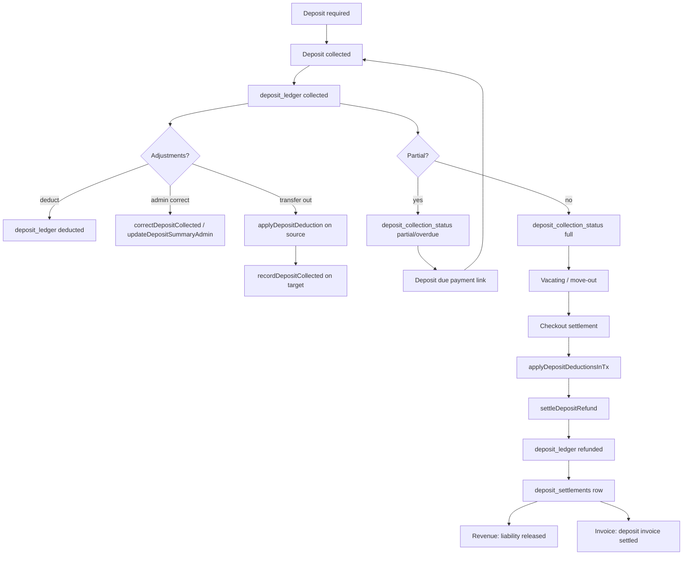

# Deposit Verification (Static Audit)

**Date:** 13 June 2026  
**Mode:** Audit only — no redesign, refactor, or fixes  
**Workflow:** Deposits (§6 in [`SYSTEM_TRUTH_MAP.md`](../SYSTEM_TRUTH_MAP.md))  
**Related:** [`MASTER_TEST_MATRIX.md`](../MASTER_TEST_MATRIX.md) §6–7 · [`BOOKING_PAYMENT_VERIFICATION.md`](./BOOKING_PAYMENT_VERIFICATION.md)

---

## Overall status

| Field | Value |
|-------|-------|
| **DEPOSITS** | **AUDIT COMPLETE / E2E NOT RUN** |
| **Ledger SSOT** | Documented — `deposit_ledger` via `getDepositSummaryForBooking()` |
| **Unit tests** | `depositSsot.test.ts`, `depositSettlement.test.ts`, `depositPageLoad.test.ts` |
| **Script** | `scripts/verify-deposit-ledger.ts` (local ledger smoke) |

---

## Lifecycle (end-to-end)



| Stage | What happens | Primary SSOT |
|-------|----------------|--------------|
| **1. Deposit required** | Quote engine → `bookings.deposit_paise`, `total_paise`, `pricing_snapshot.perBed[].securityDepositPaise` at `createBooking()` | `bookings.deposit_paise` (frozen at creation) |
| **2. Deposit collected** | Cash/UPI/QR/link/advance/admin add → `recordDepositCollected()` | `deposit_ledger` `collected` (+amount) |
| **3. Deposit ledger** | Append-only rows; balance = Σ amount_paise | `deposit_ledger` |
| **4. Adjustments** | Admin deduct, collection correction, wallet rebuild, invoice cancel | `deducted` / extra `collected` rows |
| **5. Transfer** | Admin moves credit source → target | Source `deducted` + target `collected` + snapshot stamp |
| **6. Vacating** | Notice, electricity, damage inputs | `vacating_requests`, checkout draft |
| **7. Settlement** | Admin approves checkout → deductions then refund | `checkout_settlements` → `deposit_settlements` |
| **8. Refund** | Ledger `refunded` (−amount), booking `admin_deposit_refund_status` | `settleDepositRefund()` |
| **9. Revenue impact** | Collected deposit = **liability**, not recognized revenue; refund releases liability | `depositLedgerMetrics`, `revenueCommandCenter` |
| **10. Invoice impact** | Deposit-due invoices, payment links, admin deposit invoice model | `depositInvoices.ts`, `financial_invoices` |

---

## SSOT (single sources of truth)

| Concern | SSOT | Notes |
|---------|------|-------|
| **Money held / refundable** | `deposit_ledger` aggregated by `getDepositSummaryForBooking()` | `refundableBalancePaise = collected − deducted − refunded` |
| **Required deposit amount** | `bookings.deposit_paise` | Set at booking creation; admin can correct via `correctDepositCollected` / `updateDepositSummaryAdmin` |
| **Collection progress** | `bookings.deposit_collection_status`, `deposit_due_paise`, `deposit_due_date` | Derived/synced by `syncDepositCollectionFromLedger()` |
| **Admin list / status display** | `depositInvoices.ts` → `DepositInvoiceRecord` | Computed view — not raw ledger rows |
| **Unified admin detail** | `depositOperations.ts` → `getUnifiedDepositView()` | Combines ledger + booking + invoice status |
| **Cross-booking credit at checkout** | `bookings.pricing_snapshot.depositCredit` | Applied only when `adminTransferred === true` |
| **Refund audit trail** | `deposit_settlements` + `deposit_ledger.refunded` + `audit_log` | Idempotency via `idempotencyKey` |
| **Checkout move-out refund** | `checkout_settlements` workflow | Preferred over legacy `resident_requests.deposit_refund` |

---

## Routes

### Admin-only

| Route | Purpose |
|-------|---------|
| `/admin/deposits` | Portfolio list (collecting, held, refund pending) |
| `/admin/deposits/[bookingId]` | Detail: add, deduct, refund, correct, transfer, advanced tools |
| `/admin/deposits/add` | KYC / unassigned deposit collection |
| `/admin/deposits/advance` | Advance deposit before bed assignment |
| `/admin/deposits/collected` | Collected deposits table |
| `/admin/deposits/audit` | Ledger audit / mismatch review |
| `/admin/checkout-settlements` | Move-out settlement (deductions + refund payout) |
| `/admin/checkout-settlements/[id]` | Settlement detail + mark refund paid |
| `/admin/requests` | Legacy resident request completion (incl. `deposit_refund`) |
| `/admin/quick-actions` | Express refund / add deposit shortcuts |
| `/admin/operations/payment-reviews` | Partial deposit approve on QR proof |
| `/admin/bookings/[bookingId]` | Offline payment, deposit summary read |
| `/admin/pgs/[pgId]/collections` | PG collections queue (deposit kind) |
| `/admin/invoices/[invoiceId]` | Unified invoice refund (may touch deposit lines) |

### API (admin)

| Route | Purpose |
|-------|---------|
| `POST /api/admin/deposits/[bookingId]/correct-summary` | Redirect form for `editDepositSummaryCore` |
| `GET/POST /api/admin/payment-proof/[kind]/[id]` | Proof approval (`deposit_link` kind) |

### Resident-visible

| Route | Purpose |
|-------|---------|
| `/booking/[code]/pay` | Checkout pay — deposit split shown; prior deposits **informational only** |
| `/pay/[linkId]` | Deposit-due / combined payment link |
| `/account/profile` (resident hub) | Deposit due card, payment link CTA |
| `/account/resident/*` | Wallet tab, deposit due extension request |
| Resident requests UI | `deposit_refund` request (legacy path; gated by vacating eligibility) |

### Not resident-triggered

- Cross-booking deposit transfer (admin only)
- Direct ledger deduct / refund (admin only)
- Checkout settlement approval (admin only)

---

## Server actions

| Action | File | Service entry |
|--------|------|---------------|
| `addDepositAction` | `app/(admin)/admin/deposits/[bookingId]/actions.ts` | `recordDepositCollected` |
| `deductDepositAction` | same | `applyDepositDeduction` |
| `refundDepositAction` | same | `settleDepositRefund` (`source: admin_panel`) |
| `correctDepositAction` | same | `correctDepositCollected` |
| `reconcileDepositLedgerAction` | same | `executeReconcileDepositLedger` |
| `processDepositSettlementAction` | `[bookingId]/settlementActions.ts` | `settleDepositWithDeductions` |
| `transferOldDepositAction` | `deposit-wallet-actions.ts` | `transferOldDepositAdmin` |
| `editDepositSummaryAction` | `deposit-wallet-actions.ts` | `updateDepositSummaryAdmin` |
| `rebuildDepositWalletAction` | `deposit-wallet-actions.ts` | `rebuildDepositWallet` |
| `cancelDepositInvoiceAction` | `deposit-wallet-actions.ts` | `cancelDepositInvoice` |
| `recordAdvanceDepositAction` | `deposits/advance/actions.ts` | `recordAdvanceDeposit` |
| `approvePartialQrPaymentAction` | payment review actions | `recordPaymentSuccess` + partial deposit |
| `markCheckoutRefundPaidAction` | `checkout-settlements/actions.ts` | `markCheckoutRefundPaid` → `settleDepositRefund` |
| Quick refund / add deposit | `quick-actions/actions.ts` | `settleDepositRefund` / `recordDepositCollected` |
| `submitDepositDueExtensionRequestAction` | `deposit-actions.ts` | `submitDepositDueExtensionRequest` (no ledger write) |
| `submitDepositRefundRequestAction` | resident requests actions | Creates `resident_requests` row only until admin completes |

---

## Services (by responsibility)

| Service | Key exports |
|---------|-------------|
| `src/services/deposits.ts` | `recordDepositCollected`, `getDepositSummaryForBooking`, `correctDepositCollected`, `adjustDepositCollectedBalance`, `recordAdvanceDeposit`, `executeReconcileDepositLedger`, `backfillDepositCollectedRows` |
| `src/services/depositSettlement.ts` | `applyDepositDeduction`, `applyDepositDeductionsInTx`, `settleDepositRefund`, `settleDepositWithDeductions`, `settleVacatingDepositRefund` |
| `src/services/depositCollection.ts` | `validateBookingPayment`, `splitBookingPayment`, `syncDepositCollectionFromLedger`, `applyPartialDepositOnConfirm`, `applyFullDepositOnConfirm`, `waiveDepositDue`, deposit payment link helpers |
| `src/services/depositCredit.ts` | `getCustomerDepositCredit`, `applyDepositCreditToBooking`, `transferOldDepositAdmin`, prior-deposit info for payment review cards |
| `src/services/depositOperations.ts` | `getUnifiedDepositView`, `updateDepositSummaryAdmin`, `rebuildDepositWallet`, `cancelDepositInvoice` |
| `src/services/depositInvoices.ts` | `getDepositInvoiceForBooking`, portfolio queries for admin tables |
| `src/services/depositRepair.ts` / `depositWalletRepair.ts` | Batch repair, wallet sync scripts |
| `src/services/bookingLifecycle.ts` | `recordPaymentSuccess` → deposit mirror on confirm |
| `src/services/checkoutSettlement.ts` | Deductions + refund on move-out |
| `src/services/vacating.ts` | Vacating completion deposit path |
| `src/services/invoicePayment.ts` | `recordDepositPaymentFromLink`, unified invoice pay/refund deposit lines |
| `src/services/expressCollection.ts` / `expressWalkInSale.ts` | Admin walk-in deposit + optional wallet credit |
| `src/services/bookingOverpayment.ts` | Overpayment → extra `recordDepositCollected` |
| `src/services/bookingPriorOutstanding.ts` | Prior booking deposit outstanding → `recordDepositCollected` on old booking |
| `src/services/residentRequests.ts` | Legacy `deposit_refund` complete → `settleDepositWithDeductions` |
| `src/services/pricing.ts` | Quote deposit at booking time |
| `src/lib/billing/bookingCheckoutTotals.ts` | Checkout totals; credit only if `adminTransferred` |
| `src/lib/deposits/unifiedDepositView.ts` | Display caps and wallet formula validation |

---

## Tables & columns

| Table | Deposit-related fields / role |
|-------|------------------------------|
| `deposit_ledger` | **Money SSOT** — `entry_kind`: `collected` \| `deducted` \| `refunded`; signed `amount_paise` |
| `deposit_settlements` | Refund settlement records, idempotency, deductions snapshot |
| `bookings` | `deposit_paise`, `deposit_due_paise`, `deposit_due_date`, `deposit_collection_status`, `admin_deposit_refund_status`, `pricing_snapshot.depositCredit` |
| `payments` | Booking checkout payments; `purpose: refund` on cancellation (may not mirror ledger) |
| `payment_links` | Deposit-due collection links |
| `financial_invoices` | Unified invoices with deposit lines / metadata |
| `checkout_settlements` | Move-out settlement state, deduction inputs, link to `deposit_settlements` |
| `vacating_requests` | `deposit_refund_paise`, deduction fields |
| `resident_requests` | `type: deposit_refund`, payout/meter fields |
| `audit_log` | All admin/customer deposit actions |
| `bed_prices` | Source rates for quote engine (not post-booking SSOT) |
| `automation_events` | `deposit_collection_due`, `deposit_collection_received`, `deposit_pending_refund` |

---

## 3. Every place a deposit amount can change

### A. Required deposit (`bookings.deposit_paise`)

| # | Trigger | Path | Also updates |
|---|---------|------|--------------|
| R1 | Booking creation | `createBooking()` ← `quoteBookingPrice()` / `customDepositPaise` | `total_paise`, `pricing_snapshot.perBed` |
| R2 | Admin correct collected + required | `correctDepositCollected()` | `deposit_paise`, `total_paise`, snapshot per-bed, ledger delta |
| R3 | Admin edit summary | `updateDepositSummaryAdmin()` | `deposit_paise`, `total_paise` when `requiredPaise` passed |
| R4 | Legacy repair scripts | `scripts/repair-legacy-2x-monthly-deposit.ts` | Direct SQL update (operator tooling) |

### B. Collected balance (ledger `collected` entries)

| # | Trigger | Path |
|---|---------|------|
| C1 | Booking payment confirm | `recordPaymentSuccess()` → `recordDepositCollected()` |
| C2 | Admin add deposit | `addDepositAction` / quick-actions |
| C3 | Advance deposit | `recordAdvanceDeposit()` |
| C4 | Express walk-in / collection | `expressCollection`, `expressWalkInSale` |
| C5 | Deposit payment link | `recordDepositPaymentFromLink()` |
| C6 | Unified invoice pay (deposit line) | `invoicePayment.ts` deposit line handler |
| C7 | Overpayment disposition (wallet credit) | `bookingOverpayment.ts` |
| C8 | Prior outstanding allocation | `bookingPriorOutstanding.ts` |
| C9 | Cross-booking credit (target) | `applyDepositCreditToBooking()` |
| C10 | Admin wallet adjust (collected only) | `adjustDepositCollectedBalance()` |
| C11 | Admin correct / edit summary (collected leg) | `correctDepositCollected`, `updateDepositSummaryAdmin`, `executeReconcileDepositLedger` |
| C12 | Backfill (operator) | `backfillDepositCollectedRows()` |

### C. Deducted balance (ledger `deducted` entries)

| # | Trigger | Path |
|---|---------|------|
| D1 | Admin deduct | `deductDepositAction` → `applyDepositDeduction()` |
| D2 | Cross-booking transfer (source) | `applyDepositCreditToBooking()` |
| D3 | Checkout settlement approve | `applyDepositDeductionsInTx()` (notice, electricity, damage, cleaning, custom) |
| D4 | Vacating completion | `vacating.ts` → `applyDepositDeduction` / `settleVacatingDepositRefund` deductions |
| D5 | Legacy resident request complete | `settleDepositWithDeductions()` |
| D6 | Admin collected correction (negative delta) | `correctDepositCollected` / `adjustDepositCollectedBalance` |
| D7 | Cancel deposit invoice | `cancelDepositInvoice()` — deducts refundable to zero |
| D8 | Unified invoice refund reversal | `invoicePayment.ts` may add deduction on deposit line refund |

### D. Refunded balance (ledger `refunded` entries)

| # | Trigger | Path |
|---|---------|------|
| F1 | Admin refund on deposit detail | `refundDepositAction` → `settleDepositRefund` |
| F2 | Quick-actions refund | `settleDepositRefund` (`source: manual`) |
| F3 | Checkout mark refund paid | `markCheckoutRefundPaid` → `settleDepositRefund` (`source: checkout`) |
| F4 | Legacy resident request complete | `settleDepositWithDeductions` (refund leg) |
| F5 | Vacating deposit refund | `settleVacatingDepositRefund` |
| F6 | `settleDepositWithDeductions` (any caller) | Combined deduct + refund |

### E. Derived / status fields (not ledger money)

| # | Field | Writer |
|---|-------|--------|
| E1 | `deposit_due_paise`, `deposit_collection_status` | `syncDepositCollectionFromLedger`, `applyPartialDepositOnConfirm`, `waiveDepositDue` |
| E2 | `pricing_snapshot.depositCredit` | `stampAdminDepositCreditOnBooking` (transfer), `createBooking` param |
| E3 | `bookings.total_paise` (credit reduces due) | Transfer stamp, correct deposit |
| E4 | `admin_deposit_refund_status` | `settleDepositRefund` when `markBookingRefunded` |

---

## 4. Every place a refund can be triggered

| # | Entry point | Service | `source` | Canonical? |
|---|-------------|---------|----------|------------|
| 1 | `/admin/deposits/[bookingId]` refund form | `refundDepositAction` → `settleDepositRefund` | `admin_panel` | Yes |
| 2 | `/admin/quick-actions` refund | quick-actions → `settleDepositRefund` | `manual` | Yes |
| 3 | `/admin/checkout-settlements` mark paid | `markCheckoutRefundPaid` → `settleDepositRefund` | `checkout` | **Preferred for move-out** |
| 4 | `/admin/deposits/[bookingId]` settlement panel | `processDepositSettlementAction` → `settleDepositWithDeductions` | `resident_request` / admin | Legacy overlap |
| 5 | `/admin/requests` complete `deposit_refund` | `residentRequests` complete → `settleDepositWithDeductions` | `resident_request` | **Duplicate of checkout** |
| 6 | Vacating flow completion | `settleVacatingDepositRefund` | `vacating` | Overlaps checkout |
| 7 | `cancelBooking()` | Provider/cash refund via `payments` only | — | **Risk: no ledger `refunded` row** |
| 8 | Unified invoice refund | `invoicePayment.ts` reversal paths | — | May deduct/refund deposit lines separately |

All canonical refund writers funnel to `settleDepositRefund()` or `settleDepositWithDeductions()` except **#7** and partial **#8**.

---

## 5. Every place a transfer between bookings can occur

| # | Path | Admin? | Mechanism |
|---|------|--------|-----------|
| T1 | `transferOldDepositAdmin()` via `transferOldDepositAction` | **Yes** | Source `applyDepositDeduction` + target `recordDepositCollected` + snapshot `adminTransferred` |
| T2 | `recordPaymentSuccess()` when `pricing_snapshot.depositCredit.adminTransferred` | Triggered at payment confirm | Calls `applyDepositCreditToBooking` with `sourceBookingId` |
| T3 | `expressWalkInSale` with `walletCreditApplied` | **Yes** (walk-in) | `applyDepositCreditToBooking` **without** `sourceBookingId` — drains largest prior balance |
| T4 | Admin assign / walk-in `depositCreditAppliedPaise` on `createBooking` | **Yes** | Sets snapshot; ledger movement at T2 on confirm |
| T5 | `applyDepositCreditToBooking` idempotent skip | — | If target already has `DEPOSIT_CREDIT_REASON` collected row |

**Not a transfer:** Customer `/booking/new` checkout — auto cross-booking credit was **removed** (deposit isolation fix). Payment review cards show prior deposits **informationally only**.

---

## 6. Downstream impact surfaces

### Invoices

| Surface | How deposit appears |
|---------|---------------------|
| `depositInvoices.ts` | Admin deposit invoice status: collecting → held → refund_pending → settled |
| `financial_invoices` | Deposit-due and combined invoice lines |
| `payment_links` | Resident deposit-due pay → proof → `recordDepositPaymentFromLink` |
| `invoicePayment.ts` | Pay/refund deposit lines on unified invoices |
| Checkout display | Deposit excluded from rent line items in snapshot `rentLineItems` |

### Revenue

| Surface | Behavior |
|---------|----------|
| `depositLedgerMetrics.ts` | Portfolio collected / outstanding / refunded aggregates |
| `revenueCommandCenter.ts` | `depositRevenuePaise` = collected liability snapshot by PG — **not P&L revenue** |
| `payments.purpose = booking` | Checkout payment includes deposit portion in cash flow, not rent recognition |
| Refund / settlement | Releases liability when `refunded` ledger entries posted |

### Wallet (customer deposit credit)

| Surface | Behavior |
|---------|----------|
| `getCustomerDepositCredit()` | Sums `refundableBalancePaise` across confirmed/completed bookings |
| `src/lib/residents/walletLedger.ts` | Resident wallet tab display |
| `residentAccountContext.ts` | Held deposit estimate for dashboard |
| Admin transfer panel | Shows prior booking refundable balances |

### Checkout settlement

| Surface | Behavior |
|---------|----------|
| `checkoutSettlement.ts` | Reads wallet via `getDepositSummaryForBooking`; applies deductions; `markCheckoutRefundPaid` |
| `depositRefundRequirements.ts` | Validates resident payout details before refund |
| `vacating_requests` | Seeds settlement amounts |

### Resident dashboard

| Surface | Behavior |
|---------|----------|
| `ResidentAreaSection.tsx` / `ResidentHomePanel.tsx` | Deposit due card, pay link |
| `residentHomeState.ts` | CTA when `depositDuePaise > 0` |
| `deposit-actions.ts` | Extension request only (no money movement) |
| Requests hub | `deposit_refund` request (legacy; gated by vacating eligibility) |
| `/booking/[code]/pay` | Split rent vs deposit; admin-transferred credit reduces cash due |

---

## Known risks

| ID | Risk | Severity |
|----|------|----------|
| DR-01 | **`cancelBooking()`** writes refund to `payments` but not `deposit_ledger.refunded` — wallet can show stale held balance after cancellation refund | High |
| DR-02 | **Dual refund paths:** checkout settlement vs legacy `resident_requests.deposit_refund` — double-refund if both used | High |
| DR-03 | **`recordPaymentSuccess` deposit block** swallows errors in try/catch — booking confirms without ledger mirror (same class as BP R1) | High |
| DR-04 | **Express walk-in wallet credit (T3)** applies credit without explicit source booking — harder to audit than `transferOldDepositAdmin` | Medium |
| DR-05 | **Pre-ledger bookings** — `bookings.deposit_paise` may exist without ledger rows until backfill | Medium |
| DR-06 | **`updateDepositSummaryAdmin` / `correctDepositCollected`** can change required and collected independently — operator error surface | Medium |
| DR-07 | **Display vs ledger** — `depositInvoices` caps refundable display; wallet formula validation can flag mismatch | Low |
| DR-08 | **Partial deposit gating** — `deposit_collection_status` must stay in sync with ledger via `syncDepositCollectionFromLedger` callers | Medium |

---

## Duplicate paths

| Topic | Path A (preferred) | Path B (legacy / duplicate) |
|-------|-------------------|----------------------------|
| Move-out refund | `checkout_settlements` → `markCheckoutRefundPaid` | `resident_requests.deposit_refund` → `settleDepositWithDeductions` |
| Vacating refund | Checkout settlement | Direct `settleVacatingDepositRefund` in vacating completion |
| Admin refund | Deposit detail `refundDepositAction` | Quick-actions refund |
| Collected correction | `correctDepositCollected` | `updateDepositSummaryAdmin` + `executeReconcileDepositLedger` |
| Deposit due collection | Payment link → proof queue | Admin add deposit / express collection |
| Cancellation refund | — | `cancelBooking` payments refund **without** ledger (DR-01) |

---

## Admin-only vs resident-visible

| Capability | Admin | Resident |
|------------|-------|----------|
| View deposit balance | `/admin/deposits/*`, booking detail | Wallet tab, deposit due card |
| Collect deposit | Add, advance, express, approve proof | Pay checkout, pay deposit link |
| Deduct from deposit | Yes | No |
| Refund deposit | Yes (multiple panels) | Request only (`deposit_refund` — legacy) |
| Transfer between bookings | Yes (`TransferOldDepositPanel`) | No (informational prior deposits on pay page) |
| Waive deposit due | `waiveDepositDue` (admin) | Extension request only |
| Correct required/collected | Yes | No |
| Rebuild wallet / reconcile ledger | Yes | No |
| Checkout settlement | Yes | Submit vacating + payout details |

---

## Test matrix cross-reference

| ID | Case | Audit result |
|----|------|--------------|
| D-01 | Ledger on confirm | Path via `recordPaymentSuccess` → `recordDepositCollected` |
| D-02 | Balance formula | `getDepositSummaryForBooking` — unit tested |
| D-03 | Admin add | `addDepositAction` |
| D-04 | Admin deduct | `deductDepositAction` |
| D-05 | Deposit link pay | `recordDepositPaymentFromLink` |
| D-06 | Partial collection | `deposit_collection_status` + move-in gating |
| DT-01 | Admin transfer | `transferOldDepositAdmin` |
| DT-02 | No customer auto-transfer | Verified removed at `/booking/new` |
| DT-03 | Checkout credit gate | `adminTransferred` in snapshot |
| DT-04 | Transfer audit | `audit_log` in `transferOldDepositAdmin` |

---

## Files index (quick grep anchors)

```
src/services/deposits.ts
src/services/depositSettlement.ts
src/services/depositCollection.ts
src/services/depositCredit.ts
src/services/depositOperations.ts
src/services/depositInvoices.ts
app/(admin)/admin/deposits/
scripts/verify-deposit-ledger.ts
tests/unit/depositSsot.test.ts
tests/unit/depositSettlement.test.ts
```

---

*Static audit complete. E2E verification deferred — run `scripts/verify-deposit-ledger.ts` and staging move-out scenarios when DB available.*
