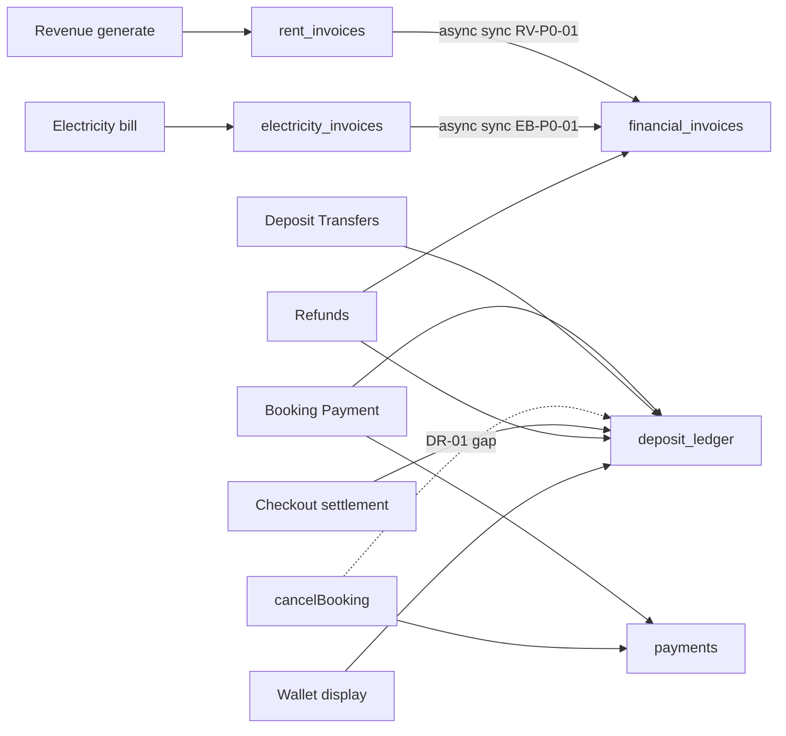

# Financial Domain Report

**Date:** 13 June 2026  
**Mode:** Fast-track audit — verification only, no redesign or fixes  
**Scope:** Booking Payment · Deposits · Deposit Transfers · Revenue · Invoices · Electricity Billing · Refunds · Wallet Credits  
**Sources:** [`DEPOSIT_VERIFICATION.md`](./DEPOSIT_VERIFICATION.md) · [`DEPOSIT_RISK_VERIFICATION.md`](./DEPOSIT_RISK_VERIFICATION.md) · [`BOOKING_PAYMENT_VERIFICATION.md`](./BOOKING_PAYMENT_VERIFICATION.md) · [`BOOKING_PAYMENT_FIX_REPORT.md`](./BOOKING_PAYMENT_FIX_REPORT.md) · [`BOOKING_PAYMENT_E2E_REPORT.md`](./BOOKING_PAYMENT_E2E_REPORT.md) · [`MASTER_TEST_MATRIX.md`](../MASTER_TEST_MATRIX.md) · [`SYSTEM_TRUTH_MAP.md`](../SYSTEM_TRUTH_MAP.md)

---

## Executive summary

| Verdict | Count | Workflows |
|---------|-------|-----------|
| **FAIL** | 4 | Deposits, Deposit Transfers, Refunds, Wallet Credits |
| **NOT VERIFIED** | 4 | Booking Payment, Revenue, Invoices, Electricity Billing |

**P0 repair items:** 9 (money mismatch or double-payout / ledger drift)  
**P1 repair items:** 8 (audit trail, duplicate paths, silent partial failure)  
**P2 repair items:** 6 (navigation, dead UI, display aliases)

E2E blocked globally: staging `DATABASE_URL` unavailable; local schema drift (`bookings.stay_type`).

---

## Workflow status (single pass)

| Workflow | Status | Rationale |
|----------|--------|-----------|
| **Booking Payment** | **NOT VERIFIED** | Offline bypass fixed (`cd822da`); canonical path code-audited PASS. E2E not run (staging DB). Residual **FAIL** on confirm: DR-03 / BP-R1 (ledger swallow). |
| **Deposits** | **FAIL** | DR-01–DR-04 verified by static trace ([`DEPOSIT_RISK_VERIFICATION.md`](./DEPOSIT_RISK_VERIFICATION.md)). |
| **Deposit Transfers** | **FAIL** | Admin `transferOldDepositAdmin` OK; express walk-in wallet credit unaudited (DR-04). |
| **Revenue** | **NOT VERIFIED** | Rent generation logic unit-tested; cron/E2E not run. **P0 risk:** fire-and-forget unified sync (RV-P0-01). |
| **Invoices** | **NOT VERIFIED** | Registry model verified in unit tests; sync consistency E2E not run. **P0 risks:** sync drift (INV-P0-01), refund reversal swallow (INV-P0-02). |
| **Electricity Billing** | **NOT VERIFIED** | Create/split/pay paths code-verified; multi-occupant E2E not run. **P0 risk:** same async sync pattern (EB-P0-01). |
| **Refunds** | **FAIL** | DR-01 cancel bypasses ledger; DR-02 eight paths / legacy overlap; INV-P0-02 on invoice refund. Checkout path unit-tested PASS in isolation. |
| **Wallet Credits** | **FAIL** | SSOT is `deposit_ledger`; display via `getCustomerDepositCredit` / `buildWalletLedger`. Inherits DR-01/DR-03 ledger drift; DR-04 weak audit on express apply. |

---

## Unified domain matrix

| Workflow | SSOT | Tables | Services | Admin screens | Resident screens | Known risks | Duplicate paths | Financial impact |
|----------|------|--------|----------|---------------|------------------|-------------|-----------------|------------------|
| **Booking Payment** | `recordPaymentSuccess()` → `payments` + confirm side effects | `payments`, `bookings`, `bed_reservations`, `deposit_ledger`, `pg_payment_records`, `audit_log` | `bookingLifecycle.ts`, `qrPayments.ts`, `paymentVerification.ts`, `depositCollection.ts`, `deposits.ts` | `/admin/operations/payment-reviews`, `/admin/bookings/[id]`, `/admin/revenue/billing` | `/booking/[code]/pay`, proof upload APIs | DR-03/BP-R1 ledger swallow; E2E blocked | QR approve vs offline (fixed); webhook vs QR; partial vs full approve | Checkout cash in `payments`; deposit liability via ledger mirror (may be skipped) |
| **Deposits** | `deposit_ledger` via `getDepositSummaryForBooking()`; required = `bookings.deposit_paise` | `deposit_ledger`, `deposit_settlements`, `bookings`, `payments`, `audit_log` | `deposits.ts`, `depositSettlement.ts`, `depositCollection.ts`, `depositOperations.ts`, `depositInvoices.ts` | `/admin/deposits`, `/admin/deposits/[bookingId]`, add/advance/audit | Wallet tab, deposit due card, `/pay/[linkId]` | DR-01–DR-04 | Collect: payment / admin add / link / express / advance / overpay; correct: `correctDepositCollected` vs `updateDepositSummaryAdmin` | Liability held; checkout/refund/release; **not** P&L revenue |
| **Deposit Transfers** | Ledger movement + `pricing_snapshot.depositCredit.adminTransferred` | `deposit_ledger`, `bookings.pricing_snapshot`, `audit_log` | `depositCredit.ts` (`transferOldDepositAdmin`, `applyDepositCreditToBooking`) | Transfer panel on deposit detail; quick-actions walk-in | Prior deposits informational on pay page only | DR-04 | `transferOldDepositAdmin` vs express walk-in wallet credit vs confirm-time apply | Reduces cash due on target; moves liability between bookings |
| **Revenue** | `rent_invoices` (generation); read KPIs via `revenueCommandCenter.ts` + RFE | `rent_invoices`, `financial_invoices`, `bookings`, `bed_reservations`, `payments` | `rentInvoices.ts`, `revenueCommandCenter.ts`, `residentFinancialEngine.ts`, `billing.ts` | `/admin/revenue`, `/admin/revenue/billing`, `/admin/rent` | Payments hub (outstanding rent) | RV-P0-01 async sync; deposit KPI mixed into MTD inflow | Cron vs admin generate vs `ensureMonthlyRentInvoice` vs express rent | Rent recognized when invoices paid; deposit collected tracked separately (liability) |
| **Invoices** | `financial_invoices` registry; sources `rent_invoices` / `electricity_invoices` | `financial_invoices`, `rent_invoices`, `electricity_invoices`, `payment_links`, `payments`, `invoice_audit_events` | `unifiedInvoices.ts`, `invoiceDocumentModel.ts`, `invoicePayment.ts`, `invoiceCommandCenter.ts` | `/admin/invoices`, `/admin/invoices/[id]` | `/resident/invoices/[ref]` (share link); **no hub nav** | INV-P0-01 sync drift; INV-P0-02 refund swallow; INV-P1-01 hub nav | Pay: Razorpay / proof / link / admin mark paid; refund vs void vs cancel | Unified presentation + payment allocation; drives revenue KPIs when paid |
| **Electricity Billing** | `electricity_bills` + per-occupant `electricity_invoices` | `electricity_bills`, `electricity_invoices`, `rooms`, `financial_invoices`, `payments` | `electricityBilling.ts`, `meterElectricity.ts`, `billing.ts` (`splitElectricity`) | `/admin/electricity/new`, collections electricity tab | `/account/resident/pay-electricity/[id]` | EB-P0-01 async sync; F8 rounding remainder (operator-absorbed, documented) | Webhook vs UPI proof vs express collection | Occupant share revenue; vacating cancels future elec invoices |
| **Refunds** | Deposit: `settleDepositRefund()` / `settleDepositWithDeductions()`; Invoice: `refundUnifiedInvoice()` | `deposit_ledger`, `deposit_settlements`, `checkout_settlements`, `financial_invoices`, `payments`, `resident_requests` | `depositSettlement.ts`, `checkoutSettlement.ts`, `unifiedInvoices.ts`, `invoicePayment.ts`, `bookingLifecycle.ts` (cancel) | Checkout settlements, deposit detail, invoices, requests, quick-actions | Deposit refund request (legacy), vacating payout details | DR-01, DR-02, INV-P0-02 | **8 deposit paths** (see DR-02); invoice refund vs deposit refund (F10) | Cash out + liability release; cancel path refunds `payments` only |
| **Wallet Credits** | Same as deposits — `getDepositSummaryForBooking()` aggregated per customer | `deposit_ledger`, `bookings` | `depositCredit.ts`, `walletLedger.ts`, `residentFinancialEngine.ts`, `residentAccountContext.ts` | Deposit detail, quick-actions walk-in, transfer panel | `?tab=wallet`, resident home CTAs | Inherits DR-01/03; DR-04 express apply | `getCustomerDepositCredit` vs admin unified view vs RFE summary | Display-only aggregation; **must not** be write SSOT |

---

## FAIL findings by severity

### P0 — Critical (money mismatch)

| ID | Finding | Workflow | Evidence | Financial impact |
|----|---------|----------|----------|------------------|
| **DR-01** | `cancelBooking()` writes `payments` refund but never `deposit_ledger.refunded` | Refunds · Deposits | `bookingLifecycle.ts:1499–1692` — no `settleDepositRefund` | Ledger liability overstated; wallet shows held deposit after cancel refund; enables double payout (DR-02B) |
| **DR-02** | Eight deposit refund paths; legacy + checkout overlap; cancel bypasses ledger | Refunds | [`DEPOSIT_RISK_VERIFICATION.md`](./DEPOSIT_RISK_VERIFICATION.md) § DR-02 | Cross-table inconsistency; cancel + admin refund = provider refund + ledger refund |
| **DR-03** | `recordPaymentSuccess()` catch swallows deposit block; returns `{ ok: true }` | Booking Payment · Deposits | `bookingLifecycle.ts:534–536` | Confirmed booking, zero ledger row; checkout settlement wrong at move-out |
| **DR-02B** | Cancel refund + admin `refundDepositAction` on same booking | Refunds | DR-01 + balance guard still allows if cancel used tier partial deposit refund | Double cash out to resident |
| **RV-P0-01** | `generateRentInvoicesForMonth` uses `void syncRentInvoiceToUnified()` — sync failure silent | Revenue · Invoices | `rentInvoices.ts:769–770`; SYSTEM_TRUTH_MAP F3 | `rent_invoices` exists; `financial_invoices` missing/stale → wrong outstanding, payment links, revenue KPIs |
| **INV-P0-01** | Same fire-and-forget sync on rent pay paths and batch reconcile `.catch(() => undefined)` | Invoices | `rentInvoices.ts:1500–1503`, `1988–1989` | Admin/resident see different invoice state; collections against wrong document |
| **EB-P0-01** | `createElectricityBill` uses `void syncManyToUnified(..., 'electricity')` | Electricity · Invoices | `electricityBilling.ts:570–571` | Elec invoices invisible in unified registry; revenue/outstanding split |
| **INV-P0-02** | `refundUnifiedInvoice()` returns `{ ok: true }` when `reverseBookingEffectsIfInvoiceVoided` fails | Refunds · Invoices | `unifiedInvoices.ts:864–872` | Invoice marked refunded; source rent/booking reversal may not run — paid status vs occupancy/billing drift |
| **INV-PAY-01** | Deposit line reversal on invoice refund uses `.catch(() => undefined)` | Invoices · Deposits | `invoicePayment.ts:177–182` | Partial refund: unified invoice refunded but ledger deduction skipped |

**Note on DR-04:** Listed as P0 in risk triage because express walk-in can drain **multiple** source bookings without operator-selected source — wrong-source attribution during disputes (money totals correct in ledger, but operational error class). Classified **P1** in repair backlog below; upgrade to P0 if ops reports mis-applied credits.

---

### P1 — High (audit mismatch / duplicate path / silent partial failure)

| ID | Finding | Workflow | Evidence |
|----|---------|----------|----------|
| **DR-04** | Express walk-in `applyDepositCreditToBooking` without `sourceBookingId`; no transfer audit_log | Deposit Transfers | `expressWalkInSale.ts:239–244`; snapshot lacks `sourceBookingId` |
| **RF-P1-01** | Legacy `resident_requests.deposit_refund` complete still calls `settleDepositWithDeductions` | Refunds | `residentRequests.ts:353`; overlaps checkout |
| **RF-P1-02** | `settleVacatingDepositRefund` parallel to checkout when no approved refund request | Refunds | `vacating.ts:894`; idempotency `vacating:{id}` vs `checkout:{id}` |
| **RF-P1-03** | `refundDepositAction` / quick refund use random idempotency UUID — replay only blocked by balance | Refunds | `actions.ts` `manual:{uuid}`, `quick:{uuid}` |
| **BP-P1-01** | Deposit credit transfer failure logged only inside confirm block | Booking Payment | `bookingLifecycle.ts:457–459` |
| **F10** | Invoice refund (`refundUnifiedInvoice`) vs deposit refund (`settleDepositRefund`) — no cross-lock | Refunds | SYSTEM_TRUTH_MAP F10 |
| **F6** | Legacy refund queue + checkout both visible in `adminRefundQueue` — dedup is UI-only | Refunds | `adminRefundQueue.ts` lists both sources |
| **RV-P1-01** | Revenue command center mixes deposit collected into MTD `totalPaise` / `depositRevenuePaise` label | Revenue | `revenueCommandCenter.ts` — liability shown alongside rent (misleading, not double-booking if ledger correct) |

---

### P2 — Medium (UX mismatch)

| ID | Finding | Workflow | Evidence |
|----|---------|----------|----------|
| **INV-P2-01** | No resident hub nav to invoice detail (H10) | Invoices | MASTER_TEST_MATRIX INV-04 |
| **BP-P2-01** | Customer booking pay page QR-only; Razorpay webhook exists but UI dead | Booking Payment | BP-05; SYSTEM_TRUTH_MAP |
| **X-P2-01** | Receipt route exists; hub paid history not linked | Invoices | MASTER_TEST_MATRIX X-05 |
| **RV-P2-01** | Revenue KPIs on `/admin/revenue`, `/admin/overview/revenue`, `/admin/collections` — filter drift risk | Revenue | SYSTEM_TRUTH_MAP duplicate views |
| **W-P2-01** | Wallet tab display caps vs raw ledger (admin-only caps in `unifiedDepositView`) | Wallet Credits | `risk-report.md` §4.2 |
| **EB-P2-01** | Electricity split rounding remainder operator-absorbed — must not hide from bill UI | Electricity | `billing.ts:273–274`; documented, needs E2E confirm |

---

## Prioritized repair backlog

### P0 — Critical

| Order | ID | Fix summary | Effort | Blast radius | Why this order |
|-------|-----|-------------|--------|--------------|----------------|
| **1** | DR-03 / BP-R1 | Fail-closed: move deposit mirror into payment transaction or compensate on ledger failure | **M** (2–4d) | All booking confirms (QR, offline, webhook) | Stops new ledger drift at source; unblocks trustworthy E2E |
| **2** | DR-01 | Route cancel deposit portion through `settleDepositRefund` (or ledger `refunded` + settlement row) | **M** (2–3d) | `cancelBooking`, customer + admin cancel UI | Closes liability overstatement and DR-02B double payout |
| **3** | RV-P0-01 / INV-P0-01 / EB-P0-01 | Await unified sync in generate/create/pay paths; surface sync errors; batch reconcile job | **M** (3–5d) | Rent cron, invoice registry, resident links, revenue KPIs | Single fix pattern across three call sites |
| **4** | INV-P0-02 / INV-PAY-01 | Fail invoice refund if reversal/allocation fails; remove `.catch(() => undefined)` on deposit deduction | **S** (1–2d) | Admin invoice refund | Prevents “refunded” label with uncorrected source rows |
| **5** | DR-02 | Deprecate or hard-block legacy paths #5–#6 when `checkout_settlements` exists; document canonical only | **M** (2–3d) | `/admin/requests`, vacating complete, checkout | Reduces duplicate refund surface after ledger fixes |

**Effort key:** S = 1–2 dev-days · M = 2–5 · L = 5+

---

### P1 — High

| Order | ID | Fix summary | Effort | Blast radius |
|-------|-----|-------------|--------|--------------|
| 6 | DR-04 | Express walk-in: require `sourceBookingId` or call `transferOldDepositAdmin`; always write audit_log | S | Quick-actions walk-in |
| 7 | RF-P1-01 / RF-P1-02 | Gate legacy request + vacating refund when checkout settlement open/completed | S | Requests, vacating |
| 8 | BP-P1-01 | Fail or compensate when `applyDepositCreditToBooking` fails at confirm | S | Admin transfer at payment |
| 9 | F10 | Cross-check booking id + amount before deposit refund if invoice refund touched deposit lines | M | Invoice + deposit panels |
| 10 | RF-P1-03 | Stable idempotency keys for manual admin refunds (e.g. per booking + day) | S | Deposit detail, quick-actions |
| 11 | RV-P1-01 | Rename/split deposit liability from rent revenue in command center UI | S | `/admin/revenue` display only |

---

### P2 — Medium

| Order | ID | Fix summary | Effort | Blast radius |
|-------|-----|-------------|--------|--------------|
| 12 | INV-P2-01 / X-P2-01 | Add hub links to invoices + payment receipts | S | Resident hub |
| 13 | BP-P2-01 | Enable Razorpay on pay page or remove dead webhook surface | M | Booking pay UX |
| 14 | RV-P2-01 | Document canonical revenue screen; align filters | S | Admin nav |
| 15 | W-P2-01 | Wallet tab mismatch banner when `validateWalletFormula` fails | S | Resident wallet |
| 16 | EB-P2-01 | Show rounding remainder on electricity bill summary | S | Admin elec create |

---

## Cross-domain dependency graph



**Repair sequencing principle:** Fix **write-path SSOT** (DR-03, DR-01, sync await) before **display** (wallet, revenue KPIs) and before **deprecating legacy refund UI**.

---

## Verification scripts (when DB available)

Run once after P0 fixes to re-baseline the domain:

```bash
npx tsx scripts/verify-booking-payment-e2e.ts   # Booking Payment + DR-03
npx tsx scripts/verify-deposit-ledger.ts        # Deposits
npx tsx scripts/verify-cancel-refund.ts         # DR-01 (extend with ledger asserts)
npx tsx scripts/verify-rent-billing.ts          # Revenue
npx tsx scripts/verify-invoice-command-center.ts # Invoices sync
npm test -- tests/unit/depositSettlement.test.ts tests/unit/billing.test.ts tests/unit/checkoutSettlementDeductions.test.ts
```

---

## Document index

| Doc | Role |
|-----|------|
| This file | Single financial domain status + repair backlog |
| [`DEPOSIT_RISK_VERIFICATION.md`](./DEPOSIT_RISK_VERIFICATION.md) | DR-01–DR-04 evidence |
| [`BOOKING_PAYMENT_E2E_REPORT.md`](./BOOKING_PAYMENT_E2E_REPORT.md) | E2E blockers + BP-R1 |
| [`SYSTEM_TRUTH_MAP.md`](../SYSTEM_TRUTH_MAP.md) | SSOT reference (§3–16) |
| [`MASTER_TEST_MATRIX.md`](../MASTER_TEST_MATRIX.md) | Per-test-case matrix |

---

*Financial domain fast-track complete. Next step: execute P0 backlog in order 1→5, then re-run verification scripts on staging.*
